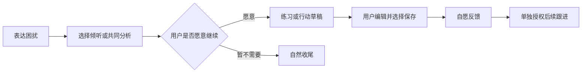
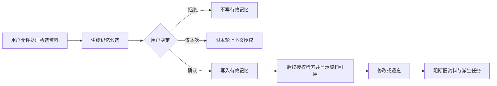

# 阶段1｜首次使用与支持闭环：目标与功能设计

> 整合修订：2026-09-20｜规划文档；产品未实现，业务验收未执行。
> [项目导览](../../README.md) · [阶段目标](01-阶段目标与功能设计.md) · [技术方案](02-技术方案与实施计划.md) · [测试验收](03-测试与验收标准.md) · [分步实施](04-分步实施与检查清单.md)

前置：确认产品范围、模型开发接入及首批审阅材料。共同约定见[共同合同入口与实施证据边界](02-技术方案与实施计划.md#missing-sources)，开发与验收见本目录02、03。

<a id="s1-scope-v1"></a>
## S1-STEP01 范围基线 s1-scope/1

2026-09-20：本版仅冻结合成开发的范围与反例，不是已批准的心理支持文案。实施执行者为本轮 Codex；专业审阅者尚未指定，审阅状态为 pending verification。关联 S1-T01、RSI-S1-T01；实际产物与检查见[本步记录](04-分步实施与检查清单.md#s1-step01-evidence)。

| 范围项 | 必须保留的行为边界 | 合成 fixture 标识 |
|---|---|---|
| 倾听与冷启动 | 直接回应当下，不编过去，不强制问卷或建议 | cold_start、listen |
| 必要澄清 | 区分感受、可观察事实及未知意图，不默认第三方动机 | clarify |
| 合作分析 | 用户愿意时比较可选解释或下一步，不代替决定 | explore |
| 明确拒绝 | 拒绝建议后继续倾听，不靠拒绝非必要用途封禁基础支持 | refuse_advice |
| 真实欺凌情境 | 在合成情境中明确有欺凌行为时，不归咎用户认知，不强迫联系不安全对象 | bullying |
| 自主结束 | 尊重停止或结束，不制造内疚、情感义务或诱导停留 | close |
| 现实支持 | 高风险不只做小游戏或机械结束；资源未知或过期均不编号码、时间、核查日期或已转介事实 | support_unknown、support_expired |
| 固定安全 | 排他、情感义务、诊断、危险建议即使出现在候选后半段仍须拦截；好评和偏好不能覆盖 | late_exclusivity、late_obligation、late_diagnosis、late_danger |

以上标识在[合成目录](fixtures/S1-STEP01/scenarios.json)中唯一；每项包含输入、应有行为、禁止行为和明确为自建的候选正反例。候选是待验证样例，不是模型实测输出、临床指导或生产回退文案。

本 STEP 不包含页面、API、数据库、运行图、Provider、输出安全执行器。独立练习内容、现实资源条目及其专业审阅均未完成；不得由此范围表推导出可对真人开放。阶段1其余功能仍按下表及后续 STEP 执行。

## 阶段价值和范围

用户首次进入即可获得适切支持，也能不聊天直接完成一个注意力练习。首次体验不依赖积累大量历史、RAG、长期记忆或自我优化。

| 功能 | 增量与优先级 | 本阶段边界 |
|---|---|---|
| F-CHAT-001 | 原有增强，P0 | 中文倾听、澄清、合作分析、可选下一步和自然收尾；不强制走完所有步骤 |
| F-PREF-001 | 原有增强，P0 | 最少进入说明、登录/会话身份、支持方式、字号、减少动画、敏感标题隐藏 |
| F-CHAT-002 | 原有增强，P1 | 历史、重命名、搜索、归档；运行结束后的最后输入修订和回答重新生成 |
| F-SAFE-001 | 原有增强，P0 | 基础现实支持入口、高风险表达处理；不等待阶段4资源中心 |
| F-DATA-001、F-FEEDBACK-001 | 原有增强，P0 | 当前数据用途说明、会话删除、退出、简要反馈；不给原始对话开放研究用途 |
| F-EXERCISE-001 | 真正新增，P0 | 一个无模型依赖的分步注意力练习；此阶段不保存练习历史 |
| F-OPS-001、F-EVAL-001 | 支撑增强，P0 | 运行状态、有限预算、基础trace、固定场景和错误处理 |

暂不包含：长期记忆及节律推断、个人记录中心、持久行动、完整资源检索、外部写工具、站外通知、优化器。用户可自行采用对话建议；“保存行动计划”在阶段3才出现，避免无效按钮。

本阶段暂不实现Multi-Agent；Multi-Agent已列为后期正式目标，在[阶段5A](../阶段5A/01-阶段目标与功能设计.md)实施。本阶段保持 `FastAPI → Meta → LangGraph → Support Agent → Tools / RAG / Memory` 的单Agent扩展主线，其中工具仅限本阶段已有只读能力，RAG和长期Memory按后续阶段接入。只保证状态、Artifact、预算和LangGraph扩展边界不会被阻塞，不提前创建Evidence/Reviewer等角色。

### 前置与阶段目标

前置为开发身份/合成材料、基础模型适配与首批经审阅支持内容。本阶段仍完成首次可用的单Support闭环：倾听→必要澄清→用户选择分析或行动→自然收尾，保留[基础功能设计](01-阶段目标与功能设计.md)的会话、偏好、历史、输入修订、静态练习、现实支持、删除与简要反馈。本轮只是设计，不因新增评估模块提前拆多个Agent。

### 功能与用户故事

| 功能 | 用户故事与入口 | 数据/接口/工作流 | 异常与验收 |
|---|---|---|---|
| U01 分用途说明和年龄范围 | 首次进入时知道AI身份和当前用途，可跳过非必要分析；`/me/privacy` | ConsentRecord、age_band=adult/minor/unknown；POST consents；只选基础支持仍可聊 | 非必要许可拒绝不封禁；年龄未知不得默认为成人；RSI-S1-A02/RSI-S1-A03 |
| U02 最小互动证据基础 | 用户希望使用时间解释可核对且不监控站外 | InteractionEvent仅run/进入来源/可观测活跃段；POST interaction-events批量幂等；主动采集需告知及适用合法依据 | 断连重试、页面闲置不计主动会话；没有覆盖就是unknown；RSI-S1-A04 |
| U03 支持反馈与纠正入口 | 对回答可说“不合适”“误解了我”“只想倾听” | 原feedback扩展category、可选reason、明确是否允许用于研究；与策略偏好分开保存 | 没有反馈不记不满意；不隐式附全文；RSI-S1-A01/RSI-S1-A03 |
| U04 基本Agent行为检查 | 用户不因被赞同就遭强化错误判断 | AgentBehaviorEvaluator的规则基线；对事实/感受、用户拒绝、关系边界、固定安全做检查 | 高风险稿不先流出；无评估预算走已审回退；RSI-S1-A05/RSI-S1-A06 |

不建依赖总分、不从高频/亲昵称呼/深夜一次对话判定依赖；不做跨会话画像、长期记忆、外部写工具、站外提醒或L1/L2。可在本次上下文中识别明确拒绝和当下安全需求，不需要持久画像来解释用户。

## 学生端页面合同

### 2.1 对话页 `/chat`、`/chat/$sessionId`

目标是表达和处理当前困扰。电脑为会话列表—消息区—按需详情；手机列表从标题菜单进入，不压缩消息区域。首次展示简短能力说明、可跳过的“先倾听/一起想办法”选择、输入区和现实支持入口，不以长问卷阻挡倾诉。

主要操作：发送消息后显示已接收/生成中，提供停止；完成后可反馈、重新生成；历史消息菜单可修订最后一条用户输入。新会话、重命名、归档、恢复归档和删除均反映真实服务端状态。搜索只在自己的可用会话内进行；隐藏敏感标题仅改变展示，不改变权限。

输入为用户正文、支持方式及当前会话标识；输出为支持回应、可选建议或练习卡。正文设服务端长度上限并在界面提示，空白消息不提交。列表空态显示“开始一次对话”；生成中不重复发送同一请求；失败保留用户输入并提供查询运行状态/重试；未登录先完成身份进入；无权会话不显示标题或片段。

支持方式可随时改变。用户只想倾听时允许不提建议；用户陈述“我觉得对方讨厌我”时，回应区分感受与第三方意图。遇到真实欺凌或不安全环境，不能机械归因为用户想法问题。当前急切需求优先，不因为晚间或准备收尾而催促离开。

### 2.2 独立练习 `/resources/exercises/$exerciseId`

从支持资源首个页签或对话中的可选卡片进入。显示“注意身边的事物”的适用说明、内容版本、开始按钮与始终可见的退出。主体只呈现当前步骤、文字提示、进度、跳过/下一步；完成后可返回资源或主动发起对话。

状态：`idle → active → finished`，任何步骤可 `cancelled`。跳过不记失败；退出不自动弹出聊天或强制保存。阶段1只在页面内保存进度，刷新重新进入说明页；不把该本地状态当练习历史。无声、无强制动画，不要求闭眼、屏息或完成固定次数。暂停和计时型练习在阶段3按内容类型扩展。

来源为 CBT `ui.js` 的 `openGroundScreen/groundNext/closeGroundScreen`。原项目存在前端步骤和退出实现，未运行；本项目新增React页面、中文审阅和无障碍合同。对方配图、音乐和效果文案不自动复用。

### 2.3 支持资源 `/resources`

此阶段仅“练习”和“现实支持”两个实际页签。现实支持显示团队已核实的求助方式及核查日期；没有已核实校内信息时显示说明和可核验的官方入口，不能编造联系方式或工作时间。高风险流程提供现实支持引导，不声称值守、自动转介或已经联系专业人员。

### 2.4 我的 `/me`

包含交流方式、显示偏好、数据用途、会话删除入口、退出和问题反馈。当前产品使用产生的数据不自动进入研究或模型优化。简要帮助度反馈不要求写理由；问题反馈说明其文字将供获授权处理人员查看，不附带整段私人对话。保存失败显示未保存并可重试。

### 页面和可演示旅程

`/chat`保持原消息区、支持方式和停止；首次说明简短且可读，不展示“依赖检测分”。`/me/privacy`以四种用途分开呈现，未实施的研究/长期画像开关标未开放；不给空功能按钮。消息反馈包括有帮助/一般/不合适/不愿评价，另有“这里误解了我”，用户自行决定是否提供描述。

合成演示：未知年龄进入说明→选择基础支持、拒绝画像→表达室友困扰→Agent区分感受和事实→拒绝建议后继续倾听→反馈误解→停止并删除。独立静态练习仍不需聊天或画像授权。手机/键盘/减少动画均可用。

## 第一阶段演示旅程

1. 合成账号进入网页，跳过偏好问答，描述室友沟通困扰。
2. Agent先理解感受，询问一个必要澄清点；用户选择共同分析后给可选择的下一步。
3. 用户拒绝某建议，系统调整，不持续劝说；可自愿打开注意力练习，也可直接结束。
4. 练习可从资源页独立进入，无需先发送消息；退出返回原页面。
5. 查看历史、修改标题；修订最后输入生成新回答分支，旧分支保留为历史。
6. 删除会话，核对访问与存储处理结果，再退出账号；再次登录不能看见已删内容。

## 内容与权限前提

首版支持提示、反例和练习说明须有来源及审阅状态。开发可用明确标注的合成材料；未经所需审阅的心理内容不对真实学生开放。基础内容先用版本化静态文件人工审阅，阶段4再引入内容管理平台，不形成隐含依赖。

阶段1已有服务端身份隔离、用途说明、输入校验和删除行为。进入阶段2前，消息与会话必须具有稳定ID、版本、删除状态、可靠服务端时间和当前用户归属。

### 退出、回退与完成边界

点击停止或退出时提交cancel并查询服务端终态；意外断网仅失去订阅，原run受原deadline限制；不会以“你走了我会难过”挽留。评估组件关闭时基础安全检查仍在，支持策略回到已批准通用版本。阶段完成须阶段1用例及本批S1新增用例有真实证据；没有内容专业审阅、年龄范围/适用要求、供应商数据条件与资格，不开展真实学生试用。法定提醒/应急要求见[共同合同与治理入口](../阶段1/02-技术方案与实施计划.md#missing-sources)，不能与可选画像混同。

## 工程能力与用户价值

F-CHAT-001/F-OPS-001/F-EVAL-001；U01～U04。第一次请求就能停止、重连和看清失败；网络断开不会自动再发一次请求，等待确认与已中断有真实状态。Provider不支持某能力时只关闭相应路径，保留经审基础支持。

Provider能力表、统一重试、SSE版本/游标/重放授权/慢客户端、同源网关、首个切片lint/类型/确定性回归与最小观测。成本是接线与有界事件留存，回退至同run获准快照/固定说明。

实施见[本阶段技术](02-技术方案与实施计划.md)，共同新增验收为[S1-A11、S1-A12、S1-A13](03-测试与验收标准.md#sync-acceptance)，与原有功能/验收一并保留。新增能力均为规划、未实现、验收未执行。

## 实施挂载与阶段交接

正式依赖顺序为`1→2→3→4→5→5A→6→7`。可提前进行合成资料的静态兼容性设计；不将预研算作阶段验收完成。

| 阶段 | 最小交付边界 | 任务及合同 | 向后交接门槛 |
|---|---|---|---|
| 1 首次使用与支持闭环 | 用户第一次调用就须可控；单Support和静态支持，不先拆角色 | S1-T01～S1-T08＋U01～U04；[AUD-01](02-技术方案与实施计划.md#aud-01)/02/03/11最小项 | 真实身份/授权、run版本、预算、SSE终态、取消/删除与输出门禁；可选分析失败仍支持；最低确定性回归有证据 |

<a id="product-journey"></a>
## 完整产品导航、布局与用户旅程

### 导航决定

完整形态采用“对话｜我的记录｜支持资源｜我的”四个入口，这是本轮设计默认，非此前已冻结要求。阶段1只显示有实际内容的对话、支持资源、我的；阶段2首次有独立记录后显示我的记录。练习置于支持资源的首个页签，不另加第五入口。操作台与学生端入口分开，阶段5A不增加“单Agent/Multi-Agent/Reviewer”选择菜单，阶段6/7不增加学生端“自我进化”菜单。后台按任务自动路由，只在必要时显示查找审阅资料、核对来源、等待确认等状态。

```text
对话：当前会话、历史/搜索/归档、支持方式、消息操作、资料/记忆/行动抽屉
我的记录：笔记与摘记【新增】、睡眠【新增】、想法整理【新增】、情绪、行动、练习历史、日历/回顾【增强】
支持资源：练习台【新增】、文章方法、现实支持、收藏
我的：交流/提醒、AI记忆、支持备忘卡【新增】、显示与可访问性、数据/同意/退出、反馈
内部工作台：内容、索引任务、反馈、评估、策略版本、运行概览
```

### 关键布局

下列【原】为原有功能落到页面，【增】为本轮新增任务，【强】为已有能力增强。字号和配色采用可读默认，不通过隐藏标题代替真实权限。

```text
电脑整体
┌──────────┬──────────────────────────────┬────────────┐
│一级导航  │ 页面标题、必要操作             │按需详情抽屉│
│对话【原】│ 当前页面主体                  │来源/审批等 │
│记录【增】│                               │关闭后还原  │
│资源【原】│                               │            │
│我的【原】│                               │            │
└──────────┴──────────────────────────────┴────────────┘
手机整体
┌──────────────────────────┐
│标题、返回、更多操作         │
│单列内容；详情使用独立页面   │
│键盘出现时保持输入可见       │
│对话｜记录｜资源｜我的       │
└──────────────────────────┘
对话页
会话列表【强】｜消息区【原】 → 可选练习卡【增】/行动草稿【原】/记忆候选【原】
             ｜支持方式【原】；输入、发送、停止【原】
             └来源、摘记【增】、版本比较【强】按需打开，不占首屏
我的记录
类型页签 → 日期筛选、新建 → 列表｜详情
【增】笔记/睡眠/想法；【原】情绪/行动；【强】历史和日历
详情底部：编辑、删除、选择资料带入本次对话
支持资源
练习【增】｜文章方法【强】｜现实支持【原】｜收藏【强】
分类/搜索 → 卡片 → 来源与适用范围 → 阅读或开始练习
AI记忆管理
个性化开关【强】 → 待确认/有效/已停止【强】 → 记忆列表【原】
详情：内容、来源、发生时间、用途 → 确认/修改/停止跟进/遗忘
内部工作台
角色导航【原】｜筛选与状态表【强】｜详情与证据/审批
内容人员看内容；评估人员看获准案例；运维看脱敏运行信息
```

### 用户旅程



非对话旅程：我的记录新建笔记/睡眠/想法，或支持资源开始练习 → 表单/步骤 → 保存或退出 → 历史详情 → 选择资料及用途 → 新对话。取消 AI 辅助不保存 AI 草稿；已成功保存的原始记录不因取消辅助被删除。阶段1练习无历史保存，阶段3再提供可选保存。



内容旅程：内容编辑者提交草稿和许可 → 审阅者批准 → 索引任务完成后发布可检索版本 → 学生阅读/引用 → 内容更新生成新版本；撤回先阻断访问与检索，再清理索引；历史引用只显示撤回状态，不继续透出正文。详见阶段4。

以上是沿用总体的设计默认；分阶段只显示实际可用入口，不把后续入口占位当成功能完成。

<a id="feature-catalog"></a>
## 功能基线与增量目录

### 2.1 产品定位

面向大学生压力、情绪、人际和生活适应困扰，提供中文支持性对话、经授权的长期陪伴、自助方法和现实行动。界面明确AI身份，以自然、持续的支持建立体验，不冒充真人或专业咨询师。成年普通大学生是初期试用假设，年龄核验方式、试用范围和支持责任安排待确认。

主流程：首次进入与偏好确认 → 表达困扰 → 共情与澄清 → 合作选择支持方式 → 自主选择现实行动 → 保存经授权的记忆 → 后续跟进与调整。新增独立记录和练习入口，允许用户无需聊天完成有价值的操作。

AER 关注 AI 情绪调节依赖，RS 关注有真人联系机会与意愿时的替代事件。它们在此提供设计问题：是否支持自主调节、是否促进合适的现实支持、是否增加不必要的黏附。不得把候选题组直接做成“依赖诊断”“健康分”，不得把聊天更久或更频繁作为支持质量的主要目标。原研究正式样本规划和旧开发记录不自动成为本应用试用或优化数据。

### 2.2 原规划功能基线

| 原编号或会话基线 | 已明确子能力及解决的问题 | 页面与阶段的原有深度 | 实现证据 |
|---|---|---|---|
| F01、F03、F06 | 初次有用；共情后合作检视；倾听/建议偏好即时生效 | 对话入口；七阶段1，未有逐页合同 | 仅规划 |
| F02、F07 | 长期记忆；来源、时间、纠正和删除 | 记忆管理；七阶段2，已有候选字段 | 仅规划 |
| F04、F05 | 深夜收尾；下次打开时事件与交流间隔承接 | 会话内行为；七阶段2，已有反例 | 仅规划 |
| F08 | 能力边界与现实支持 | 基础支持入口；阶段1起，资源中心阶段4 | 仅规划 |
| F09及阶段3 | 情绪记录、技能、压力拆解、沟通练习、微行动及回顾 | 只有模块与场景，未明确独立笔记、想法表或睡眠表 | 仅规划 |
| 阶段4 | RAG、校园资源、上传审阅发布撤回、授权工具 | 尚无完整阅读、收藏、任务状态和页面布局 | 仅规划 |
| 阶段5 | 质量、管理权限、数据退出、云端交付 | 原则与门槛，未有可执行操作台合同 | 仅规划 |
| F10及阶段6–7 | 固定系统、固定改进器、可调整改进器；版本与回退 | 研究方向和三组比较，未有运行实现 | 仅规划 |

分页、字段校验、按钮、日历视图不单独计作全新功能。独立练习台只有在提供完整分步执行、退出和非对话入口时才计 A；之后增加练习种类与历史属于同一功能的增强。

## 4. 真正新增的五项功能

| 功能编号 | 原规划缺口与新增用户价值 | 采用代价、适配判断 | 入口与阶段 |
|---|---|---|---|
| F-JOURNAL-001 自由笔记与对话摘记 | 用户可不聊天记下经历，或保留关联片段；填补个人原始记录与 AI 记忆之间的空白 | 需编辑器、来源关系和删除传播；Loyal 是交互/来源参考，不能宣称原仓库已有站内编辑器 | 我的记录→笔记；阶段2 |
| F-THOUGHT-001 结构化想法记录 | 将情境、想法、感受和其他解释分开整理；不同于单一情绪评分 | 需表单、可选 AI 辅助、历史和来源；复用 CBT 字段/测试思路，专业内容审阅 | 我的记录→想法整理；阶段3 |
| F-SLEEP-001 睡眠与生活节奏记录 | 记录并核对作息，允许自行决定是否用于休息提醒；原规划仅提醒没有记录流程 | 需完整日期/时区与版本处理；舍弃浏览器整批覆盖同步；不做疾病判定 | 我的记录→睡眠；阶段2 |
| F-EXERCISE-001 独立引导练习台 | 无需先聊天就能按步骤练习并退出；真正新增的是独立执行流程 | 首版一个文字注意力练习，不依赖 LLM；内容与资源许可分别审查；后续种类和历史不重复计数 | 支持资源→练习；阶段1起，阶段3增强 |
| F-SUPPORT-001 个人支持备忘卡 | 用户自己整理有帮助的方法、提醒和主动求助渠道，平时编写、需要时查看 | CBT 只有本地文本，云端持久化和结构化内容为本轮设计；不称临床安全计划 | 我的→支持备忘卡；阶段2 |

## 5. 完整功能目录、优先级与阶段

P0 为该阶段核心交付，P1 为该阶段基础闭环后增强。不是把所有功能作为阶段1最高优先级。

| 编号 | 功能与增量类型 | 页面/消费者 | 首次阶段；后续增强 | 主要验收归属 |
|---|---|---|---|---|
| F-CHAT-001 | 支持性对话及方式切换，B | 对话 | 1；4检索支持；5A角色协作 | S1-A01、S4-A03、S5A-A03/A11 |
| F-CHAT-002 | 会话组织、输入修订与回答分支，B | 对话历史/消息操作 | 1 P1；2派生数据联动 | S1-A04、S2-A07 |
| F-PREF-001 | 身份、偏好与显示控制，B | 我的/首次进入 | 1；2个性化、5可访问性检查 | S1-A02、S5-A01 |
| F-SAFE-001 | 支持边界与现实支持入口，B | 对话/支持资源 | 1；4目录完善 | S1-A07、S4-A05 |
| F-DATA-001 | 用途授权、撤回与删除，B | 我的/各记录详情 | 1；2派生删除、5备份验收 | S1-A06、S2-A06、S5-A04 |
| F-FEEDBACK-001 | 用户反馈与处理状态，B | 消息/我的/工作台 | 1简要反馈；5处理闭环 | S1-A08、S5-A06 |
| F-EXERCISE-001 | 独立练习台，A | 支持资源/对话卡片 | 1 P0；3多练习及历史 | S1-A03、S3-A04 |
| F-JOURNAL-001 | 自由笔记与摘记，A | 我的记录 | 2 P0 | S2-A01、S2-A07 |
| F-SLEEP-001 | 睡眠记录，A | 我的记录 | 2 P1 | S2-A02 |
| F-SUPPORT-001 | 支持备忘卡，A | 我的/支持资源 | 2 P1 | S2-A03 |
| F-MEM-001 | 记忆候选、确认与管理，B/C | 对话卡片/我的 | 2 P0 | S2-A04、S2-A06 |
| F-MEM-002 | 授权资料检索与参考说明，B/C | 运行上下文/资料抽屉 | 2 P0 | S2-A05 |
| F-CARE-001 | 休息和事件/交流间隔关心，B | 用户开启后的对话 | 2 P1 | S2-A08 |
| F-THOUGHT-001 | 想法记录，A | 我的记录 | 3 P0 | S3-A01 |
| F-MOOD-001 | 情绪与情境记录，B | 我的记录 | 3 P0 | S3-A02 |
| F-ACT-001 | 微行动与调整，B | 我的记录/对话卡片 | 3 P0 | S3-A03 |
| F-REVIEW-001 | 日历与可核对回顾，B | 我的记录 | 3 P1 | S3-A05、S3-A06 |
| F-RESOURCE-001 | 文章方法阅读、检索、收藏，B | 支持资源 | 4 P0 | S4-A01、S4-A03 |
| F-RESOURCE-002 | 校园/地区支持资源，B | 支持资源 | 1静态基础；4完整目录 | S4-A05 |
| F-CONTENT-001 | 内容审阅和索引生命周期，B | 内容工作台 | 4 P0 | S4-A02、S4-A04 |
| F-TOOL-001 | 授权工具与审批恢复，B | 对话确认卡/运行 | 4 P0 | S4-A06、S4-A07 |
| F-OPS-001 | 权限、观测、云部署和恢复，B | 工作台/运维 | 1基础；5完整 | S5-A01、S5-A03、S5-A05 |
| F-EVAL-001 | 分层质量与Meta评估，B | 内部评估 | 1基础；5系统化；5A组合专项 | S5-A02、S5A-A13 |
| F-DATA-002 | 导出预览与数据请求跟踪，B | 我的/数据工作台 | 5 P0 | S5-A04 |
| F-MA-001 | 受控Multi-Agent协作与角色化执行，正式内部架构能力 | 既有对话运行/工作台 | 5A P0；6/7策略优化研究 | S5A-A01至S5A-A14 |
| F-OPT-001 | 受控持续优化，B/C | 优化工作台 | 6 P0 | S6-A01至S6-A08 |
| F-RSI-001 | 可调整改进器三组研究，B | 研究流程 | 7 P0 | S7-A01至S7-A08 |

阶段5A含新增S5A-A15；阶段6/7同样执行各自新增验收。目录仅索引首次能力，完整验收以各阶段03与04为准。

<a id="requirement-map"></a>
## RSI需求与阶段追踪

Q编号是历史研究需求映射，不增加功能或验收计数；U01～U17含既有增强，不表示17项全新首创。任务顺序仍以各阶段04为准。

| 需求/新增功能 | 设计和实施归属 | 数据/接口落点 | 新增验收 |
|---|---|---|---|
| Q01 保留原支持/前端/单Runtime与定位 | 阶段1；阶段1产品与共同合同 | 原session/run/preferences；Support/Meta/LangGraph | RSI-S1-A01/A08、RSI-S5-A06 |
| Q02 U01/U02/U03授权、年龄、事件和反馈 | 阶段1 | ConsentRecord/InteractionEvent/feedback | RSI-S1-A02/A03/A04/A07 |
| Q03 U05/U06/U08多维画像、反证、确认记忆 | 阶段2 | DependencyEvidence/Profile；consents/corrections/memory-candidates | RSI-S2-A01至A06 |
| Q04 U07可选自评与量表边界 | 阶段2/3 | self-reports、OutcomeObservation，null/skip | RSI-S2-A08、RSI-S3-A09 |
| Q05 U09分风险策略与解除 | 阶段3 | PolicyDecision/Adapter；support-explanation | RSI-S3-A01至A07/A10 |
| Q06 U04/U13 Agent行为与独立Judge | 阶段1基础、5校准 | AgentEvaluation/EvaluatorVersion | RSI-S1-A05/A06、RSI-S5-A02/A03/A10 |
| Q07 U10/U11现实行动、纵向负担/更正 | 阶段3、5 | actions/outcome-observations/feedback | RSI-S3-A08/A09/A10 |
| Q08 U12证据与工具、外部注入 | 阶段4 | content/Artifact/approval/tool_receipt | RSI-S4-A01至A08 |
| Q09 U14正式Multi-Agent、角色预算 | 阶段5基础交接后，由正式阶段5A实施并联合验收 | MetaDecision、typed Artifact、同run预算/trace | RSI-S5-A04/A06/A07 |
| Q10 U15固定L1、候选生命周期、多目标 | 阶段6 | ImprovementProposal/PolicyVersion/optimization-runs | RSI-S6-A01至A06/A09/A10 |
| Q11 U16独立审批、发布和回滚 | 阶段5/6 | ApprovalRecord/RollbackRecord/releases | RSI-S5-A09、RSI-S6-A07/A08 |
| Q12 U17 L2元效用/权限/递归深度 | 阶段7 | MetaOptimizerVersion/ExperimentRun/protocol | RSI-S7-A01至A05/A08 |
| Q13 等预算、数据/时间隔离、统计、迁移 | 阶段5/7 | dataset snapshots、split/protocol、final访问账本 | RSI-S5-A01/A05、RSI-S7-A03/A06/A09/A10 |
| Q14 隐私、删除、沙箱、现实支持/研究资格 | 从阶段1设计，5核实际资格，6/7强化 | G独立权限、删除清单、source/consent版本与收据 | RSI-S2-A06、RSI-S4-A05/A08、RSI-S5-A08/A09、RSI-S6-A02/A06、RSI-S7-A05/A07 |

<a id="deferred-capabilities"></a>
## 暂缓能力与新增条件

暂缓：语音、数字人、社区、模型训练、自主修改生产代码；未明确授权的推送或自动联络；GraphRAG、额外编排框架、独立Mem0、无消费者Redis/MCP；临床量表自测与疾病分类。若后续提出真实问题，须给收益、许可、数据用途、运维成本及退出方案后另作决定。

适用条件触发后只评估相应范围；不把暂缓技术写成阶段1强制依赖。Multi-Agent不属于暂缓项，阶段5A仍为必经能力。
