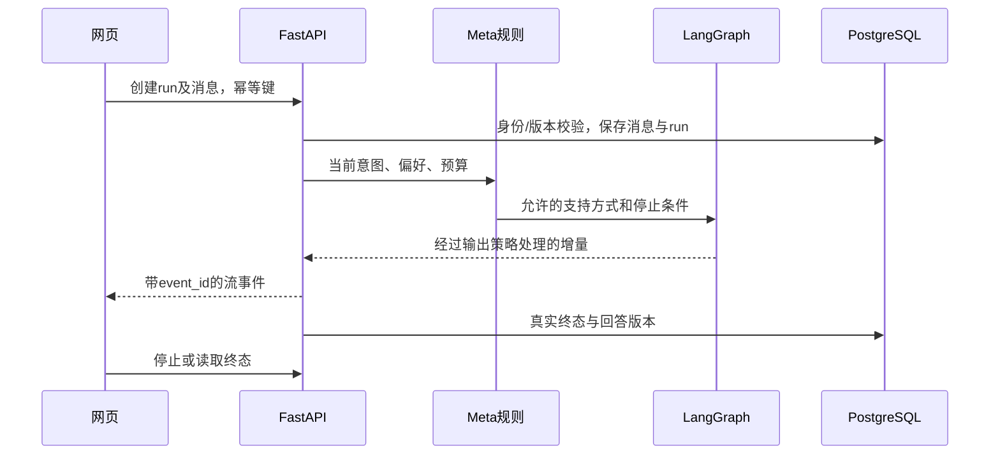
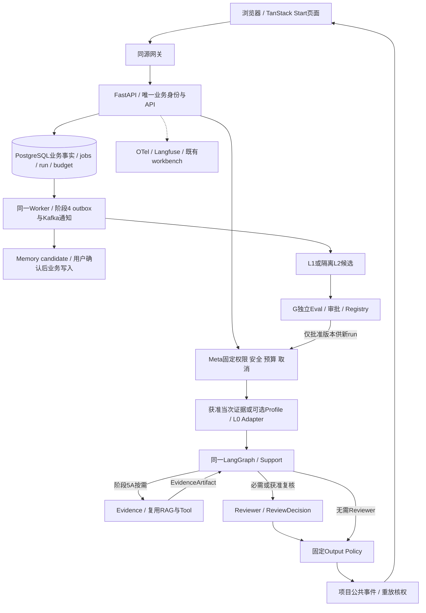

# 阶段1｜技术方案与实施计划

> 整合修订：2026-09-20｜规划文档；产品未实现，业务验收未执行。
> [项目导览](../../README.md) · [阶段目标](01-阶段目标与功能设计.md) · [技术方案](02-技术方案与实施计划.md) · [测试验收](03-测试与验收标准.md) · [分步实施](04-分步实施与检查清单.md)

所有代码路径均为建议新增；本阶段计划未执行。规则以[共同合同入口与实施证据边界](02-技术方案与实施计划.md#missing-sources)为准。来源：S01生产架构，S02 V5–V12/V17的契约、流、工具及预算；R03练习交互、R12会话组织仅作适配参考。

## 最小模块与数据流

建议新增 `frontend/src/routes/`、`frontend/src/features/chat/`、`frontend/src/features/exercises/`、`backend/app/api/`、`backend/app/agent/`、`backend/app/services/`、`backend/tests/`。不创建Java兼容层或第二个Agent框架。

前端采用React/TS、TanStack Start/Router/Query/Form；原生控件和CSS实现基础布局。Start处理页面服务，网关同源 `/api/v1` 转发FastAPI；公开介绍页SSR，私人页面客户端取数。后端Python 3.12兼容环境、uv锁依赖、FastAPI/Pydantic、异步HTTPX和SQLAlchemy/Alembic。工程验收前锁定实际版本，不把上游宽泛版本范围当兼容证明。



### 模块与调用链

沿原FastAPI→Meta→LangGraph→Support→Output Policy。新增最小consent用途映射、InteractionEvent接收器与AgentBehaviorEvaluator规则函数；它们不是自治Agent。Meta控制合法资料、固定支持边界、调用预算与取消。无需每轮LLM分类，语义不确定时先自然澄清。

### 分阶段架构与权限边界



节点按需执行，前四阶段不提前拆Evidence/Reviewer。MCP若将来接入，只在Tool适配边界；Redis若接入，只存可重建或临时信息。图内的Meta运行治理与G独立研究治理是不同权限主体。

<a id="aud-01"></a>
## Agent与Meta合同

`SupportState`保存session/run、当前消息版本、用户明确偏好、支持方式、预算计数及停止原因。用户身份在服务端注入，不由模型生成。阶段1工具仅允许读取当前会话与静态审阅资源，不能写长期记忆、行动或联系他人。

Meta输入：已认证用户、消息、当前偏好、运行预算、可用模型和支持材料版本。输出：`mode`（listen/clarify/explore/action/close/support_route）、`allowed_tools`、`budget`、`stop_reason`及版本。权限/预算/用户拒绝为规则；仅在意图含糊时使用结构化分类，不为每轮增加独立Meta LLM调用。分类失败回到保守倾听/必要澄清；高风险表达按经过审阅的支持流程处理，不依据未经验证的个人风险分数。

状态图：输入校验 → 意图/支持方式 → 生成 → 输出处理 → 完成或明确失败。限制总调用、token、deadline和生成步数；数值作为开发配置，结合合成用例与供应商实测后冻结。不透明的provider计费不能因取消标为零。

后期衔接：SupportState及run_id、版本、source引用、预算、取消和trace保留可扩展边界；阶段1输出仍只由Support及固定输出策略处理，不预建多角色Artifact表或第二套调度。阶段5A将在同一StateGraph增加角色节点、typed Artifact、allowed_agents及角色预算；阶段1的单Agent与Meta任务不因此增加前置依赖。

### 事件去噪与基线检查

用户真实发送的唯一client_message_id计主动发起；网络重送、模型重试、刷新恢复、自动重连不新增一次发起。initiation区分user/requested_followup/system_push/unknown；当前产品不产生站外push，system_push仅保留将来合法能力或合成压力测试的可区分枚举。用户预约跟进指下次主动开启会话时承接，不自动推送。

对active_ms使用单调时钟区间、服务端接收时间与事件序号做去重/合并；重叠多标签页不能重复相加。闲置阈值、heartbeat精度与后台切换误差是工程配置，在合成录制和无障碍场景上校准；未校准时active_ms=null，不用连接时长冒充互动时长。聊天频率只作观察信号，原有严重生活影响不因“个人常态”被正常化。

在线Evaluator输出AgentEvaluation（可只规则项），未知语义评分null。安全/拒绝/关系操控硬失败不能用温暖度或满意度抵消；普通路径只发布经固定检查的片段，敏感/需整体语义复核路径缓冲完整候选。评估超时不增加无限调用，返回已审有限回应或Controlled Stop；记录失败而非假通过。

### 故障与回退

事件服务失败只停止可选分析，不阻止必要对话；用途查询失败时禁止新增私人来源读取，允许当前已合法输入的基本支持。LLM/检查失败不伪造“已理解/已保存”。取消沿服务端CAS终态；删除同时处理反馈中获准关联片段与评估派生引用。回滚规则/策略版本只影响新run，不恢复已删资料。

<a id="provider-contract"></a>

### Provider能力与统一重试

关联任务：S1-T03；验收：S1-A12。

Provider调用优先使用锁定LangChain模型适配器。每个ModelProfile登记provider、精确模型标识/可获版本、参数、适配包版本、数据区域与保留条件、允许任务、结构化输出方式、tools与structured output能否同时用、流/usage/取消能力及验证引用。状态区分documented/tested/unsupported/unknown；未验证不是true。Pydantic仍做模型外校验。拒答、截断、无usage、未知tool name和错误参数分别处理，不把空JSON或HTTP200记成功。

ModelProfile能力矩阵由S1-T03维护，具体Provider/model尚未选择，初始全部unknown；官方声明只可记documented，完成获准的真实适配验收并附版本/收据才可记tested。

| 能力项 | 待填配置/证据 | 当前能力状态 | 不具备时的消费者与回退 |
|---|---|---|---|
| 文本与流式输出 | 精确model_ref/参数/adapter版本、截断与半截流收据 | unknown | Support关闭未验证流路径，使用已审说明或已验证同策略路径 |
| 结构化输出 | provider-native或Tool策略、schema子集及拒答形状 | unknown | Meta/候选仍须模型外Pydantic验证，无有效对象不执行 |
| Tool调用及与结构化输出组合 | tool名称/参数、并行返回、组合能力收据 | unknown | 只开放已验证Tool子集，未知mutation结果不自动重试 |
| usage与计费 | token字段、usage_source、price_version/currency、实际/估算/未知 | unknown | 账本保守占用；无可信上界停止新付费调用 |
| 超时/取消 | connect/read/write/pool及外层deadline，远端终止确认 | unknown | 本地先停新调用/输出，远端未知消耗保留 |
| 错误与重试 | 429/Retry-After、拒答/截断/schema错误、SDK重试配置 | unknown | 项目边界统一有限重试，不叠加无计量SDK重试 |
| 数据使用条件 | 区域、保留政策/凭据引用、允许任务和批准记录 | unknown | 缺条件只用合成开发，不外发真实私人资料 |

同一外部请求的重试由项目调用边界统一负责；关闭或显式计入Provider SDK、LangChain、图节点与Worker的重复重试。只有可安全重试的瞬态错误，且剩余calls/token/cost/deadline允许时，才有限退避重试。429尊重服务端Retry-After但不能超过原deadline；已流出正文、mutation结果未知或用户取消后不自动重做。schema修复也是新模型调用，最多使用冻结配额，不无限修到通过。

调用链：`start→Meta预占→LangGraph模型适配→Pydantic/Output Policy→事件/usage结算`。持久调用收据拟关联run、role、model_ref、request_id、attempt、reserved/actual/unknown，凭据只存引用。生产故障优先已审说明或预先验证的同策略兼容降级；实验组禁止静默换模型/Provider/参数，变化标非等价或重立协议。Ollama不成为用户隐私默认出口。

验收/回退：S1-A12；所选模型不支持所需能力则关闭对应路径，保持已审基础支持，不能关闭固定安全。验收证据是兼容矩阵、错误分类和实际账本，不是“支持所有OpenAI-Compatible模型”。

## 数据结构与所有权

| 表/结构 | 最小字段及约束 |
|---|---|
| users、user_preferences | user_id、session身份引用、mode、display_preferences、version；服务端生成归属 |
| conversations | id、user_id、title、status(active/archived/deleted)、version、created_at/updated_at |
| messages、message_revisions | id、conversation_id、role、content、version、parent_id、branch_id、is_current、deleted_at；正文不进入URL/普通日志 |
| runs、run_events | id、user_id、session_id、source_message_version、version、status(draft/queued/running/waiting_approval/completed/failed/cancelled/interrupted)；waiting_approval从阶段4有真实消费者时启用、strategy_version、budget_used、stop_reason；事件唯一(run_id,event_id)；状态改变递增run版本，token事件不递增资源版本 |
| feedback | id、user_id、run_id、helpfulness、category、可选comment、处理范围说明版本；不得隐式附整段对话 |
| deletion_jobs | id、owner、target、scope、status、completed_steps、error_code；阶段1可串行处理，失败保留真实状态 |
| consent_records | user_id、purpose、document_version、decision、decided_at；当前不开研究用途 |

LangGraph使用官方检查点能力，命名空间与业务表分开；它不决定消息是否删除或运行是否已完成。阶段1若断点恢复无法保证一致，允许恢复为“已中断、可重试”，不得伪造继续成功。为阶段2保留source_id/version/deleted_at即可，不先实现长期记忆。

<a id="aud-02"></a>
## API与流事件

统一鉴权、错误、幂等规则见[共同接口合同](../阶段1/02-技术方案与实施计划.md#shared-contracts)。以下私人接口逐项校验归属；不可见资源404。`expected_version`不符409，正文或枚举错误422。

| 方法与路径 | 请求 | 返回及失败语义 |
|---|---|---|
| POST `/api/v1/sessions` | 可选title；Idempotency-Key | session_id/version/status；空标题用中性默认，不从敏感首句直接生成标题 |
| GET `/api/v1/sessions` | q、status、cursor、limit | items/next_cursor；搜索不返回已删除内容 |
| GET `/api/v1/sessions/{id}` | 无 | 当前分支消息、历史分支引用、version；分页历史单独读取 |
| PATCH `/api/v1/sessions/{id}` | title或status、expected_version | 更新后的资源；不能借此恢复deleted |
| POST `/api/v1/sessions/{id}/runs` | kind(message/regenerate)、message或source_message_id、expected_session_version、client_message_id | 普通聊天便捷入口，内部创建draft后启动；202 run_id/version/status；重复键同一run；未知前次状态先查询 |
| POST `/api/v1/run-drafts` | context_type=conversation、session_id、kind、本阶段所需expected_session_version；Idempotency-Key | draft run_id/version；不调用模型、不读取额外资料；后续阶段用此ID绑定临时授权 |
| POST `/api/v1/runs/{id}/start` | input（message或source_message_id）、grant_ids可空、expected_version（run版本）、expected_session_version | 202相同run_id及新version；原子将draft转queued，重新核对来源和授权；重复启动同一请求不二次执行 |
| GET `/api/v1/runs/{id}` | 无 | version、status、output_ref、last_event_id、stop_reason |
| GET `/api/v1/runs/{id}/events` | after_event_id | SSE信封schema_version/run_id/event_id/generation/type/run_version/occurred_at/payload；补发已持久事件，不重跑工具 |
| POST `/api/v1/runs/{id}/cancel` | expected_version（run版本） | 当前version/状态和取消结果；终态已提交则返回该终态；活动版本冲突409先读取再决定，不能复活已结束run |
| POST `/api/v1/sessions/{id}/messages/{mid}/revisions` | content、expected_version | 新消息版本/branch；仅最后用户输入且前run终止，其他情形409 |
| DELETE `/api/v1/sessions/{id}` | expected_version | deletion_id/status；先阻断访问，后返回已完成步骤；失败可查状态，不假称彻底删除 |
| GET `/api/v1/deletion-jobs/{id}` | 无 | 处理步骤、剩余项、retryable；阶段1无备份则标不适用 |
| GET/PATCH `/api/v1/me/preferences` | PATCH为字段及expected_version | 已保存偏好和version |
| POST `/api/v1/feedback` | run_id、helpfulness、category、可选comment | feedback_id/status；不附带原文 |
| GET `/api/v1/exercises/{id}` | 无 | 已审内容id/version/steps/limitations；未审版本404 |
| GET `/api/v1/resources/support` | 可选已选地区/学校 | 当前已核实静态条目及checked_at；无条目返回空态说明 |

阶段1流只使用 `run.started`、`message.delta`、`run.completed`、`run.failed`、`run.cancelled`；状态事件附run_version，artifact与approval事件留到真实消费者阶段。取消与完成以服务端终态CAS先成功者为准；前端收到冲突先取终态，仍活动时可重发取消。断网、身份过期、代理缓冲、重复事件及终态竞态有专门测试；浏览器停止需通知服务端，不能只停止绘制。draft可取消或到期，不发送模型、不产生假消息；未带额外资料的普通聊天可走便捷入口。

### 接口合同

所有接口使用[共同合同与治理入口](../阶段1/02-技术方案与实施计划.md#missing-sources)身份/幂等/版本规范。

| 接口 | 输入→输出 | 校验/错误 |
|---|---|---|
| POST `/api/v1/consents` | purpose、decision、notice_version、scope→id/version/effective_scope | 不接受客户端owner；长期画像/记忆/研究不可合并为一个勾选；未开放用途422 |
| GET `/api/v1/consents`；DELETE `/api/v1/consents/{id}` | 本人列表；expected_version→revoked/受影响任务 | 撤回可选用途不退出基本服务；本人不可见404 |
| PATCH `/api/v1/me/preferences` | 支持方式、提醒、显示、age_band及expected_version→新版本 | age_band为范围/来源而非从文风猜年龄；正式年龄核验方式待G批准 |
| POST `/api/v1/interaction-events` | event_id、session/run、type、时间、initiation、可选active_ms/coverage→accepted/duplicate/rejected计数 | 服务端归属、有限batch、时钟偏差、重复键、非法负时长校验；无权用途403 |
| POST `/api/v1/feedback` | run_id、helpfulness、category、optional_comment、research_opt_in可缺省false→feedback_id | 不随反馈附会话原文，不将点赞作为政策晋升票 |

原会话run-draft→grant→start、SSE、cancel与修订API沿本阶段运行接口合同，公共事件不暴露模型状态。InteractionEvent不包含键盘轨迹、私人正文、站外应用、精确位置；页面可见/焦点与主动交互段只能估计可观测活跃时间，不能称已测真实注意力。

<a id="public-events"></a>

### 公共事件、重放与同源Start边界

关联任务：S1-T04、S1-T05；验收：S1-A11。

Start提供页面服务；网关将同源`/api/v1`与SSE直接转发FastAPI，后者验证同一HttpOnly会话与业务权限。POST start/cancel/确认继续有CSRF校验；GET流只读，不能启动run。Start不复制业务session和运行状态，私人页不SSR敏感正文，QueryClient按请求隔离。Query自动重试不得再次start。

公共事件在原run_id/event_id/type/payload外增加schema_version、generation、occurred_at；状态事件保留run_version。event_id沿run单调唯一且作为SSE id，generation独立，恢复不重置序号。message.delta只由Output Policy写入公共事件，内部模型流、角色消息、画像、审稿意见及Artifact正文不透传。required review路径先缓冲整稿，只有通过绑定draft hash/source/grant的检查后才发送；等待只显示白名单进度。

| 原合同 | 规划兼容规则 |
|---|---|
| run.started、message.delta、run.completed、run.failed、run.cancelled | 名称与语义保留；新信封字段向前端合同显式加入，未发现实际旧客户端，不假称已做兼容迁移 |
| artifact.proposed | 仅用户可审业务候选的受权预览，不映射所有内部run_artifacts |
| approval.required | 继续表示等待用户批准；waiting_approval不算业务完成，不释放未耗尽预算或刷新deadline |
| run.progress | 5A继续仅finding_resources/checking_sources等白名单；不新增agent_started/agent_thought |
| status=interrupted | 公开run.failed且stop_reason=interrupted，查询仍返回真实status；客户端列入不可自动恢复终态，重新生成另建run |

状态映射以业务run为真源；阶段1未启用的approval/Artifact/进度只登记兼容合同，不产生假事件。

| GET run.status | 公共事件/前端处理 |
|---|---|
| draft | 不产生模型事件；显式start前零调用 |
| queued | 查询表示等待执行；GET订阅不启动任务 |
| running | run.started；之后仅Output Policy可发message.delta，必要时run.progress |
| waiting_approval | approval.required；非终态、预算和deadline不重置 |
| completed | run.completed；只引用已核权真实output |
| failed | run.failed及具体stop_reason |
| cancelled | run.cancelled；保留已发生费用/业务结果 |
| interrupted | run.failed及stop_reason=interrupted；GET保留interrupted，不自动resume新图 |

所有公共事件使用完整信封且run_version为写入时的业务版本；delta不自行递增资源版本。event_id为十进制序号字符串，按数值单调，前端按run/event_id去重而非按字符串排序。客户端遇未知schema先停止拼接并查获准快照，不能猜字段；游标冲突或不合法返回422，过期410。generation不能替代序号或授权。

公共事件例子（合成、未执行）：

```json
{"schema_version":"public-run-events/1","run_id":"run-demo","event_id":"17","generation":1,"type":"run.progress","run_version":3,"occurred_at":"2026-09-18T00:00:00Z","payload":{"code":"checking_sources"}}
```

重连沿`GET /runs/{id}/events?after_event_id=...`，允许标准Last-Event-ID；两者同时给且不同则拒绝，不默选。游标不是授权凭据，每次连接、重放批次及实际发布核当前owner/source/grant/generation/删除状态。前端按run＋event_id去重；乱序先查终态/缺口，禁止拼成新run。游标超过保留窗口返回410 `event_cursor_expired`，从已核权run/output快照恢复，不能重调模型。删源后旧delta必须不可重放，不能仅删除最终message；当前页面清理受影响缓存，但不承诺能收回用户已看到的文本。

SSE注释心跳不计业务事件或主动发起次数；间隔与代理idle timeout配套配置并测量。限制每用户连接、发送队列和输出字节；慢客户端溢出只断开流并让其恢复快照，不无限堆积私密正文。关闭浏览器流连接仅代表失去订阅；点击“停止”必须提交cancel，页面退出按产品原约定尽力取消并核终态，不能只停止绘制。意外网络断开时run最多执行到原deadline；无新start、无预算重置、无新增InteractionEvent主动计数。账号退出/撤权使相应run停止。

底层优先核所锁FastAPI的原生SSE能力，官方文档标自0.135.0提供；不为追新强改未来实际仓库。浏览器主方案为原生EventSource消费同源GET，遇结构化握手失败先关闭重连并查询run；需要自定义header时再论证fetch消费者，不能另建协议。验收S1-A11；回退至同一run的状态查询/获准完整结果，绝不以重新start模拟断点续传。

<a id="aud-03"></a>
## 复用与适配步骤

R03：从CBT `frontend/js/ui.js`的注意力步骤/退出流程整理纯状态转换，迁为React组件；不复制DOM全局变量、音频和localStorage。Sage呼吸组件留阶段3，同一练习台共享退出/可访问性合同。中文内容另外审阅，代码许可不代替心理内容认可。

R12：借鉴SoulChat历史选择/重命名交互；不搬Streamlit、按标题拼路径、原文打印和用户配置。使用数据库ID、所有权及中性标题。LLM及API直接使用LangChain/FastAPI既定栈。

<a id="first-slice-gates"></a>

### 最小工程门禁与异步资源

关联任务：S1-T02、S1-T03、S1-T08；验收：S1-A13。

Python先锁一个3.12兼容环境，实际依赖按API/Worker/离线优化需要分组；不使用“3.12+”作为无限兼容承诺。项目现无包管理器，uv沿既定方向；若取得的真实仓库已有可用锁文件，则先保留，不无条件迁移。Ruff负责lint/格式检查，mypy检查业务边界和schema类型，pytest覆盖有业务含义的失败路径；不增加与其重复的默认检查器。

I/O路径使用async/await：HTTP、DB和支持异步的模型调用；共享HTTP客户端/连接池在FastAPI lifespan或Worker生命周期创建并关闭，不每token/循环创建。AsyncSession按请求或并发任务隔离，不能把同一实例广播给角色。阻塞解析/CPU计算放有界Worker/进程，必要同步SDK只用有界线程桥；取消await不保证线程或远端工作已停，迟到提交仍核generation及账本。外层剩余deadline裁剪每个connect/read/write/pool超时，资源等待也计时；CancelledError清理后继续传播，不吞掉取消。

第一次可用切片即有lint、类型、API与授权/取消确定性回归；阶段5再补镜像、恢复与完整发布。质量门禁不需要当前引入GitHub云托管，命令应可本地/私有CI运行。验收S1-A13；依赖适配失败保留旧锁版本并停用新增特性，不为通过类型检查把边界全改Any。验收证据：锁定环境、异步资源生命周期、故障fixture与合成API演示。

#### 首次切片的执行入口（未来实施，全部未执行）

以下命令仅在实际backend/frontend目录、依赖锁文件、脚本和隔离配置存在后运行；本轮未创建这些配置、未执行产品测试。Python/前端任一授权、类型或取消回归失败即阻止该切片交付。PR无外部模型出口，只使用合成fixture和受限测试数据库。

```bash
# 未执行：未来 backend/，须先有实际依赖锁、dev组及隔离配置
uv lock --check
uv sync --locked --group dev
uv run --no-sync ruff check .
uv run --no-sync ruff format --check .
uv run --no-sync mypy app
uv run --no-sync pytest -m "not live_model and not external_service"
# 只连隔离测试数据库；相应路径/markers须先由实现登记
uv run --no-sync alembic check
uv run --no-sync pytest tests/contracts/test_run_events.py
uv run --no-sync pytest tests/workers/test_job_recovery.py
# 未执行：未来 frontend/，默认pnpm；须有对应锁文件和实际scripts
pnpm install --frozen-lockfile
pnpm run typecheck
pnpm run lint
pnpm run test:unit
pnpm run test:e2e
pnpm run build
```

以上脚本名和测试路径是实施合同，不表示文件已经存在。取得真实仓库后如已有其他唯一锁定工具链，先核对并保留，不能并装多套包管理器。安装与执行分开：受控构建按锁文件取依赖，检查阶段默认禁模型/外部服务访问；不声称uv sync必然离线成功。迁移须另测空库、上一受支持schema升级、N/N-1应用兼容和失败恢复；alembic check不能替代这些证据。覆盖率与负载门槛由可信基线后事前冻结，真实模型访问另核输入资格、预算与取消，pytest marker不充当访问控制。


最小观测同时前移：调用边界只采request/run、版本、耗时、预算和错误元数据，默认不采正文/画像/密钥；费用unknown不填0，重试与取消均留收据。阶段5再按[完整采集合同](../阶段5/02-技术方案与实施计划.md#observability)扩展OTel/Langfuse与费用核对；不提前启动整套观测服务。

## 任务顺序

| 任务 | 优先级/前置 | 关联功能 | 可检查产出与验收 |
|---|---|---|---|
| S1-T01 <a id="s1-t01"></a> 冻结合同和合成用例 | P0/无 | F-CHAT-001、F-EVAL-001 | 支持方式、风险流程、练习内容审阅状态与用例版本；S1-A01/S1-A07 |
| S1-T02 <a id="s1-t02"></a> 建身份与数据结构 | P0/T01 | F-PREF-001、F-DATA-001 | 登录、资源归属、迁移、版本/删除表；S1-A02/S1-A06 |
| S1-T03 <a id="s1-t03"></a> 接单Agent与Meta | P0/T02 | F-CHAT-001、F-OPS-001 | 图、结构化决策、调用预算和模型错误；S1-A01/S1-A09 |
| S1-T04 <a id="s1-t04"></a> 接运行状态和流 | P0/T03 | F-CHAT-001、F-CHAT-002 | 运行API、SSE、取消和终态查询；S1-A05 |
| S1-T05 <a id="s1-t05"></a> 完成TanStack页面和练习 | P0/T02,T04 | F-EXERCISE-001、F-PREF-001 | 响应式网页、独立练习、键盘流；S1-A02/S1-A03 |
| S1-T06 <a id="s1-t06"></a> 完成删除/退出/反馈 | P0/T02,T04 | F-DATA-001、F-FEEDBACK-001 | 删除处理证据、缓存清理、反馈真实ID；S1-A06/S1-A08 |
| S1-T07 <a id="s1-t07"></a> 完善历史和修订 | P1/T04,T06 | F-CHAT-002 | 搜索/归档/分支合同、无旧分支混入；S1-A04 |
| S1-T08 <a id="s1-t08"></a> 运行阶段验收并交接 | P0/T01–T07 | 全阶段 | 真实端到端记录及未解决项；S1-A01至S1-A10 |

首版开发可本地装配，不能标为最终生产。供应商与专业内容未就绪时用隔离合成材料继续工程，不默认对真实学生开放。下一阶段复用身份、消息版本、删除处理和运行预算，扩展业务模块而不是重写运行框架。

### 任务依赖与资源

增量任务按下表登记；原S*-T*含义保持，页内Txx为本阶段基础任务的局部简称。每个工作包S/M（规模定义见[预算口径](../阶段6/02-技术方案与实施计划.md#cost-assumptions)），不承诺工期。阶段2复用source/version/consent快照；本阶段不创建长期画像表的生产数据。

<a id="increment-tasks"></a>

### RSI任务与基础任务映射

| 增量任务 | 原任务关联 | 依赖 | 功能与接口/实体产出 | 验收引用 |
|---|---|---|---|---|
| RSI-S1-T01 <a id="rsi-s1-t01"></a> 冻结支持边界与合成反例 | [S1-T01](02-技术方案与实施计划.md) | 本阶段前置门槛 | U01/U04；consent告知、固定支持规则与合成case | [RSI-S1-A01](03-测试与验收标准.md)、[RSI-S1-A05](03-测试与验收标准.md)；共同S1-A11、S1-A12、S1-A13 |
| RSI-S1-T02 <a id="rsi-s1-t02"></a> 定义consent/事件schema及UI | [S1-T02](02-技术方案与实施计划.md)、[S1-T05](02-技术方案与实施计划.md) | RSI-S1-T01 | U01/U02；ConsentRecord/InteractionEvent、/consents及privacy页 | [RSI-S1-A02](03-测试与验收标准.md)、[RSI-S1-A03](03-测试与验收标准.md)、[RSI-S1-A04](03-测试与验收标准.md)；共同S1-A11、S1-A12、S1-A13 |
| RSI-S1-T03 <a id="rsi-s1-t03"></a> 接run/feedback与事件去噪 | [S1-T04](02-技术方案与实施计划.md)、[S1-T06](02-技术方案与实施计划.md) | RSI-S1-T02 | U02/U03；run-events/feedback、发起去重与VersionBinding | [RSI-S1-A03](03-测试与验收标准.md)、[RSI-S1-A04](03-测试与验收标准.md)、[RSI-S1-A07](03-测试与验收标准.md)；共同S1-A11、S1-A12、S1-A13 |
| RSI-S1-T04 <a id="rsi-s1-t04"></a> 接输出前检查与取消 | [S1-T03](02-技术方案与实施计划.md)、[S1-T04](02-技术方案与实施计划.md) | RSI-S1-T03 | U04；AgentEvaluation、Output Policy、cancel | [RSI-S1-A05](03-测试与验收标准.md)、[RSI-S1-A06](03-测试与验收标准.md)、[RSI-S1-A07](03-测试与验收标准.md)；共同S1-A11、S1-A12、S1-A13 |
| RSI-S1-T05 <a id="rsi-s1-t05"></a> 执行基线及增量阶段验收 | [S1-T08](02-技术方案与实施计划.md) | RSI-S1-T04 | U01～U04；API/SSE、Provider/预算、首切片门禁 | [RSI-S1-A01](03-测试与验收标准.md)、[RSI-S1-A08](03-测试与验收标准.md)；共同S1-A11、S1-A12、S1-A13 |

以上均为未来实施任务，未执行。工作包规模不作工期或性能承诺。

<a id="technical-sources"></a>
## 技术来源与核验边界

下表转引2026-09-18审核的外部资料与静态快照；本次仅整合文档，未重新核验在线版本或装配兼容性。历史库版本不是项目依赖锁，正文中的建议路径也不是现有源码。

| 来源 | 历史核验记录及适用范围 | 对应合同 |
|---|---|---|
| [WHATWG SSE](https://html.spec.whatwg.org/multipage/server-sent-events.html)、[FastAPI SSE](https://fastapi.tiangolo.com/tutorial/server-sent-events/) | SSE有id/event/data与Last-Event-ID；FastAPI原生SSE文档标自0.135.0增加 | [AUD-02](02-技术方案与实施计划.md#aud-02)优先锁定版原生能力；若实得旧版再适配，不能直接声称本项目已有EventSourceResponse |
| [FastAPI lifespan](https://fastapi.tiangolo.com/advanced/events/)、[HTTPX async](https://www.python-httpx.org/async/)、[timeouts](https://www.python-httpx.org/advanced/timeouts/)、[Python 3.12 asyncio](https://docs.python.org/3.12/library/asyncio-task.html) | 生命周期管理、连接复用、分项I/O超时与外层取消属于不同职责 | [AUD-01](02-技术方案与实施计划.md#aud-01)/03：外层总deadline、有限并发与统一重试；不把read timeout当整个run时限 |
| [SQLAlchemy 2.0 async](https://docs.sqlalchemy.org/en/20/orm/extensions/asyncio.html)、[Alembic autogenerate](https://alembic.sqlalchemy.org/en/latest/autogenerate.html) | AsyncSession不能供多个并发任务共享；自动生成迁移仍需审查 | [AUD-03](02-技术方案与实施计划.md#aud-03)/12：每任务事务，迁移检查不等于安全回退 |
| [uv CI](https://docs.astral.sh/uv/guides/integration/github/)、[Ruff](https://docs.astral.sh/ruff/)、[mypy](https://mypy.readthedocs.io/en/stable/running_mypy.html)、[pytest marks](https://docs.pytest.org/en/stable/how-to/mark.html) | 锁依赖、lint、类型和分组测试各有官方入口；本项目无对应配置 | [AUD-03](02-技术方案与实施计划.md#aud-03)/12：拟定离线PR门禁，不假定GitHub仓库或workflow存在 |
| [LangChain模型](https://docs.langchain.com/oss/python/langchain/models)、[Structured Output](https://docs.langchain.com/oss/python/langchain/structured-output) | Provider原生输出和Tool策略是不同路径，自动选择依赖模型能力；声明不是兼容测试 | [AUD-01](02-技术方案与实施计划.md#aud-01)：锁模型能力表，不自写通用SDK，也不静默更换研究模型 |

<a id="technology-stack"></a>
## 分层技术栈与本地开发方式

| 层/性质 | 生产主线（按阶段） | 条件触发或隔离实验 | 暂不采用 |
|---|---|---|---|
| 语言与工程工具 | Python 3.12起步、TS；uv、Ruff、mypy、pytest；Git | 若外部代码已有可用工具链，先保留并论证迁移；GitHub Actions仅托管确认后采用 | 为展示工具无条件换包管理器/并装多套lint |
| 前端框架 | React、TanStack Start/Router/Query/Form；公开SSR、私人客户端取数 | Table/Virtual依实际消费者，浏览器E2E工具在实际仓库中选定并锁版 | Next.js替换、第二身份/session/run store |
| Web/持久化库 | FastAPI、Pydantic、HTTPX、SQLAlchemy、Alembic | FastAPI原生SSE需所锁版本支持；生产模型/数据库驱动待定 | 通用自研Provider SDK |
| Agent框架 | LangChain＋唯一LangGraph Runtime；LangMem提取/摘要 | LangGraph Command/Send、HITL按现有合同使用；MCP Client按外部需求验证 | CrewAI、AutoGen、Semantic Kernel、LlamaIndex、Haystack、第二Agent Loop |
| 协议 | HTTP API、SSE；公共事件与Tool合同为项目协议 | MCP是外部工具协议，不是Agent Runtime；只读隔离Client/Server展示可单独提案 | 未审工具自动发现即放行、任意SQL/文件/shell/外发工具 |
| 数据与消息基础设施 | PostgreSQL权威业务状态；阶段4pgvector/私有对象存储、Kafka通知和outbox；同一Worker | 应用Redis仅缓存/跨实例限流有证据时；生产PG轮询替换Kafka需ADR且互斥 | 第二向量库、第二队列、Neo4j/GraphRAG无需求引入 |
| 观测/交付 | OTel、既有workbench、按数据条件接Langfuse；OCI/Docker；阶段5受管容器/托管数据库方向 | 开发Compose；Langfuse托管或自托管二选一并核数据条件/费用；真实云账户待定 | Kubernetes、Service Mesh、CRD/Warm Pool、额外Dashboard |
| 项目逻辑模块 | Meta、Output Policy、Budget、Assessor、Adapter、Behavior/OutcomeEvaluator、background_jobs/Worker、Registry/G | 可先在模块化单体与受限Worker内实现；G需独立身份/权限，非所有模块都微服务 | 把逻辑名称当第三方软件包，给每模块创建Agent |
| 评价/研究 | 确定性Eval＋获准人工评价＋校准LLM Judge；Ragas限RAG；L1 GEPA受限适配；L2独立协议 | LangMem固定优化器是L1互斥备选；Ollama仅本地合成开发；有GPU/Serving问题再二选一vLLM或SGLang | 训练平台、任意代码自演化、MicroVM/Firecracker/gVisor无明确隔离缺口时引入 |

本地开发默认Windows/WSL进程，前端使用实际pnpm脚本、FastAPI通过uv启动开发reload，Worker独立运行。Compose默认仅PostgreSQL；应用容器用于CI、生产或显式选择的隔离流程。Python库为依赖，pgvector为PostgreSQL扩展。API导入与reload不得启动消费者。

<a id="missing-sources"></a>
## 共同合同入口与实施证据边界

2026-09-20已从修订前备份核对两份总体规划并按主题吸收到现有阶段文档；来源定义已恢复，实际schema实现、迁移和运行收据仍未完成。历史总体不是新增的运行时或第二份有效合同。优先级为本次明确修订及C01～C08统一口径、各阶段02当前合同、历史来源记录；不恢复旧GENERATED/CANARY/PRODUCTION生命周期、旧错误事件简称或修订前先导顺序。

| 共同合同 | 唯一维护入口 | 仍需实施或批准 |
|---|---|---|
| 身份、幂等、错误、用途映射、共同封套和VersionBinding | [本页共同合同](#shared-contracts) | 实际Pydantic/schema、迁移、身份部署与隔离回归 |
| 14类核心逻辑实体 | [实体索引](#entity-index)，专属字段分阶段02维护 | 逻辑对象映射既有业务表，非14张新表，也非全部产品表数量 |
| 角色Artifact及ContextManifest | [阶段5A](../阶段5A/02-技术方案与实施计划.md) | 实际typed Artifact、上下文及恢复证据 |
| 数据保留、服务资格、来源与发布责任 | [阶段5治理](../阶段5/02-技术方案与实施计划.md#service-governance) | 实际责任人、适用性判断、数据期限及服务/研究资格 |
| L1注册表和L2研究协议 | [阶段6](../阶段6/02-技术方案与实施计划.md#l1-lifecycle)、[阶段7](../阶段7/02-技术方案与实施计划.md#l2-protocol) | 实际依赖锁、先导与独立评价、发布证据 |

来源字段统一为结构化source_refs；VersionBinding及来源、授权、删除状态均由服务端核验。14类实体是RSI总体第8节的核心逻辑对象，不代表全部产品表数量；payload示例不冒充完整可持久化封套。

来源编号分域：S01～S06为原输入，原版复用R01～R14与RSI研究R01～R12是不同目录。各阶段来源段显式标注“原版复用”或“RSI研究”，保留历史编号，不混用结论。输入、源码和论文的历史核验记录不等于当前已运行、已复现或已获真实服务资格。

<a id="contract-decisions"></a>
## 合同统一口径与待决项

以下整合采用2026-09-18审核的C01～C08修订意见；编号保留用于追溯，均为规划决定，不是产品验证结果。

| 原冲突编号 | 统一口径 | 正文入口 |
|---|---|---|
| C01 | GEPA受限adapter为L1主线，LangMem prompt optimizer为互斥profile；记忆提取用途独立 | [阶段6优化器](../阶段6/02-技术方案与实施计划.md#optimizer-integration) |
| C02 | candidate→offline_validated→human_approved→staging_validated→active；canary/production是release.scope，旧状态不能无证据自动晋升 | [阶段6生命周期](../阶段6/02-技术方案与实施计划.md#l1-lifecycle) |
| C03 | 保留S任务含义，RSI任务使用独立前缀并关联父任务；AUD验收作为现有用例别名 | 各阶段02任务表及03验收映射 |
| C04 | 无有效业务授权不得执行；缺引用说明证据不足，不编造引用；合法无引用工具不一概禁止 | [阶段4验收](../阶段4/03-测试与验收标准.md)中的RSI-S4-A02 |
| C05 | 无画像许可禁止读取持久profile，但尊重合法current_run的诉求、拒绝和纠正；不保存趋势 | [阶段3适配](../阶段3/02-技术方案与实施计划.md) |
| C06 | 保留完整run.failed/run.cancelled名称；waiting_approval发approval.required；interrupted映射run.failed并带真实stop_reason | [公共事件](#public-events) |
| C07 | 阶段5负责评价治理，5A负责角色/Artifact/预算并保留14项基础验收及S5A-A15；5A完成才进入6 | [阶段5A](../阶段5A/02-技术方案与实施计划.md) |
| C08 | source_refs结构化、VersionBinding一致；payload片段不冒充完整可持久化封套，14类核心实体字段与共同封套已归位，实际schema和状态校验待实现 | [共同合同与待补资料](#missing-sources) |

具体Provider、实际SDK/依赖锁、中文校准、外部MCP需求、生产基础设施及服务/研究资格仍按各阶段待补证据核定；不因文档整合而标为已实现或已批准部署。

## 实施前待补证据

| 待补事项 | 缺失证据 | 当前采用方式 | 影响范围 |
|---|---|---|---|
| 外部实际代码与共同schema | 实际源码、依赖锁、配置及按已整合合同实现的schema/迁移 | 先完成已知合同与合成fixture，缺字段明确留位 | 相应持久化与接口实现；不能凭片段创建重复实体 |
| Provider与价格/数据条件 | 精确模型、地区、数据保留条件、usage/取消实测及价格版本 | fake Provider验证确定性合同，费用未知明确记录 | 真实模型能力、成本与真实资料调用验收 |

## 任务表与执行步骤的关系

基础任务和RSI任务编号用于追溯，父任务关联不等于必须等待父任务全部结束。合并后的实际顺序、局部完成条件及交接见[分步实施清单](04-分步实施与检查清单.md)。同一任务的合同、实现与验证可跨步，须所有相关步骤及用例完成才能记整项通过。

<a id="shared-contracts"></a>
## 共同身份、授权、实体封套与版本合同

所有业务路径以 `/api/v1` 开头，用户身份取自服务端会话，客户端不传可决定所有权的user_id。采用同源、安全HttpOnly会话及CSRF保护；业务资源逐项校验归属。成功返回资源ID、版本和真实状态；列表含 `items/next_cursor`。错误含 `code/message/request_id/retryable`，不带堆栈或私人原文。

新增记录使用 `Idempotency-Key`，同用户同键同请求返回原结果，键相同内容不同返回409。修改/删除带 `expected_version`，版本不符409，字段不合法422，未登录401，权限不足403；私人资源不可见时统一404；限流429；服务不可用503。请求超时不等于写入失败：按幂等键查结果后再决定重试。各阶段列具体请求和响应字段，不直接照搬源项目接口。

用途枚举分层：ConsentRecord描述告知/合法用途，context_grants描述对具体source/run的访问授权，两者不能互换。service_context映射current_run；optional_profile映射新增dependency_assessment grant；saved_memory仍须candidate_extraction并经用户确认，后续读取另核personalization；research映射受控research_export/evaluation范围，只产生经G核验的去标识snapshot。旧current_run/candidate_extraction/personalization枚举保留；新用途由业务schema与权限迁移显式加入，不由模型生成grant。

运行前原子绑定 `VersionBinding={policy_version, assessor_version, evaluator_version, graph_version, model_ref, schema_version, consent_snapshot}`，同一run不热换。每次读取、外部调用、handoff、写入和输出重新核权/来源版本；新版本仅新run使用。审批绑定资产hash与基线，hash变化失效；恢复检查幂等业务收据，不能只信模型日志。个人修正可使Profile立即stale，正在生成的关联输出停止。

以下是拟定的**逻辑实体**，沿用consent_records/context_grants、run_events、strategy_bundles、candidate_versions等既有设计，不为同一对象建双主存。共同字段：id、schema_version、version、created_at、updated_at、source_refs（含版本）、consent_refs、purpose、retention_policy_id、deleted_at；个人对象另有服务端owner_id；全局资产仅来源于合资格去标识案例，记录dataset_snapshot和provenance，不带个人owner。unknown用null与reason，不用0冒充未观测；已充分观测的零次事件可以是0。

类型约束补充：id及关联键为不含业务正文的opaque string；version/schema_version为正整数或受注册的版本字符串，generation为非负整数；时间为带时区ISO-8601，窗口起止必须有序；计数和active_ms为非负数或null，费用币种/价目版本显式绑定。source_refs逐项为 `{source_type, source_id, source_version, purpose, grant_ref}`，不可仅存自由文本引用。个人对象owner_id由服务端注入，跨对象owner不一致拒绝；全局资产不得用owner=null绕过来源资格。

枚举统一：ExperimentRun.status为planned/queued/running/paused/completed/failed/cancelled，arm为E0～E6（MA对照另用独立profile）；MetaOptimizerVersion.status沿PolicyVersion生命周期；EvaluatorVersion.status为draft/calibrating/approved/retired；ApprovalRecord.decision为pending/approve/reject/research_only；AgentEvaluation.verdict为pending/pass/revise/block/error/not_applicable。pending只允许未完成记录，不能通过发布门禁。敏感性分为personal_sensitive/research_restricted/nonpersonal_asset，去标识材料默认仍为research_restricted；必须绑定retention_policy_id，不从字段名猜是否可公开。

记录默认仅本人查看。`context_grants`绑定资料ID、版本、用途与有效范围；临时授权使用“创建draft run→绑定grant→显式start”，终止、取消或到期后失效。普通无附加资料聊天可用内部同流程的便捷入口；记录辅助不要求先创建聊天会话。候选卡的“仅本次”具体指下一次尚未开始的回应，不能追溯授权。允许AI整理只开放选定内容给本次模型处理；候选生成前、写入前、后台重试前均重查授权。长期记忆另需明确确认，研究/优化另需独立安排。模型已经接收的内容不能通过本地取消“收回”，供应商保存条件须在试用前核实并如实告知。

自由笔记独立保存；对话摘记使用 `source_message_ids` 关联正文及用户批注，属于关联记录。源会话删除时预览受影响摘记，并一并删除相关摘记；不删除无关自由笔记。本轮不提供绕过来源关联的自动永久复制。用户纠正消息使关联摘记和AI派生内容变为需重核状态，不把旧摘要继续提供给模型。

记忆区分 `user_statement`、`user_feeling`、`system_inference`、`confirmed_preference`；系统推断不能直接成为有效事实。正文变化产生新版本，引用绑定版本；生成候选不等于用户确认。`ContextManifest`记录本轮实际提供给模型的资料引用，界面称“本轮参考资料”，不声称证明模型内部因果使用。

### 8.3 删除和撤回

删除请求先原子标记对象不再可用并递增版本，再处理摘要、候选、索引、缓存、相关运行检查点、服务端导出包和排队任务；阶段5A起同样处理各角色Artifact、草稿及绑定的review，旧pass不得在来源失效后继续发布。导出包即使已ready，每次下载也要重查来源状态；来源删除/撤权使旧包invalidated并清理，取消后的迟到任务不能重新ready。旧任务提交前检查源版本、授权和删除标记，失败则丢弃结果。单条记忆遗忘而原会话保留时，保存最少来源抑制标记，避免再次自动抽取；后续用户主动重新确认可新建授权。

处理状态为 `requested → online_blocked → derivatives_purged → backup_pending → completed`，失败为 `failed_retryable`并显示待处理项。前端只有全部范围有证据才显示完成。无备份的早期开发阶段使用当前删除任务记录，备份项不适用，不依赖阶段4对象存储；启用任何包含用户数据的备份前必须建立独立清单，不能先开备份再补治理。生产备份保存期限在阶段5冻结，此后删除请求接受前需取得独立于数据库快照的持久清单确认；恢复获取最新清单并核对水位，缺失时禁止接流量。账号删除撤销普通身份，同时提供只读本任务状态的受限回执，不恢复原数据访问。撤回用途默认停止后续使用，和删除全部原始记录分开提供。日志以元数据为主，必要保留和供应商删除能力列入数据说明。

记忆claim_type固定为user_statement、user_feeling、system_inference、confirmed_preference；推断不能自动升级为事实。ConsentRecord.notice_version是告知版本；旧consent_records.document_version映射同一告知版本，不另建两份同意真源。context_grants保存来源级权限，ConsentRecord不是可直接取数凭据。

VersionBinding中的schema_version表示注册的版本标识；角色Artifact的schema_version沿5A整数major合同，公共SSE沿public-run-events/1示例，各对象在实际schema中固定具体类型，不以共同封套的允许范围放宽消费者校验。总预算和固定安全配置缺失不启动对应调用；新增枚举须显式迁移，不默认为已具备研究权限。

原总体统一错误封套适用于本项目业务API；当前公共SSE事件及状态映射以本页公共事件合同为准，不恢复旧failed/cancelled简称。删除failed_retryable保留已完成步骤和待清项，恢复不重新开放已阻断资料。

<a id="entity-contracts"></a>
## 本阶段核心逻辑实体与合成片段

共同字段、类型、枚举及VersionBinding由[共同合同](../阶段1/02-技术方案与实施计划.md#shared-contracts)统一维护。下表仅列专属字段；复用既有表/注册表，不新增第二份事实库。

| 实体 | 专属字段/枚举与关联 | 隔离、敏感性和删除关系 |
|---|---|---|
| ConsentRecord | purpose=service_context/optional_profile/saved_memory/research；decision=granted/declined/revoked；notice_version、scope、expires_at、revoked_at；context_grants仍限定source/run | 敏感用途分开明确同意；“保存记忆”不等于研究或长期画像许可 |
| InteractionEvent | event_id、run/session、occurred_at、received_at、event_type、initiation=user/requested_followup/system_push/unknown、active_ms/null、coverage、idempotency_key | 只采获准本站最小事件，不记录键盘正文/站外行为；技术故障/重复/闲置另标 |

以下为合成payload片段，不是可直接提交或持久化的完整对象；服务端必须补全共同封套并按状态校验。null预算、未批准evaluator、缺失画像expires_at均不能作为可运行/可持久化状态。示例不代表已执行验收。

```json
{
  "ConsentRecord": {
    "id": "c-demo",
    "purpose": "optional_profile",
    "decision": "granted",
    "scope": [
      "source-demo-v1"
    ],
    "version": 1
  },
  "InteractionEvent": {
    "id": "e-demo",
    "event_type": "session_opened",
    "initiation": "user",
    "active_ms": null,
    "coverage": "unknown",
    "run_id": "run-demo"
  }
}
```

<a id="s1-step01-mapping"></a>
## S1-STEP01 实际仓库合同映射 s1-contract-map/1

2026-09-20，在基线 c146742 检查全部受版本控制文件及目录：仅 README、AGENTS、32 份规划和 `_check_docs.py`；未找到前端、后端、API、DTO/model、数据库/migration、配置读取器、依赖清单/锁、产品测试或 CI。没有可复用的产品 schema，以下“未实现”不是可持久化类型声明，也不据此新建14张实体表。执行者：本轮 Codex；后续实际路径由对应 STEP 落实后更新此表。

| 消费字段/边界 | 权威合同与映射结论 | 当前实际 schema / 路径 | 承接步骤/负责阶段 |
|---|---|---|---|
| user_id / owner / owner_id；age_band | [共同合同](#shared-contracts)由服务端身份注入归属，三种命名指同一所有权语义；请求不能授予 owner。年龄沿 adult/minor/unknown，不推测 | 未实现；身份方案与年龄来源待定 | S1-STEP03 / 阶段1 |
| id、schema_version、version、created_at、updated_at、deleted_at | [共同封套](#shared-contracts)；opaque ID、版本、带时区时间与删除状态，按对象限定类型，不将 payload 片段当完整对象 | 未实现；具体对象 schema 版本注册及持久化约束待定 | S1-STEP03 / 阶段1 |
| source_refs[].source_type/source_id/source_version/purpose/grant_ref | [共同合同](#shared-contracts)的结构化来源；source 与 owner、授权及当前版本共同核验 | 未实现；没有来源表/索引；本步仅引用文档来源 | S1-STEP03；阶段2扩展资料 |
| consent_refs、purpose、retention_policy_id | [共同封套](#shared-contracts)；用途/保留配置需要显式引用，不用 null 或历史假设冒充已批准配置 | 未实现；真实保留策略及批准人 unknown | S1-STEP03 / 阶段1；阶段5治理 |
| ConsentRecord.notice_version / document_version | [实体合同](#entity-contracts)及[共同合同](#shared-contracts)：document_version 是 notice_version 的旧名称，不建两份同意真源；decision/scope/expires_at/revoked_at 独立可查 | 未实现；没有告知文案批准记录 | S1-STEP03 / 阶段1 |
| service_context → current_run | [用途映射](#shared-contracts)：Consent 不等于可取数 grant；当次合法输入支持不依赖画像/研究 | 未实现；本步合成材料不授予实际数据访问 | S1-STEP03、S1-STEP05 / 阶段1 |
| optional_profile → dependency_assessment；saved_memory → candidate_extraction / personalization | [用途映射](#shared-contracts)；画像、候选提取、确认记忆、后续检索不能互授；阶段1不开这些持久能力 | 未实现；仅登记兼容方向 | 阶段2；本步不创建接口或表 |
| research → research_export / evaluation | [用途映射](#shared-contracts)；阶段1未开放用途返回422，不把同意开关当研究资格 | 未实现；真实研究资格 unknown | 阶段5治理、阶段6/7研究 |
| run_id / session_id / source_message_version / version / status | [运行API](#aud-02)；run/session 为不同对象版本，终态CAS与幂等键归属服务端；waiting_approval 到阶段4再启用 | 未实现；draft→start、cancel、run_events 均无代码 | S1-STEP03、S1-STEP05 / 阶段1 |
| VersionBinding.policy_version/assessor_version/evaluator_version/graph_version/model_ref/schema_version/consent_snapshot | [版本绑定](#shared-contracts)：运行前原子绑定，不热换；未启用组件如何显式表示须在具体 schema 落地时决定，不伪造已批准版本 | 未实现；所有实际版本/模型 unknown | S1-STEP04、S1-STEP05 / 阶段1；后续阶段扩展 |
| mode / allowed_tools / budget / stop_reason | [Meta合同](#aud-01)；单Support、固定拒绝与安全；预算缺失不调用，未知 usage 不记0 | 未实现；有限预算数值及 Provider 条件未冻结 | S1-STEP04 / 阶段1 |
| code/message/request_id/retryable；Idempotency-Key / expected_version | [共同接口](#shared-contracts)：401/403/404/409/422/429/503；私人不可见统一404；同键不同内容409；错误无原文 | 未实现；没有错误 DTO 或 API | S1-STEP03 起 / 阶段1 |
| schema_version/run_id/event_id/generation/type/run_version/occurred_at/payload | [公共事件](#public-events)：十进制序号字符串，delta 不递增资源版本，重放重核权限，interrupted 映射 run.failed | 未实现；本步不创建流协议执行器 | S1-STEP05 / 阶段1 |

此表是现状映射和缺口登记。S1-STEP01.3 的“到实际 schema”在当前仓库得到的结论是无实现；按本步合成边界交付，不能把表格当作 schema 校验通过。S1-STEP03 开始前必须落实身份方案和相应持久类型；VersionBinding 的具体类型/未启用组件表达在运行实现前落实，缺配置保持不可运行。

### 本步来源消费与资格

| 来源分域 | 本步消费位置/用途 | 版本与当前证据 | 负责阶段与限制 |
|---|---|---|---|
| 当前规划 01/02/03/04 | 范围、字段映射、fixture 预期及执行顺序 | c146742 中的2026-09-20规划；本次逐份阅读32文档，检查收据另列当前hash | 阶段1；历史设计不当业务实证 |
| 原输入 S01/S02/S03/S04 | 沿[来源说明](#source-provenance)使用已整合架构/业务约束；本轮用户另明确只做一STEP | 仅本仓库整合文本；原文件正文未提供，历史指纹不算本次读取原件 | 阶段1维护；不补造申报/移交材料 |
| 原输入 S05/S06 | 沿[来源索引](#source-index)辨别研究及第三方证据域 | 原研究资料/第三方源码均未导入，本步不消费其个人数据、代码或运行结果 | 阶段2～7对应来源维护 |
| 原版复用 R03 | [练习交互参考](#original-reuse)仅登记后续来源，当前无练习内容产物 | CBT固定commit见[阶段3来源](../阶段3/02-技术方案与实施计划.md#original-reuse)；历史MIT/未运行声明，本步未重核许可 | S1-STEP06；内容专业审阅另核 |
| 原版复用 R12 | [阶段5历史/评价参考](../阶段5/02-技术方案与实施计划.md#original-reuse)仅登记来源 | SoulChat固定commit与Apache-2.0为历史记录；本步不复制文本/权重/案例 | S1-STEP07、阶段5 |
| 本步独立合成 s1-synthetic/1 | [13条fixture](fixtures/S1-STEP01/scenarios.json)，基于本项目范围独立编写 | synthetic；本轮 Codex 创建；无真实个人轨迹；未专业审阅，非第三方录制 | 阶段1；仅本地 fixture 检查与后续合成回归，不授予真人服务资格 |

### 本步 fixture 文件合同

`fixtures/S1-STEP01/scenarios.json` 由根目录 `_check_s1_step01.py` 以 UTF-8 读取；仅标准库、无环境变量、无凭据配置、无网络、无模型或数据库调用。版本为 `s1-fixtures/1`。它是测试材料目录格式，不是产品 API/schema，也不是安全分类器。

顶层固定字段：schema_version、scope_version、step_id、task_ids、source、cases。source 固定声明 id=s1-synthetic/1、kind=synthetic、author=Codex、review_status=pending_verification、approved_for_real_users=false。每个 case 固定包含 fixture_id、acceptance_ids、input（messages、age_band、resource_status）、expected（mode、must、must_not）、examples（acceptable、unacceptable）、product_status=planned。messages 是按序的 role/content 对象；样例为手写目标/反例，无实际 observed 输出或分数。

case 的范围与验收 ID 必须真实存在，标识不得重复；正常/反例均非空，必须覆盖[范围基线](01-阶段目标与功能设计.md#s1-scope-v1)的13种场景。检查脚本只验证文件合同、追溯与标签完整性；不能根据预置答案声称 Agent 行为通过。写执行收据用显式 `--receipt`，仅输出本步 evidence 目录；失败退出非0。

<a id="entity-index"></a>
## 14类核心实体维护索引

| 核心实体 | 专属字段维护位置 |
|---|---|
| ConsentRecord | [阶段1专属字段](../阶段1/02-技术方案与实施计划.md#entity-contracts) |
| InteractionEvent | [阶段1专属字段](../阶段1/02-技术方案与实施计划.md#entity-contracts) |
| DependencyEvidence | [阶段2专属字段](../阶段2/02-技术方案与实施计划.md#entity-contracts) |
| DependencyProfile | [阶段2专属字段](../阶段2/02-技术方案与实施计划.md#entity-contracts) |
| PolicyDecision | [阶段3专属字段](../阶段3/02-技术方案与实施计划.md#entity-contracts) |
| AgentEvaluation | [阶段3专属字段](../阶段3/02-技术方案与实施计划.md#entity-contracts) |
| OutcomeObservation | [阶段3专属字段](../阶段3/02-技术方案与实施计划.md#entity-contracts) |
| EvaluatorVersion | [阶段5专属字段](../阶段5/02-技术方案与实施计划.md#entity-contracts) |
| ImprovementProposal | [阶段6专属字段](../阶段6/02-技术方案与实施计划.md#entity-contracts) |
| PolicyVersion | [阶段6专属字段](../阶段6/02-技术方案与实施计划.md#entity-contracts) |
| ApprovalRecord | [阶段6专属字段](../阶段6/02-技术方案与实施计划.md#entity-contracts) |
| RollbackRecord | [阶段6专属字段](../阶段6/02-技术方案与实施计划.md#entity-contracts) |
| ExperimentRun | [阶段7专属字段](../阶段7/02-技术方案与实施计划.md#entity-contracts) |
| MetaOptimizerVersion | [阶段7专属字段](../阶段7/02-技术方案与实施计划.md#entity-contracts) |

该索引来自RSI总体第8节；原产品业务表和5A Artifact继续按原合同维护，不纳入14类数量重复计数。

<a id="source-provenance"></a>
## 输入来源、版本指纹与核验边界

两份总体的原始字节SHA-256：

- `项目总体规划.md`：`f4b37029b7e61d1e50ace9ce8d3602e42594f8ad3ffef3d97bc082befce67060`。
- `项目总体规划_RSI升级版.md`：`a49c02928332a11cbb0cc3c41abfbb956aca597a7cf97f6805d90f932b522b5e`。

| 来源 | 用途与本轮确认 | 不能推导的结论 |
|---|---|---|
| S01《大创.md》 | 通用生产 Agent 提示词：LangChain/LangGraph、Meta、结构化输出、工具治理、记忆、检索、评估、受控优化、云端生产要求 | 业务信息栏为空；不能说大学生心理业务或这些技术已经实现 |
| S02《Intelli-Edu-AI-单独实施计划.md》 | 参考 A/C/D、V5–V13、V17–V29、V30–V53、V62–V63 的契约、编排、记忆、索引、评测与发布治理 | 其教育用户、Java 迁移、已有代码和测试不属于 PsyEvoAgent |
| S03 三份现有项目文档 | 已提出的心理支持场景、F01–F10、记忆字段、T01–T16、A/B/C 研究对照 | 草案、候选与未执行验收不能升级为已完成事实 |
| S04 用户本次及此前确认 | 普通大学生、手机与电脑网页、TanStack Start、RSI方向、可复用开源实现；本次确定后期LangGraph Multi-Agent及正式阶段5A，保留原阶段编号，合计25份规划文档 | 未授权读取微信、自动联系他人、发布服务或使用真实私密对话训练 |
| S05 现有心理研究当前入口 | `mentalhealth/00_项目索引与记录/当前进度.md`：问卷 v2.7、研究计划 v7 的当前边界 | 候选测量与横断面关联不能证明干预效果或诊断价值 |
| S06 七个开源仓库 | 下表 commit 下的页面、API、模型、工作流、测试与许可静态核查 | 文件存在、测试存在、README 宣传均不等于本轮运行通过 |

需求来源使用“原始提示词要求／用户已确认要求／参考技术及适配／本次新增建议／待确认信息”。外部能力证据只使用：**已核实代码，未运行；已实际运行验证；仅文档声明；仅界面或演示数据；本轮设计建议；未能核实**。本次没有任何仓库被标为“已实际运行验证”。

历史输入《大创.md》SHA-256为`e4945cda8752a9df6e9d6aebcce3f88f88b244c8a55352914ce9766cebe56cc2`，《Intelli-Edu-AI-单独实施计划.md》为`57699ad9bab61a747de00a4fd76cd58d65748bfffdd8115f36546116a06de7b9`。原机器私人路径不作为开发依赖；未提供原输入正文、申报/移交材料或产品源码，不能凭指纹声称本轮读过这些资料。

原总体来源记录日期2026-09-17；增量审核日期2026-09-18；本次仅核对备份指纹并整合文档。历史核查为静态阅读，未运行第三方项目。旧版本25/22份数量描述历史批次，不作为当前32份文档验收数量。

<a id="original-reuse"></a>
## 原版开源证据与逐项复用

原版复用R编号来自原总体第9节，与RSI研究R编号分域。固定快照为2026-09-17历史静态核查，未运行；复制前核源码、许可与升级差异，完成本项目装配后才能称可用。目标代码路径为建议，不代表当前存在。

| 采集项与用户操作 | 页面—接口—数据证据 | 状态、缺口及外部依赖 | 分类与决定 |
|---|---|---|---|
| CBT 分步注意力/呼吸/STOP/肌肉放松 | `ui.js` 的打开、下一步、退出与计时函数，HTML 实际加载 | 已核实代码，未运行；前端功能不证明临床效果或练习历史落库；音频资产另审 | A，纳入练习台，内容分批审阅 |
| CBT 自测量表、语音、桌面通知 | 表单计分、浏览器/远端 TTS、定时通知函数 | 代码可定位但内容许可、适用性未完成；语音有外部服务 | E，不纳入本轮主线 |
| Loyal 回退最后输入 | `handleRevert` 更新 React 状态 | 已核实代码，未运行；没有已保存记忆/工具副作用回退闭环 | B，仅借鉴交互，新增版本一致性 |

| R编号/来源定位 | 目标功能与方式 | 保留、修改、依赖及许可要求 | 目标路径/阶段/验收 |
|---|---|---|---|
| R03 CBT `frontend/js/ui.js:openGroundScreen/groundNext/closeGroundScreen`；Sage `frontend/src/components/games/breathing-game.tsx` | F-EXERCISE-001，适配复用 | CBT及Sage前端MIT；保留步骤、暂停/退出思路，改React组件及单调时间计时、中文审阅、减少动画；媒体许可未核不搬 | `frontend/src/features/exercises/`；1/3；S1-A03/S3-A04 |

分类A真正新增、B原有增强、C实现替换、D重复能力、E暂缓；分页和视图不另计功能。

CBT/PsyChat/Loyal/LangMem根LICENSE均已读为MIT；Sage `frontend/LICENSE`为MIT，后端包声明ISC，不能互相替代。SoulChat/Mem0根为Apache-2.0。SoulChat模型README另说明科研用途及基座协议；数据和模型卡的ModelScope网页在本轮未返回可核读正文，未据此授权使用。PsyChat案例文件、CBT知识材料和第三方图/音频/字体的独立许可未完整核实，初始内容采用团队自建且经审阅材料。许可不清不以“网上公开”代替授权。

<a id="frontend-sources"></a>
## 前端来源补充

| 来源 | 历史核验记录及适用范围 | 对应合同 |
|---|---|---|
| [TanStack选择性SSR](https://tanstack.com/start/latest/docs/framework/react/guide/selective-ssr) | 可按路由选择SSR；当前文档并非项目版本锁定证据 | 保留公开页SSR、私人页客户端加载和同源FastAPI，不新建BFF身份 |

[Start官方入口](https://tanstack.com/start/latest/docs/framework/react/overview)、[LangGraph持久化](https://docs.langchain.com/oss/python/langgraph/persistence)仅支持选型；按实际锁版本核验兼容，不证明已运行。

<a id="source-index"></a>
## 来源编号总索引

同一R编号在原版复用与RSI研究中含义不同，引用必须注明分域。下面指向唯一详细来源表；跨阶段消费者引用，不复制第二份许可或固定版本结论。

| 分域编号 | 详细记录 |
|---|---|
| 原版复用 R01 | [来源、适配与局限](../阶段3/02-技术方案与实施计划.md#original-reuse) |
| 原版复用 R02 | [来源、适配与局限](../阶段2/02-技术方案与实施计划.md#original-reuse) |
| 原版复用 R03 | [来源、适配与局限](../阶段1/02-技术方案与实施计划.md#original-reuse) |
| 原版复用 R04 | [来源、适配与局限](../阶段2/02-技术方案与实施计划.md#original-reuse) |
| 原版复用 R05 | [来源、适配与局限](../阶段2/02-技术方案与实施计划.md#original-reuse) |
| 原版复用 R06 | [来源、适配与局限](../阶段4/02-技术方案与实施计划.md#original-reuse) |
| 原版复用 R07 | [来源、适配与局限](../阶段4/02-技术方案与实施计划.md#original-reuse) |
| 原版复用 R08 | [来源、适配与局限](../阶段2/02-技术方案与实施计划.md#original-reuse) |
| 原版复用 R09 | [来源、适配与局限](../阶段2/02-技术方案与实施计划.md#original-reuse) |
| 原版复用 R10 | [来源、适配与局限](../阶段6/02-技术方案与实施计划.md#original-reuse) |
| 原版复用 R11 | [来源、适配与局限](../阶段3/02-技术方案与实施计划.md#original-reuse) |
| 原版复用 R12 | [来源、适配与局限](../阶段5/02-技术方案与实施计划.md#original-reuse) |
| 原版复用 R13 | [来源、适配与局限](../阶段2/02-技术方案与实施计划.md#original-reuse) |
| 原版复用 R14 | [来源、适配与局限](../阶段3/02-技术方案与实施计划.md#original-reuse) |
| RSI研究 R01 | [来源、适配与局限](../阶段7/02-技术方案与实施计划.md#research-sources) |
| RSI研究 R02 | [来源、适配与局限](../阶段2/02-技术方案与实施计划.md#research-sources) |
| RSI研究 R03 | [来源、适配与局限](../阶段6/02-技术方案与实施计划.md#research-sources) |
| RSI研究 R04 | [来源、适配与局限](../阶段6/02-技术方案与实施计划.md#research-sources) |
| RSI研究 R05 | [来源、适配与局限](../阶段6/02-技术方案与实施计划.md#research-sources) |
| RSI研究 R06 | [来源、适配与局限](../阶段7/02-技术方案与实施计划.md#research-sources) |
| RSI研究 R07 | [来源、适配与局限](../阶段6/02-技术方案与实施计划.md#research-sources) |
| RSI研究 R08 | [来源、适配与局限](../阶段7/02-技术方案与实施计划.md#research-sources) |
| RSI研究 R09 | [来源、适配与局限](../阶段5/02-技术方案与实施计划.md#research-sources) |
| RSI研究 R10 | [来源、适配与局限](../阶段7/02-技术方案与实施计划.md#research-sources) |
| RSI研究 R11 | [来源、适配与局限](../阶段5/02-技术方案与实施计划.md#research-sources) |
| RSI研究 R12 | [来源、适配与局限](../阶段3/02-技术方案与实施计划.md#research-sources) |

<a id="data-ownership"></a>
## 数据事实所有权总表

| 数据 | 唯一所有者/存储 | 其他部分的使用方式 |
|---|---|---|
| 用户、同意、偏好、业务记录、行动、内容状态 | FastAPI业务服务/PostgreSQL | Agent和前端只能通过已校验接口访问 |
| 有效记忆、候选与用途范围 | 记忆业务服务/PostgreSQL | LangMem返回候选；不用第二套Mem0主存或自动Store写入形成双真相 |
| 运行状态与副作用结果 | runs/tool_executions业务表 | LangGraph checkpoint用于恢复，恢复后仍核对当前权限和版本 |
| 角色Artifact及复核结果 | 运行业务服务/PostgreSQL，复用artifact_sources | 仅派生产物，继承来源/授权/删除；不是第二套长期记忆或可自行授权的事实库 |
| 文档正文及附件 | 对象存储，PostgreSQL维护版本/状态 | 向量和检索缓存是可重建派生数据 |
| 任务 | background_jobs/PostgreSQL | 阶段2独立worker读取持久任务；阶段4Kafka只投递同一任务ID，不建立第二套任务状态 |
| 原始评估材料与评分 | 独立访问域的评估集/结果 | 默认合成及许可明确材料，不直接读取生产会话表 |
