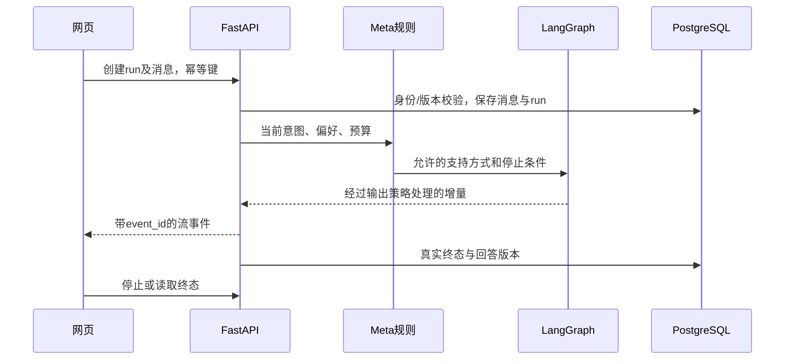
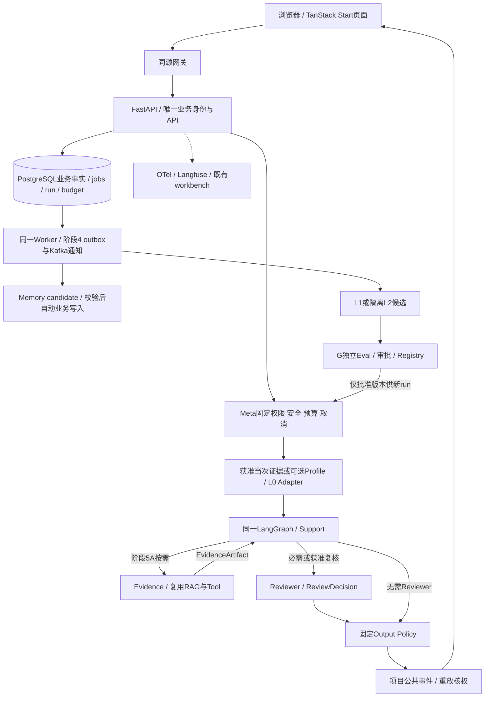
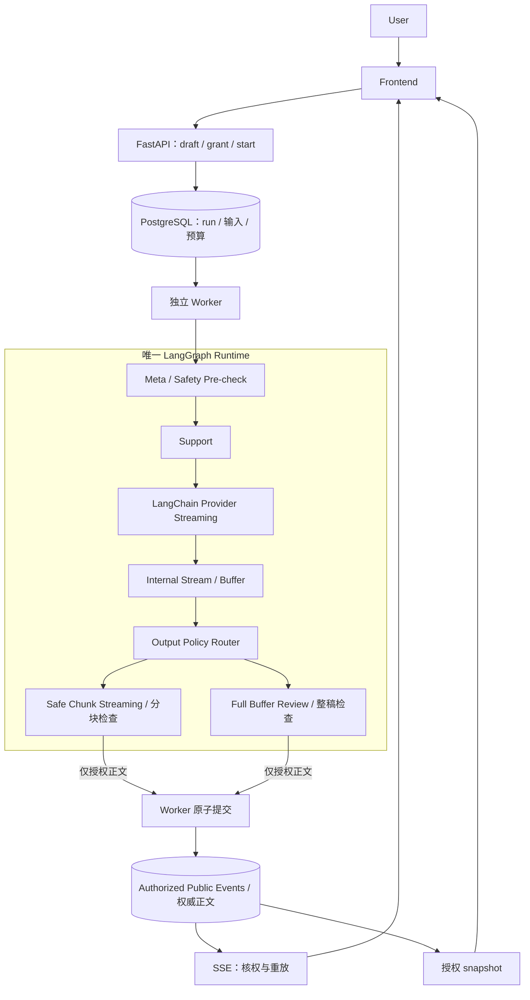

# 阶段1｜技术方案与实施计划

<a id="s1-multiturn"></a>
## 同会话多轮聊天增量（2026-09-28）

本增量属于阶段1聊天补全，不推进阶段2。网页采用会话侧栏、连续消息区和底部输入区；窄屏侧栏可展开与收起。复用原消息、run与修订关系，不迁移历史正文，不添加长期记忆、摘要、画像或跨会话检索。

2026-09-29交互补充：有效历史消息直接显示在聊天区，折叠的“查看旧版本”仅展示被替代分支。最新回答下直接提供小型“重新生成”按钮，修订仍限最后输入。运行状态自动更新，常驻“查询运行状态”移除；仅发送或停止未确认时提供“检查发送状态”，显示检查中、未接收、已接收或失败结果，查询本身不重新调用模型。失败回答提示从消息下方重新生成。

“查看旧版本”入口位于对话标题右侧，以独立浮层展示，不占消息区。history接口可传`old_only=true`，在分页前筛选被替代分支，并跳过来源失效内容补足分页；无可用旧分支时隐藏入口，默认history接口行为不变。

- GET `/api/v1/sessions/{session_id}/timeline?limit=20&cursor={run_id}`：本人有效主分支分页，默认20、最大100；返回`items`与`next_cursor`。初始页取最近轮次，页内按`created_at,id`升序；游标向更早读取。游标必须属于本人同一会话；被替代的游标仍可定位，正文不因此返回。过滤失效来源后补足页面，空输入草稿不算轮次。轮次DTO追加`created_at`，保留`parent_run_id`，旧history接口仍可查旧分支。
- current-run仍是运行状态和停止操作的权威。Query按run_id和版本合并、按修订父边排除旧分支；SSE仅使授权快照失效，不直接显示私有候选。发送前刷新已显示时间线，避免current-run前移丢掉上一轮；刷新、重连、修订、删除及跨标签页通知同步时间线缓存。
- 模型前文仅限同owner、同session、当前run之前的有效未被替代completed轮次，并要求有完整用户消息与已发布助手消息。以user/assistant原顺序传入；当前用户消息最后追加。失败、取消、中断和修订草稿仍在网页显示状态，但不进入模型前文。修订沿用仅最新有效输入的限制；创建修订草稿即替代父分支，不因失败恢复旧分支。
- Worker冻结选中前文的run和消息ID/版本，在调用前、运行期间、输出校验和持久提交时复核归属、主分支、删除及来源绑定；失效则停止且不发布迟到结果。系统提示允许使用提供的同会话前文，禁止编造未提供历史；历史内容不是系统指令。
- 新启动运行记录`support-policy/2`；仍接受已冻结的`support-policy/1`，该版本继续原单消息提示且不附加前文。历史调用记录不改写。
- 新建live聊天run冻结32768总tokens、原输出上限、最多1次调用及原deadline；fake保持8192与原费用/次数约束，自动标题仍8192，已启动run不扩预算。输入裁剪采用UTF-8字节数加每历史轮128、系统与当前消息256的封装预留，再预留输出上限；这是保守估算而非供应商tokenizer。按最早完整轮次移除，保留最近连续有效前文；无历史仍超限则`token_budget`，不截断当前消息。live仍预占整个预算并核验实际usage，不因估算宣称供应商绝不会超限。
- 网页历史不受模型预算截取影响，但仍遵守来源有效性校验。会话版本变化可能使绑定旧版本的内容不可用；不能绕过此规则恢复正文。新会话不会读取旧会话；继续Full Buffer Review，不实现公共安全分块。

本次验证记录见[同会话多轮增量](evidence/S1-MULTITURN/README.md)，STEP08历史收据不改写。

2026-09-27新增实现见[STEP07合同](#s1-step07-implementation)，实测状态以本步证据为准；下方既有段落保留各历史时点。

> 当前按[内部实验执行约定](../../EXPERIMENT.md)推进：支持通过指定 HTTPS 地址分享；注册登录后直接进入，不设年龄、用途确认或资格审批入口，不设固定业务保存期限。支持、记忆、画像、内部评测与优化按版本化实验默认配置开启，各功能仍按所属 STEP 实现。

> 整合修订：2026-09-21｜STEP02工程与STEP03合成身份/授权已实现并局部验证；完整支持产品及业务整项验收未完成。
> [项目导览](../../README.md) · [阶段目标](01-阶段目标与功能设计.md) · [技术方案](02-技术方案与实施计划.md) · [测试验收](03-测试与验收标准.md) · [分步实施](04-分步实施与检查清单.md)

除本页STEP02工程、[STEP03实际实现](#s1-step03-implementation)和[STEP04隔离合成运行](#s1-step04-implementation)外，代码路径仍为规划；整阶段业务验收未完成。STEP04真实Provider/内容审阅仍BLOCKED。规则以[共同合同入口与实施证据边界](02-技术方案与实施计划.md#missing-sources)为准。来源：S01生产架构，S02 V5–V12/V17的契约、流、工具及预算；R03练习交互、R12会话组织仅作适配参考。

## 最小模块与数据流

建议新增 `frontend/src/routes/`、`frontend/src/features/chat/`、`frontend/src/features/exercises/`、`backend/app/api/`、`backend/app/agent/`、`backend/app/services/`、`backend/tests/`。不创建Java兼容层或第二个Agent框架。

前端采用React/TS、TanStack Start/Router/Query/Form与Tailwind CSS；保留原生语义控件，Tailwind utility与CSS-first主题token实现布局和视觉。Start处理页面服务，网关同源 `/api/v1` 转发FastAPI；公开介绍页SSR，私人页面客户端取数。后端Python 3.12兼容环境、uv锁依赖、FastAPI/Pydantic、异步HTTPX和SQLAlchemy/Alembic。工程验收前锁定实际版本，不把上游宽泛版本范围当兼容证明。


```mermaid
sequenceDiagram
 participant U as 网页
 participant A as FastAPI
 participant M as Meta规则
 participant G as LangGraph
 participant D as PostgreSQL
 U->>A: 创建run及消息，幂等键
 A->>D: 身份/版本校验，保存消息与run
 A->>M: 当前意图、偏好、预算
 M->>G: 允许的支持方式和停止条件
 G-->>A: 经过输出策略处理的增量
 A-->>U: 带event_id的流事件
 A->>D: 真实终态与回答版本
 U->>A: 停止或读取终态
```

### 模块与调用链

沿原FastAPI→Meta→LangGraph→Support→Output Policy。新增版本化实验默认配置与来源用途映射、InteractionEvent接收器与AgentBehaviorEvaluator规则函数；它们不是自治Agent。Meta控制合法资料、固定支持边界、调用预算与取消。无需每轮LLM分类，语义不确定时先自然澄清。

### 分阶段架构与权限边界


```mermaid
flowchart TB
 B[浏览器 / TanStack Start页面] --> GW[同源网关]
 GW --> API[FastAPI / 唯一业务身份与API]
 API --> META[Meta固定权限 安全 预算 取消]
 META --> L0[获准当次证据或可选Profile / L0 Adapter]
 L0 --> LG[同一LangGraph / Support]
 LG -->|阶段5A按需| E[Evidence / 复用RAG与Tool]
 E -->|EvidenceArtifact| LG
 LG -->|必需或获准复核| REV[Reviewer / ReviewDecision]
 REV --> OUT[固定Output Policy]
 LG -->|无需Reviewer| OUT
 OUT --> SSE[项目公共事件 / 重放核权]
 SSE --> B
 API --> PG[(PostgreSQL业务事实 / jobs / run / budget)]
 PG --> JOB[同一Worker / 阶段4 outbox与Kafka通知]
 JOB --> MC[Memory candidate / 校验后自动业务写入]
 JOB --> OPT[L1或隔离L2候选]
 OPT --> GE[G独立Eval / 审批 / Registry]
 GE -->|仅批准版本供新run| META
 API -.-> OBS[OTel / Langfuse / 既有workbench]
```

节点按需执行，前四阶段不提前拆Evidence/Reviewer。MCP若将来接入，只在Tool适配边界；Redis若接入，只存可重建或临时信息。图内的Meta运行治理与G独立研究治理是不同权限主体。

<a id="aud-01"></a>
## Agent与Meta合同

`SupportState`保存session/run、当前消息版本、用户明确偏好、支持方式、预算计数及停止原因。用户身份在服务端注入，不由模型生成。阶段1工具仅允许读取当前会话与静态审阅资源，不能写长期记忆、行动或联系他人。

Meta输入：已认证用户、消息、当前偏好、运行预算、可用模型和支持材料版本。输出：`mode`（listen/clarify/explore/action/close/support_route）、`allowed_tools`、`budget`、`stop_reason`及版本。权限/预算/用户拒绝为规则；仅在意图含糊时使用结构化分类，不为每轮增加独立Meta LLM调用。分类失败回到保守倾听/必要澄清；高风险表达按经过审阅的支持流程处理，不依据未经验证的个人风险分数。

状态图：输入校验 → 意图/支持方式 → 生成 → 输出处理 → 完成或明确失败。限制总调用、token、deadline和生成步数；数值作为开发配置，结合合成用例与供应商实测后冻结。不透明的provider计费不能因取消标为零。

后期衔接：SupportState及run_id、版本、source引用、预算、取消和trace保留可扩展边界；阶段1输出仍只由Support及固定输出策略处理，不预建多角色Artifact表或第二套调度。阶段5A将在同一StateGraph增加角色节点、typed Artifact、allowed_agents及角色预算；阶段1的单Agent与Meta任务不因此增加前置依赖。

### 事件去噪与基线检查

用户真实发送的唯一client_message_id计主动发起；网络重送、模型重试、刷新恢复、自动重连不新增一次发起。initiation区分user/requested_followup/system_push/unknown；当前产品不产生站外push，system_push仅保留将来合法能力或合成压力测试的可区分枚举。用户预约跟进指下次主动开启会话时承接，不自动推送。

对active_ms使用单调时钟区间、服务端接收时间与事件序号做去重/合并；重叠多标签页不能重复相加。闲置阈值、heartbeat精度与后台切换误差是工程配置，在合成录制和无障碍场景上校准；未校准时active_ms=null，不用连接时长冒充互动时长。聊天频率只作观察信号，原有严重生活影响不因“个人常态”被正常化。

在线Evaluator输出AgentEvaluation（可只规则项），未知语义评分null。安全/拒绝/关系操控硬失败不能用温暖度或满意度抵消；普通路径只发布经固定检查的片段，敏感/需整体语义复核路径缓冲完整候选。评估超时不增加无限调用，返回已审有限回应或Controlled Stop；记录失败而非假通过。

### 故障与回退

事件服务失败只停止可选分析，不阻止必要对话；用途查询失败时禁止新增私人来源读取，允许当前已合法输入的基本支持。LLM/检查失败不伪造“已理解/已保存”。取消沿服务端CAS终态；删除同时处理反馈中获准关联片段与评估派生引用。回滚规则/策略版本只影响新run，不恢复已删资料。

<a id="provider-contract"></a>

### Provider能力与统一重试

关联任务：S1-T03；验收：S1-A12。

Provider调用优先使用锁定LangChain模型适配器。每个ModelProfile登记provider、精确模型标识/可获版本、参数、适配包版本、数据区域与保留条件、允许任务、结构化输出方式、tools与structured output能否同时用、流/usage/取消能力及验证引用。状态区分documented/tested/unsupported/unknown；未验证不是true。Pydantic仍做模型外校验。拒答、截断、无usage、未知tool name和错误参数分别处理，不把空JSON或HTTP200记成功。

ModelProfile能力矩阵由S1-T03维护，具体Provider/model待接入时登记，未实测能力仍为unknown；官方声明只可记documented，完成真实适配验收并附版本/收据才可记tested。用户已于2026-09-25明确真实模型可随时提供、费用不是接入阻塞项，具体接入安排见[真实模型接入计划](#live-model-integration)。

| 能力项 | 待填配置/证据 | 当前能力状态 | 不具备时的消费者与回退 |
|---|---|---|---|
| 文本与流式输出 | 精确model_ref/参数/adapter版本、截断与半截流收据 | unknown | Support关闭未验证流路径，使用已审说明或已验证同策略路径 |
| 结构化输出 | provider-native或Tool策略、schema子集及拒答形状 | unknown | Meta/候选仍须模型外Pydantic验证，无有效对象不执行 |
| Tool调用及与结构化输出组合 | tool名称/参数、并行返回、组合能力收据 | unknown | 只开放已验证Tool子集，未知mutation结果不自动重试 |
| usage与计费 | token字段、usage_source、price_version/currency、实际/估算/未知 | unknown | 账本保守占用；无可信上界停止新付费调用 |
| 超时/取消 | connect/read/write/pool及外层deadline，远端终止确认 | unknown | 本地先停新调用/输出，远端未知消耗保留 |
| 错误与重试 | 429/Retry-After、拒答/截断/schema错误、SDK重试配置 | unknown | 项目边界统一有限重试，不叠加无计量SDK重试 |
| 数据使用条件 | 区域、保留政策/凭据引用、允许任务和批准记录 | unknown | 缺条件只用合成开发，不外发真实私人资料 |

同一外部请求的重试由项目调用边界统一负责；关闭或显式计入Provider SDK、LangChain、图节点与Worker的重复重试。只有可安全重试的瞬态错误，且剩余calls/token/cost/deadline允许时，才有限退避重试。429尊重服务端Retry-After但不能超过原deadline；已流出正文、mutation结果未知或用户取消后不自动重做。schema修复也是新模型调用，最多使用冻结配额，不无限修到通过。

调用链：`start→Meta预占→LangGraph模型适配→Pydantic/Output Policy→事件/usage结算`。持久调用收据拟关联run、role、model_ref、request_id、attempt、reserved/actual/unknown，凭据只存引用。生产故障优先已审说明或预先验证的同策略兼容降级；实验组禁止静默换模型/Provider/参数，变化标非等价或重立协议。Ollama不成为用户隐私默认出口。

验收/回退：S1-A12；所选模型不支持所需能力则关闭对应路径，保持已审基础支持，不能关闭固定安全。验收证据是兼容矩阵、错误分类和实际账本，不是“支持所有OpenAI-Compatible模型”。

<a id="s1-step04-implementation"></a>
### STEP04 隔离合成运行实现合同（2026-09-24）

本步消费者为后端内部调用和确定性验收；尚无start/SSE/聊天页面消费者，不提前接STEP05/06。复用STEP03身份/来源事实，STEP04的输入由可信调用方提供owner、session/run、消息版本及来源快照，调用前/每次重试/输出前检查一致性和有效性。当前仅合成测试装配，不把内部类型当成客户端可授予身份的接口。

唯一图：`START → meta → support → output_policy → END`。Meta为固定规则，优先当次拒绝/结束/安全诉求；意图含糊保守澄清，不增设独立分类LLM。allowed_tools为空（本步无可调用的已审资源消费者），任何模型tool调用或伪称写入均拒绝；不建第二Agent或Worker消费者。LangChain core承担消息与fake模型适配，LangGraph承担唯一执行图；尚未选定的真实厂商SDK不安装。

运行版本固定为`support-graph/1`、`support-policy/1`、`behavior-rules/1`、`support-runtime/1`及现有`experiment-defaults/1`；assessor显式`disabled`，不虚构画像评分器。配置不可热换，语义评分为null；规则通过不等于独立语义/专业审阅通过。所有候选完整缓冲，结构化schema与固定规则均通过才返回正文；无已审回退内容时Controlled Stop，正文为空并返回明确原因。

合成预算基线`s1-fake-budget/1`：最多2次调用、8192总token、每次最多1024输出token、10秒原始deadline、3个图节点；预占输入UTF-8字节数加输出上限（仅fake保守计量，不能冒充真实模型tokenizer）。合成价格`fake-price/1`为每token 0.001 SYNTHETIC，费用上限8.192，绝非供应商报价。真实usage可信时结算，缺失/不可信时actual=null并保留全部预占，停止后续调用；超预算返回失败不退款。成功、错误、取消、重试均留run/request/attempt/model/版本/耗时/预占/actual或unknown元数据，不留正文或异常原文。fake账本随验收归档；业务持久调用表和run启动原子绑定承接STEP05，不新增第二套run存储。

只有未产生正文的429/瞬态故障可统一重试；Retry-After需有限非负且不越原deadline，每次都重新预占并占调用次数。schema错误不自动修复（本版修复配额0），拒答、截断、半截流、工具、usage未知及取消不重试。SDK/图/Worker隐式重试均不得叠加。当前仅允许LangChain的本地fake模型，显式关闭追踪外发，不读取Provider密钥；真实模型、价格、数据条件、取消/usage能力继续unknown/BLOCKED，不能将fake验证标为真实tested。

## 数据结构与所有权

| 表/结构 | 最小字段及约束 |
|---|---|
| users、user_preferences | user_id、session身份引用、mode、display_preferences、version；服务端生成归属 |
| conversations | id、user_id、title、status(active/archived/deleted)、version、created_at/updated_at |
| messages、message_revisions | id、conversation_id、role、content、version、parent_id、branch_id、is_current、deleted_at；正文不进入URL/普通日志 |
| runs、run_events | id、user_id、session_id、source_message_version、version、status(draft/queued/running/waiting_approval/completed/failed/cancelled/interrupted)；waiting_approval从阶段4有真实消费者时启用、strategy_version、budget_used、stop_reason；事件唯一(run_id,event_id)；状态改变递增run版本，token事件不递增资源版本 |
| feedback | id、user_id、run_id、helpfulness、category、可选comment、处理范围说明版本；不得隐式附整段对话 |
| deletion_jobs | id、owner、target、scope、status、completed_steps、error_code；阶段1可串行处理，失败保留真实状态 |
| consent_records | 仅保留历史用户决定及原告知版本；新实验默认配置不生成granted记录，不作为业务前置 |

LangGraph使用官方检查点能力，命名空间与业务表分开；它不决定消息是否删除或运行是否已完成。阶段1若断点恢复无法保证一致，允许恢复为“已中断、可重试”，不得伪造继续成功。为阶段2保留source_id/version/deleted_at即可，不先实现长期记忆。

<a id="conversation-auto-title-contract"></a>
## 对话自动标题增强合同

2026-09-28用户确认采用模型概括主题并要求在阶段1实施。本节关联F-CHAT-002，当前实现与验证见[独立记录](evidence/S1-AUTO-TITLE/README.md)；实现检查见[04](04-分步实施与检查清单.md#conversation-auto-title-work)，验收见[03](03-测试与验收标准.md#conversation-auto-title-acceptance)。STEP08历史验收结论及阶段2步骤顺序保持不变。

### 触发、输入与输出

- 新空对话不调用模型；首次成功完成普通聊天后，仅为默认标题且尚未尝试生成的会话创建持久任务。后续消息、修订和重新生成不得重复触发已尝试任务。
- 旧默认标题会话在下一次成功完成普通聊天时进入同一流程；选择最早一轮仍有效、成功完成的用户消息与已发布回复。缺少有效成对来源则不创建任务，不批量扫描历史正文。
- 输入仅含该轮用户消息和已发布回复，绑定消息ID/版本，不读其他会话或未发布候选。生成使用对话主要语言、单行、1～24个Unicode码点的主题摘要，去除首尾空白；禁止添加诊断判断、复制姓名/联系方式或敏感原句。模型指令和输出校验共同约束，不宣称已验证概括质量或敏感信息识别效果。

当前输入分别截取用户消息和已发布回复的前2400个UTF-8字节，并在完整字符边界截断；输出上限256 tokens，总用量上限8192 tokens，最多一次调用、20秒期限（配置更小时不扩大）。队列等待最多5分钟。有限格式/内容规则不构成通用姓名或诊断语义识别，真实模型效果须独立验证。
- 输出通过格式、长度及内容约束检查后才保存；无效输出、拒绝、超时或模型不可用均保留中性默认标题，不回退为用户首句，不影响支持回复。用户仍可手动改名。

### 数据与任务生命周期

- 通过增量迁移增加标题来源`default/auto/manual`、独立`title_revision`及生成状态`not_requested/queued/running/succeeded/failed/cancelled`；任务保存会话/owner、触发run、输入来源版本、任务身份及调用关联，不复制正文进任务或普通日志。
- 迁移将旧非默认标题保守标记为`manual`，旧默认标题标记为`default`。新建时的非空自定义标题以及任何显式手动改名均标记`manual`，即使用户改成“新的对话”也不得自动覆盖。
- 复用现有独立Worker、模型配置与适配器，显式增加标题任务类型及允许任务范围，不新增Agent或依赖。任务与支持回复分开管理状态、预算、超时和输出上限；标题失败不得改变已完成回复状态。
- 每个会话的自动任务唯一，入队和领取具备幂等及条件更新保护。生成失败不自动重试；Worker重启可领取尚未开始的任务，已开始但结果未知的任务标记失败/中断，不盲目重发可能已经发生的调用。
- 调用继续记录实际用量、失败和供应商回执，并明确区分标题与支持任务；不能把未知用量记零，不将标题正文或提示词写入用量记录。配置和任务类型扩展不放宽现有真实模型或合成数据库执行限制。

### 并发、接口与删除

- 保存前在现有owner锁顺序下重新核对会话未删除、来源仍有效、标题仍为默认、任务身份及`title_revision`匹配。手动修改、来源失效或删除后的迟到结果丢弃，不覆盖、不恢复资源。
- 自动命名仅更新展示元数据和独立标题修订，不递增对话内容来源版本，不使正在运行的回复或历史来源绑定失效。手动修改与现有版本规则兼容，不能直接复用会触发来源失效的通用更新逻辑保存自动结果。
- 沿用现有创建/读取/列表/PATCH会话接口及`title`字段；读取与列表追加`title_source`、`title_generation_status`、`title_revision`。PATCH增加可选`expected_title_revision`，新前端改名必须提交；不匹配返回409并刷新。旧客户端仍沿用`expected_version`且显式手动修改优先，归档请求不要求标题修订值。
- 前端沿用Query管理会话缓存，任务待完成时有限轮询会话状态，终态或离开页面后停止；结果更新详情并失效列表/搜索缓存。保留手动改名、隐藏标题、归档和长标题布局，不增加生成按钮或阻塞输入区。

当前增量迁移为`i009_conversation_titles`：会话保存标题来源、独立修订与状态；`title_tasks`以会话ID为唯一键，仅存owner、来源run、消息版本、冻结模型标识及期限，不存正文。标题调用以确定性request_id防止重复执行，`ModelCall.receipt.role=title`独立记录；原run的`budget_used`仅统计support调用，删除回执仍涵盖全部调用。列表额外返回`has_pending_titles`，包含当前筛选状态下尚在生成回复的默认标题会话，不受搜索关键词过滤；页面每2秒轮询，最多180次读取后停止，并在自动标题更新后使用现有跨标签页通知失效缓存。原Worker内两个独立有界处理循环分别消费回复与标题，不在API中启动消费者。
- 删除先阻断标题任务读取和回写，任务清理纳入现有删除范围；调用回执纳入外部处理状态判断，保留无正文用量事实。进程中已取得正文的任务须响应取消且不能提交结果，不声称外部供应商数据已因此删除。

<a id="aud-02"></a>
## API与流事件

统一鉴权、错误、幂等规则见[共同接口合同](../阶段1/02-技术方案与实施计划.md#shared-contracts)。以下私人接口逐项校验归属；不可见资源404。`expected_version`不符409，正文或枚举错误422。

| 方法与路径 | 请求 | 返回及失败语义 |
|---|---|---|
| POST `/api/v1/sessions` | 可选title；Idempotency-Key | session_id/version/status；空标题用中性默认，不直接复制敏感首句；首轮完成后的模型主题摘要见[自动标题合同](#conversation-auto-title-contract) |
| GET `/api/v1/sessions` | q、status、cursor、limit | items/next_cursor；搜索不返回已删除内容 |
| GET `/api/v1/sessions/{id}` | 无 | 当前分支消息、历史分支引用、version；分页历史单独读取 |
| PATCH `/api/v1/sessions/{id}` | title或status、expected_version | 更新后的资源；不能借此恢复deleted |
| POST `/api/v1/sessions/{id}/runs` | kind(message/regenerate)、message或source_message_id、expected_session_version、client_message_id | 普通聊天便捷入口，内部创建draft后启动；202 run_id/version/status；重复键同一run；未知前次状态先查询 |
| POST `/api/v1/run-drafts` | context_type=conversation、session_id、kind、本阶段所需expected_session_version；Idempotency-Key | draft run_id/version；不调用模型、不读取额外资料；后续阶段用此ID绑定临时授权 |
| POST `/api/v1/runs/{id}/start` | input（message或source_message_id）、grant_ids可空、expected_version（run版本）、expected_session_version | 202相同run_id及新version；原子将draft转queued，重新核对来源和授权；重复启动同一请求不二次执行 |
| GET `/api/v1/runs/{id}` | 无 | version、status、output_ref、last_event_id、stop_reason |
| GET `/api/v1/runs/{id}/events` | after_event_id | SSE信封schema_version/run_id/event_id/generation/type/run_version/occurred_at/payload；补发已持久事件，不重跑工具 |
| POST `/api/v1/runs/{id}/cancel` | expected_version（run版本） | 当前version/状态和取消结果；终态已提交则返回该终态；活动版本冲突409先读取再决定，不能复活已结束run |
| POST `/api/v1/sessions/{id}/messages/{mid}/revisions` | content、expected_version | 新消息版本/branch；仅最后用户输入且前run终止，其他情形409 |
| DELETE `/api/v1/sessions/{id}` | expected_version | deletion_id/status；先阻断访问，后返回已完成步骤；失败可查状态，不假称彻底删除 |
| GET `/api/v1/deletion-jobs/{id}` | 无 | 处理步骤、剩余项、retryable；阶段1无备份则标不适用 |
| GET/PATCH `/api/v1/me/preferences` | PATCH为字段及expected_version | 已保存偏好和version |
| POST `/api/v1/feedback` | run_id、helpfulness、category、可选comment | feedback_id/status；不附带原文 |
| GET `/api/v1/exercises/{id}` | 无 | 已审内容id/version/steps/limitations；未审版本404 |
| GET `/api/v1/resources/support` | 可选已选地区/学校 | 当前已核实静态条目及checked_at；无条目返回空态说明 |

阶段1流只使用 `run.started`、`message.delta`、`run.completed`、`run.failed`、`run.cancelled`；状态事件附run_version，artifact与approval事件留到真实消费者阶段。取消与完成以服务端终态CAS先成功者为准；前端收到冲突先取终态，仍活动时可重发取消。断网、身份过期、代理缓冲、重复事件及终态竞态有专门测试；浏览器停止需通知服务端，不能只停止绘制。draft可取消，不设固定到期，不发送模型、不产生假消息；未带额外资料的普通聊天可走便捷入口。

### 接口合同

所有接口使用[共同合同与治理入口](../阶段1/02-技术方案与实施计划.md#missing-sources)身份/幂等/版本规范。

| 接口 | 输入→输出 | 校验/错误 |
|---|---|---|
| 身份注册、登录与密码管理（目标） | 邮箱验证码注册、邮箱密码登录、验证码找回和已登录改密 | 见[邮箱身份目标合同](#email-identity-target)；S1-STEP03.5待实现，当前用户名接口见[当前合成实现](#s1-step03-implementation) |
| GET `/api/v1/experiment-config` | 已登录→version/defaults/implemented/user_consent | experiment-defaults/1；五类功能默认开启与实际实现分开；user_consent=false；旧consents接口仅兼容历史，不由当前客户端调用 |
| PATCH `/api/v1/me/preferences` | 支持方式、显示及expected_version→新版本 | 历史age_band/age_source不改写；新账号unknown/not_provided；客户端无年龄选择 |
| POST `/api/v1/interaction-events` | event_id、session/run、type、时间、initiation、可选active_ms/coverage→accepted/duplicate/rejected计数 | 服务端归属、有限batch、时钟偏差、重复键、非法负时长校验；来源不可用拒绝 |
| POST `/api/v1/feedback` | run_id、helpfulness、category、optional_comment→feedback_id | 内部评测按实验配置处理，不随反馈附会话原文，不将点赞作为政策晋升票 |

原会话run-draft→grant→start、SSE、cancel与修订API沿本阶段运行接口合同，公共事件不暴露模型状态。InteractionEvent不包含键盘轨迹、私人正文、站外应用、精确位置；页面可见/焦点与主动交互段只能估计可观测活跃时间，不能称已测真实注意力。

<a id="public-events"></a>

### 公共事件、重放与同源Start边界

2026-09-27补充：[安全流式双路径设计](#safe-output-streaming)规定后续分块发布、部分正文和恢复的目标语义，尚未实施；下方STEP05/06实现描述及历史收据保持原证据域。

#### STEP05实际装配合同（2026-09-24）

实现路径为`backend/app/runs.py`、`run_stream.py`、`run_worker.py`，复用原Run、身份/CSRF、来源关联及唯一SupportRuntime。新增`run_executions`（每run唯一的启动绑定/预算/deadline/generation/事件序号，不另存status）、`messages`、`run_events`、`model_calls`、`interaction_events`。业务终态仍以runs为准；增量迁移`d642b94fcbb5`保留原记录，已有本步数据时拒绝有损降级。

start正文为`input.message`（非空、最多4000字符）、`client_message_id`、`expected_version`、`expected_session_version`、`grant_ids`（最多8个、不重复）、`initiation=user/requested_followup/unknown`。同owner的Idempotency-Key与路径/请求hash绑定，重放核当前来源并返回原run，同key异内容409。便捷POST sessions/{id}/runs仅启用kind=message，相同client_message_id/内容返回原run；regenerate/历史修订属于STEP07。start原子保存当前消息、版本绑定、固定fake预算和queued状态；draft、GET及SSE零模型调用。grant绑定来源关联，不因此实现额外历史正文检索。

只有`PSYEVO_ENV=test`、独立loopback合成check库且`PSYEVO_SUPPORT_MODE=fake`时允许执行；默认disabled返回503 provider_not_configured，不读取模型密钥。独立`python -m app.worker --support`串行消费，API导入/reload零消费者。owner行锁及条件更新串联claim与终态CAS。queued时冻结10秒deadline，断流/重试不重置；过期running记interrupted/run.failed，不重新执行。每次调用前、重试前、输出前及持久提交核来源消息版本/删除、grant、身份和generation。调用预占先持久化，取消/未知usage保留预占，迟到结果不覆盖终态。

GET run返回获准output、version_binding、budget/budget_used、deadline_at、generation及last_event_id；delta与completed在同一事务提交。draft可取消但不产生模型事件；活动版本冲突409，终态返回已提交事实。退出/改密停止对应活动run，Worker也复核身份/来源失效。业务保存期限无固定TTL，10秒仅为一次执行预算。

锁定FastAPI 0.141.1的原生EventSourceResponse/format_sse_event负责唯一编码，无新增依赖。十进制游标query/header冲突或超前422，过期410，恢复只读同run快照。每run保留最新128个公共事件（数量窗口），序号不重置；每次发布取一个事件并核权，1秒注释心跳、32768字节单帧上限、2秒发送超时、当前单API进程每owner最多2条流。无无界生产队列；多进程全局配额未扩展。本步验证现有Vite同源代理，不冒充远程Caddy或公开发布。

互动批次最多50个，event_id/hash与tab/sequence去重；真实发送由服务端唯一client_message_id记录，重连/模型重试/心跳不增计数，可选互动记录失败不阻断基本启动。active_segment包含tab_id、sequence、单调start_ms/end_ms、visible/focused，区间最多30秒；客户端时间与接收时间偏差超过5分钟拒绝。以报告的occurred_at对齐后取跨标签并集，排除闲置/后台段，最多核最近1000段并显式返回truncated。reported_union_ms仅为报告区间合并值；未校准真实设备/无障碍误差，故active_ms=null、coverage=uncalibrated，不冒充注意力测量。system_push只保留报告/合成来源标签，不实现推送。

本节描述实现，执行状态见[STEP05记录](evidence/S1-STEP05/README.md)；STEP06页面、STEP07删除清理及真实Provider/内容审阅不在本步范围。

关联任务：S1-T04、S1-T05；验收：S1-A11。

Start提供页面服务；网关将同源`/api/v1`与SSE直接转发FastAPI，后者验证同一HttpOnly会话与业务权限。POST start/cancel/确认继续有CSRF校验；GET流只读，不能启动run。Start不复制业务session和运行状态，私人页不SSR敏感正文，QueryClient按请求隔离。Query自动重试不得再次start。

公共事件在原run_id/event_id/type/payload外增加schema_version、generation、occurred_at；状态事件保留run_version。event_id沿run单调唯一且作为SSE id，generation独立，恢复不重置序号。message.delta只由Output Policy写入公共事件，内部模型流、角色消息、画像、审稿意见及Artifact正文不透传。required review路径先缓冲整稿，只有通过绑定draft hash/source/grant的检查后才发送；等待只显示白名单进度。

| 原合同 | 规划兼容规则 |
|---|---|
| run.started、message.delta、run.completed、run.failed、run.cancelled | 名称与语义保留；新信封字段向前端合同显式加入，未发现实际旧客户端，不假称已做兼容迁移 |
| artifact.proposed | 仅用户可审业务候选的受权预览，不映射所有内部run_artifacts |
| approval.required | 继续表示等待用户批准；waiting_approval不算业务完成，不释放未耗尽预算或刷新deadline |
| run.progress | 5A继续仅finding_resources/checking_sources等白名单；不新增agent_started/agent_thought |
| status=interrupted | 公开run.failed且stop_reason=interrupted，查询仍返回真实status；客户端列入不可自动恢复终态，重新生成另建run |

状态映射以业务run为真源；阶段1未启用的approval/Artifact/进度只登记兼容合同，不产生假事件。

| GET run.status | 公共事件/前端处理 |
|---|---|
| draft | 不产生模型事件；显式start前零调用 |
| queued | 查询表示等待执行；GET订阅不启动任务 |
| running | run.started；之后仅Output Policy可发message.delta，必要时run.progress |
| waiting_approval | approval.required；非终态、预算和deadline不重置 |
| completed | run.completed；只引用已核权真实output |
| failed | run.failed及具体stop_reason |
| cancelled | run.cancelled；保留已发生费用/业务结果 |
| interrupted | run.failed及stop_reason=interrupted；GET保留interrupted，不自动resume新图 |

所有公共事件使用完整信封且run_version为写入时的业务版本；delta不自行递增资源版本。event_id为十进制序号字符串，按数值单调，前端按run/event_id去重而非按字符串排序。客户端遇未知schema先停止拼接并查获准快照，不能猜字段；游标冲突或不合法返回422，过期410。generation不能替代序号或授权。

公共事件例子（合成、未执行）：

```json
{"schema_version":"public-run-events/1","run_id":"run-demo","event_id":"17","generation":1,"type":"run.progress","run_version":3,"occurred_at":"2026-09-18T00:00:00Z","payload":{"code":"checking_sources"}}
```

重连沿`GET /runs/{id}/events?after_event_id=...`，允许标准Last-Event-ID；两者同时给且不同则拒绝，不默选。游标不是授权凭据，每次连接、重放批次及实际发布核当前owner/source/grant/generation/删除状态。前端按run＋event_id去重；乱序先查终态/缺口，禁止拼成新run。游标超过保留窗口返回410 `event_cursor_expired`，从已核权run/output快照恢复，不能重调模型。删源后旧delta必须不可重放，不能仅删除最终message；当前页面清理受影响缓存，但不承诺能收回用户已看到的文本。

SSE注释心跳不计业务事件或主动发起次数；间隔与代理idle timeout配套配置并测量。限制每用户连接、发送队列和输出字节；慢客户端溢出只断开流并让其恢复快照，不无限堆积私密正文。关闭浏览器流连接仅代表失去订阅；点击“停止”必须提交cancel，页面退出按产品原约定尽力取消并核终态，不能只停止绘制。意外网络断开时run最多执行到原deadline；无新start、无预算重置、无新增InteractionEvent主动计数。账号退出/撤权使相应run停止。

底层优先核所锁FastAPI的原生SSE能力，官方文档标自0.135.0提供；不为追新强改未来实际仓库。浏览器主方案为原生EventSource消费同源GET，遇结构化握手失败先关闭重连并查询run；需要自定义header时再论证fetch消费者，不能另建协议。验收S1-A11；回退至同一run的状态查询/获准完整结果，绝不以重新start模拟断点续传。

<a id="aud-03"></a>
## 复用与适配步骤

R03：从CBT `frontend/js/ui.js`的注意力步骤/退出流程整理纯状态转换，迁为React组件；不复制DOM全局变量、音频和localStorage。Sage呼吸组件留阶段3，同一练习台共享退出/可访问性合同。中文内容另外审阅，代码许可不代替心理内容认可。

R12：借鉴SoulChat历史选择/重命名交互；不搬Streamlit、按标题拼路径、原文打印和用户配置。使用数据库ID、所有权及中性标题。LLM及API直接使用LangChain/FastAPI既定栈。

<a id="first-slice-gates"></a>

<a id="s1-step02-environment"></a>
### S1-STEP02 环境合同与实际盘点

环境合同版本 `s1-environment/3`，2026-09-21。接续已有未提交的工程骨架实施；不再使用早期“无源码”的阻塞原因。实际启动、依赖准备及检查命令统一见[本地开发说明](../../DEVELOPMENT.md)，结果见[本步执行记录](04-分步实施与检查清单.md#s1-step02-evidence)。本步不实现身份、持久化或 Agent。

| 对象 | 实际入口/版本 | 实施边界 |
|---|---|---|
| Python | backend/.python-version=3.12.13；pyproject.toml + uv.lock；uv 0.11.7 | FastAPI 0.141.1；HTTPX/Pydantic/Uvicorn；dev组含Ruff/mypy/pytest/psutil |
| 前端 | Node 22.19.x；pnpm 10.28.0；package.json + pnpm-lock.yaml | React 19.3.0、Start 1.168.56、Router 1.170.38、Tailwind CSS及Vite插件4.3.3；实际脚本包含dev/build/lint/typecheck/test:unit/test:e2e；审计补齐Prettier 3.9.8及format/format:check/test/check |
| API | backend/app/main.py:create_app；GET /api/v1/health | 返回严格的 status=ok、stage=S1-STEP02；仅工程存活检查，不代表数据库/模型就绪；无业务身份或写入 |
| Worker | backend/app/worker.py，显式独立入口 | 生命周期探针，consumers=0；无任务/队列；API不导入、不启动它 |
| 前端网关 | frontend/vite.config.ts | 开发时 /api/v1 转发127.0.0.1:8000；无生产网关部署 |
| 前端样式 | frontend/src/style.css；frontend/src/routes/*.tsx | Tailwind由Vite插件编译；CSS-first主题token加utility classes；无PostCSS或独立Tailwind配置文件 |
| 配置 | backend/app/config.py；Vite envDir=false；根.gitignore | API/Worker仅读PSYEVO_ENV，不自动加载.env；校验development/test；秘密不得进前端 |
| 检查 | scripts/check_step02.py；scripts/check_step02_isolated.sh；scripts/probe_os_isolation.py；Python/Node网络钩子 | 安装与执行分离；Windows开发回归、Linux/WSL内核级PR出口隔离；独立收据、外连探针及隔离前置失败即停止；非完整文件系统沙箱 |

API import只定义应用工厂，lifespan负责当前进程资源；目前无HTTP/DB长生命周期客户端。本地开发通过uv运行backend/app/dev.py，复用已锁定的watchfiles与Uvicorn Server API，使用进程事件请求优雅退出后重载；监督模式以非阻塞stdin EOF触发停止，避免Windows阻塞管道读取卡住子进程初始化。Windows与WSL均已通过实际导入、连续两次reload、三次启停及无残留子进程测试；旧Uvicorn原生reload失败收据保留。Worker单独启动退出及协程取消测试不替代API reload。

PR门禁通过Linux/WSL私有user/network/mount/PID namespace仅保留loopback，移除capabilities并禁止提权；WSL私有挂载阻断/init互操作解释器，宿主保持不变。完整门禁执行前用不加载语言网络钩子的探针验证IPv4/IPv6 TCP/UDP、原生curl及Windows互操作拒绝；没有内核隔离则拒绝开始测试，不能把普通入口当作PR隔离验收。命令、前置依赖和配置读取见[开发说明](../../DEVELOPMENT.md)，收据见[局部验收](03-测试与验收标准.md#s1-step02-validation)。

fake Provider仅在backend/tests/fakes.py提供固定响应/异常，验证结构化校验和异常传播；不实现STEP04的Runtime、重试和预算。浏览器测试覆盖工程页键盘、停止、错误焦点及移动布局；不替代授权/撤权/业务run取消。当前无数据库消费者，因此未创建Compose、迁移或数据库配置；需要时默认只启PostgreSQL。

本次影响README、DEVELOPMENT、AGENTS、阶段1的02/03/04、前后端工程、检查脚本及本步证据；原STEP01收据保留。

<a id="frontend-stack-contract"></a>
2026-09-29 长回答增量合同：用户输入仍限 4000 字符，Support 回答取消独立 4000 字符限制；内部完整 JSON 响应统一限 128 KiB UTF-8 字节（含包装和转义）。流式块数量不等于 token 数，不作为截断依据；仍执行 token/用量预算、运行期限、正常结束及整稿规则检查。字节超限独立返回 `output_too_large`，不归为 `schema_invalid` 或 `partial_stream`；不发布未通过检查的部分回答。当前验证与限制见 [DEVELOPMENT](../../DEVELOPMENT.md)，历史收据保持原时点。

2026-09-29 审查修复补充：公共 SSE 的单帧字节上限与上述完整响应对齐，为 132 KiB（128 KiB 响应加 4 KiB 封装余量）。Worker 仍在同一事务中保存整稿检查通过的单个 `message.delta`、消息正文和 `run.completed`，维持事件序号与重放语义；不表示已实现公共安全分块。

### 前端职责与按需接入合同

2026-09-29 Markdown 消费者补充：聊天时间线与旧版本回答已有真实展示需求，接入锁定的 `react-markdown` 10.1.0 / `remark-gfm` 4.0.1，共用 `markdown-message.tsx` 与唯一 `style.css` 的正文工具类。只渲染服务端获准的 `output.text`，不改写原文或整稿发布规则；禁用原始 HTML、保留默认危险 URL 过滤、图片仅显示替代文字，外链使用 `noopener noreferrer`。标题、列表、表格和代码块在现有 React/TanStack 页面内展示，不新增路由或状态体系；语法高亮仍无独立消费者。下方 2026-09-21 审计为历史时点，本次验证单列于 [DEVELOPMENT](../../DEVELOPMENT.md)。

2026-09-21前端审计确认：React + TypeScript + TanStack Start/Router为现有主线；参考项目只提供补充能力，不能替换主线。判定优先级为当前仓库用法与约定、TanStack官方职责、参考项目独有能力、未来候选。新增依赖必须同时满足“当前功能需要、没有等价实现、属于确定主线”；用户已明确选择严格按消费者补齐，UI基础也不例外。

| 能力 | 当前状态 | 现有消费者与后续触发条件 |
|---|---|---|
| Start / Router | 已对齐 | src/router.tsx工厂、文件路由、生成路由树；Start Vite插件负责框架装配，不另建SSR或路由系统 |
| Tailwind v4 | 已对齐 | 唯一src/style.css与现有页面；保留CSS-first主题和Vite插件 |
| Query | 已对齐 | STEP03账号页由Query维护身份、请求及mutation；health.ts仍用集中fetch与局部状态，不复制到Store |
| Form / Zod | 已对齐 | STEP03注册/登录使用Form + Zod，账号响应由Zod校验；DTO/Search Params按消费者接入 |
| Store | 缺失但当前无需引入 | 无真正共享客户端状态；跨页面草稿等消费者出现后评估，简单状态继续用React局部状态 |
| shadcn / cn / Lucide / Sonner | 缺失但当前无需引入 | 当前原生控件足够；真实UI需要时接components.json、统一cn及必要组件，不批量生成组件 |
| ESLint / Vitest / Playwright / Prettier | 已对齐 | 工程源码、2项单元测试、4项E2E；新增Prettier 3.9.8及format、format:check、test、check脚本 |
| MSW / jsdom / Testing Library / Git hooks | 缺失但当前无需引入 | 当前fetch stub、Playwright拦截及显式门禁足够；出现对应测试或提交自动化需求再评估 |
| Table / Virtual / Pacer | 未来保留 | 分别由复杂表格、大量消息或真实节流/排队需求触发，不预建wrapper |
| DB / AI | 未来保留 | 明确客户端同步数据库或TanStack AI消费者后才评估，不因项目名称含AI而安装 |
| 图表 / Markdown / Highlight / Hotkeys | 未来保留 | 当前无消费者；图表选型未决，接入时核实候选官方能力、版本和真实需求，不同时安装三套图表；稳定既有实现不为改名而迁移 |
| XYFlow / Dagre / Monaco / 动画 / 3D | 未来保留 | 分别由工作流图、编辑器、动画或WebGL页面触发；只选所需方案，动画须正确清理 |

业务页面出现后，默认链路为route → feature → query/form/local state → service或Start Server Function → FastAPI/data source；保持route薄，但不为当前小型工程检查页强行拆目录。STEP03已有账号页QueryClient和Form消费者；Store、额外Context或Server Function仍无消费者，不创建空Provider。Loader、Server Function与Query按边界组合，HTTP薄客户端不复制Query的缓存、重试和loading职责；仅在Authorization、refresh、错误映射或trace等真实需求出现时增加。

新代码不引入Zustand、react-hook-form/resolvers、Axios、react-router-dom、Next.js、自建Vite SSR、nprogress或第二套主组件/图标库来覆盖已有职责。发现既有冲突库时先列文件、状态归属、消费者、迁移成本和业务风险，未经授权不卸载。当前未发现这类业务依赖。接入shadcn时CSS须指向真实入口，rsc依据实际能力判断，不能把SSR等同于RSC；不并装重复primitive体系。

版本以package.json与pnpm锁文件为准，当前直接依赖声明一致；Start与Router版本号不同不自动视为冲突。仅在兼容失败、明确安全问题、锁不一致或已定方案无法满足时改版，不批量追新。此次安装提示ESLint 9.39.5已不受支持，保留版本且lint实测通过；未执行安全专项核验。官方生成的routeTree.gen.ts保留生成器类型抑制，禁止手改；手写代码不得新增any、as any或@ts-ignore绕过检查。

日常命令及格式化范围统一见[DEVELOPMENT](../../DEVELOPMENT.md)；`check`不包含build/E2E，也不替代scripts/check_step02.py或Linux/WSL隔离门禁。审计结果只允许使用“已对齐、缺失需立即补、缺失但当前无需引入、未来保留、多余 / 冲突、版本偏离、需要确认”；没有消费者不等于实施缺陷。实测边界见[补充实施记录](04-分步实施与检查清单.md#frontend-audit-followup)。

### 最小工程门禁与异步资源

关联任务：S1-T02、S1-T03、S1-T08；验收：S1-A13。

Python先锁一个3.12兼容环境，实际依赖按API/Worker/离线优化需要分组；不使用“3.12+”作为无限兼容承诺。本步已使用uv和pnpm分别管理后端与前端；若取得的真实仓库已有可用锁文件，则先保留，不无条件迁移。Ruff负责lint/格式检查，mypy检查业务边界和schema类型，pytest覆盖有业务含义的失败路径；不增加与其重复的默认检查器。

I/O路径使用async/await：HTTP、DB和支持异步的模型调用；共享HTTP客户端/连接池在FastAPI lifespan或Worker生命周期创建并关闭，不每token/循环创建。AsyncSession按请求或并发任务隔离，不能把同一实例广播给角色。阻塞解析/CPU计算放有界Worker/进程，必要同步SDK只用有界线程桥；取消await不保证线程或远端工作已停，迟到提交仍核generation及账本。外层剩余deadline裁剪每个connect/read/write/pool超时，资源等待也计时；CancelledError清理后继续传播，不吞掉取消。

第一次可用切片即有lint、类型、API与授权/取消确定性回归；阶段5再补镜像、恢复与完整发布。质量门禁不需要当前引入GitHub云托管，命令应可本地/私有CI运行。验收S1-A13；依赖适配失败保留旧锁版本并停用新增特性，不为通过类型检查把边界全改Any。验收证据：锁定环境、异步资源生命周期、故障fixture与合成API演示。

#### 后续业务切片的检查模板（尚未执行）

以下命令仅在实际backend/frontend目录、依赖锁文件、脚本和隔离配置存在后运行；STEP02实际入口及结果见上节；下面业务迁移/运行事件/任务恢复模板仍未落地。Python/前端任一授权、类型或取消回归失败即阻止该切片交付。PR无外部模型出口，只使用合成fixture和受限测试数据库。

```bash
# 尚未实现：仅在业务迁移、测试路径及隔离数据库存在后执行
uv run --no-sync alembic check
uv run --no-sync pytest tests/contracts/test_run_events.py
uv run --no-sync pytest tests/workers/test_job_recovery.py
```

以上脚本名和测试路径是实施合同，不表示文件已经存在。取得真实仓库后如已有其他唯一锁定工具链，先核对并保留，不能并装多套包管理器。安装与执行分开：受控构建按锁文件取依赖，检查阶段默认禁模型/外部服务访问；不声称uv sync必然离线成功。迁移须另测空库、上一受支持schema升级、N/N-1应用兼容和失败恢复；alembic check不能替代这些证据。覆盖率与负载门槛由可信基线后事前冻结，真实模型访问另核输入资格、预算与取消，pytest marker不充当访问控制。


最小观测同时前移：调用边界只采request/run、版本、耗时、预算和错误元数据，默认不采正文/画像/密钥；费用unknown不填0，重试与取消均留收据。阶段5再按[完整采集合同](../阶段5/02-技术方案与实施计划.md#observability)扩展OTel/Langfuse与费用核对；不提前启动整套观测服务。

## 任务顺序

| 任务 | 优先级/前置 | 关联功能 | 可检查产出与验收 |
|---|---|---|---|
| S1-T01 <a id="s1-t01"></a> 冻结合同和合成用例 | P0/无 | F-CHAT-001、F-EVAL-001 | 支持方式、风险流程、练习内容审阅状态与用例版本；S1-A01/S1-A07 |
| S1-T02 <a id="s1-t02"></a> 建身份与数据结构 | P0/T01 | F-PREF-001、F-DATA-001 | 登录、资源归属、迁移、版本/删除表；S1-A02/S1-A06 |
| S1-T03 <a id="s1-t03"></a> 接单Agent与Meta | P0/T02 | F-CHAT-001、F-OPS-001 | 图、结构化决策、调用预算和模型错误；S1-A01/S1-A09 |
| S1-T04 <a id="s1-t04"></a> 接运行状态和流 | P0/T03 | F-CHAT-001、F-CHAT-002 | 运行API、SSE、取消和终态查询；S1-A05 |
| S1-T05 <a id="s1-t05"></a> 完成TanStack页面和练习 | P0/T02,T04 | F-EXERCISE-001、F-PREF-001 | 响应式网页、独立练习、键盘流；S1-A02/S1-A03 |
| S1-T06 <a id="s1-t06"></a> 完成删除/退出/反馈 | P0/T02,T04 | F-DATA-001、F-FEEDBACK-001 | 删除处理证据、缓存清理、反馈真实ID；S1-A06/S1-A08 |
| S1-T07 <a id="s1-t07"></a> 完善历史和修订 | P1/T04,T06 | F-CHAT-002 | 搜索/归档/分支合同、无旧分支混入；S1-A04 |
| S1-T08 <a id="s1-t08"></a> 运行阶段验收并交接 | P0/T01–T07 | 全阶段 | 真实端到端记录及未解决项；S1-A01至S1-A10 |

首版开发可本地装配，不能标为最终生产。供应商与专业内容未就绪时用隔离合成材料继续工程，不默认对真实学生开放。下一阶段复用身份、消息版本、删除处理和运行预算，扩展业务模块而不是重写运行框架。

### 任务依赖与资源

增量任务按下表登记；原S*-T*含义保持，页内Txx为本阶段基础任务的局部简称。每个工作包S/M（规模定义见[预算口径](../阶段6/02-技术方案与实施计划.md#cost-assumptions)），不承诺工期。阶段2复用source/version/实验配置快照；本阶段不创建长期画像表的生产数据。

<a id="increment-tasks"></a>

### RSI任务与基础任务映射

| 增量任务 | 原任务关联 | 依赖 | 功能与接口/实体产出 | 验收引用 |
|---|---|---|---|---|
| RSI-S1-T01 <a id="rsi-s1-t01"></a> 冻结支持边界与合成反例 | [S1-T01](02-技术方案与实施计划.md) | 本阶段前置门槛 | U01/U04；实验配置、固定支持规则与合成case | [RSI-S1-A01](03-测试与验收标准.md)、[RSI-S1-A05](03-测试与验收标准.md)；共同S1-A11、S1-A12、S1-A13 |
| RSI-S1-T02 <a id="rsi-s1-t02"></a> 定义实验配置/事件schema及账号UI | [S1-T02](02-技术方案与实施计划.md)、[S1-T05](02-技术方案与实施计划.md) | RSI-S1-T01 | U01/U02；历史ConsentRecord/InteractionEvent、experiment-config及注册登录账号页 | [RSI-S1-A02](03-测试与验收标准.md)、[RSI-S1-A03](03-测试与验收标准.md)、[RSI-S1-A04](03-测试与验收标准.md)；共同S1-A11、S1-A12、S1-A13 |
| RSI-S1-T03 <a id="rsi-s1-t03"></a> 接run/feedback与事件去噪 | [S1-T04](02-技术方案与实施计划.md)、[S1-T06](02-技术方案与实施计划.md) | RSI-S1-T02 | U02/U03；run-events/feedback、发起去重与VersionBinding | [RSI-S1-A03](03-测试与验收标准.md)、[RSI-S1-A04](03-测试与验收标准.md)、[RSI-S1-A07](03-测试与验收标准.md)；共同S1-A11、S1-A12、S1-A13 |
| RSI-S1-T04 <a id="rsi-s1-t04"></a> 接输出前检查与取消 | [S1-T03](02-技术方案与实施计划.md)、[S1-T04](02-技术方案与实施计划.md) | RSI-S1-T03 | U04；AgentEvaluation、Output Policy、cancel | [RSI-S1-A05](03-测试与验收标准.md)、[RSI-S1-A06](03-测试与验收标准.md)、[RSI-S1-A07](03-测试与验收标准.md)；共同S1-A11、S1-A12、S1-A13 |
| RSI-S1-T05 <a id="rsi-s1-t05"></a> 执行基线及增量阶段验收 | [S1-T08](02-技术方案与实施计划.md) | RSI-S1-T04 | U01～U04；API/SSE、Provider/预算、首切片门禁 | [RSI-S1-A01](03-测试与验收标准.md)、[RSI-S1-A08](03-测试与验收标准.md)；共同S1-A11、S1-A12、S1-A13 |

以上均为未来实施任务，未执行。工作包规模不作工期或性能承诺。

<a id="technical-sources"></a>
## 技术来源与核验边界

下表转引2026-09-18审核的外部资料与静态快照；本次仅整合文档，未重新核验在线版本或装配兼容性。历史库版本不是项目依赖锁，正文中的建议路径也不是现有源码。

| 来源 | 历史核验记录及适用范围 | 对应合同 |
|---|---|---|
| [WHATWG SSE](https://html.spec.whatwg.org/multipage/server-sent-events.html)、[FastAPI SSE](https://fastapi.tiangolo.com/tutorial/server-sent-events/) | SSE有id/event/data与Last-Event-ID；FastAPI原生SSE文档标自0.135.0增加 | [AUD-02](02-技术方案与实施计划.md#aud-02)优先锁定版原生能力；若实得旧版再适配，不能直接声称本项目已有EventSourceResponse |
| [FastAPI lifespan](https://fastapi.tiangolo.com/advanced/events/)、[HTTPX async](https://www.python-httpx.org/async/)、[timeouts](https://www.python-httpx.org/advanced/timeouts/)、[Python 3.12 asyncio](https://docs.python.org/3.12/library/asyncio-task.html) | 生命周期管理、连接复用、分项I/O超时与外层取消属于不同职责 | [AUD-01](02-技术方案与实施计划.md#aud-01)/03：外层总deadline、有限并发与统一重试；不把read timeout当整个run时限 |
| [SQLAlchemy 2.0 async](https://docs.sqlalchemy.org/en/20/orm/extensions/asyncio.html)、[Alembic autogenerate](https://alembic.sqlalchemy.org/en/latest/autogenerate.html) | AsyncSession不能供多个并发任务共享；自动生成迁移仍需审查 | [AUD-03](02-技术方案与实施计划.md#aud-03)/12：每任务事务，迁移检查不等于安全回退 |
| [uv CI](https://docs.astral.sh/uv/guides/integration/github/)、[Ruff](https://docs.astral.sh/ruff/)、[mypy](https://mypy.readthedocs.io/en/stable/running_mypy.html)、[pytest marks](https://docs.pytest.org/en/stable/how-to/mark.html) | 锁依赖、lint、类型和分组测试各有官方入口；本项目STEP02已建立基础配置，实测边界见本页环境合同 | [AUD-03](02-技术方案与实施计划.md#aud-03)/12：拟定离线PR门禁，不假定GitHub仓库或workflow存在 |
| [LangChain模型](https://docs.langchain.com/oss/python/langchain/models)、[Structured Output](https://docs.langchain.com/oss/python/langchain/structured-output) | Provider原生输出和Tool策略是不同路径，自动选择依赖模型能力；声明不是兼容测试 | [AUD-01](02-技术方案与实施计划.md#aud-01)：锁模型能力表，不自写通用SDK，也不静默更换研究模型 |

<a id="technology-stack"></a>
## 分层技术栈与本地开发方式

| 层/性质 | 生产主线（按阶段） | 条件触发或隔离实验 | 暂不采用 |
|---|---|---|---|
| 语言与工程工具 | Python 3.12起步、TS；uv、Ruff、mypy、pytest；Git | 若外部代码已有可用工具链，先保留并论证迁移；GitHub Actions仅托管确认后采用 | 为展示工具无条件换包管理器/并装多套lint |
| 前端框架 | React、TanStack Start/Router/Query/Form、Tailwind CSS；公开SSR、私人客户端取数 | Table/Virtual依实际消费者，浏览器E2E工具在实际仓库中选定并锁版 | Next.js替换、第二身份/session/run store、并行第二套样式框架 |
| Web/持久化库 | FastAPI、Pydantic、HTTPX、SQLAlchemy、Alembic | FastAPI原生SSE需所锁版本支持；生产模型/数据库驱动待定 | 通用自研Provider SDK |
| Agent框架 | LangChain＋唯一LangGraph Runtime；LangMem提取/摘要 | LangGraph Command/Send、HITL按现有合同使用；MCP Client按外部需求验证 | CrewAI、AutoGen、Semantic Kernel、LlamaIndex、Haystack、第二Agent Loop |
| 协议 | HTTP API、SSE；公共事件与Tool合同为项目协议 | MCP是外部工具协议，不是Agent Runtime；只读隔离Client/Server展示可单独提案 | 未审工具自动发现即放行、任意SQL/文件/shell/外发工具 |
| 数据与消息基础设施 | PostgreSQL权威业务状态；阶段4pgvector/私有对象存储、Kafka通知和outbox；同一Worker | 应用Redis仅缓存/跨实例限流有证据时；生产PG轮询替换Kafka需ADR且互斥 | 第二向量库、第二队列、Neo4j/GraphRAG无需求引入 |
| 观测/交付 | OTel、既有workbench、按数据条件接Langfuse；OCI/Docker；阶段5受管容器/托管数据库方向 | 开发Compose；Langfuse托管或自托管二选一并核数据条件/费用；真实云账户待定 | Kubernetes、Service Mesh、CRD/Warm Pool、额外Dashboard |
| 项目逻辑模块 | Meta、Output Policy、Budget、Assessor、Adapter、Behavior/OutcomeEvaluator、background_jobs/Worker、Registry/G | 可先在模块化单体与受限Worker内实现；G需独立身份/权限，非所有模块都微服务 | 把逻辑名称当第三方软件包，给每模块创建Agent |
| 评价/研究 | 确定性Eval＋获准人工评价＋校准LLM Judge；Ragas限RAG；L1 GEPA受限适配；L2独立协议 | LangMem固定优化器是L1互斥备选；Ollama仅本地合成开发；有GPU/Serving问题再二选一vLLM或SGLang | 训练平台、任意代码自演化、MicroVM/Firecracker/gVisor无明确隔离缺口时引入 |

本地开发默认Windows/WSL进程，前端使用实际pnpm脚本、FastAPI通过uv启动开发reload，Worker独立运行。Compose默认仅PostgreSQL；应用容器用于CI、生产或显式选择的隔离流程。Python库为依赖，pgvector为PostgreSQL扩展。API导入与reload不得启动消费者。

### 技术栈缺口评估与隔离验证

默认保持上述主线：LangChain承担模型、Tool、Retriever等能力层，LangGraph是唯一主要Agent/Workflow Runtime；Multi-Agent优先用同一Runtime的Node、Subgraph、State、Command、Send、interrupt和checkpoint表达；PostgreSQL是业务事实库，pgvector是当前生产向量检索方案。CrewAI、AutoGen、ChromaDB、Milvus及其他重叠基础设施不是因为流行、招聘要求、Stars或“技术栈更丰富”而加入。

每次架构复杂度上升时，先记录“问题→证据→候选PoC→对比→ADR→决定”：区分实现问题与能力缺口，说明当前方案是否仍能合理解决，并核算第二套Runtime、数据库、Workflow或职责边界的长期成本。没有真实规模、延迟、资源或维护证据时，不迁移、不并行维护重复基础设施。

CrewAI只在角色团队协作成为主要模式，且LangGraph出现大量重复角色/任务/委派/汇总代码、样板和调度复杂度已形成真实痛点时建议做隔离PoC；对照当前LangGraph实现，至少比较开发复杂度、状态、可观测性、调试、HITL、checkpoint/resume、Tool、Memory、测试、错误恢复、性能和维护成本。AutoGen只在Agent间自由对话、协商、反驳、轮次与终止控制成为核心且手工消息路由明显失控时建议PoC；至少比较对话自然度、路由和状态可控性、循环风险、Token成本、Debug/Trace、HITL、恢复、测试及与LangChain/LangGraph兼容性。两者均不得直接替换LangGraph，结论须进入ADR并明确最高层Runtime及State、Checkpoint、Resume、Retry、Trace、Memory、Tool、HITL、错误处理和生命周期归属。

ChromaDB仅可作为不依赖完整PostgreSQL的轻量、隔离、本地RAG实验组件，实验结束不得自动替换生产PostgreSQL+pgvector。只有在真实向量规模、P50/P95延迟、并发、资源占用和pgvector调优结果证明独立向量层需要独立扩缩容或已影响业务负载时，才评估Milvus、Qdrant、Weaviate等候选；评估须基于真实数据和基准，不以“AI专用向量库”作为理由。任何候选引入都要说明谁拥有业务状态、向量索引、检索、回退、删除、观测和恢复职责，避免形成多套Runtime或数据真相。

该判断是持续架构门禁：发现LangGraph协作重复、自由对话增多、RAG规模或pgvector性能下降、或MCP/Tool出现现有方案无法解决的缺口时，主动提出是否做隔离PoC；证据不足则继续当前主线并记录待测指标。

<a id="missing-sources"></a>
## 共同合同入口与实施证据边界

2026-09-20已从修订前备份核对两份总体规划并按主题吸收到现有阶段文档；来源定义已恢复，实际schema实现、迁移和运行收据仍未完成。历史总体不是新增的运行时或第二份有效合同。优先级为本次明确修订及C01～C08统一口径、各阶段02当前合同、历史来源记录；不恢复旧GENERATED/CANARY/PRODUCTION生命周期、旧错误事件简称或修订前先导顺序。

| 共同合同 | 唯一维护入口 | 仍需实施或批准 |
|---|---|---|
| 身份、幂等、错误、用途映射、共同封套和VersionBinding | [本页共同合同](#shared-contracts) | 实际Pydantic/schema、迁移、身份部署与隔离回归 |
| 14类核心逻辑实体 | [实体索引](#entity-index)，专属字段分阶段02维护 | 逻辑对象映射既有业务表，非14张新表，也非全部产品表数量 |
| 角色Artifact及ContextManifest | [阶段5A](../阶段5A/02-技术方案与实施计划.md) | 实际typed Artifact、上下文及恢复证据 |
| 实验数据保留、来源与操作责任 | [阶段5治理](../阶段5/02-技术方案与实施计划.md#service-governance) | 删除、外发确认及恢复证据；无固定业务TTL、公众资格或期限审批前置 |
| L1注册表和L2研究协议 | [阶段6](../阶段6/02-技术方案与实施计划.md#l1-lifecycle)、[阶段7](../阶段7/02-技术方案与实施计划.md#l2-protocol) | 实际依赖锁、先导与独立评价、发布证据 |

来源字段统一为结构化source_refs；VersionBinding及来源、授权、删除状态均由服务端核验。14类实体是RSI总体第8节的核心逻辑对象，不代表全部产品表数量；payload示例不冒充完整可持久化封套。

来源编号分域：S01～S06为原输入，原版复用R01～R14与RSI研究R01～R12是不同目录。各阶段来源段显式标注“原版复用”或“RSI研究”，保留历史编号，不混用结论。输入、源码和论文的历史核验记录不等于当前已运行、已复现或已获真实服务资格。

<a id="contract-decisions"></a>
## 合同统一口径与待决项

以下整合采用2026-09-18审核的C01～C08修订意见；编号保留用于追溯，均为规划决定，不是产品验证结果。

| 原冲突编号 | 统一口径 | 正文入口 |
|---|---|---|
| C01 | GEPA受限adapter为L1主线，LangMem prompt optimizer为互斥profile；记忆提取用途独立 | [阶段6优化器](../阶段6/02-技术方案与实施计划.md#optimizer-integration) |
| C02 | candidate→offline_validated→human_approved→staging_validated→active；canary/production是release.scope，旧状态不能无证据自动晋升 | [阶段6生命周期](../阶段6/02-技术方案与实施计划.md#l1-lifecycle) |
| C03 | 保留S任务含义，RSI任务使用独立前缀并关联父任务；AUD验收作为现有用例别名 | 各阶段02任务表及03验收映射 |
| C04 | 无有效业务授权不得执行；缺引用说明证据不足，不编造引用；合法无引用工具不一概禁止 | [阶段4验收](../阶段4/03-测试与验收标准.md)中的RSI-S4-A02 |
| C05 | 画像按实验配置默认开启；无有效来源或缺失证据时回退当次上下文；当次诉求、拒绝和纠正优先 | [阶段3适配](../阶段3/02-技术方案与实施计划.md) |
| C06 | 保留完整run.failed/run.cancelled名称；waiting_approval发approval.required；interrupted映射run.failed并带真实stop_reason | [公共事件](#public-events) |
| C07 | 阶段5负责评价治理，5A负责角色/Artifact/预算并保留14项基础验收及S5A-A15；5A完成才进入6 | [阶段5A](../阶段5A/02-技术方案与实施计划.md) |
| C08 | source_refs结构化、VersionBinding一致；payload片段不冒充完整可持久化封套，14类核心实体字段与共同封套已归位，实际schema和状态校验待实现 | [共同合同与待补资料](#missing-sources) |

具体Provider、实际SDK/依赖锁、中文校准与外部MCP需求按各阶段真实消费者核定；不因文档修订而标为已实现。本次不实际发布远程服务，不新增服务或研究资格审批。

<a id="live-model-integration"></a>
## 真实模型接入计划（2026-09-25新增，尚未实施）

2026-09-28当前执行范围：按[实验约定](../../EXPERIMENT.md)交付内部实验整稿工程链；安全分块为未启用能力，不以其未具备阻塞已验证整稿路径交接。内部流严格检查choice索引、畸形工具标记、结束后正文和冲突usage；任何异常停止且不发公共正文。终局usage的input/output/total三个计数相同则仅计一次，可选细分字段不参与未知费用计算，计数冲突或终局前usage均拒绝。SMTP复用现有SMTPMailer，独立显式探针验证TLS/鉴权/发送及收件确认；凭据只读进程环境，测试标识不是业务验证码。无新业务API/迁移；内部验证入口和变量见[DEVELOPMENT](../../DEVELOPMENT.md)。后续分块目标合同仍保留，不宣称已实现。

2026-09-27续作实现：真实PoC已通过，`support_mode=live`仅在隔离合成test库且密钥齐全时开放原API/Worker。start在既有RunExecution JSON中冻结model_ref及新增provider_ref、单次调用/输出上限/原deadline，live max_cost=null；Worker使用冻结输出预算且模型/Provider变更拒绝执行。原完整JSON/usage/tool/finish/固定规则全部保留，完成事务仍一次提交整段delta/assistant/completed。无可靠分块策略所以不开放Safe Chunk Streaming。删除回执新增external_provider_status，按持久ModelCall是否存在live预占决定unknown/not_applicable，不以当前配置判断历史。具体启动、兼容max_tokens参数、SDK与测试见[续作记录](evidence/S1-STEP08/continuation.md)与[开发说明](../../DEVELOPMENT.md)。

2026-09-27实施补充：用户指定`https://ai.hybgzs.com/v1`、`grok-4.7`，密钥留空供本机填写。已新增`app.provider`内部流适配、`app.provider_probe`显式合成PoC及配置，复用现有Support图；尚无真实调用，网页/Worker live和安全分块未实现。具体已实现边界与受控测试见[本轮记录](evidence/S1-STEP08/README.md)，下方保留完整目标合同，不将计划或SDK替身结果记为live能力。

2026-09-27实施顺序补充：先验证真实Provider内部流，再接通整稿检查的真实对话；安全分块另按[双路径设计](#safe-output-streaming)满足准入与恢复条件后开放。Provider streaming不等于public streaming，真实模型接入通过不代表安全分块通过；执行顺序见[STEP08](04-分步实施与检查清单.md#s1-step08)。

首次真实模型接入安排在 **S1-STEP08.1**，作为阶段1全链路联调的首项工作，完成后再执行STEP08.2～.4；不等到阶段2的LangMem提取才接入。S1-STEP04～06的fake交付与历史收据保持原证据域。用户已明确可随时提供真实模型，无需因费用顾虑推迟接入；目前缺的是具体配置、适配实现与实测证据，不能继续笼统记为“无真实模型可用”。

| 接入事项 | 实施要求与交付 |
|---|---|
| 配置交接时点 | STEP08.1开始时登记Provider名称、API协议与base URL、精确模型ID/可获版本、鉴权方式和凭据引用；同步登记数据区域、保留条件及允许任务。密钥通过本地进程环境注入，不写计划、Git、浏览器或验收收据 |
| 配置读取与开关 | 扩展现有`backend/app/config.py`的`load_settings`，由API/独立Worker启动时读取显式进程变量，不自动加载.env；实施时在DEVELOPMENT登记实际变量名、读取方与启动命令。当前没有真实Provider配置读取能力；默认仍disabled，只有显式选择live且配置齐全才开放调用，缺配置返回明确不可用 |
| 适配与执行 | 复用锁定LangChain适配器、唯一LangGraph及既有run/Worker链路；按实际Provider添加必要适配依赖，不新建Agent循环。先以合成输入验证独立调用，再接网页→API→Worker→Provider→输出检查→持久事件/SSE；API导入/reload不启动消费者 |
| 能力与运行限制 | 验证结构化输出、拒答/截断、usage、流与取消，按能力逐项登记tested/unsupported/unknown；不把兼容协议名称当实测。保留有限调用次数、token上限、deadline、统一重试及取消规则，防止失控执行；费用不是排期阻塞项，但账本仍如实记录usage与费用unknown，不沿用fake价格或计量算法冒充真实成本 |
| 验证与交接 | 按[真实模型验收补充](03-测试与验收标准.md#live-model-acceptance)留独立live收据。普通PR与确定性回归继续禁外部模型出口，新增显式启动的live验收入口；仅使用隔离合成check数据库和合成材料。实际命令在实现后登记，不将现有fake检查脚本标为live验证 |

本次授权范围为补充计划，不执行API调用。后续实施任务明确包含真实模型调用时按其授权范围执行，不因费用重复设置确认流程。真实接入失败可继续fake工程回归，但STEP08真实对话联调及整阶段交接不能标完成；逐项记录原因和修复动作。专业内容审阅等独立未满足项仍分别记录，接通API不等于语义安全或全部业务验收通过。

阶段2S2-STEP04复用此Provider配置和调用边界，另验LangMem候选提取兼容性；同一模型能对话不代表能按记忆schema提取，详见[阶段2接入合同](../阶段2/02-技术方案与实施计划.md#live-memory-integration)。

<a id="safe-output-streaming"></a>
## 安全分块与整稿复核双路径（2026-09-27设计，待实施）

本节是后续实现的目标合同，不改变STEP04～07历史事实。对应[公共事件](#public-events)、[Provider合同](#provider-contract)、[STEP06页面](#s1-step06-implementation)；验收集中在[双路径验收补充](03-测试与验收标准.md#safe-output-streaming-acceptance)，不新建聊天协议、Agent Runtime或第二份运行事实库。

### 当前事实与能力缺口

| 对象 | 当前代码事实 | 目标与实施前缺口 |
|---|---|---|
| Provider / Runtime | 仅本地FakeMessagesListChatModel，profile.streaming=unsupported；模型与图均ainvoke；唯一图meta→support→output_policy，无持久checkpointer | 真实Provider尚未接入，能力unknown；先内部流PoC，不把fake结果记为live tested |
| 安全与输出 | select_mode仅有限关键词路由；完整JSON、usage、tool、finish检查后执行整稿确定性规则；无LLM Judge，规则通过不等于语义审阅通过 | 缺少可靠的分块准入和上下文策略；不能把“未命中关键词”作为低风险放行证据 |
| 持久发布与快照 | Worker同一事务写整段delta、assistant message、completed；snapshot仅completed返回output | 分块需逐块提交；运行中及非成功终态需要授权前缀快照 |
| 恢复与页面 | 128条事件窗口；非completed终态递增generation并阻止旧delta重放；页面只invalidate查询后显示快照 | 协调取消隔离与已授权前缀恢复；页面须消费合法增量并与快照校准 |
| 观测 | 有持久模型调用元数据和账本；LangSmith追踪显式关闭，未装配OTel/Langfuse | 先复用元数据收据，记录首个安全块耗时；不假称已有完整tracing |

Provider、精确模型/SDK、数据条件、真实预算及流式兼容证据在STEP08.1登记；未知项不妨碍本设计归档，但不能据此开放未验证能力。当前fake的unsupported和历史整稿实现描述不改写成已支持。

### 唯一公开出口与双路径


```mermaid
flowchart TD
    U[User] --> F[Frontend]
    F --> A[FastAPI：draft / grant / start]
    A --> D[(PostgreSQL：run / 输入 / 预算)]
    D --> W[独立 Worker]
    subgraph G[唯一 LangGraph Runtime]
        M[Meta / Safety Pre-check] --> S[Support]
        S --> P[LangChain Provider Streaming]
        P --> I[Internal Stream / Buffer]
        I --> R[Output Policy Router]
        R --> C[Safe Chunk Streaming / 分块检查]
        R --> B[Full Buffer Review / 整稿检查]
    end
    W --> M
    C -->|仅授权正文| T[Worker 原子提交]
    B -->|仅授权正文| T
    T --> E[(Authorized Public Events / 权威正文)]
    E --> SSE[SSE：核权与重放]
    SSE --> F
    E --> Q[授权 snapshot]
    Q --> F
```

Provider token不等于公共message.delta。原始流只进入图内私有Buffer；Output Policy授权具体正文，Worker负责核权和持久提交，SSE只读已提交公共事件。工具参数/结果、内部JSON协议、scratchpad、角色讨论、Critic/Reviewer、路由、安全审阅及reasoning不得映射为用户正文；不得直接转发LangGraph内部事件或Provider回调。

后端在首块发布前，用当前用户输入及必要的已授权安全上下文判定路径。只有已验证策略明确允许分块时进入Safe Chunk Streaming；高风险、自伤/他伤、危机、现实支持升级、重大现实决策、需要整体语义判断及任何不确定情况默认Full Buffer Review。现有支持方式枚举不是风险等级；不得新增一个未经验证的LLM分类器充当放行依据，也不让前端或Provider决定路径。两条路径均留在原LangGraph内，不增加第二套Agent循环。

内部流按完整句子等基本独立语义形成候选块；逗号/分号只可作为候选边界，仍需检查语义完整性。字符/token数、等待时间和Buffer上限只能触发检查、继续缓冲、升级或有界停止，不能强制公开。“你应该马上”等不完整指令不能因达到阈值而放行。具体上限随选定适配器、预算和合成反例验证冻结，不虚构当前已有参数。

Streaming Output Policy至少检查当前输入、必要安全上下文、已发布前缀及候选块，返回allow/hold/block/escalate或等价明确结果。allow只授权本次具体新增正文；hold保持私有；block终止发布并记录受控原因；escalate锁定整稿路径。跨块组合也须检查，不能把整稿正则逐token调用当作完整分块策略。没有可靠判断时hold或整稿缓冲；策略异常、超时和预算不足不得假pass。复用底层固定规则，必要的更深复核仍受统一calls/token/cost/deadline约束，不按细碎token调用昂贵Judge。

Full Buffer Review可内部流式生成，但完成完整schema/输出检查前公共正文为零。首块后出现风险则立即停止后续公开，将剩余候选保持私有，对“已公开前缀＋剩余候选”重新严格复核；只有批准结果保持已发布前缀原文不变时才可追加后缀。若安全结果必须改写或撤回前缀，则受控停止本轮、保留真实非成功状态；不得覆盖前缀或把用户已看到的内容当作未发布。已授权前缀也不能为后续候选自动授予权限。

现有完整JSON、拒答、tool、finish及usage校验不能因分块而静默删除。接入时逐项说明发布前可确认的条件、只能在结束确认的条件及失败处理；结构化流解析只能产出内部候选，不能公开JSON包装、未闭合转义或内部字段。无法在首块前满足必需条件的适配方式继续整稿缓冲；终局失败停止后续发布并保留真实账本，不冒充completed。只有真实适配和安全语义均验证后才开放分块。

### 公共事件、权威正文与事务

沿用public-run-events/1信封和run.started、message.delta、run.completed、run.failed、run.cancelled名称。目标明确message.delta.payload.text为**本次新增的授权片段**，不是累计全文；整稿路径可发一条完整正文。当前成功路径只有一条delta，多片段拼接尚未实测；实现时同步后端、前端类型、文档与恢复测试，不凭旧单条测试宣称兼容通过。

优先复用messages、run_events、run_executions及现有owner锁：每个授权块在短事务内复核owner/source/grant/删除、身份、run状态、generation与deadline，原子追加assistant message授权正文并写入一个公共delta，commit后才可见。Buffer与未授权候选不写公共事件或assistant message。块不递增run资源版本，事件序号仍沿run单调唯一；最终正文确认与completed原子提交，最后一块可并入完成事务。

目标snapshot.output表示截至同一last_event_id的授权累计正文，不再仅限completed；status区分运行中、成功和未完成，空授权正文返回null。正文与游标必须从一致读取中返回，避免新游标配旧正文造成遗漏。历史读取同样继承该语义及来源核权。完整获准delta序列按数值event_id拼接须等于权威assistant正文；成功终态与非成功终态的已授权前缀均保持这一不变量。

| 故障点 | 目标行为 |
|---|---|
| 块已批准但DB写失败 | 事务回滚，正文与事件均不公开；不跳过该块继续写后续块 |
| commit结果未知 | 先核对同run已提交序号/前缀，不盲目重新追加；无法确定则停止，不重调模型 |
| delta已提交后Worker崩溃 | 已授权前缀可从快照恢复；不重跑running任务，沿原deadline转interrupted |
| 最后一块已提交但完成事务失败 | 前缀保留，状态不得伪装completed；恢复不重复该块；同一完成事务内message与completed不能一成一败 |
| 用户取消、Provider断流或策略失败 | 原子终态竞争仍由服务端决定；丢弃未授权Buffer，不flush，不自动重试已产生正文的模型调用；未知费用保留预占 |
| 取消与块提交并发 | 由既有锁/CAS串联；先提交块才可保留，先取消则拒绝迟到块；不能只停止前端绘制 |

保留generation对迟到执行的隔离；现有“非成功终态递增generation即拒绝旧delta”的读取逻辑须演进为可恢复已提交授权前缀，不能简单移除generation检查。普通取消/失败不撤销已经批准的内容；来源撤销、删除或失去读取权限仍阻断快照和旧事件，前端清理相关正文。实现前以竞态用例验证写隔离与读恢复，不能放宽owner/source/grant边界。

现有表具备事件顺序和正文存储能力，当前不预设新增schema。若实施发现无法保证一致游标或提交去重，须先记录具体缺口再提出追加迁移；不新建第二份聊天事实表。128条窗口只负责有界重放，不承诺永久保存所有delta；窗口外通过授权全文快照恢复。验收中的完整拼接使用本次合成运行采集的完整事件序列，不从被裁剪日志推断全文。

### 前端恢复、无障碍与观测

React Query负责服务端快照；页面本地状态仅维护当前run的瞬时展示、generation与已应用游标。初始读取授权正文及last_event_id后，沿现有after_event_id/Last-Event-ID订阅同run后续事件；校验信封schema、run、类型、generation及数值事件序号，重复丢弃，缺口/乱序/未知schema或generation变化停止拼接并重新核对快照。旧请求或旧run的迟到数据不得覆盖新基线，后台快照刷新不得倒退已显示的授权正文。

completed/failed/cancelled或连接异常后重新读取授权快照校准；活动run可按当前快照游标重新订阅，失败时沿原轮询回退，禁止自动start、重新生成或重置预算。刷新直接显示已授权前缀，不重播动画；410恢复不依赖已裁剪事件。读取拒绝/删除阻断优先隐藏内容，不保留失权本地副本。

chunk到达立即整块显示，不增加逐字reveal，无需新增状态库或动画依赖；reduced_motion与系统减少动效不阻止真实数据更新。正文容器不作逐块live播报，仅通知正在响应/完成/失败等状态；终态DOM包含完整可选择、可复制的授权正文。桌面、窄屏、键盘、减少动画及历史分支按同一规则验收。

性能先记录Provider TTFT、Time To First Safe Chunk（本轮start接受至首块提交/浏览器可见分别计量）、平均块大小、策略耗时、整轮耗时、块数及策略调用次数；Provider内部首token不是用户可见首字。当前SSE空闲轮询约1秒，实测分开归因，未测不承诺延迟阈值。复用调用账本与白名单元数据收据记录run、模式、blocked/cancelled/escalated等，不采正文、凭据或异常原文，不为本功能新建tracing系统。

## 实施前待补证据

| 待补事项 | 缺失证据 | 当前采用方式 | 影响范围 |
|---|---|---|---|
| 外部实际代码与共同schema | 实际源码、依赖锁、配置及按已整合合同实现的schema/迁移 | 先完成已知合同与合成fixture，缺字段明确留位 | 相应持久化与接口实现；不能凭片段创建重复实体 |
| Provider与价格/数据条件 | 用户可随时提供模型；待登记精确配置、地区、保留条件、usage/取消实测及价格版本 | STEP08.1接入真实模型；fake继续验证确定性合同，费用未知明确记录，费用不阻塞接入排期 | 真实模型能力、成本与真实资料调用验收；见[接入计划](#live-model-integration) |

## 任务表与执行步骤的关系

基础任务和RSI任务编号用于追溯，父任务关联不等于必须等待父任务全部结束。合并后的实际顺序、局部完成条件及交接见[分步实施清单](04-分步实施与检查清单.md)。同一任务的合同、实现与验证可跨步，须所有相关步骤及用例完成才能记整项通过。

<a id="s1-step03-implementation"></a>
## S1-STEP03 当前合成实现合同

**当前调整：** 内部实验取消consent、run draft和context_grant的固定到期时长，新增迁移d031_experiment_expiry使expires_at可空；API返回null，历史非空值保留但不再参与业务核权。登录会话8小时安全失效保持。有效性由owner、用途、撤回、来源版本/删除和run状态决定。此前两次迁移及收据为调整前历史，数据原样保留。

2026-09-21；以下为本步实际实现，覆盖此前 STEP01 的缺口映射中身份、consent/grant、session/run/偏好与删除状态部分。STEP01 映射和 STEP02 收据保留历史含义。代码落点为 `backend/app/models.py`、`contracts.py`、`api.py`、`security.py`、`provision.py` 与 `backend/migrations/`；页面为 `frontend/src/routes/me.privacy.tsx`。完整工程装配和配置读取见 [DEVELOPMENT](../../DEVELOPMENT.md)。

### 本地身份及启用边界

采用持久化opaque会话，Cookie存随机令牌，数据库存SHA-256摘要、CSRF token、到期与撤销时间；密码采用随机盐PBKDF2-SHA256/600000次。当前注册须先验证邮箱验证码，再以至少6位密码创建账号、偏好和8小时会话。登录仅用邮箱密码；旧用户名数据由迁移保留但不再作为登录身份。5次错误密码暂锁1分钟，登录/注册旋转会话，退出撤销。写请求准确校验单一Origin与CSRF；注册/登录同样检查Origin。响应no-store，错误不回显密码或数据库异常。

API接受显式PostgreSQL地址与库名，不限本地或synthetic前缀，未配置返回503。environment=test及自动化验收只允许独立loopback合成check/migration库，拒绝开发库。owner由认证身份注入；跨用户404，版本冲突409，写入事务提交后才成功。幂等重放重新检查当前资源，不复活失效授权。

| 本步端点 | 当前行为及边界 |
|---|---|
| POST `/api/v1/auth/register`、`/auth/login`；GET `/auth/session`；POST `/auth/logout`（均在/api/v1下） | 邮箱验证码注册后自动登录，邮箱唯一冲突409；安全Cookie、CSRF与退出；旧账号和原哈希由迁移保留 |
| GET/PATCH `/api/v1/me/preferences` | 正整数 expected_version；mode、display_preferences、age_band 持久化；unknown默认，adult/minor仅标self_reported |
| GET `/api/v1/experiment-config`；历史 `/api/v1/consents` | 版本化默认配置与历史用户决定分开；支持/记忆/画像/内部评测/优化默认true，实际能力单独列举；当前客户端不调用consents |
| POST/GET/PATCH `/api/v1/sessions`（GET/PATCH带ID） | 本步数据CRUD切片：创建、中性标题、本人读取及版本化标题更新；历史搜索/归档界面留 STEP07 |
| POST `/api/v1/run-drafts`；GET `/api/v1/runs/{id}` | 仅创建message draft，绑定会话版本，不设固定到期，不读消息、不启动模型；start/cancel/SSE留 STEP05 |
| POST/GET/DELETE `/api/v1/context-grants`（GET/DELETE带ID） | conversation/current_run；POST无需且不接受consent_id；服务端绑定owner/source/version/draft，重查删除及终态；未来由业务动作内部建立，不弹用途授权框 |

历史consent及年龄原样保留，不参与新实验入口或业务执行校验。新grant的consent_id为空、consent_refs为空列表，不伪造granted。默认开启仅为版本化项目配置，尚未实现的记忆、画像、评测与优化不产生虚假功能入口或运行结果。

### 持久 schema 与迁移

实际表为 email_codes、users、identity_sessions、user_preferences、consent_records、conversations、runs、context_grants、deletion_jobs、idempotency_records。个人对象采用共同封套的整数 schema_version=1、opaque UUID、UTC带时区时间、owner、版本、来源/consent引用与 synthetic-local/1 保留标识。run未执行时 source_message_version 为空，不伪造消息或 VersionBinding；运行字段由 STEP04/05 在启动前补全。

基础迁移7af8981db341和owner约束c1756470d092保持不变；追加d031_experiment_expiry取消固定业务TTL，e032_experiment_defaults使grant.consent_id可空，旧引用与owner复合外键保留。迁移不改写账号、年龄、历史consent或旧grant。含新无consent记录时拒绝有损降级。deletion_jobs目前仅有持久模型，不代表完整删除已实现。

合成保留标识、告知版本和自报年龄仅供本地验证。当前内部实验不要求真人服务资格、正式年龄核验或保留期限审批，不作为STEP阻塞项。本步局部验收见[测试边界](03-测试与验收标准.md#s1-step03-validation)。

<a id="email-identity-target"></a>
### S1-STEP03.5 邮箱身份合同（已实现）

2026-09-23本节接口已实现，替代旧用户名入口；验证范围和未完成项见[本次独立记录](evidence/S1-STEP03/email-identity/README.md)，不覆盖历史收据。注册输入邮箱、邮箱验证码和密码；验证码通过后才创建用户与偏好，并自动建立8小时会话。普通登录只使用邮箱和密码，不重复发送验证码。忘记密码用邮箱验证码重置；已登录改密校验当前密码。新密码为6～128位且无字符组合要求，页面要求重复输入新密码。邮箱去首尾空白并统一大小写后校验，长度不超过254，按规范化值唯一；不做特定邮件服务商的别名或点号合并。目标页面沿现有TanStack Start/Router、Query、Form和Zod接入，不增加年龄、用途或同意前置。

| 当前端点（均在`/api/v1`下） | 输入→输出 | 约束 |
|---|---|---|
| POST `/auth/registration-codes` | email→202通用回执 | 只发验证码，不创建账号；已有邮箱不通过回执暴露 |
| POST `/auth/register` | email、code、password→201 user_id/email/csrf_token及安全Cookie | 验证码有效后事务性创建账号、偏好和会话；唯一邮箱竞态409 |
| POST `/auth/login`；GET `/auth/session`；POST `/auth/logout` | email、password→身份会话；session返回user_id/email/csrf_token | 登录不校验邮箱验证码；保留原Cookie、Origin/CSRF、同一规范化邮箱无论是否注册均在5次错密后暂锁1分钟、退出撤销 |
| POST `/auth/password-reset-codes` | email→202通用回执 | 账号不存在也返回相同外部结果，不泄露邮箱是否注册 |
| POST `/auth/password-reset` | email、code、new_password→204 | 验证成功才更新哈希，撤销该账号全部会话；用户重新登录 |
| POST `/auth/password-change` | 已登录，current_password、new_password→204 | 校验当前密码与CSRF，成功后撤销全部会话；用户重新登录 |

验证码按注册与重置用途绑定：6位随机数字、10分钟有效、最多5次校验、单次使用；重发间隔至少60秒，重发作废旧码，每邮箱每小时最多5次，全局每小时最多100次。只存带独立服务端密钥的摘要，不记录明文验证码或密码；错误码和日志不泄露邮箱是否存在、验证码或SMTP凭据。验证码期限仅为身份安全机制，不是业务资料TTL。安全Cookie、响应no-store、账号隔离和现有PBKDF2-SHA256哈希保持；全部未登录写请求校验精确Origin，已登录改密还校验CSRF。重置或改密不自动登录；向邮箱发送不含密码的变更通知。

SMTP由`app.config.load_settings`从显式进程变量`PSYEVO_SMTP_HOST`、`PSYEVO_SMTP_PORT`、`PSYEVO_SMTP_FROM`、`PSYEVO_SMTP_USERNAME`、`PSYEVO_SMTP_PASSWORD`、`PSYEVO_SMTP_TLS_MODE`（`starttls`或`ssl`）和`PSYEVO_EMAIL_CODE_KEY`读取，不自动加载`.env`。未配置发送能力时验证码入口统一返回503；真实凭据保持忽略或由部署环境注入，验收以隔离邮件替身替代外发。新增依赖以实际消费者为准，不引入模型或后台消费者来完成身份流程。

持久层仅追加可空邮箱列、唯一规范化邮箱约束、验证码记录和按邮箱保存的登录失败计数，允许新账号无用户名；迁移保留现有用户名、密码哈希及其关联记录，不在迁移中删除账号。切换邮箱专用登录前，仅对确认的本机`psyevo_synthetic_dev`安排一次独立、事务性的旧账号及关联实验数据清理，不在日常重启时清理。其他环境保持数据不动，须先制定迁移方案方可切换登录入口；现有`app.provision <username>`不能作为新邮箱账号的验证旁路。追加迁移f033_email_identity和g034_login_attempts已实现；SMTP读取与TLS发送已实现但未配置真实凭据。限定本机开发库清理及合成开发账号创建已执行，实际影响见新增记录。

补充执行规则：规范化邮箱当前接受ASCII地址（本地部分最多64字符、总长254）；含国际化域名须先使用ASCII域名形式。每邮箱和全局发码限额按过去一小时滑动窗口、合并注册/找回请求计算。数据库事务锁保护发码与单次消费，错误尝试单独提交；重发仅作废同用途旧码。对已存在和不存在邮箱均发送同类验证码，返回相同202；持有有效注册码后的重复邮箱返回409，已用码返回400。未知账号重置在有效码后同样204，但不创建账号。变更通知采用通用文案，不含密码；发送失败不回滚已提交的密码与撤销记录。普通API没有验证码查询或合成邮箱开关，测试替身仅由测试工厂注入。旧用户名provision命令明确拒绝创建。

<a id="shared-contracts"></a>
## 共同身份、授权、实体封套与版本合同

所有业务路径以 `/api/v1` 开头，用户身份取自服务端会话，客户端不传可决定所有权的user_id。采用同源、安全HttpOnly会话及CSRF保护；业务资源逐项校验归属。成功返回资源ID、版本和真实状态；列表含 `items/next_cursor`。错误含 `code/message/request_id/retryable`，不带堆栈或私人原文。

新增记录使用 `Idempotency-Key`，同用户同键同请求返回原结果，键相同内容不同返回409。修改/删除带 `expected_version`，版本不符409，字段不合法422，未登录401，权限不足403；私人资源不可见时统一404；限流429；服务不可用503。请求超时不等于写入失败：按幂等键查结果后再决定重试。各阶段列具体请求和响应字段，不直接照搬源项目接口。

版本化 experiment-defaults/1 控制 support、memory、profile、evaluation、optimization，均默认true；它不是用户同意。ConsentRecord仅作历史，consent_refs可空，业务不要求consent。来源用途仍区分service_context/current_run、optional_profile/dependency_assessment、saved_memory/candidate_extraction/personalization、research/research_export/evaluation；服务端依据业务动作和来源建立grant，模型和客户端不能授予owner权限。内部评测与优化仍须来源追踪、去标识和评测集隔离。

运行前原子绑定 `VersionBinding={policy_version, assessor_version, evaluator_version, graph_version, model_ref, schema_version, experiment_config_version}`，同一run不热换。每次读取、外部调用、handoff、写入和输出重新核权/来源版本；新版本仅新run使用。审批绑定资产hash与基线，hash变化失效；恢复检查幂等业务收据，不能只信模型日志。个人修正可使Profile立即stale，正在生成的关联输出停止。

以下是拟定的**逻辑实体**，沿用consent_records/context_grants、run_events、strategy_bundles、candidate_versions等既有设计，不为同一对象建双主存。共同字段：id、schema_version、version、created_at、updated_at、source_refs（含版本）、consent_refs、purpose、retention_policy_id、deleted_at；个人对象另有服务端owner_id；全局资产仅来源于合资格去标识案例，记录dataset_snapshot和provenance，不带个人owner。unknown用null与reason，不用0冒充未观测；已充分观测的零次事件可以是0。

类型约束补充：id及关联键为不含业务正文的opaque string；version/schema_version为正整数或受注册的版本字符串，generation为非负整数；时间为带时区ISO-8601，窗口起止必须有序；计数和active_ms为非负数或null，费用币种/价目版本显式绑定。source_refs逐项为 `{source_type, source_id, source_version, purpose, grant_ref}`，不可仅存自由文本引用。个人对象owner_id由服务端注入，跨对象owner不一致拒绝；全局资产不得用owner=null绕过来源资格。

枚举统一：ExperimentRun.status为planned/queued/running/paused/completed/failed/cancelled，arm为E0～E6（MA对照另用独立profile）；MetaOptimizerVersion.status沿PolicyVersion生命周期；EvaluatorVersion.status为draft/calibrating/approved/retired；ApprovalRecord.decision为pending/approve/reject/research_only；AgentEvaluation.verdict为pending/pass/revise/block/error/not_applicable。pending只允许未完成记录，不能通过发布门禁。敏感性分为personal_sensitive/research_restricted/nonpersonal_asset，去标识材料默认仍为research_restricted；必须绑定retention_policy_id，不从字段名猜是否可公开。

记录默认仅本人可访问；context_grants绑定来源、版本、用途与run，由服务端业务动作建立，不新增授权弹窗。每次读取、提取、提交和重试检查owner、来源版本、删除状态、run和抑制标记。记忆提取校验后自动保存，可查看、更正及确认删除；不将模型推断标为用户确认事实。支持、画像、内部评测和优化不依赖用户consent。外发等重要副作用仍需动作确认，已发送内容不能因本地取消声称收回。

自由笔记独立保存；对话摘记使用 `source_message_ids` 关联正文及用户批注，属于关联记录。源会话删除时预览受影响摘记，并一并删除相关摘记；不删除无关自由笔记。本轮不提供绕过来源关联的自动永久复制。用户纠正消息使关联摘记和AI派生内容变为需重核状态，不把旧摘要继续提供给模型。

记忆区分 `user_statement`、`user_feeling`、`system_inference`、`confirmed_preference`；系统推断不能直接成为有效事实。正文变化产生新版本，引用绑定版本；生成候选不等于用户确认。`ContextManifest`记录本轮实际提供给模型的资料引用，界面称“本轮参考资料”，不声称证明模型内部因果使用。

### 8.3 删除和撤回

删除请求先原子标记对象不再可用并递增版本，再处理摘要、候选、索引、缓存、相关运行检查点、服务端导出包和排队任务；阶段5A起同样处理各角色Artifact、草稿及绑定的review，旧pass不得在来源失效后继续发布。导出包即使已ready，每次下载也要重查来源状态；来源删除/撤权使旧包invalidated并清理，取消后的迟到任务不能重新ready。旧任务提交前检查源版本、授权和删除标记，失败则丢弃结果。单条记忆遗忘而原会话保留时，保存最少来源抑制标记，避免再次自动抽取；后续用户主动重新确认可新建授权。

处理状态为 `requested → online_blocked → derivatives_purged → backup_pending → completed`，失败为 `failed_retryable`并显示待处理项。前端只有全部范围有证据才显示完成。无备份的早期开发阶段使用当前删除任务记录，备份项不适用，不依赖阶段4对象存储；启用任何包含用户数据的备份前必须建立独立清单，不能先开备份再补治理。备份不设固定业务保存期限，阶段5实现删除清单与恢复校验，此后删除请求接受前需取得独立于数据库快照的持久清单确认；恢复获取最新清单并核对水位，缺失时禁止接流量。账号删除撤销普通身份，同时提供只读本任务状态的受限回执，不恢复原数据访问。来源显式撤销停止相关使用；历史consent撤回不作为新实验开关，删除原始记录仍按明确范围确认。日志以元数据为主，必要保留和供应商删除能力列入数据说明。

记忆claim_type固定为user_statement、user_feeling、system_inference、confirmed_preference；推断不能自动升级为事实。ConsentRecord.notice_version是告知版本；旧consent_records.document_version映射同一告知版本，不另建两份同意真源。context_grants保存来源级权限，ConsentRecord不是可直接取数凭据。

VersionBinding中的schema_version表示注册的版本标识；角色Artifact的schema_version沿5A整数major合同，公共SSE沿public-run-events/1示例，各对象在实际schema中固定具体类型，不以共同封套的允许范围放宽消费者校验。总预算和固定安全配置缺失不启动对应调用；新增枚举须显式迁移，不默认为已具备研究权限。

原总体统一错误封套适用于本项目业务API；当前公共SSE事件及状态映射以本页公共事件合同为准，不恢复旧failed/cancelled简称。删除failed_retryable保留已完成步骤和待清项，恢复不重新开放已阻断资料。

<a id="entity-contracts"></a>
## 本阶段核心逻辑实体与合成片段

共同字段、类型、枚举及VersionBinding由[共同合同](../阶段1/02-技术方案与实施计划.md#shared-contracts)统一维护。下表仅列专属字段；复用既有表/注册表，不新增第二份事实库。

| 实体 | 专属字段/枚举与关联 | 隔离、敏感性和删除关系 |
|---|---|---|
| ConsentRecord | 历史purpose=service_context/optional_profile/saved_memory/research；decision=granted/declined/revoked；notice_version、scope、expires_at、revoked_at | 原记录保留，不改写成实验默认同意；不是当前业务执行前置；默认配置版本独立维护 |
| InteractionEvent | event_id、run/session、occurred_at、received_at、event_type、initiation=user/requested_followup/system_push/unknown、active_ms/null、coverage、idempotency_key | 只采获准本站最小事件，不记录键盘正文/站外行为；技术故障/重复/闲置另标 |

以下为合成payload片段，不是可直接提交或持久化的完整对象；服务端必须补全共同封套并按状态校验。null预算、未批准evaluator、缺失画像来源版本均不能作为可运行/可持久化状态。示例不代表已执行验收。

```json
{
  "ConsentRecord": {
    "id": "c-demo",
    "purpose": "optional_profile",
    "decision": "granted",
    "scope": [
      "source-demo-v1"
    ],
    "version": 1
  },
  "InteractionEvent": {
    "id": "e-demo",
    "event_type": "session_opened",
    "initiation": "user",
    "active_ms": null,
    "coverage": "unknown",
    "run_id": "run-demo"
  }
}
```

<a id="s1-step01-mapping"></a>
## S1-STEP01 实际仓库合同映射 s1-contract-map/1

2026-09-20，在基线 c146742 检查全部受版本控制文件及目录：仅 README、AGENTS、32 份规划和 `_check_docs.py`；未找到前端、后端、API、DTO/model、数据库/migration、配置读取器、依赖清单/锁、产品测试或 CI。没有可复用的产品 schema，以下“未实现”不是可持久化类型声明，也不据此新建14张实体表。执行者：本轮 Codex；后续实际路径由对应 STEP 落实后更新此表。

| 消费字段/边界 | 权威合同与映射结论 | 当前实际 schema / 路径 | 承接步骤/负责阶段 |
|---|---|---|---|
| user_id / owner / owner_id；age_band | [共同合同](#shared-contracts)由服务端身份注入归属，三种命名指同一所有权语义；请求不能授予 owner。年龄沿 adult/minor/unknown，不推测 | 未实现；身份方案与年龄来源待定 | S1-STEP03 / 阶段1 |
| id、schema_version、version、created_at、updated_at、deleted_at | [共同封套](#shared-contracts)；opaque ID、版本、带时区时间与删除状态，按对象限定类型，不将 payload 片段当完整对象 | 未实现；具体对象 schema 版本注册及持久化约束待定 | S1-STEP03 / 阶段1 |
| source_refs[].source_type/source_id/source_version/purpose/grant_ref | [共同合同](#shared-contracts)的结构化来源；source 与 owner、授权及当前版本共同核验 | 未实现；没有来源表/索引；本步仅引用文档来源 | S1-STEP03；阶段2扩展资料 |
| consent_refs、purpose、retention_policy_id | [共同封套](#shared-contracts)；用途/保留配置需要显式引用，不用 null 或历史假设冒充已批准配置 | 未实现；真实保留策略及批准人 unknown | S1-STEP03 / 阶段1；阶段5治理 |
| ConsentRecord.notice_version / document_version | [实体合同](#entity-contracts)及[共同合同](#shared-contracts)：document_version 是 notice_version 的旧名称，不建两份同意真源；decision/scope/expires_at/revoked_at 独立可查 | 未实现；没有告知文案批准记录 | S1-STEP03 / 阶段1 |
| service_context → current_run | [用途映射](#shared-contracts)：Consent 不等于可取数 grant；当次合法输入支持不依赖画像/研究 | 未实现；本步合成材料不授予实际数据访问 | S1-STEP03、S1-STEP05 / 阶段1 |
| optional_profile → dependency_assessment；saved_memory → candidate_extraction / personalization | [用途映射](#shared-contracts)；画像、候选提取、自动保存的记忆、后续检索不能互授；阶段1不开这些持久能力 | 未实现；仅登记兼容方向 | 阶段2；本步不创建接口或表 |
| research → research_export / evaluation | [用途映射](#shared-contracts)；阶段1未开放用途返回422，不把同意开关当研究资格 | 未实现；真实研究资格 unknown | 阶段5治理、阶段6/7研究 |
| run_id / session_id / source_message_version / version / status | [运行API](#aud-02)；run/session 为不同对象版本，终态CAS与幂等键归属服务端；waiting_approval 到阶段4再启用 | 未实现；draft→start、cancel、run_events 均无代码 | S1-STEP03、S1-STEP05 / 阶段1 |
| VersionBinding.policy_version/assessor_version/evaluator_version/graph_version/model_ref/schema_version/experiment_config_version | [版本绑定](#shared-contracts)：运行前原子绑定，不热换；未启用组件如何显式表示须在具体 schema 落地时决定，不伪造已批准版本 | 未实现；所有实际版本/模型 unknown | S1-STEP04、S1-STEP05 / 阶段1；后续阶段扩展 |
| mode / allowed_tools / budget / stop_reason | [Meta合同](#aud-01)；单Support、固定拒绝与安全；预算缺失不调用，未知 usage 不记0 | 未实现；有限预算数值及 Provider 条件未冻结 | S1-STEP04 / 阶段1 |
| code/message/request_id/retryable；Idempotency-Key / expected_version | [共同接口](#shared-contracts)：401/403/404/409/422/429/503；私人不可见统一404；同键不同内容409；错误无原文 | 未实现；没有错误 DTO 或 API | S1-STEP03 起 / 阶段1 |
| schema_version/run_id/event_id/generation/type/run_version/occurred_at/payload | [公共事件](#public-events)：十进制序号字符串，delta 不递增资源版本，重放重核权限，interrupted 映射 run.failed | 未实现；本步不创建流协议执行器 | S1-STEP05 / 阶段1 |

此表是现状映射和缺口登记。S1-STEP01.3 的“到实际 schema”在当前仓库得到的结论是无实现；按本步合成边界交付，不能把表格当作 schema 校验通过。S1-STEP03 开始前必须落实身份方案和相应持久类型；VersionBinding 的具体类型/未启用组件表达在运行实现前落实，缺配置保持不可运行。

### 本步来源消费与资格

| 来源分域 | 本步消费位置/用途 | 版本与当前证据 | 负责阶段与限制 |
|---|---|---|---|
| 当前规划 01/02/03/04 | 范围、字段映射、fixture 预期及执行顺序 | c146742 中的2026-09-20规划；本次逐份阅读32文档，检查收据另列当前hash | 阶段1；历史设计不当业务实证 |
| 原输入 S01/S02/S03/S04 | 沿[来源说明](#source-provenance)使用已整合架构/业务约束；本轮用户另明确只做一STEP | 仅本仓库整合文本；原文件正文未提供，历史指纹不算本次读取原件 | 阶段1维护；不补造申报/移交材料 |
| 原输入 S05/S06 | 沿[来源索引](#source-index)辨别研究及第三方证据域 | 原研究资料/第三方源码均未导入，本步不消费其个人数据、代码或运行结果 | 阶段2～7对应来源维护 |
| 原版复用 R03 | [练习交互参考](#original-reuse)仅登记后续来源，当前无练习内容产物 | CBT固定commit见[阶段3来源](../阶段3/02-技术方案与实施计划.md#original-reuse)；历史MIT/未运行声明，本步未重核许可 | S1-STEP06；内容专业审阅另核 |
| 原版复用 R12 | [阶段5历史/评价参考](../阶段5/02-技术方案与实施计划.md#original-reuse)仅登记来源 | SoulChat固定commit与Apache-2.0为历史记录；本步不复制文本/权重/案例 | S1-STEP07、阶段5 |
| 本步独立合成 s1-synthetic/1 | [13条fixture](fixtures/S1-STEP01/scenarios.json)，基于本项目范围独立编写 | synthetic；本轮 Codex 创建；无真实个人轨迹；未专业审阅，非第三方录制 | 阶段1；仅本地 fixture 检查与后续合成回归，不授予真人服务资格 |

### 本步 fixture 文件合同

`fixtures/S1-STEP01/scenarios.json` 由根目录 `_check_s1_step01.py` 以 UTF-8 读取；仅标准库、无环境变量、无凭据配置、无网络、无模型或数据库调用。版本为 `s1-fixtures/1`。它是测试材料目录格式，不是产品 API/schema，也不是安全分类器。

顶层固定字段：schema_version、scope_version、step_id、task_ids、source、cases。source 固定声明 id=s1-synthetic/1、kind=synthetic、author=Codex、review_status=pending_verification、approved_for_real_users=false。每个 case 固定包含 fixture_id、acceptance_ids、input（messages、age_band、resource_status）、expected（mode、must、must_not）、examples（acceptable、unacceptable）、product_status=planned。messages 是按序的 role/content 对象；样例为手写目标/反例，无实际 observed 输出或分数。

case 的范围与验收 ID 必须真实存在，标识不得重复；正常/反例均非空，必须覆盖[范围基线](01-阶段目标与功能设计.md#s1-scope-v1)的13种场景。检查脚本只验证文件合同、追溯与标签完整性；不能根据预置答案声称 Agent 行为通过。写执行收据用显式 `--receipt`，仅输出本步 evidence 目录；失败退出非0。

<a id="entity-index"></a>
## 14类核心实体维护索引

| 核心实体 | 专属字段维护位置 |
|---|---|
| ConsentRecord | [阶段1专属字段](../阶段1/02-技术方案与实施计划.md#entity-contracts) |
| InteractionEvent | [阶段1专属字段](../阶段1/02-技术方案与实施计划.md#entity-contracts) |
| DependencyEvidence | [阶段2专属字段](../阶段2/02-技术方案与实施计划.md#entity-contracts) |
| DependencyProfile | [阶段2专属字段](../阶段2/02-技术方案与实施计划.md#entity-contracts) |
| PolicyDecision | [阶段3专属字段](../阶段3/02-技术方案与实施计划.md#entity-contracts) |
| AgentEvaluation | [阶段3专属字段](../阶段3/02-技术方案与实施计划.md#entity-contracts) |
| OutcomeObservation | [阶段3专属字段](../阶段3/02-技术方案与实施计划.md#entity-contracts) |
| EvaluatorVersion | [阶段5专属字段](../阶段5/02-技术方案与实施计划.md#entity-contracts) |
| ImprovementProposal | [阶段6专属字段](../阶段6/02-技术方案与实施计划.md#entity-contracts) |
| PolicyVersion | [阶段6专属字段](../阶段6/02-技术方案与实施计划.md#entity-contracts) |
| ApprovalRecord | [阶段6专属字段](../阶段6/02-技术方案与实施计划.md#entity-contracts) |
| RollbackRecord | [阶段6专属字段](../阶段6/02-技术方案与实施计划.md#entity-contracts) |
| ExperimentRun | [阶段7专属字段](../阶段7/02-技术方案与实施计划.md#entity-contracts) |
| MetaOptimizerVersion | [阶段7专属字段](../阶段7/02-技术方案与实施计划.md#entity-contracts) |

该索引来自RSI总体第8节；原产品业务表和5A Artifact继续按原合同维护，不纳入14类数量重复计数。

<a id="source-provenance"></a>
## 输入来源、版本指纹与核验边界

两份总体的原始字节SHA-256：

- `项目总体规划.md`：`f4b37029b7e61d1e50ace9ce8d3602e42594f8ad3ffef3d97bc082befce67060`。
- `项目总体规划_RSI升级版.md`：`a49c02928332a11cbb0cc3c41abfbb956aca597a7cf97f6805d90f932b522b5e`。

| 来源 | 用途与本轮确认 | 不能推导的结论 |
|---|---|---|
| S01《大创.md》 | 通用生产 Agent 提示词：LangChain/LangGraph、Meta、结构化输出、工具治理、记忆、检索、评估、受控优化、云端生产要求 | 业务信息栏为空；不能说大学生心理业务或这些技术已经实现 |
| S02《Intelli-Edu-AI-单独实施计划.md》 | 参考 A/C/D、V5–V13、V17–V29、V30–V53、V62–V63 的契约、编排、记忆、索引、评测与发布治理 | 其教育用户、Java 迁移、已有代码和测试不属于 PsyEvoAgent |
| S03 三份现有项目文档 | 已提出的心理支持场景、F01–F10、记忆字段、T01–T16、A/B/C 研究对照 | 草案、候选与未执行验收不能升级为已完成事实 |
| S04 用户本次及此前确认 | 普通大学生、手机与电脑网页、TanStack Start、RSI方向、可复用开源实现；本次确定后期LangGraph Multi-Agent及正式阶段5A，保留原阶段编号，合计25份规划文档 | 未授权读取微信、自动联系他人、发布服务或使用真实私密对话训练 |
| S05 现有心理研究当前入口 | `mentalhealth/00_项目索引与记录/当前进度.md`：问卷 v2.7、研究计划 v7 的当前边界 | 候选测量与横断面关联不能证明干预效果或诊断价值 |
| S06 七个开源仓库 | 下表 commit 下的页面、API、模型、工作流、测试与许可静态核查 | 文件存在、测试存在、README 宣传均不等于本轮运行通过 |

需求来源使用“原始提示词要求／用户已确认要求／参考技术及适配／本次新增建议／待确认信息”。外部能力证据只使用：**已核实代码，未运行；已实际运行验证；仅文档声明；仅界面或演示数据；本轮设计建议；未能核实**。本次没有任何仓库被标为“已实际运行验证”。

历史输入《大创.md》SHA-256为`e4945cda8752a9df6e9d6aebcce3f88f88b244c8a55352914ce9766cebe56cc2`，《Intelli-Edu-AI-单独实施计划.md》为`57699ad9bab61a747de00a4fd76cd58d65748bfffdd8115f36546116a06de7b9`。原机器私人路径不作为开发依赖；未提供原输入正文、申报/移交材料或产品源码，不能凭指纹声称本轮读过这些资料。

原总体来源记录日期2026-09-17；增量审核日期2026-09-18；本次仅核对备份指纹并整合文档。历史核查为静态阅读，未运行第三方项目。旧版本25/22份数量描述历史批次，不作为当前32份文档验收数量。

<a id="original-reuse"></a>
## 原版开源证据与逐项复用

原版复用R编号来自原总体第9节，与RSI研究R编号分域。固定快照为2026-09-17历史静态核查，未运行；复制前核源码、许可与升级差异，完成本项目装配后才能称可用。目标代码路径为建议，不代表当前存在。

| 采集项与用户操作 | 页面—接口—数据证据 | 状态、缺口及外部依赖 | 分类与决定 |
|---|---|---|---|
| CBT 分步注意力/呼吸/STOP/肌肉放松 | `ui.js` 的打开、下一步、退出与计时函数，HTML 实际加载 | 已核实代码，未运行；前端功能不证明临床效果或练习历史落库；音频资产另审 | A，纳入练习台，内容分批审阅 |
| CBT 自测量表、语音、桌面通知 | 表单计分、浏览器/远端 TTS、定时通知函数 | 代码可定位但内容许可、适用性未完成；语音有外部服务 | E，不纳入本轮主线 |
| Loyal 回退最后输入 | `handleRevert` 更新 React 状态 | 已核实代码，未运行；没有已保存记忆/工具副作用回退闭环 | B，仅借鉴交互，新增版本一致性 |

| R编号/来源定位 | 目标功能与方式 | 保留、修改、依赖及许可要求 | 目标路径/阶段/验收 |
|---|---|---|---|
| R03 CBT `frontend/js/ui.js:openGroundScreen/groundNext/closeGroundScreen`；Sage `frontend/src/components/games/breathing-game.tsx` | F-EXERCISE-001，适配复用 | CBT及Sage前端MIT；保留步骤、暂停/退出思路，改React组件及单调时间计时、中文审阅、减少动画；媒体许可未核不搬 | `frontend/src/features/exercises/`；1/3；S1-A03/S3-A04 |

分类A真正新增、B原有增强、C实现替换、D重复能力、E暂缓；分页和视图不另计功能。

CBT/PsyChat/Loyal/LangMem根LICENSE均已读为MIT；Sage `frontend/LICENSE`为MIT，后端包声明ISC，不能互相替代。SoulChat/Mem0根为Apache-2.0。SoulChat模型README另说明科研用途及基座协议；数据和模型卡的ModelScope网页在本轮未返回可核读正文，未据此授权使用。PsyChat案例文件、CBT知识材料和第三方图/音频/字体的独立许可未完整核实，初始内容采用团队自建且经审阅材料。许可不清不以“网上公开”代替授权。

<a id="frontend-sources"></a>
## 前端来源补充

| 来源 | 历史核验记录及适用范围 | 对应合同 |
|---|---|---|
| [TanStack选择性SSR](https://tanstack.com/start/latest/docs/framework/react/guide/selective-ssr) | 可按路由选择SSR；当前文档并非项目版本锁定证据 | 保留公开页SSR、私人页客户端加载和同源FastAPI，不新建BFF身份 |
| [Tailwind CSS的TanStack Start安装指南](https://tailwindcss.com/docs/installation/framework-guides/tanstack-start) | 官方建议通过`@tailwindcss/vite`及根CSS导入接入；项目实际版本以锁文件为准 | 使用Tailwind v4 CSS-first配置，不并装PostCSS链或第二套样式框架 |

[Start官方入口](https://tanstack.com/start/latest/docs/framework/react/overview)、[LangGraph持久化](https://docs.langchain.com/oss/python/langgraph/persistence)仅支持选型；按实际锁版本核验兼容，不证明已运行。

<a id="source-index"></a>
## 来源编号总索引

同一R编号在原版复用与RSI研究中含义不同，引用必须注明分域。下面指向唯一详细来源表；跨阶段消费者引用，不复制第二份许可或固定版本结论。

| 分域编号 | 详细记录 |
|---|---|
| 原版复用 R01 | [来源、适配与局限](../阶段3/02-技术方案与实施计划.md#original-reuse) |
| 原版复用 R02 | [来源、适配与局限](../阶段2/02-技术方案与实施计划.md#original-reuse) |
| 原版复用 R03 | [来源、适配与局限](../阶段1/02-技术方案与实施计划.md#original-reuse) |
| 原版复用 R04 | [来源、适配与局限](../阶段2/02-技术方案与实施计划.md#original-reuse) |
| 原版复用 R05 | [来源、适配与局限](../阶段2/02-技术方案与实施计划.md#original-reuse) |
| 原版复用 R06 | [来源、适配与局限](../阶段4/02-技术方案与实施计划.md#original-reuse) |
| 原版复用 R07 | [来源、适配与局限](../阶段4/02-技术方案与实施计划.md#original-reuse) |
| 原版复用 R08 | [来源、适配与局限](../阶段2/02-技术方案与实施计划.md#original-reuse) |
| 原版复用 R09 | [来源、适配与局限](../阶段2/02-技术方案与实施计划.md#original-reuse) |
| 原版复用 R10 | [来源、适配与局限](../阶段6/02-技术方案与实施计划.md#original-reuse) |
| 原版复用 R11 | [来源、适配与局限](../阶段3/02-技术方案与实施计划.md#original-reuse) |
| 原版复用 R12 | [来源、适配与局限](../阶段5/02-技术方案与实施计划.md#original-reuse) |
| 原版复用 R13 | [来源、适配与局限](../阶段2/02-技术方案与实施计划.md#original-reuse) |
| 原版复用 R14 | [来源、适配与局限](../阶段3/02-技术方案与实施计划.md#original-reuse) |
| RSI研究 R01 | [来源、适配与局限](../阶段7/02-技术方案与实施计划.md#research-sources) |
| RSI研究 R02 | [来源、适配与局限](../阶段2/02-技术方案与实施计划.md#research-sources) |
| RSI研究 R03 | [来源、适配与局限](../阶段6/02-技术方案与实施计划.md#research-sources) |
| RSI研究 R04 | [来源、适配与局限](../阶段6/02-技术方案与实施计划.md#research-sources) |
| RSI研究 R05 | [来源、适配与局限](../阶段6/02-技术方案与实施计划.md#research-sources) |
| RSI研究 R06 | [来源、适配与局限](../阶段7/02-技术方案与实施计划.md#research-sources) |
| RSI研究 R07 | [来源、适配与局限](../阶段6/02-技术方案与实施计划.md#research-sources) |
| RSI研究 R08 | [来源、适配与局限](../阶段7/02-技术方案与实施计划.md#research-sources) |
| RSI研究 R09 | [来源、适配与局限](../阶段5/02-技术方案与实施计划.md#research-sources) |
| RSI研究 R10 | [来源、适配与局限](../阶段7/02-技术方案与实施计划.md#research-sources) |
| RSI研究 R11 | [来源、适配与局限](../阶段5/02-技术方案与实施计划.md#research-sources) |
| RSI研究 R12 | [来源、适配与局限](../阶段3/02-技术方案与实施计划.md#research-sources) |

<a id="data-ownership"></a>
## 数据事实所有权总表

| 数据 | 唯一所有者/存储 | 其他部分的使用方式 |
|---|---|---|
| 用户、同意、偏好、业务记录、行动、内容状态 | FastAPI业务服务/PostgreSQL | Agent和前端只能通过已校验接口访问 |
| 有效记忆、候选与用途范围 | 记忆业务服务/PostgreSQL | LangMem返回候选；不用第二套Mem0主存或自动Store写入形成双真相 |
| 运行状态与副作用结果 | runs/tool_executions业务表 | LangGraph checkpoint用于恢复，恢复后仍核对当前权限和版本 |
| 角色Artifact及复核结果 | 运行业务服务/PostgreSQL，复用artifact_sources | 仅派生产物，继承来源/授权/删除；不是第二套长期记忆或可自行授权的事实库 |
| 文档正文及附件 | 对象存储，PostgreSQL维护版本/状态 | 向量和检索缓存是可重建派生数据 |
| 任务 | background_jobs/PostgreSQL | 阶段2独立worker读取持久任务；阶段4Kafka只投递同一任务ID，不建立第二套任务状态 |
| 原始评估材料与评分 | 独立访问域的评估集/结果 | 默认合成及许可明确材料，不直接读取生产会话表 |

<a id="ui-reference-contract"></a>
## UI参考落地约束

采用[本阶段图号映射](01-阶段目标与功能设计.md#ui-reference)与[统一设计基线](../UI设计图/README.md#ui-reference-policy)，视觉与交互参考不得覆盖本阶段API、状态、权限及数据合同。

P03补齐邮箱验证码，校验通过后才创建账号；S01不作为年龄、用途或同意前置。找回、改密及错误状态按身份合同补齐，登录后仅进入已实现功能。

沿用[前端职责与按需接入合同](#frontend-stack-contract)：React + TypeScript + TanStack Start/Router保持主线，Query负责业务服务端状态，新业务表单使用Form + Zod，Store仅用于真正共享的客户端状态。shadcn/cn/Lucide/Sonner等仍由真实UI消费者触发，参考图不构成安装依赖、预建空组件或更换框架的依据。本次仅补充设计参考，不新增接口、schema、路由或依赖，不宣称页面已实现。

<a id="s1-step06-implementation"></a>
## S1-STEP06 实际页面装配（2026-09-25）

下述整稿展示仍是当前实现；后续实时增量与部分正文恢复按[安全流式双路径设计](#safe-output-streaming)实施并另留证，不追认本步已具备分块能力。

页面使用既有Start/Router、Query、Form/Zod、Tailwind入口与品牌，无新增依赖。`/chat`建立会话后进入`/chat/$sessionId`；新消息沿既有draft→grant→start提交，各子请求以同一消息UUID派生固定幂等键，响应丢失只由用户重试原请求。正文不进URL、浏览器持久存储或普通日志。SSE事件只触发受权快照读取，UI展示整稿检查后持久化的最终回答，不拼接未经确认的delta。断流（含EventSource无法暴露的410）关闭订阅、读取同一run的快照，活动run每3秒核对终态；不自动start。取消前GET最新version再CAS，冲突或网络失败显示未确认，可查询后重试。

`backend/app/pages.py`只增加本步页面所需读模型：

| 接口 | 输出和边界 |
|---|---|
| GET `/api/v1/sessions/{session_id}/current-run` | 本人当前会话最新轮次的原run snapshot及input_text；无run为null；复用来源grant/版本/删除核权，不返回历史列表或分支 |
| GET `/api/v1/resources/exercises/attention` | title、version、review_status、available、steps；`synthetic-attention/1`明确未审，只有既有隔离test环境返回步骤，development返回available=false及空steps；不依赖Provider模式 |
| GET `/api/v1/resources/support` | items为空、checked_at=null及未知说明；没有伪造学校、号码、官方URL或核查日期 |

`/me`复用GET/PATCH preferences，保留既有age_band，不增加年龄输入；模式listen/explore、字号、减少动画、隐藏标题随expected_version保存，失败不更新缓存或保存版本。run启动仍由STEP05冻结服务端偏好。聊天/资源Query缓存按身份隔离并在离开身份范围时清理；读失败隐藏正文。隐藏标题仅改变显示，不改库中title或权限。

练习路由`/resources/exercises/$exerciseId`仅有文字步骤，idle→active→finished，退出卸载局部状态；无计时器、动画、音频、localStorage、历史写入、模型调用或成功次数。from只接受会话UUID，退出返回原对话，否则返回资源；刷新回说明页。专业审阅、真实Provider、SMTP仍BLOCKED，不对真实学生开放合成步骤。只展示当前轮次；历史搜索、修订、反馈、删除仍属于STEP07。

<a id="s1-step07-implementation"></a>
## S1-STEP07 历史修订、删除与反馈实现（2026-09-27）

复用现有身份、owner事务锁、消息/run、公共SSE、单Support图和独立fake Worker。新增`history.py`、`deletion.py`及追加迁移`h007_history_feedback`，只创建`feedback`和`run_branches`；不改变历史迁移，不新建运行框架、消费者或依赖。旧消息保存在原`messages`，修订以新run、新用户消息和递增消息version表达，不再复制另一份正文表。分支边的parent/new run使用复合owner外键和唯一约束。

| 接口 | 当前实现及边界 |
|---|---|
| GET `/sessions?q=&status=&cursor=&limit=` | 搜索本人有效会话标题；active/archived分开，创建时间及ID游标，默认20/最多100；不搜索或返回删除正文 |
| PATCH `/sessions/{id}` | title和/或active/archived，expected_version；queued/running时409；已终止本会话的有效版本绑定随纯元数据变更更新，旧draft/失效版本不重新授权，deleted不可恢复 |
| GET `/sessions/{id}/history` | 同样有界分页；返回输入、输出、input_id/version、branch_id（run ID）、parent_run_id、is_current；逐轮重新校验来源，不可用grant不返回正文；旧分支只读 |
| GET `/sessions/{id}/current-run` | 排除被分支替代的run；仍只取当前最新轮次；GET不启动生成 |
| POST `/sessions/{id}/messages/{mid}/revisions` | content、expected_version（消息版本）、Idempotency-Key；仅最后输入且所有旧运行终止；建立新draft和消息，不调用模型；正文空白/NUL/超过4000拒绝 |
| POST `/runs/{id}/start` | input可为message或source_message_id，二者恰选其一；修订draft只接受其新消息ID，正文不可在start偷换；沿原幂等、预算、取消和来源检查 |
| POST `/sessions/{id}/runs` | 新开放kind=regenerate，input.source_message_id指向最后用户输入；创建分支后走同一个start；client_message_id和Idempotency-Key双重去重 |
| POST `/feedback` | run_id、helpfulness=helpful/neutral/unhelpful/not_rated、category=general/misunderstood/listen_only/inappropriate、可空comment（最多1000）；终态后可选提交，返回真实feedback_id与feedback-scope/1；不复制正文、不自动改偏好，不以好评改变安全策略 |
| DELETE `/sessions/{id}` | expected_version、confirmed=true、Idempotency-Key；先提交会话删除标记及相关run取消/删除屏障，再逐项串行清理；重复原请求返回同一任务 |
| GET `/deletion-jobs`、GET `/deletion-jobs/{id}`、POST `/deletion-jobs/{id}/retry` | 本人最新100条回执/单任务；重试带任务expected_version；显示completed_steps/remaining_steps/error_code，不把中途失败显示成彻底删除 |

修订/重新生成只把新消息交给现有Support；旧输入及旧回答不混入模型上下文。分支复制仍有效的来源绑定至新run，并在start/Worker/输出/重放继续重查；来源删除能覆盖新旧分支及引用该来源的其他run。来源与消息归属由服务端决定，不由客户端传owner。

删除完成范围为在线标题/全部消息版本正文、run公共事件/互动事件、关联反馈及来源使用。消息/run保留无正文墓碑防迟到提交与旧幂等重放；保留调用用量元数据，取消的未知消耗不记零。每个清理步骤独立事务，失败保留前面已完成步骤和永久访问阻断，可显式重试；不新增删除Worker。当前图`compile()`未配持久checkpointer，未配置应用备份/外部模型，回执逐项记“不适用”，不虚构清理服务。未来启用这些存储须同步扩展范围及实测，不能沿用本步完成声明。

前端`history-page.tsx`复用Query/Form/Zod、原生details/dialog和现有主题；对话列表、管理、历史、反馈及分支操作接真实API，`/me`有删除入口及回执。删除确认后隐藏当前正文，失败保留原key重试；成功清Query缓存并整页返回列表。BroadcastChannel只传事件类型、会话ID及标签页标识，不传正文；普通改名/归档/修订/重新生成仅刷新会话列表及受影响会话查询，保留无关标签页未提交输入。删除、退出及BFCache恢复仍整页重新核权。退出沿原服务端撤销身份/取消运行及整页跳转。没有localStorage正文或持久查询缓存。未引入shadcn/新图标、AI模型、长期记忆、研究导出或阶段5反馈工作台。

2026-09-27评审修复：修订草稿在尚无RunExecution时也校验继承grant的owner/run/purpose、撤销/删除状态及来源版本，失效时current-run/snapshot拒绝正文、history过滤该轮。修订文本先经Zod校验再保留幂等尝试；本地空白、超长或NUL校验失败不会锁住后续修订或重新生成。实测结果另列于STEP07评审修复记录，不改写原交付收据。


<a id="s1-model-settings"></a>
## 阶段1增强：官方与个人模型配置（2026-09-29）

设置页 `/me?section=models` 提供 `official/custom` 两种来源。`GET /api/v1/me/model-settings` 返回版本（未建立为0）、来源、官方模型可用性、加密存储可用性和个人地址/模型/预算/has_key；不返回 Key。`PATCH` 接收 expected_version、mode，个人模式接收 base_url、model、可选 api_key、deadline_seconds（1～120秒）、max_output_tokens（1～4096，test仍≤1024）。省略 Key 保留原值，换地址必须重填；切换官方保留个人配置，显式 DELETE 才撤销清除。DELETE 与 POST `/test` 均检查 expected_version；所有写操作沿用认证、CSRF、同账号事务锁及409版本冲突。测试仅在live显式启用时执行一次固定合成请求，保存不触发付费请求。

`j010_provider_settings` 增加按owner唯一的选择记录与按run唯一的私有配置绑定。独立Fernet主密钥通过显式进程环境加载；密文封装owner与用途。运行接收时冻结有效配置，Worker/标题取同一运行快照；不因后续保存改变已接受任务。删除个人凭据撤销相关快照和在途任务，来源会话删除清除对应密文；历史业务失败事实不回写。

自定义服务为公网HTTPS Chat Completions兼容接口；域名解析结果全部校验并在连接层固定数字IP，保留原Host/SNI/TLS证书校验，禁重定向/环境代理。服务不兼容或用量不明确时失败，不静默切换供应商。官方配置由显式开发入口指定的 `.env.step08.ps1` 监听加载，有效保存影响新运行，非法保存保留上一有效配置；无需重启或中断API。手动标题仍优先，自动标题仍属于阶段1增强。

实施与验证分开记录，见[evidence/S1-MODEL-SETTINGS](evidence/S1-MODEL-SETTINGS/README.md)。
## 2026-09-29 质量审查修复合同补充

本次增量沿用已有阶段1合同：新run绑定输出规则`behavior-rules/2`，补直接诊断边界并按联系方式语境识别号码，包含“拨／打”短号码指令，允许普通年份和数量。诊断匹配检查同一断言内的疑问限定语，不借用其他分句的问题放行确定诊断。执行时按冻结的`evaluator_version`分派；已绑定`behavior-rules/1`的排队run继续原规则及空白归一化（包括原三位以上数字拦截），不改写运行版本与调用回执。有限规则不构成专业语义评估。

显式模型配置测试增加`provider_tests`无正文记录（owner、identity、请求幂等键、配置版本、是否个人配置、原deadline、状态及调用回执），由`k011_provider_tests`增量迁移创建。它不生成用户会话/消息，复用现有Provider/Support图。服务端按owner串行预占后释放事务锁再调用；同键同配置版本重放状态，冲突409；每账号单并发和10秒启动间隔。测试与聊天启动互斥；个人配置删除和身份撤销中止对应测试，原deadline到期为interrupted且不重发。未知用量保留预占，结果与配置密钥均不写入正文日志。`POST /me/model-settings/test`要求Idempotency-Key；新增`GET /me/model-settings/test/{request_key}`仅返回本人状态和无正文回执。

聊天`current-run`优先queued/running，活动运行期间拒绝创建新的空草稿；既有空草稿不遮住停止目标。批量读模型只活于单次数据库事务，保留owner/source/version/deletion复核，禁止跨事务复用授权结果。实现和当前证据见[审查修复](evidence/S1-AUDIT-REPAIRS/README.md)。
