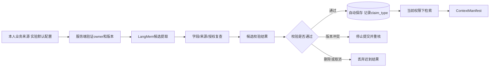
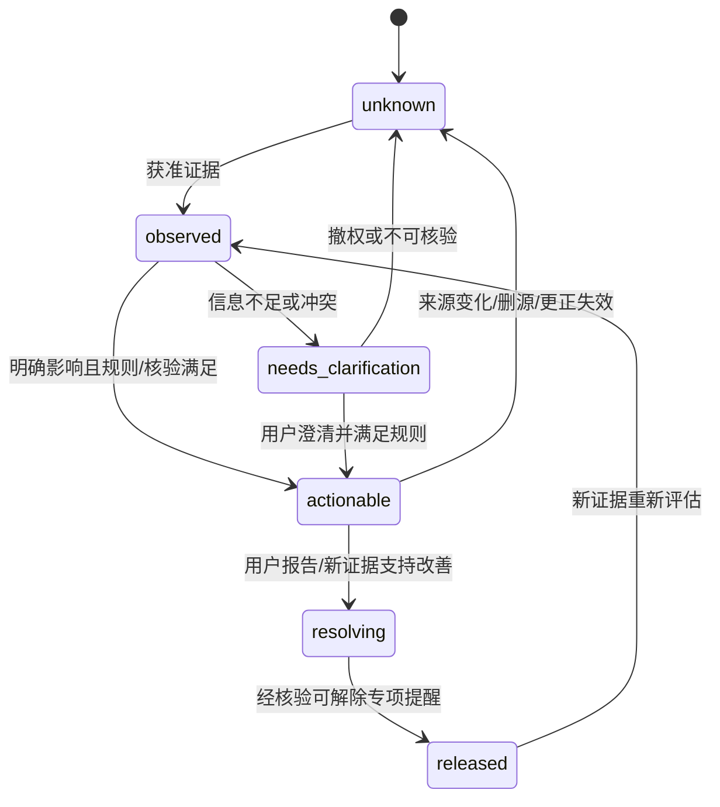

# 阶段2｜技术方案与实施计划

> 当前按[内部实验执行约定](../../EXPERIMENT.md)推进：支持通过指定 HTTPS 地址分享；注册登录后直接进入，不设年龄、用途确认或资格审批入口，不设固定业务保存期限。支持、记忆、画像、内部评测与优化按版本化实验默认配置开启，各功能仍按所属 STEP 实现。

> 整合修订：2026-09-20｜规划文档；产品未实现，业务验收未执行。
> [项目导览](../../README.md) · [阶段目标](01-阶段目标与功能设计.md) · [技术方案](02-技术方案与实施计划.md) · [测试验收](03-测试与验收标准.md) · [分步实施](04-分步实施与检查清单.md)

建议新增模块，尚未实现。承接阶段1；参考S02 V12/V28/V40的记忆与恢复治理，以及原版复用R02/R04/R05/R08/R09。LangMem与Mem0只选一条主线，本版采用LangMem候选提取与摘要，持久事实由PostgreSQL业务服务拥有。

<a id="aud-04"></a>
## 模块与授权数据流

建议新增 `frontend/src/features/records/{notes,sleep}/`、`frontend/src/features/memory/`、`frontend/src/features/support-card/`、`backend/app/{notes,records,memory,provenance}/`及 `backend/app/workers/`。列表用Query，表单用Form；长历史达到实际渲染压力后接Virtual，保持焦点和滚动锚点。



后台任务从 `background_jobs`读取引用，不把原文复制到队列。阶段2使用PostgreSQL持久任务和独立worker，租约/重试有界；阶段4加Kafka投递时沿用同一任务ID与状态。LangMem本地ReflectionExecutor线程不能承担必须跨重启可靠的任务。

### Assessor输入与证据分类

UserDependencyAssessor按实验默认配置处理本人有效来源、本站事件、自愿自评和更正；不读取设备其他应用。长期趋势由Worker生成，缺有效来源或证据时保持unknown，不以历史consent决定是否保存画像。

| 维度 | 观察信号 | 核心判断所需/保护因素与替代解释 |
|---|---|---|
| language_expectation | 亲昵称呼、关系/排他性措辞 | 核引用/玩笑/否定/角色扮演；用户知道AI边界是反证，不凭词命中定级 |
| frequency_change | 唯一主动发起、短期重进、相对本人变化 | 排除故障/预约/系统诱发；考试短期求助可解释；频率本身不是损害 |
| duration_schedule | 可观测活跃时间、时段、用户自设计划冲突 | 闲置和覆盖未知分开；深夜未必违背作息；用户明确报告冲突才谈影响 |
| regulation_concentration | 是否几乎只依赖AI调节 | 核有无其他可接受方法、用户是否愿意扩展；未提及其他方法是unknown |
| reassurance_loop | 同一担忧反复求保证、得到保证后很快再问 | 区分澄清新事实和重复确认；跨会话推断须有本人有效来源与充分证据 |
| unavailability_response | 对真实故障/自然结束的反应 | 只观察自然事件，禁止故意断联/延迟测试；重要事项中断的合理焦急是替代解释 |
| decision_autonomy | 要Agent作全部重要决定、不核验信息 | 区分征询建议与外包决定；能给个人理由/自主拒绝为保护因素 |
| use_control | 自报想停却不能按意愿停 | 不用会话长自动判断；记录用户自己希望的控制方式，不实施惩罚限流 |
| exclusivity_replacement | 唯一关系期待、明确放弃原有真人联系 | 需要有真实机会/意愿及用户报告的替代；不假定家人朋友安全；自主安全选择为保护 |
| functional_impact | 睡眠/学习/工作/责任/生活实际受影响 | 当前明确严重影响不能因个人基线一贯如此而正常化；来源/发生时间可核对 |
| protective_factors | 独立选择、其他应对、安全联系、兴趣、现实行动 | 未知不等于不存在；保护因素与负面证据并列，不加减成一个净分 |

前3维主要是观察；第4～10维用于需要澄清的支持适配判断；第11维为保护因素。并非三类一一排他：每条Evidence须带stance、alternative_explanations与source版本，不能从行为计数直接推出心理事实。

<a id="durable-jobs"></a>

### 持久任务、租约与提交恢复

关联S2-T04/S2-T06/S2-T08；阶段4 S4-T02继续复用；验收S2-A10、S4-A11。

background_jobs/PostgreSQL保存权威任务状态；Kafka只负责阶段4起的通知；Worker负责执行；checkpoint只保存图恢复信息。job状态queued→running→succeeded，瞬态失败进入retry_wait后重新queued；耗尽为failed，用户取消为cancelled，来源/用途代次失效为invalidated。该枚举是本次确认的规划补充，不覆盖data_requests、deletion_jobs和runs各自业务状态。

在已有id/kind/source_refs/generation/status/attempt/lease_until/cancelled_at/error_code上补version、owner/purpose绑定、grant/实验配置版本、available_at、max_attempts、deadline_at、budget_ref、lease_owner及递增lease_token。领取用短事务行锁/CAS，续租与完成必须匹配lease_token；租约回收后旧Worker不得提交。租约不是数据访问授权，每次读取/调用/提交仍核来源与用途。job重试不重置run/experiment总预算、attempt或deadline。

业务链：`实验配置开启且来源有效→同事务保存job→阶段2 Worker轮询领取→复核来源→LangMem→校验→candidate→服务端校验→自动保存memories`。阶段4内容链为`批准版本＋job＋outbox同库事务→发布通知→Kafka→Worker→候选索引generation→人工发布`。outbox早已有设计；阶段2无消息双写时不要求提前部署Kafka。正式记忆自动保存是同步业务事务，不用FastAPI进程内BackgroundTasks假装耐久提交；删除传播、导出、纵向评价、L1/L2均依需要复用持久job。

投递/恢复合同：

1. outbox发送后未标记会重复投递，按事件ID/job_id/generation去重；不得先标sent再发送。消息不携正文。
2. Kafka消费者确认通知已对应到持久job，并成功领取或确认已完成/由其他有效租约持有后ack；执行责任在DB账本。后续Worker崩溃由租约扫描恢复，不能只靠Kafka重投。未能核实DB状态不ack。
3. 结果、来源版本核验与完成标记尽量在同事务提交；正式业务副作用通过已有幂等服务/唯一tool_executions收据完成。取消先阻止新读取/调用，已经提交的合法业务结果如实保留；取消不等于撤销此前确认。
4. 分类重试：临时I/O有限退避＋抖动；参数、权限、删除、schema不自动重试；未知mutation结果先查收据。dead-letter保留最少错误元数据，处理后仍重验当前资格，不把DLQ当私人正文仓库。
5. 恢复扫描queued/retry_wait/过期租约/outbox积压；指标含最老等待时间、attempt、租约丢失、invalidated、失败和取消。恢复不复活旧generation。

`ConversationFinished`尚不是已确认事件名；若后续采用，只是内部任务触发别名，不加入学生SSE。建议payload仅event_id/schema_version、run/session引用、generation、source_refs/versions、purpose/grant_refs和trace_ref。事件发生本身不授予候选提取或研究权限。

验收S2-A10、S4-A11；回退停止新的通知发布、暂停消费者并对账同一job表。已有生产Kafka方向保留。若未来用单PG轮询替代生产Kafka，必须有ADR记录峰值到达率/服务时间、积压恢复目标、DB锁等待、运维能力和故障结果，给出停生产者→排空/去重→同ID接管→可恢复Kafka步骤；目前无这些测量，不建议批准替换，更不加Celery/Redis队列并行。

## 数据结构

| 表 | 最小字段与约束 |
|---|---|
| notes | id、user_id、kind(free/linked_excerpt)、title、body或source_refs、annotation、occurred_at、timezone、tags、status(draft/saved/needs_review/deleted)、version |
| sleep_records | id、user_id、entry_date、bed_at/wake_at可空、timezone可空、interruptions可空、feeling/note、version、deleted_at；不以提交时间替代发生时间 |
| support_cards | id、user_id唯一、helpful_methods、self_reminders、contact_notes、resource_refs、version、updated_at/deleted_at |
| context_grants | id、user_id、source_type/id/version、purpose(current_run/candidate_extraction/personalization)、run_id可空、expires_at可空（历史兼容，不作业务TTL）、revoked_at、version |
| memory_candidates | id、owner、source_refs、claim_type、proposed_content、operation、target_memory_id、grant_version、status、version、generator_version |
| memories | id、owner、type、content、claim_type、event_time、recorded_at、source_refs、scope、status、supersedes_id、version、expires_at可空 |
| artifact_sources | artifact_type/id/version、source_type/id/version、purpose；反向索引支持来源变更传播 |
| memory_suppressions | owner、source_ref或最小指纹、scope、reason、created_at；只保留阻止再抽取需要的元数据 |
| followups | owner、source_ref、subject、due_at可空、status、permission_ref、last_prompted_at、version |
| background_jobs | id、kind、source_refs、generation、status、attempt、lease_until、cancelled_at、error_code；不存私人正文 |

业务表使用同一PostgreSQL；LangMem不能直接写第二Store。系统推断可在校验后保存，但必须保持system_inference，不自动转换为用户确认事实。运行摘要、用户更正和长期记忆分别记录语义与来源。

阶段5A可用MemoryCandidateArtifact封装本阶段候选，绑定现有candidate ID/version、source_refs、grant、run/job及generation；不得新增第二memory store或改写正式记忆所有权。授权来源→LangMem/Memory Workflow→candidate→来源/grant/schema检查→自动保存memories始终不变。单Support读取和提取预算先在本阶段成立，角色拆分与各角色子预算留5A，不提前引入独立Memory Agent。

### 状态与校准



actionable仅表示值得调整帮助方式，不是诊断。profile始终保存window、baseline_ref、coverage、sufficiency、反证、待澄清、expires_at（可空历史字段，不作业务TTL）与assessor_version。基础状态可实时核明确诉求；趋势基线只有在许可、覆盖和可比时区满足时估计。阈值/权重/窗口/模型confidence未校准时不产生数值等级，初始规则优先依赖可核对自报与保守澄清。LLM confidence不得当概率、权限或临床风险。

CalibrationProfile列明window、min_coverage、个人变动规则、提示冷却/解除参数及取值来源。用独立中文合成/获准标注先导比较误报/漏报、校准和亚群体差异，由G冻结版本；真正中文适用性仍需未来认知访谈和授权研究。基线越界的长期生活影响仍进入fixed safety/现实支持检查。任何变更由G单独升级EvaluatorVersion(kind=dependency)，不得被L1/L2改写。

## API合同

均遵守[共同接口合同](../阶段1/02-技术方案与实施计划.md#shared-contracts)的身份、幂等、版本和错误约定。所有记录GET需归属；source_refs逐个校验，不能通过传入他人ID带入对话。

| 方法/路径 | 请求字段 | 返回及特别错误 |
|---|---|---|
| POST/GET `/api/v1/notes` | POST kind/title/body或source_refs/annotation/occurred_at/timezone/tags/status；GET q/date/type/cursor | 资源或列表；空正文且无合法来源422；来源不可见404 |
| GET/PATCH/DELETE `/api/v1/notes/{id}` | PATCH允许字段+expected_version；DELETE版本 | 资源或deletion_id；来源修订时needs_review，不能继续AI读取 |
| POST/GET `/api/v1/sleep-records` | entry_date、可选bed_at/wake_at/timezone/interruptions/feeling/note；GET日期/cursor | 资源/列表，完整起止不合法422；未知字段原样为空 |
| GET/PATCH/DELETE `/api/v1/sleep-records/{id}` | 字段/expected_version | 新版本或删除任务；跨度由合法完整日期派生，不接受客户端“健康分” |
| GET/PUT/DELETE `/api/v1/support-card` | PUT各区内容+expected_version；首次无资源版本为0 | 单例卡片/version或删除任务；资源引用不可用时给可核对字段错误，不伪造资源 |
| POST `/api/v1/context-grants` | source_refs、purpose、run_id或有效范围 | grant_id/version/scope；授权不能超过本人数据权限 |
| DELETE `/api/v1/context-grants/{id}` | expected_version | revoked_at、受影响run/job；当前读取与后续写入都需响应撤回 |
| POST `/api/v1/memory-candidates` | source_refs、Idempotency-Key；服务端建立来源关联 | 202 job_id；owner/删除校验；版本冲突409；提取校验后自动保存，无consent前置 |
| GET `/api/v1/memory-candidates` | status/cursor | 仅本人候选及来源、类型、生成状态 |
| GET `/api/v1/memory-candidates/{id}` | 本人身份 | 只读提取/校验/保存结果及memory_id或失败原因；不提供逐条confirm/edit_confirm同意入口 |
| GET `/api/v1/memories`；GET/PATCH/DELETE `/api/v1/memories/{id}` | 搜索/状态；PATCH内容或停止状态+版本；DELETE版本 | 记忆或遗忘任务；不默认删除原会话，范围需预览 |
| GET `/api/v1/runs/{id}/context` | 无 | 本轮曾提供的可访问资料引用，删除项只显示不可用占位 |
| PATCH `/api/v1/followups/{id}` | status(active/stopped)、expected_version | 状态/version；停止后不再提示 |
| GET `/api/v1/jobs/{id}` | 无 | status/progress/error_code；只开放本人任务元数据 |

服务端按业务动作执行创建draft→绑定来源grant→start，不要求用户另行授权。grant仅绑定本人有效来源与未启动draft；读取/提交时重查，run终态、取消、删源或版本变化使其失效，无固定TTL。记忆提取校验后自动保存，不能原位覆盖用户记录。

### 接口与事务

| 接口 | 输入→输出 | 校验与异常 |
|---|---|---|
| GET `/api/v1/me/dependency-profile` | 可选as_of→本人Profile及Evidence | 缺有效来源返回unknown/stale，不伪造画像；无年龄或consent前置，跨账号不可见 |
| POST `/api/v1/dependency-assessments` | source_refs、expected_profile_version→202 job_id | 服务端注入owner与实验配置版本，建立来源grant；旧版本409，跨账号404 |
| POST `/api/v1/me/dependency-corrections` | dimension、evidence_ref、用户说明/更正、expected_version→correction_id及失效范围 | 立即阻断旧推断；模型不能否决用户纠正；保留必要不同来源冲突说明 |
| POST `/api/v1/self-reports` | 自愿问题版本、window、answers含skip/unknown→id/version | 未答用null；不得自动填0、造保护因素或强迫完成 |
| DELETE `/api/v1/me/dependency-profile` | expected_version→deletion_id/status | 删除派生画像/索引/cache/checkpoint；是否删原笔记另列预览，不越范围删除 |

画像、记忆均按experiment-defaults/1开启，来源级grant由业务服务创建，不要求客户端consent_ref。DependencyEvidence/Profile引用业务来源，提交比较source/config/profile/generation；删除、来源变化或取消时丢弃。Assessor和LangMem只产候选，校验与自动保存由PostgreSQL业务事务负责，共享skill不存个人记忆。

<a id="aud-06"></a>
## 记忆读取、写入和删除算法边界

读取先过滤owner/status/grant/版本，再按当前问题、明确偏好、时间与相关度取有限资料；上下文超限先去重、截断无关内容，再调用摘要节点。token预算覆盖摘要和候选提取。相关度不是权限，缓存键包含owner、用途、源版本和策略版本。

R08采用 `create_memory_manager`返回候选，自定义Pydantic schema并限制max_steps；源码MemoryManager本身没有Store写调用，但其文档措辞不能代替迁移验证。不要把 `create_manage_memory_tool`直接暴露给对话Agent，它会直接写/删Store。R09摘要需追踪所有源消息版本；源变化时重新生成前不能继续使用旧摘要。

删除模式分开：

- **遗忘记忆**：有效记忆不可用、相关摘要/候选失效、旧检查点上下文停止复用，并记录来源抑制；原始会话可以按用户选择保留供本人查看，但上下文构建不得借原历史重新抽取已遗忘来源。
- **删除原始记录/会话**：先展示关联摘记、AI派生记录和受影响回应；确认后阻断源与关联派生内容，清理正文/索引/缓存。与被删来源关联的AI回应按保守范围屏蔽或提示重新生成，不声称能精确删除模型内部语义。
- **来源失效**：删除、更正、显式grant撤销或配置关闭后停止相关读取与提交；历史consent撤回不充当新实验开关。

删除检查点优先使用对应锁定版本的官方删除接口；若不能安全做局部修改，删除受影响thread检查点，从仍有效的业务消息建立新thread。宁可丢失该次恢复能力，也不恢复被禁止的内容。运行中撤回/删除需取消使用该来源的run，停止继续发送旧资料衍生输出。任务完成提交使用source_version/grant_version比较，迟到结果丢弃而非重新保存。

<a id="memory-lifecycle"></a>

### 自动保存、更正、遗忘与来源分离

S2-T04/S2-T05/S2-T06补齐提交检查，验收S2-A11。LangMem仅产候选；业务短事务核owner/source/grant/config/schema/generation/版本及抑制标记后自动保存。同一候选重复提交至多一笔，不以进程内BackgroundTasks代替耐久提交，不伪造用户确认。

memory、Profile、共享经验和研究案例分别核用途。来源修订、用户更正、撤权或遗忘需使相关Artifact、Review pass、摘要、索引、缓存、checkpoint、导出及研究资格失效；保留原源而单条遗忘时用最小抑制标记阻止再次抽取。回退/旧checkpoint不能覆盖新更正；合法已确认行动的独立状态按原合同保留。任何缓存、trace或共享skill均不是第二资料库。

11维画像按实验配置默认开启，unknown、反证与保护因素合同保留；缺有效来源时只使用当前诉求、拒绝和纠正。自评与引用自评的Profile只算一份证据，重连、多标签页和重试不增加主动发起。

代价为来源反向索引、失效传播和Worker恢复，复用原PG与worker；关闭未校准画像仍保留通用温暖支持、当次明确偏好及原CRUD。

### 证据字段、独立性与派生资格

DependencyEvidence必须记录来源版本、时间窗、stance、反向证据、替代解释、覆盖/充分度及待澄清项；unknown/needs_clarification/null不压成0，LLM confidence不是已校准概率。11维定义以本文件Assessor表为准；自评与引用该自评的Profile不是两份独立证据。

Memory、profile、共享经验和研究案例分别记录用途与来源；LangMem候选由业务服务校验后自动写入。更正、删源和取消传播到Artifact、Review、摘要、索引、缓存、checkpoint与导出。遗忘保留最小抑制标记，回滚不能覆盖新更正。

当次适配、8维行为和observed/skipped/lost/withdrawn口径由[阶段3](../阶段3/02-技术方案与实施计划.md)统一维护；无画像仍保留温暖基础支持、当次明确偏好和独立CRUD。未校准时关闭相应自动调节，不展示真实学生画像或宣称临床检测准确率。验收沿S2-A11及阶段3的S3-A09。

## 跟进规则与配置

配置候选：`rest_window`、`rest_max_per_session=1`、`cadence_lookback_days=14`、`cadence_min_active_days=5`、实验配置与用户提醒偏好、事件停止状态。当地日期由服务器当前UTC和已核对IANA时区计算，记录时区变化后暂停规律推断；跨午夜采用环形时段比较或直接放弃低置信规律，不能把23:30与00:30算成相距23小时。

当前问题→已授权事件→交流间隔是优先次序。未聊天只表示本站无记录；任何关闭/拒绝覆盖推断。实现为可测试规则，模型只组织措辞；无权限、无证据、无预算时省略主动提示，正常对话仍可继续。

## 任务拆解

| 任务 | 优先级/依赖 | 功能 | 可检查产出/验收 |
|---|---|---|---|
| S2-T01 <a id="s2-t01"></a> 建记录/来源/授权合同 | P0/阶段1 | F-DATA-001、F-JOURNAL-001 | 迁移、所有权与grant场景；S2-A01/S2-A06 |
| S2-T02 <a id="s2-t02"></a> 实现笔记和摘记 | P0/T01 | F-JOURNAL-001 | 编辑器、草稿、source关联和单次带入；S2-A01/S2-A07 |
| S2-T03 <a id="s2-t03"></a> 实现睡眠与备忘卡 | P1/T01 | F-SLEEP-001、F-SUPPORT-001 | 服务端CRUD、日期校验、两个页面；S2-A02/S2-A03 |
| S2-T04 <a id="s2-t04"></a> 接LangMem候选与worker | P0/T01 | F-MEM-001 | 接口兼容记录、任务状态、处理前授权；S2-A04/S2-A09 |
| S2-T05 <a id="s2-t05"></a> 完成资料读取与摘要 | P0/T02,T04 | F-MEM-002 | ContextManifest、预算、摘要版本；S2-A05 |
| S2-T06 <a id="s2-t06"></a> 完成撤回/删除传播 | P0/T02–T05 | F-DATA-001、F-MEM-001 | 任务取消、抑制重抽取、检查点清理；S2-A06/S2-A07 |
| S2-T07 <a id="s2-t07"></a> 实现关心与停止 | P1/T05,T06 | F-CARE-001 | 规则、偏好开关、时间边界；S2-A08 |
| S2-T08 <a id="s2-t08"></a> 联调和复用验收 | P0/T01–T07 | 全阶段 | 跨账号、重启、并发、旧来源迟到结果证据；S2-A01至S2-A09 |

LangMem依赖不兼容时，保持同一候选合同，退回LangChain结构化提取节点，不更换数据主存。此为明确降级路径，未实测前不宣布第三方接口生产可用。阶段3直接复用这些授权、记录版本和时间规则。

### 任务、恢复与证据

增量任务按下表登记；原S*-T*含义保持，页内Txx为本阶段基础任务的局部简称。每项M以内，模型分类作为最后接入项，不阻塞规则与UI。恢复以当前业务授权为准；旧checkpoint不能覆盖新更正。关闭可选assessor不影响原笔记、睡眠、备忘、自动保存的记忆与Support。

<a id="increment-tasks"></a>

### RSI任务与基础任务映射

| 增量任务 | 原任务关联 | 依赖 | 功能与接口/实体产出 | 验收引用 |
|---|---|---|---|---|
| RSI-S2-T01 <a id="rsi-s2-t01"></a> 定义11维与标注反例 | [S2-T01](02-技术方案与实施计划.md) | 本阶段前置门槛 | U05；DependencyEvidence/Profile schema与反证 | [RSI-S2-A02](03-测试与验收标准.md)、[RSI-S2-A08](03-测试与验收标准.md)；共同S2-A10、S2-A11 |
| RSI-S2-T02 <a id="rsi-s2-t02"></a> 接个人用途与来源映射 | [S2-T01](02-技术方案与实施计划.md)、[S2-T04](02-技术方案与实施计划.md) | RSI-S2-T01 | U05/U08；experiment-config/context_grants、候选用途隔离 | [RSI-S2-A01](03-测试与验收标准.md)、[RSI-S2-A03](03-测试与验收标准.md)、[RSI-S2-A04](03-测试与验收标准.md)；共同S2-A10、S2-A11 |
| RSI-S2-T03 <a id="rsi-s2-t03"></a> 接规则Assessor与unknown回退 | [S2-T05](02-技术方案与实施计划.md) | RSI-S2-T02 | U05；assessments→background_jobs→Profile | [RSI-S2-A02](03-测试与验收标准.md)、[RSI-S2-A03](03-测试与验收标准.md)；共同S2-A10、S2-A11 |
| RSI-S2-T04 <a id="rsi-s2-t04"></a> 接Profile界面、更正与自评 | [S2-T02](02-技术方案与实施计划.md)、[S2-T07](02-技术方案与实施计划.md) | RSI-S2-T03 | U06/U07；dependency-profile/corrections/self-reports | [RSI-S2-A05](03-测试与验收标准.md)、[RSI-S2-A08](03-测试与验收标准.md)；共同S2-A10、S2-A11 |
| RSI-S2-T05 <a id="rsi-s2-t05"></a> 接删除、更正传播与来源失效 | [S2-T06](02-技术方案与实施计划.md) | RSI-S2-T04 | U06/U08；deletion_jobs、suppressions、Artifact失效 | [RSI-S2-A05](03-测试与验收标准.md)、[RSI-S2-A06](03-测试与验收标准.md)；共同S2-A10、S2-A11 |
| RSI-S2-T06 <a id="rsi-s2-t06"></a> 执行fresh-session记忆链验证 | [S2-T08](02-技术方案与实施计划.md) | RSI-S2-T05 | U08；候选校验与自动保存、真实保存/检索/修订收据 | [RSI-S2-A01](03-测试与验收标准.md)、[RSI-S2-A07](03-测试与验收标准.md)；共同S2-A10、S2-A11 |

以上均为未来实施任务，未执行。工作包规模不作工期或性能承诺。

<a id="technical-sources"></a>
## 技术来源与核验边界

下表转引2026-09-18审核的外部资料与静态快照；本次仅整合文档，未重新核验在线版本或装配兼容性。历史库版本不是项目依赖锁，正文中的建议路径也不是现有源码。

| 来源 | 历史核验记录及适用范围 | 对应合同 |
|---|---|---|
| [LangMem固定快照](https://github.com/langchain-ai/langmem/tree/9d033b47d9ce53e37e92c92241b0496c0278932e) | pyproject 0.0.30，LangGraph≥0.6,<2，MIT、未归档；范围声明不能证明与待选LangChain/Provider组合兼容 | 记忆复用合同不变；优化器互斥；未来做单独锁文件装配验收 |
| [Kafka 4.1设计](https://kafka.apache.org/41/design/design/) | Kafka内的事务不能自动保证外部PostgreSQL副作用exactly-once | [AUD-04](02-技术方案与实施计划.md#aud-04)：outbox/业务唯一约束/收据仍必需；未冻结本项目Kafka版本 |

## 实施前待补证据

| 待补事项 | 缺失证据 | 当前采用方式 | 影响范围 |
|---|---|---|---|
| 中文依赖/行为校准 | 获准样本、内容审阅、标注一致性、阈值/误差与亚群证据 | 11维unknown与更正、可选画像，基础支持照常 | 真人自动适配、质量阈值；不阻塞合成合同设计 |

## 任务表与执行步骤的关系

基础任务和RSI任务编号用于追溯，父任务关联不等于必须等待父任务全部结束。合并后的实际顺序、局部完成条件及交接见[分步实施清单](04-分步实施与检查清单.md)。同一任务的合同、实现与验证可跨步，须所有相关步骤及用例完成才能记整项通过。

<a id="entity-contracts"></a>
## 本阶段核心逻辑实体与合成片段

共同字段、类型、枚举及VersionBinding由[共同合同](../阶段1/02-技术方案与实施计划.md#shared-contracts)统一维护。下表仅列专属字段；复用既有表/注册表，不新增第二份事实库。

| 实体 | 专属字段/枚举与关联 | 隔离、敏感性和删除关系 |
|---|---|---|
| DependencyEvidence | dimension、evidence_kind=utterance/event/self_report/correction、source_refs（逐项含source_version）、stance=support/counter/ambiguous、alternative_explanations、event_time、expires_at可空（历史兼容） | 引用与必要短片段，用户可更正；来源撤权使派生链失效 |
| DependencyProfile | dimensions、window、sufficiency=unknown/limited/conflicting/sufficient、trend=unknown/stable/increasing/decreasing、counter_refs、protective_factors、clarifications、suggested_actions、assessor_version、expires_at可空（历史兼容） | 多维产品适配状态，非诊断分数；明确区分观察/解释；不向学校/管理员自动展示 |

以下为合成payload片段，不是可直接提交或持久化的完整对象；服务端必须补全共同封套并按状态校验。null预算、未批准evaluator、缺失画像来源版本均不能作为可运行/可持久化状态。示例不代表已执行验收。

```json
{
  "DependencyEvidence": {
    "id": "de-demo",
    "dimension": "decision_autonomy",
    "stance": "ambiguous",
    "alternative_explanations": [
      "一次求助而非持续外包"
    ],
    "source_refs": [
      {
        "source_type": "message",
        "source_id": "source-demo",
        "source_version": 1,
        "purpose": "dependency_assessment",
        "grant_ref": "grant-demo-v1"
      }
    ]
  },
  "DependencyProfile": {
    "id": "dp-demo",
    "dimensions": {
      "decision_autonomy": "needs_clarification"
    },
    "sufficiency": "limited",
    "trend": "unknown",
    "counter_refs": [],
    "protective_factors": null,
    "assessor_version": "assessor-demo-v1",
    "expires_at": null
  }
}
```

DependencyProfile.dimensions值为unknown/no_signal/observed/needs_clarification/actionable/resolving/released；临床标签不在枚举中。

<a id="original-reuse"></a>
## 原版开源证据与逐项复用

原版复用R编号来自原总体第9节，与RSI研究R编号分域。固定快照为2026-09-17历史静态核查，未运行；复制前核源码、许可与升级差异，完成本项目装配后才能称可用。目标代码路径为建议，不代表当前存在。

| 仓库 | commit | 已读关键文件和证据边界 |
|---|---|---|
| [Loyal Elephie](https://github.com/v2rockets/Loyal-Elephie/tree/f0611104cb1b551db3d73dc190802bf7298b6908) | `f0611104cb1b551db3d73dc190802bf7298b6908` | 前端保存/回退、API 登录/验证、`memory_server.py`、`file_monitor.py`、`chroma_doc_manager.py`；笔记依赖外部 Markdown 工作流，不是本项目所需的完整站内编辑器 |
| [LangMem](https://github.com/langchain-ai/langmem/tree/9d033b47d9ce53e37e92c92241b0496c0278932e) | `9d033b47d9ce53e37e92c92241b0496c0278932e` | 提取、Store 工具、后台执行、短期摘要、提示词优化、摘要测试和依赖文件；可供接口复用，依赖兼容和模型调用尚未实测 |
| [Mem0](https://github.com/mem0ai/mem0/tree/0df3e4b87df20785f0741370c75e44428796193e) | `0df3e4b87df20785f0741370c75e44428796193e` | OSS Memory、MemoryClient、SQLite 历史、PGVector 配置、遥测、服务端权限与 scope 测试；OSS 与托管能力分开，不并联引入 |

| 采集项与用户操作 | 页面—接口—数据证据 | 状态、缺口及外部依赖 | 分类与决定 |
|---|---|---|---|
| CBT 新建、修改睡眠记录 | `submitSleep` → localStorage → `/api/sync/sleep` → SQLite | 已核实代码，未运行；本地整批同步，缺多设备可靠性 | A，纳入睡眠记录，服务端重做 |
| CBT 个人支持文本 | `saveSosPlan/loadSosPlan` → `sosCrisisPlan` localStorage | 已核实代码，未运行；只有本地文本保存，无后端和授权流程 | A，纳入支持备忘卡，借鉴交互 |
| CBT 感谢/小事记录模式 | `submitThought` 的 gratitude 分支 | 已核实代码，未运行；复用想法表字段且硬填强度；不采用该数据编码 | B，可作自由笔记提示，不另计新功能 |
| Loyal 保存会话和读取笔记 | `handleSave` → `*SAVE*` → Markdown；监视 notes → 摘要/索引 | 已核实代码，未运行；外部文件编辑，共享存储 | A，站内笔记与摘记；新编辑器为本轮设计 |
| Loyal 记忆来源链接、时间检索 | `generate_ref`、`search_context_with_time`、doc 元数据 | 已核实代码，未运行；不证明用户隔离或完整删除 | B，增强来源与时序，替换存储和权限 |
| LangMem 提取、摘要与优化 | `create_memory_manager`、`SummarizationNode`、`create_prompt_optimizer` | 已核实代码，未运行；需 LLM；无本项目用途授权、删除审批与发布门禁 | C，优先候选，接口复用加业务控制 |
| Mem0 记忆 CRUD/检索 | `Memory`、PGVector 配置、scope 测试 | 已核实代码，未运行；单条 ID 操作由调用方做所有权检查；含 SQLite 历史、默认遥测 | D/E，替代候选，当前暂缓 |

| R编号/来源定位 | 目标功能与方式 | 保留、修改、依赖及许可要求 | 目标路径/阶段/验收 |
|---|---|---|---|
| R02 CBT `frontend/js/cbt_tools.js:submitSleep/editSleepEntry`、`src/utils/db.py:sync_sleep_logs` | F-SLEEP-001，仅借鉴交互/字段 | MIT；保留记录/历史体验；不复制整批删除同步、默认睡眠时刻和30条截断；完整日期/时区重做 | `frontend/src/features/records/sleep/`、`backend/app/records/sleep.py`；2；S2-A02 |
| R04 CBT `frontend/js/ui.js:saveSosPlan/loadSosPlan` | F-SUPPORT-001，仅借鉴交互 | MIT；本地textarea不当成熟云模块；改个人备忘、版本与后端访问控制，不自动拨号/发消息 | `frontend/src/features/support-card/`、`backend/app/records/support_card.py`；2；S2-A03 |
| R05 Loyal `backend/memory_server.py:*SAVE*/generate_ref`、`backend/file_monitor.py:UpdateThread.run` | F-JOURNAL-001/F-MEM-002，仅借鉴设计 | MIT；保留显式保存及source关联；替换共享文件、直接路径、打印正文、自动索引和外部笔记编辑器 | `backend/app/notes/`、`backend/app/provenance/`；2；S2-A01/A07 |
| R08 LangMem `src/langmem/knowledge/extraction.py:create_memory_manager/MemoryManager` | F-MEM-001，接口直接复用(C) | MIT；实际类返回ExtractedMemory，无Store写调用；自定义Pydantic候选，限制步数；处理前授权、处理后来源/版本校验，正式写入独立服务 | `backend/app/memory/extractor.py`；2；S2-A04/A09 |
| R09 LangMem `src/langmem/short_term/summarization.py:SummarizationNode`及`tests/short_term/test_summarization.py` | F-MEM-002，接口复用及测试适配 | MIT；token预算、工具消息配对、修订消息情境；摘要必须绑定源版本；框架摘要不是用户认可的事实 | `backend/app/memory/context.py`；2；S2-A05/A07 |
| R13 Mem0 `mem0/memory/main.py`、`mem0/memory/storage.py`、`mem0/memory/telemetry.py`、`tests/memory/test_session_scope.py` | F-MEM-001，替代候选，当前暂缓 | Apache-2.0；单条ID访问需所有权检查；OSS历史SQLite和默认遥测另治理；MemoryClient默认托管端点，不能当纯自托管；不同时接入 | 无当前新增模块；重新选型时比较同一验收集 |

分类A真正新增、B原有增强、C实现替换、D重复能力、E暂缓；分页和视图不另计功能。

CBT/PsyChat/Loyal/LangMem根LICENSE均已读为MIT；Sage `frontend/LICENSE`为MIT，后端包声明ISC，不能互相替代。SoulChat/Mem0根为Apache-2.0。SoulChat模型README另说明科研用途及基座协议；数据和模型卡的ModelScope网页在本轮未返回可核读正文，未据此授权使用。PsyChat案例文件、CBT知识材料和第三方图/音频/字体的独立许可未完整核实，初始内容采用团队自建且经审阅材料。许可不清不以“网上公开”代替授权。

<a id="research-sources"></a>
## RSI研究来源与官方实现边界

RSI研究R编号来自升级总体第3节；不同于原版复用R编号。访问/静态核查截止2026-09-17，以下性能与实验数字均为作者报告，本项目未独立复现；本次未重新核验网页或许可证。

| ID / 标题及作者 | 首次公开 / 最新arXiv修订 | 状态 / 访问日 |
|---|---|---|
| <a id="r02"></a>R02 [PAST-Bench: Benchmarking the Foundations of Recursive Self-Improvement in Personal Agents](https://arxiv.org/abs/2608.04003)；Xue, Shuhan、Ding, Zixin、Shen, Yichen等 | 2026-08-04 / 2026-08-04 | 预印本；2026-09-17 |

| ID | 优化对象/反馈 | 实验条件 | 失败与局限 | 项目关联 |
|---|---|---|---|---|
| R02 | 持久经验on/off；任务分数＋save/retrieve/update机制证据 | 26场景、204 episodes、7模型/4框架，fresh-session任务族 | 机制分是路径一致性而非因果证明；作者指出Hermes+总体差异小于重复变异；不证明L2 | 记忆链路反事实消融，保留失效/错误路径 |

| 仓库 / 固定commit / commit日期 | 已读模块 | 许可及复用决定 | 边界 | 适配规模 / 替代 |
|---|---|---|---|---|
| [Gen-Verse/PAST-Bench](https://github.com/Gen-Verse/PAST-Bench/tree/f8223517ae7491e776b69793d9f11e9d074ab42e)<br>`f8223517ae7491e776b69793d9f11e9d074ab42e`<br>2026-08-05T01:16:45Z | src/past_bench/runner/self_evolve.py; metrics/v2_layer2.py（src/past_bench下）; tests/test_self_evolve_attribution.py | Apache-2.0；内嵌Agent各自许可；**适配后复用** | 借鉴fresh-session、on/off及路径断言；不搬agents目录内多个Runtime、全量工具与原对话数据；重定义支持场景，机制分不当因果证明 | M：合成任务族/适配/来源断言/清理4类；在现有LangGraph harness实现同一对照 |
| [v2rockets/Loyal-Elephie](https://github.com/v2rockets/Loyal-Elephie/tree/f0611104cb1b551db3d73dc190802bf7298b6908)<br>`f0611104cb1b551db3d73dc190802bf7298b6908`<br>2025-02-28T23:12:59Z | backend/memory_server.py; backend/file_monitor.py | MIT代码；个人笔记/素材不可默认复用；**仅参考思路** | 显式SAVE/来源引用可借鉴；文件watcher不是站内笔记完整CRUD，自动摘要、共享文件与原文输出不迁 | M：来源/确认/删除3类；现有LangMem候选服务 |
| [langchain-ai/langmem](https://github.com/langchain-ai/langmem/tree/9d033b47d9ce53e37e92c92241b0496c0278932e)<br>`9d033b47d9ce53e37e92c92241b0496c0278932e`<br>2026-09-09T06:44:42Z | src/langmem/knowledge/extraction.py; src/langmem/prompts/optimization.py; tests/short_term/test_summarization.py | MIT；**接口直接复用候选，实施时兼容验收** | 保留已规划的提取/摘要；create_prompt_optimizer是低成本固定L1替代，不是自证L2；候选正式写入由业务校验后自动保存 | S/M：schema/授权/预算/版本4类；LangChain结构化提取与人工候选 |

R01未核到作者官方代码；R06未核验官方代码包；R09为形式框架；R11/R12不复制参与者数据。代码许可证不覆盖第三方模型权重、训练集、量表题项、图片/音频；未核清者禁止复制进入产品。依赖实读示例：GEPA有Litellm等离线依赖，LangMem声明LangGraph版本范围，SageMate是Next.js/Express/Mongoose；均需将来隔离锁版本验证，不能凭声明范围声称兼容。

许可证补充：R01未核到官方实现/代码许可；R06官方代码包许可未核；R09概念工作未核官方实现；R11/R12仅合法阅读公开论文，个体数据/代码包及题项再用许可未完整核验。其余研究代码的可用性、commit和许可逐项列于§4。开放阅读、论文许可、代码许可、数据/权重许可是不同范围；本轮没有独立复现，未来可复现性仍取决于原始split、模型版本、外部服务和完整运行配置。

<a id="retention-contract"></a>
## 数据类别、保留与派生清理

支持、记忆、画像、内部评测与优化按版本化实验配置默认开启，各功能仍须在所属STEP实现，不生成用户granted记录。记忆提取校验后自动保存并保留推断标识。个人资料不进入公共知识或学校分析页；内部评测保留来源追踪、去标识、账号与split隔离，外发仍需确认。

| 数据类 | 规划保留/过期规则 | 删除与限制 |
|---|---|---|
| 当次评估临时上下文 | run终止即清除临时副本；法定必要审计仅留最小元数据 | 不落长期profile；provider已接收内容不能假称本地取消可收回 |
| 可选事件/画像 | 内部实验不设置固定TTL；按用户删除、撤回或来源变更处理，无需期限审批 | 时间长短不是心理状态阈值；依据失效变unknown，不能自动保留“高风险标签”；更正/撤权即失效 |
| 用户原始记录、自动保存的记忆 | 沿原业务明确保存/删除规则；当前不冻结存储期限，保留至用户删除或明确清理 | 删除源→画像/evidence/候选/索引/cache/checkpoint/导出失效；正式行动独立状态按原合同处理 |
| 研究材料、实验产物 | 实验产物不设固定保存期限；合成开发包与其他材料分开，保留来源与用途说明 | 去标识仍可能是个人信息，撤回后停止使用并追踪派生资产；必要留存须说明依据与访问限制 |
| 策略及审计 | 非个人通用规则可保存谱系；任何含来源可识别信息的资产按来源资格清理 | 不承诺能撤回已公开的不可逆匿名统计、用户已下载文件或第三方副本；本项目不训练权重，未来训练删除问题须另立方案 |

删除沿原 `requested→online_blocked→derivatives_purged→backup_pending→completed`，有未清项不能显示完成。备份恢复先应用独立最新删除清单，缺失则隔离。来源撤回使待发布候选invalidated；已发布含可识别片段的策略须暂停分配、独立审查、重建或回滚，不用“已经去标识”免除传播检查。

上述事件7日、个人聚合30日、画像7日的历史假设已取消，当前不设业务固定TTL。retention_policy_id仅引用实验资料处理约定，不需要G批准期限；持久采集按版本化实验默认配置和相应功能STEP接入。

<a id="source-pending"></a>
## 来源与实际适用性待核事项

| 待验证/待负责人决定 | 当前默认和未完成范围 | 关闭条件 |
|---|---|---|
| 中文多维画像与策略门槛 | 无临床有效分数；unknown和用户更正优先 | 原始研究/许可、内容审阅、先导标注/认知访谈、校准及亚群误差 |

<a id="ui-reference-contract"></a>
## UI参考落地约束

采用[本阶段图号映射](01-阶段目标与功能设计.md#ui-reference)与[统一设计基线](../UI设计图/README.md#ui-reference-policy)，视觉与交互参考不得覆盖本阶段API、状态、权限及数据合同。

S15的逐条确认保存不作为持久化前置；提取校验后自动保存，保留推断标识，提供查看、更正及确认删除。S16不增设逐用途同意；S18保留owner、版本、run及删除状态检查。

沿用[阶段1前端职责与按需接入合同](../阶段1/02-技术方案与实施计划.md#frontend-stack-contract)，在既有页面与组件上按真实消费者扩展。本次仅补充设计参考，不新增接口、schema、路由或依赖，不宣称页面已实现。
