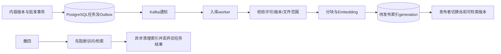
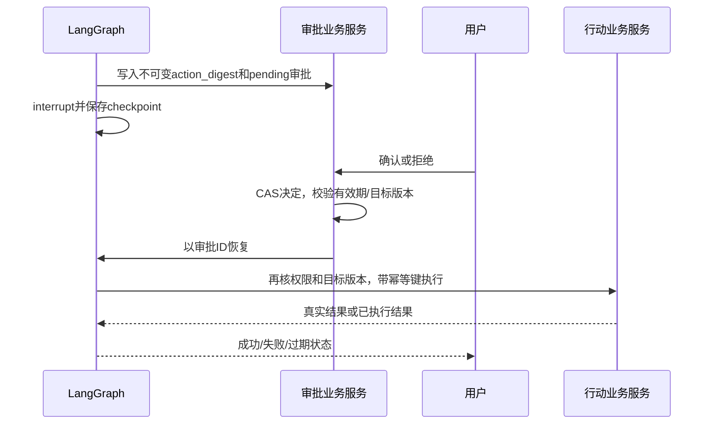

# 阶段4｜技术方案与实施计划

> 整合修订：2026-09-20｜规划文档；产品未实现，业务验收未执行。
> [项目导览](../../README.md) · [阶段目标](01-阶段目标与功能设计.md) · [技术方案](02-技术方案与实施计划.md) · [测试验收](03-测试与验收标准.md) · [分步实施](04-分步实施与检查清单.md)

建议新增模块；参考S02 V9/V13/V17–V21/V28–V35/V52与R06/R07。仅规划复用，不运行或复制不受信任脚本。完整公共规则见[共同合同入口与实施证据边界](../阶段1/02-技术方案与实施计划.md#missing-sources)。

## 模块与基础设施消费者

建议新增 `frontend/src/features/{resources,content-workbench,approvals}/`、`backend/app/{knowledge,content,tools,approvals}/`。Table承载内容/任务真实列表，Query管理其状态。PostgreSQL/pgvector作为内容索引，托管模型提供embedding；对象存储保存上传原文，学生读取经业务API核权，不发可长期绕过撤回的公开对象URL。

Kafka只承载已持久任务的通知；实际消费者为文档解析/embedding/索引worker，后续离线评估可复用。`background_jobs`是唯一状态，事务outbox与内容变更同库提交，消息只含job_id、generation和类型。幂等消费、有限重试、死信与对账不被队列“至少一次投递”替代。开发单实例可用同一worker直接轮询任务表，生产Kafka接线在阶段验收中单独证明，不标成已部署。

## 检索与Agent合同

R06适配PsyChat检索判断：规则先排除问候、单纯倾听及无资料权限；模型辅助返回 `need_retrieval/topics/query/needs_clarification`。检索计划只读取允许域，不按连续未检索次数强制触发。R07分块保留source_version、parent_id、chunk_id及对话轮次，回应范例与事实知识采用不同purpose过滤。

首版检索为元数据过滤+向量召回；关键词匹配确有不足时比较混合检索，不把PostgreSQL全文检索直接称BM25。改写最多一次主改写和一次验证，重复/空改写立即停止；这是初始可配置预算，需用本项目数据评估。TopK、阈值、长度及重排是否引入由基线验证，不照搬CBT的0.46或其他项目的成绩。

检索结果必须有source_id/version、可访问状态和证据片段；低证据时说明不足，可继续支持性交流，不补造方法或链接。正文及案例视为不可信输入，不能覆盖工具权限或系统规则。案例只影响表达方式，不能把案例中的家庭、疾病或经历说成当前用户事实。所有判断/检索/生成计入同一run预算与trace。

本阶段检索与必要检查仍是同一Support图内的工具/节点，不提前拆角色。阶段5A Evidence Agent将复用这里的RAG/Resource服务，用EvidenceArtifact包装证据、source/version、provenance、可访问状态和不足说明，返回Support整合；不得复制内容主存、放宽检索权限或把检索正文直接当最终回复。当前结构化结果、同run预算与trace必须能被该合同承接。

### 检索和最小context

PsyChat的有界改写逻辑适配为LangGraph节点，不导入其自写Agent循环和原案例库。执行次序为owner/purpose/内容发布状态过滤→有限查询→source/version/provenance→结构化Evidence→Support；当前profile只用于选择已批准支持资源，不授权额外个人记录或反向推断用户事实。相同来源来自profile和RAG时去重，不能当两份独立证据。

所有检索/embedding/摘要计同run预算；低证据/过期来源返回typed不足。图内保留EvidenceArtifact的source/authorization/schema/generation/trace封套，正式Evidence角色到阶段5A接入；不建立新内容库、Memory Store或Agent Runtime。

### 中文检索基线与逐项增强

首批解析继续为人工录入、UTF-8 Markdown/TXT，校验大小/编码/许可/解析时间，不因为“生产级”装PDF/OCR全集。按中文标题、段落和句界切分，保留source_version_id/body_hash、chunk_id、heading_path、字符起止和parent_id、purpose、审阅/发布状态、parser/chunker/embedding版本与generation；正文清洗不能破坏引用定位。chunk长度/重叠为待验证配置，不报通用最优数字。

授权域与发布状态是检索前置约束，SQL查询内限定，结果返回与最终引用再次核验。逻辑权限过滤不代表ANN物理上先遍历过滤后的集合；若用HNSW/IVFFlat，另测过滤后召回不足，不能为了凑TopK取消owner/purpose条件。小规模先保留pgvector精确查询基线；索引或iterative scan只在容量证据下启用。

正式链：`用户知识问题→Meta批准scope→Support调用检索→获准chunks→typed Evidence/5A EvidenceArtifact→Support整合→必要Reviewer→Output Policy→可访问来源卡`。引用分三项验：来源版本存在、当前用户可访问、具体主张被片段支持。三者不是同一个HTTP200或Ragas分数。source撤回立即阻止新的检索/草稿输出和重放；缺证据保留支持性回应与不足说明，不自动把外部内容发布到已审库。

最小对照按同一获准语料/查询集、embedding和预算口径逐项比较：R0向量基线；R1仅有界rewrite；R2仅关键词＋向量融合；R3只在胜出基线上加reranker。先报告Recall@k/相关性排序、可支持引用比例、应引未引、权限失败、低证据率、token/费用、P50/P95及失败分母；使用开发/选择集，质量与非劣门槛在看正式结果前冻结。

关键词主方案是**PostgreSQL可解释关键词/全文检索**：先精确标题/标签/人工同义词；中文分词方案未锁定时不能声称原生parser已完成中文语义分词。若确需全文检索，可在应用层固定经评测的分词规则/词典版本后写tsvector，用PG GIN和ts_rank_cd；这不是BM25。自动中文分词库的许可和质量须另核，当前不把任一库列为必装。融合候选采用确定性rank fusion；重排模型、query改写与外部调用另计账，失败可回已验基线。无经证实的BM25需求，不加搜索扩展/新服务；更不加Neo4j或第二向量库。

Ragas仅在获准离线集辅助度量文本与检索上下文支持关系，实际来源、权限和用户支持质量用独立检查。验收S4-A09；回退retrieval_policy与索引generation只能指向仍合法的内容，不能恢复已撤回版本。

## 数据及API

新增表：`contents(id,type,current_version_id,status,version)`；`content_versions(id,content_id,body_ref,body_hash,source_url,license_record,scope,review_status,version)`；`content_reviews`；`content_chunks(source_version_id,chunk_id,parent_id,purpose,embedding_generation)`；`resource_entries(region,school,eligibility,contact,checked_at,status,version)`；`outbox`。version为该API资源的乐观锁计数；正文批准后不可变，索引绑定content_version_id/body_hash及generation，审阅状态变化不被误当正文改写。复用阶段3的`resource_favorites`；迁入阶段1–3静态练习/支持资源时保留content_id及正文版本，练习与资源API共用内容读取服务。上传限制文本类型、大小、编码和解析时限，不执行文件内容。

| 方法/路径 | 输入 | 输出、授权和特别错误 |
|---|---|---|
| GET `/api/v1/resources` | q/type/category/cursor | 发布且适用资源items/next_cursor；无结果正常空态 |
| GET `/api/v1/resources/{id}` | 无 | 当前版本、正文/来源/适用范围；已撤回返回410及不含正文的状态 |
| GET `/api/v1/resources/support` | 用户选定region/school | 核实条目及checked_at，兼容阶段1合同 |
| PUT/DELETE `/api/v1/resource-favorites/{id}`；GET `/api/v1/resource-favorites` | 收藏资源ID；GET cursor | 本人收藏与不可用标记；收藏不复制正文 |
| POST `/api/v1/resource-feedback` | resource_id、type、可选description | feedback_id/status，处理用途明确，不附原对话 |
| POST/GET `/api/v1/admin/contents` | type/title/source/license/scope/body或上传引用 | 内容草稿或获权列表；角色403、缺字段422 |
| POST `/api/v1/admin/contents/{id}/versions` | 新正文/元数据、expected_version | 新版本ID，不覆盖已发布版 |
| PATCH `/api/v1/admin/content-versions/{vid}` | 草稿字段、expected_version | 仅draft可编辑并递增版本；in_review/approved/published返回409 |
| POST `/api/v1/admin/content-versions/{vid}/submit-review` | expected_version | draft→in_review，校验来源/许可/必要字段；缺项422 |
| POST `/api/v1/admin/content-versions/{vid}/cancel-review` | expected_version | 编辑者在尚无决定时使in_review→draft；决定竞争返回409 |
| POST `/api/v1/admin/content-versions/{vid}/review` | approve/reject、reason、expected_version | 仅in_review可决定；批准建立job/outbox；拒绝回draft并留审阅事件；角色/版本复查 |
| POST `/api/v1/admin/content-versions/{vid}/publish` | expected_version | 当前发布版本；未批准或索引未ready返回409 |
| POST `/api/v1/admin/contents/{id}/withdraw` | reason、expected_version | 立即阻断状态及清理job_id；不等待Kafka再阻断 |
| GET `/api/v1/admin/jobs/{id}`；POST `/api/v1/admin/jobs/{id}/retry` | 重试expected_version | 状态、已尝试次数、错误码；过期generation不重建旧内容 |

所有私人/管理路径遵守[共同鉴权和幂等合同](../阶段1/02-技术方案与实施计划.md#shared-contracts)；学生资源读取只给发布范围。错误不得透出对象桶、内部路径或原始堆栈。

### 发布撤回与证据传播

内容发布沿draft→in_review→approved→published，索引单独generation。撤回先阻断访问再清理向量/缓存；对应Evidence/SupportDraft/Review过期。Profile源删除同样可使检索计划失效，不能用旧checkpoint完成回答。Kafka投递任务引用、不传私人正文；后台重试同source/generation至多提交一次。

## 工具和HITL恢复

首批工具注册：`search_approved_resources`（只读公开/获权内容）、`read_authorized_records`（只读grant允许资料）、`propose_action_change`（仅草稿）、`apply_confirmed_action_change`（执行已批准业务更改）、`propose_support_card_change`（仅草稿）。工具schema含参数、风险、权限、timeout、幂等策略和返回结构，参数中的owner由运行上下文注入。

`approvals`含id/owner/run/tool/args_digest/target_version/status/expires_at/decision_version；`tool_executions`含id/approval_id唯一/target/result_ref/status。执行结果由业务事务确认。审批后权限撤回仍不能执行；批准、拒绝、过期、取消均是终态，重复决定幂等，冲突409。

API：GET `/api/v1/approvals/{id}`返回用户可见动作差异/状态；POST `/api/v1/approvals/{id}/decision`接decision/expected_version，返回真实决定；GET `/api/v1/tool-executions/{id}`返回真实结果。本阶段扩展run状态waiting_approval，interrupt持久化后递增run版本并发出`approval.required`，事件仅引用审批ID及经授权预览；有效恢复后转queued/running。模型不能自己构造“批准”来恢复。

复用LangGraph官方interrupt/checkpoint/Command恢复，不自写循环框架。三个恢复断点必须演练：审批已写尚未resume；业务已提交尚未checkpoint；图已结束但run终态尚未写。先查业务执行结果，不能盲重试写入。图版本不兼容时明确终止或人工处理，不拿旧checkpoint继续新图。

### 接口和工具契约

沿阶段4 `/resources`、`/admin/contents`、content-versions审阅/发布/撤回、jobs和approvals API。新增资源适用字段仅描述材料对象/限制，不承载私人依赖画像。公开接口不得返回内部profile分组。

| 内部Tool | 输入/输出 | 固定边界 |
|---|---|---|
| search_approved_resources | query、许可scope→EvidenceArtifact/不足 | 只读；不得从文档指令扩权 |
| read_authorized_records | grant_ref＋具体source版本→最小字段 | 独立重验用途；不能读全部记忆 |
| propose_action_change | target/version、user_goal→待确认diff | 不等于实际修改；不自动安排通知 |
| apply_confirmed_action_change | approval_id、digest、expected_target_version→tool_receipt/result | 业务事务、幂等；Meta/Profile/Reviewer意见都不是用户确认 |

LangGraph interrupt等待用户决定，恢复仍查当前授权、期限、目标/图版本和既有执行结果；节点恢复可能重执行，故副作用移到明确批准后并以幂等收据核对。论文/工具返回字符串“执行成功”没有业务收据只算未验证。

### 条件性MCP接入与工具清单治理

实际已确认需求是`search_approved_resources/read_authorized_records`等项目内业务能力，直接调用现有Tool足够；未发现必须接MCP的已确定外部服务。条件场景是未来合作方已维护有来源/版本合同的只读支持资源目录，且多个客户端需要复用其协议；只有其MCP接口比维护专用HTTP适配具有明确收益，才接Client。返回新资料仍需来源/许可/发布审核，不因服务自称“审核过”就变项目正式支持材料。Server仅当本项目工具确需给多个外部客户端复用才另作ADR；隔离展示可提议独立合成资源服务，不能冒充真实合作方上线。

MCP发现结果先进入待审清单，不直接传给Agent。执行链为“允许的远端发现→工具名/来源/输入输出schema/行为及版本摘要审核→Meta业务授权→参数和scope检查→需要时用户确认→预算预占→调用→结构化结果/来源校验→业务收据与审计”。description、annotations、服务端模型输出不产生权限。新工具、schema变化或来源身份变化使批准失效；listChanged只是重审信号。工具别名绑定内部稳定server_id与tool/schema hash，防名称冲突与工具替换。

远端固定HTTPS端点/证书与允许重定向规则；按规范核令牌受众、授权服务器与scope，不转发PsyEvoAgent登录cookie、任意Bearer或生产DB凭据。服务凭据与用户委托凭据分开，凭据仅服务端受限身份可取；同一HTTP池可复用连接但不能混用用户授权上下文。Agent不能提供任意URL、command、cwd或env来创建服务；stdio只允许隔离实验预审脚本，不执行发现文本中的命令。

协议与兼容性必须记录`protocol_version/era、transport、SDK和adapter精确版本、LangChain/LangGraph/Pydantic/Python版本、server_build、capabilities/schema_hash`。2026-09-18审核记录核得2026-07-28规范和SDK v2，而旧adapter0.3.2限制mcp<2且已归档；新LangChain MCP为beta。**不将任何组合记为装配通过**。主线保持无MCP；条件成立后只选一个经隔离测试的Client栈，优先官方维护路径。不能为了新beta反向重写稳定运行图，旧包只可作为已有系统迁移对象而非新主线。

错误区分transport/auth/protocol、schema不匹配、业务`isError`、超时、cancel与source_invalid；返回typed ToolResult供Support处理，不能把服务端“成功”文本当提交收据。只读瞬态失败可用剩余配额有限重试；mutation未知结果不得重试到成功，先按业务idempotency/receipt查证。协议断流取消与PsyEvoAgent run取消分开处理，远端停止未确认时仍计未知消耗并阻断迟到提交。默认关闭远端sampling/任意elicitation等非必要扩权能力；协议请求额外交互必须经过既有用户确认和预算，不能自动响应。

验收S4-A10；回退禁用该server工具清单，保持本地已审Tool与资源；只保留允许的最小审计。不得为展示MCP开放GitHub写操作、任意SQL、文件系统、shell或通知发送。

### Tool批准与HITL恢复补充

审批digest包含tool/schema版本、目标业务版本、参数、purpose、授权引用和到期时间；用户确认只批准该动作。恢复前重新检查当前授权、取消/期限和graph/schema兼容。先读唯一业务收据；已经提交不重做，结果未知不宣称成功。Reviewer pass、MCP elicitation应答或模型文本均不能替代approvals决定。固定输出只能按业务真实状态说已保存/失败/待核，不把模型完成当DB提交。拒绝/过期后若再改参数，创建新提案及批准，不重用旧批准。

链：`用户要求缩小行动→proposal→approval.required→用户批准→interrupt恢复→核旧收据/新授权→业务事务→tool_receipt→Support说明`。验收S4-A11；回退关闭模型mutation入口，用户仍可经原CRUD自行编辑，保留已执行收据，不逆向撤销真实操作。

#### outbox与Worker承接

S4-T02沿[阶段2持久任务](../阶段2/02-技术方案与实施计划.md#durable-jobs)的queued/running/retry_wait及终态、lease_token、提交CAS、取消与预算合同执行。内容批准、job和outbox同事务；发送后未标记导致重复通知，由event_id/job_id/generation去重；未核实DB状态不ack，已持久接管后由DB租约恢复，不把Kafka事务当外部PG副作用exactly-once。失败暂停通知发布/消费者并对账同一job表。

S4-T01/S4-T03/S4-T04分别消费来源版本、分块与三层引用核验（S4-A09）；S4-T05消费Tool digest/恢复及条件MCP（S4-A10/S4-A11）；S4-T06保留原真实Kafka链路门槛。开发PG轮询不是生产Kafka验收；生产改用PG轮询必须另有负载/恢复证据和可回Kafka的ADR，当前不替换。

## 任务拆解

| 任务 | 优先级/依赖 | 功能 | 可检查产出/验收 |
|---|---|---|---|
| S4-T01  建内容/许可/版本与权限 | P0/阶段3 | F-CONTENT-001 | 表、编辑/审阅/发布角色及最小内容页；S4-A01/S4-A02 |
| S4-T02  建任务outbox和入库worker | P0/T01 | F-CONTENT-001 | Kafka消费者、幂等/死信/撤回对账；S4-A02/S4-A04 |
| S4-T03  适配分块和检索节点 | P0/T02 | F-RESOURCE-001、F-CHAT-001 | R06/R07适配、字段过滤、低证据规则；S4-A03/S4-A04 |
| S4-T04  完成阅读/收藏/现实支持 | P0/T01,T03 | F-RESOURCE-001/002 | 页面、资源反馈与引用跳转；S4-A01/S4-A05 |
| S4-T05  注册工具与审批 | P0/阶段3,T01 | F-TOOL-001 | 白名单、审批API、变更预览和checkpoint恢复；S4-A06/S4-A07 |
| S4-T06  生命周期与端到端验收 | P0/T01–T05 | 全阶段 | 内容发布撤回、重启和攻击性材料记录；S4-A01至S4-A08 |

不为RAG引入另一个全局用户记忆库，不为Kafka建立第二套任务真相。若材料量少，保留直接阅读与向量基线，不增加GraphRAG或独立重排服务。生产资源成本与容量在阶段5测量，功能门槛不能以“服务启动”代替。

### 任务与恢复

增量任务按下表登记；原S*-T*含义保持，页内Txx为本阶段基础任务的局部简称。各M工作包，沿用原基础设施，不安装新向量库/第二消息系统。关掉个性化资源排序可回普通授权搜索，固定安全和资源真实性规则不能回退。

### RSI任务与基础任务映射

| 增量任务 | 原任务关联 | 依赖 | 功能与接口/实体产出 | 验收引用 |
|---|---|---|---|---|
| RSI-S4-T01  核许可与内容适用性 | [S4-T01](02-技术方案与实施计划.md) | 本阶段前置门槛 | U12；content_versions/许可与发布状态 | [RSI-S4-A03](03-测试与验收标准.md)、[RSI-S4-A07](03-测试与验收标准.md)；共同S4-A09、S4-A10、S4-A11 |
| RSI-S4-T02  接RAG适配与typed证据 | [S4-T03](02-技术方案与实施计划.md) | RSI-S4-T01 | U12；chunks/来源卡/三层引用核验 | [RSI-S4-A01](03-测试与验收标准.md)、[RSI-S4-A06](03-测试与验收标准.md)；共同S4-A09、S4-A10、S4-A11 |
| RSI-S4-T03  接策略最小context | [S4-T03](02-技术方案与实施计划.md)、[S4-T04](02-技术方案与实施计划.md) | RSI-S4-T02 | U12；context_grants/Profile与检索去重 | [RSI-S4-A01](03-测试与验收标准.md)、[RSI-S4-A02](03-测试与验收标准.md)；共同S4-A09、S4-A10、S4-A11 |
| RSI-S4-T04  接Tool审批与恢复 | [S4-T05](02-技术方案与实施计划.md) | RSI-S4-T03 | U12；approvals/tool_executions及条件MCP | [RSI-S4-A04](03-测试与验收标准.md)、[RSI-S4-A05](03-测试与验收标准.md)；共同S4-A09、S4-A10、S4-A11 |
| RSI-S4-T05  执行注入/撤回/跨用户回归 | [S4-T06](02-技术方案与实施计划.md) | RSI-S4-T04 | U12；outbox/Worker/generation/撤回结果 | [RSI-S4-A02](03-测试与验收标准.md)、[RSI-S4-A06](03-测试与验收标准.md)、[RSI-S4-A07](03-测试与验收标准.md)、[RSI-S4-A08](03-测试与验收标准.md)；共同S4-A09、S4-A10、S4-A11 |

以上均为未来实施任务，未执行。工作包规模不作工期或性能承诺。

## 技术来源与核验边界

下表转引2026-09-18审核的外部资料与静态快照；本次仅整合文档，未重新核验在线版本或装配兼容性。历史库版本不是项目依赖锁，正文中的建议路径也不是现有源码。

| 来源 | 历史核验记录及适用范围 | 对应合同 |
|---|---|---|
| [MCP 2026-07-28 Transport](https://modelcontextprotocol.io/specification/2026-07-28/basic/transports)、[Tools](https://modelcontextprotocol.io/specification/2026-07-28/server/tools)、[Authorization](https://modelcontextprotocol.io/specification/2026-07-28/basic/authorization) | 此版协议与旧版连接会话模型不同；Streamable HTTP是请求范围的HTTP/SSE，stdio仍可用；工具annotations不能直接当可信授权 | [AUD-08](02-技术方案与实施计划.md#aud-08)：固定协议时代、远端身份和工具清单；协议取消与业务run取消分别实现 |
| [LangChain MCP](https://docs.langchain.com/oss/python/langchain/mcp)、[Connections](https://docs.langchain.com/oss/python/langchain/mcp/connections) | 当前文档要求`langchain[mcp]>=1.4.0`，`langchain.mcp.MCPAdapter`标beta；底层FastMCP处理协议协商 | 不照抄旧adapter教程，不在无外部需求时安装beta生产依赖；兼容性仍待装配 |
| [MCP Python SDK固定快照](https://github.com/modelcontextprotocol/python-sdk/tree/6affe5c0d3588fd1705713b3703dc68015cfe3eb) | README称v2为当前stable线，v1.x继续关键修复；main pyproject是动态构建，Python≥3.10，含Pydantic≥2.12及httpx2依赖；MIT；未归档 | 不能只写`mcp`不锁版本，不能认为复用原HTTPX就已解决SDK连接/取消；未安装验证 |
| [旧adapter固定快照](https://github.com/langchain-ai/langchain-mcp-adapters/tree/52a4535f3eb4b98f386836e4d9b8c4cadf99afca) | GitHub API archived=true；README要求迁移；pyproject 0.3.2约束mcp≥1.24,<2及langchain-core≥1.3.3,<2；MIT | 与SDK v2不能按旧包约束直接拼装；不作为新的长期生产依赖 |
| [LangGraph Interrupts](https://docs.langchain.com/oss/python/langgraph/interrupts)、[Streaming](https://docs.langchain.com/oss/python/langgraph/streaming) | 当前官方文档存在新版流API；interrupt恢复会从节点开始重执行，框架本身可无限等恢复 | 继续固定业务deadline、收据、事件投影；不因文档升级而替换项目公共SSE |
| [PostgreSQL 17全文检索](https://www.postgresql.org/docs/17/textsearch-controls.html)、[pgvector](https://github.com/pgvector/pgvector) | PG提供tsvector/tsquery与ts_rank/ts_rank_cd；pgvector当前说明含v0.8.6，支持PG13+，0.8起有iterative scan；ANN过滤可能减少返回量 | [AUD-07](02-技术方案与实施计划.md#aud-07)：权限过滤语义与物理检索计划分开验证，不把PG排名叫BM25 |
| [Ragas Faithfulness](https://docs.ragas.io/en/stable/concepts/metrics/available_metrics/faithfulness/) | 评价答复对检索上下文的支持关系 | [AUD-07](#aud-07)：不验证权限、来源真伪或心理效果 |

## 实施前待补证据

| 待补事项 | 缺失证据 | 当前采用方式 | 影响范围 |
|---|---|---|---|
| MCP真实需求与兼容组合 | 实际远端合同、schema、身份、数据用途及锁版装配 | 继续直接Tool，MCP不列必装；旧归档adapter不新采用 | 生产MCP接入；不阻塞阶段4本地Tool |
| Kafka/Redis规模判断 | 任务峰值、故障恢复目标、DB锁等待、维护资源 | 保留Kafka原规划；开发可原方案PG轮询，应用Redis暂缓 | 生产替换ADR或Redis新增批准；不阻塞阶段2 |
| 中文检索增强 | 查询/相关性标注、分词版本、同语料成本对照 | 向量＋已审元数据基线，先手工关键词；不称BM25 | Hybrid/Rewrite/Reranker默认准入 |

## 任务表与执行步骤的关系

基础任务和RSI任务编号用于追溯，父任务关联不等于必须等待父任务全部结束。合并后的实际顺序、局部完成条件及交接见[分步实施清单](04-分步实施与检查清单.md)。同一任务的合同、实现与验证可跨步，须所有相关步骤及用例完成才能记整项通过。

## 原版开源证据与逐项复用

原版复用R编号来自原总体第9节，与RSI研究R编号分域。固定快照为2026-09-17历史静态核查，未运行；复制前核源码、许可与升级差异，完成本项目装配后才能称可用。目标代码路径为建议，不代表当前存在。

| 仓库 | commit | 已读关键文件和证据边界 |
|---|---|---|
| [PsyChat](https://github.com/wink-wink-wink555/PsyChat/tree/5bf6f806e0f30e45b4e1dd72282fd6afd83b66f4) | `5bf6f806e0f30e45b4e1dd72282fd6afd83b66f4` | `agent/psychology_agent.py`、`core/rag_system.py`、`core/vector_store.py`、`data/processor.py`、`web/interface.py`、系统提示；未见独立可恢复的对话阶段状态机 |

| 采集项与用户操作 | 页面—接口—数据证据 | 状态、缺口及外部依赖 | 分类与决定 |
|---|---|---|---|
| PsyChat 检索与主题判断 | `judge_rag_and_classify`、`generate_search_queries_with_pre_retrieval` | 已核实代码，未运行；需云 LLM/embedding；原始字符串决策改为结构化 | B/C，增强上下文理解与检索实现 |
| PsyChat 案例回溯和风格分析 | `_expand_context/_analyze_counselor_style/_build_psychology_prompt` | 代码已核实，未运行；案例授权与内容适用性未核实；阶段列表主要在提示词内 | B，使用经审阅自建示例；不复制原案例库 |

| R编号/来源定位 | 目标功能与方式 | 保留、修改、依赖及许可要求 | 目标路径/阶段/验收 |
|---|---|---|---|
| R06 PsyChat `agent/psychology_agent.py:judge_rag_and_classify/generate_search_queries_with_pre_retrieval` | F-CHAT-001/F-RESOURCE-001，适配复用 | MIT；提取判断和停止逻辑，改LangGraph节点/Pydantic/统一模型客户端；取消按无检索轮数强制RAG及正文日志；案例库不随代码搬入 | `backend/app/agent/nodes/retrieval.py`；4；S4-A03 |
| R07 PsyChat `data/processor.py:split_psychology_qa_pairs/_split_dialogue_by_turns` | F-CONTENT-001，适配复用 | MIT；保留对话轮次及父案例关联；新增source版本/许可/用途，中文分块实测；使用自建或获许可材料 | `backend/app/knowledge/chunking.py`；4；S4-A04 |

分类A真正新增、B原有增强、C实现替换、D重复能力、E暂缓；分页和视图不另计功能。

CBT/PsyChat/Loyal/LangMem根LICENSE均已读为MIT；Sage `frontend/LICENSE`为MIT，后端包声明ISC，不能互相替代。SoulChat/Mem0根为Apache-2.0。SoulChat模型README另说明科研用途及基座协议；数据和模型卡的ModelScope网页在本轮未返回可核读正文，未据此授权使用。PsyChat案例文件、CBT知识材料和第三方图/音频/字体的独立许可未完整核实，初始内容采用团队自建且经审阅材料。许可不清不以“网上公开”代替授权。

## RSI研究来源与官方实现边界

RSI研究R编号来自升级总体第3节；不同于原版复用R编号。访问/静态核查截止2026-09-17，以下性能与实验数字均为作者报告，本项目未独立复现；本次未重新核验网页或许可证。

| 仓库 / 固定commit / commit日期 | 已读模块 | 许可及复用决定 | 边界 | 适配规模 / 替代 |
|---|---|---|---|---|
| [wink-wink-wink555/PsyChat](https://github.com/wink-wink-wink555/PsyChat/tree/5bf6f806e0f30e45b4e1dd72282fd6afd83b66f4) `5bf6f806e0f30e45b4e1dd72282fd6afd83b66f4` 2026-03-17T13:33:27Z | agent/psychology_agent.py; core/rag_system.py; data/processor.py | MIT代码；案例库与内容未获独立授权；**适配后复用** | 有界查询改写/分块；改为LangGraph节点与Structured Output，去自写循环/正文print及强制RAG；不搬Chroma和案例语料 | M：节点/引用/权限/低证据4类；元数据过滤＋pgvector基线 |

R01未核到作者官方代码；R06未核验官方代码包；R09为形式框架；R11/R12不复制参与者数据。代码许可证不覆盖第三方模型权重、训练集、量表题项、图片/音频；未核清者禁止复制进入产品。依赖实读示例：GEPA有Litellm等离线依赖，LangMem声明LangGraph版本范围，SageMate是Next.js/Express/Mongoose；均需将来隔离锁版本验证，不能凭声明范围声称兼容。

许可证补充：R01未核到官方实现/代码许可；R06官方代码包许可未核；R09概念工作未核官方实现；R11/R12仅合法阅读公开论文，个体数据/代码包及题项再用许可未完整核验。其余研究代码的可用性、commit和许可逐项列于§4。开放阅读、论文许可、代码许可、数据/权重许可是不同范围；本轮没有独立复现，未来可复现性仍取决于原始split、模型版本、外部服务和完整运行配置。
