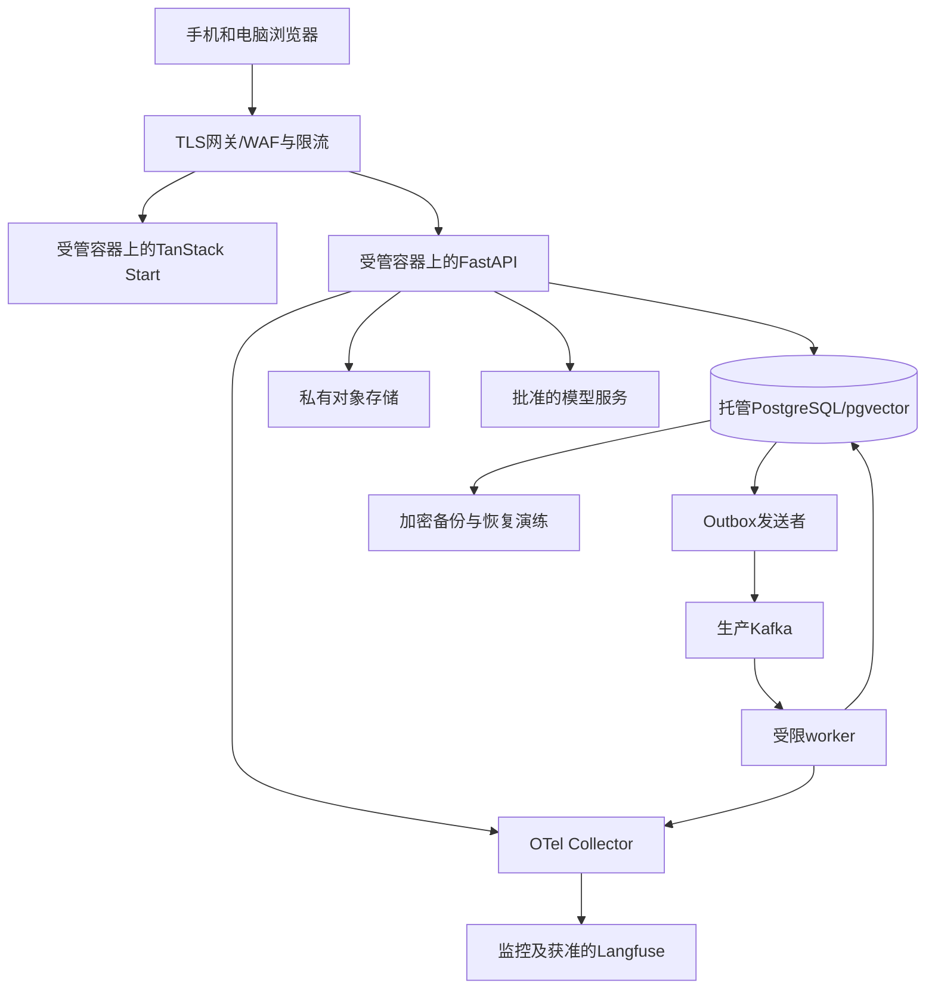
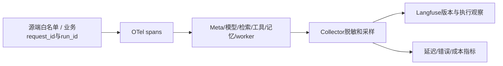

# 阶段5｜技术方案与实施计划

> 当前按[内部实验执行约定](../../EXPERIMENT.md)推进：支持通过指定 HTTPS 地址分享；注册登录后直接进入，不设年龄、用途确认或资格审批入口，不设固定业务保存期限。支持、记忆、画像、内部评测与优化按版本化实验默认配置开启，各功能仍按所属 STEP 实现。

> 整合修订：2026-09-20｜规划文档；产品未实现，业务验收未执行。
> [项目导览](../../README.md) · [阶段目标](01-阶段目标与功能设计.md) · [技术方案](02-技术方案与实施计划.md) · [测试验收](03-测试与验收标准.md) · [分步实施](04-分步实施与检查清单.md)

尚未实施。参考S01生产和持续评估要求，S02 V38–V47/V53/V62–V63、原版复用R12/R14。源码与运行实现路径均为建议新增。

## 权限、管理和数据请求

新增建议 `frontend/src/features/workbench/`、`backend/app/{operations,evaluation,data_requests}/`、`infra/`与 `backend/tests/eval/`。不将管理角色简化为“能看所有数据”。

角色矩阵：student只访问本人；content_editor/reviewer/publisher访问内容；support_operator只访问反馈及另行授权资料；evaluator只访问指定评价集；release_operator可发布已批准版本；ops_operator看脱敏运行与基础设施。其中内容reviewer是人工审阅角色，不是阶段5A的Reviewer Agent；后者不继承内容发布或研究审批权限。特别访问私人资料须有用途、范围、时限和审计记录，不能仅靠“管理员”标签。

新增表：`data_requests(kind,owner,scope,status,source_versions,result_ref,expires_at)`、`support_tickets`、`ticket_events`、`role_assignments`、`access_audit`、`evaluation_datasets/versions/cases/results`、`release_records`、`deletion_ledger`。删除任务增加只存哈希的tracking_token_hash和tracking_expires_at。任务沿用background_jobs，日志不得保存可恢复原文的无期限副本。

| 方法/路径 | 请求 | 输出、鉴权与错误 |
|---|---|---|
| POST `/api/v1/data-exports/preview` | 类别、日期、来源范围、格式 | preview_id、包含/排除项、source_versions、敏感提示；本人可见资料才纳入 |
| POST `/api/v1/data-exports` | preview_id、expected_version、Idempotency-Key | 202 request_id/job_id；来源变化409需重新预览 |
| GET `/api/v1/data-requests/{id}`；GET `/api/v1/data-exports/{id}/download` | 无 | 状态/有效期或本人鉴权下载；每次下载重查源版本/状态/授权；未ready409，失效或过期410，不可见404 |
| POST `/api/v1/data-requests/{id}/cancel` | expected_version | 当前状态；已完成不假称已撤销下载 |
| POST `/api/v1/account-deletion/preview`；POST `/api/v1/account-deletion` | scope；preview_id/version | 范围预览或deletion_id及只读状态回执；实际提交撤销普通登录和写入权限 |
| GET `/api/v1/deletion-status/{id}` | 请求头携带仅限本任务的状态回执，不放URL | 仅返回处理步骤和剩余项；无原始记录或用户资料；回执无效403、过期410、限流429 |
| GET `/api/v1/feedback`；GET `/api/v1/feedback/{id}` | status/cursor | 本人工单和处理说明 |
| POST `/api/v1/feedback/{id}/responses` | decision(provide/decline)、provide时的text、expected_version、Idempotency-Key | 本人仅在need_info时补充或拒绝；生成event并回in_review，冲突409；不附整段会话/原始记录 |
| GET/PATCH `/api/v1/admin/feedback/{id}` | 处理状态、可见说明、expected_version | 仅support角色获准范围，更新和审计同事务 |
| POST `/api/v1/admin/evaluations` | dataset_version、system_version、profile、budget | job_id；无数据用途或版本未冻结403/409 |
| GET `/api/v1/admin/evaluations/{id}` | 无 | 结果、失败分母、成本及证据引用 |
| GET `/api/v1/admin/operations` | 时间窗口、有限维度 | 聚合指标；观测不可用503，不输出假零 |

状态回执为不可猜测的随机凭据，服务端只存哈希，范围锁定为一条删除任务的只读状态；不重新授予普通身份。状态回执默认保留至删除任务及实际备份清理完成；不以固定保留期限审批阻塞发布，凭据失效规则与业务保存分开。丢失/过期的回执走明确的支持核对流程，不以公开任务ID提供私人状态。凭据不进入URL、日志或分析事件。

服务端导出包登记artifact_sources和对象引用。生成前、标记ready前、每次下载前重查来源；源删除/撤权后将包标invalidated、撤销下载并排队清理对象及缓存。取消为cancelled，不能在迟到任务完成时重新ready。对象历史版本按备份保留安排处理并显示剩余项；不提供绕过API核验的长期直链。

### API与后台权限

沿原admin/evaluations、operations、versions、data-exports/deletion和5A运行详情接口。新增 `POST /api/v1/admin/evaluator-versions`（只calibration_operator）、`POST /api/v1/admin/evaluator-versions/{id}/approve`（独立approver）登记校准证据；普通evaluator只运行获准版本，优化器不能调用批准接口。版本未冻结409、无权403、schema错误422。最终测试接口仅受限evaluation_service执行，用户页面/生成器均不暴露答案与明细。

## 生产部署与恢复设计



目标是受管容器、托管数据库/对象存储、生产Kafka和模型服务；供应商/地区待资源与数据条件评估后形成ADR。开发Compose不称最终生产；Kubernetes不是默认前提。Start和FastAPI分别部署但业务只有FastAPI一个数据入口。

镜像锁依赖、非root运行、最小权限与资源限额；健康/readiness/graceful shutdown分开。共享HTTP/DB连接池有并发、deadline和背压，长流需验证网关不缓冲且取消可传达。Secrets通过生产密钥管理，不进入前端bundle、镜像层或示例文件。

当前实验不要求备份保留期限或导出TTL审批，不因未配置期限阻塞交接；实际启用备份时验证恢复与删除一致性。删除留痕不能只有随数据库快照一起回退的表：使用既定私有对象存储的独立追加式清单，保存最少对象ID/范围、请求ID、状态回执哈希/有效期和可核对水位，不存正文，不随数据库恢复覆盖。对外确认删除请求已接受前取得该清单的持久化确认；失败不能声称请求已完整受理，保守停止相关访问并显示待处理。业务表与外部留痕按请求ID幂等对账；恢复缺失任务行时可由该清单重建最少状态及回执验证信息。

恢复到隔离环境时获取独立于旧快照的最新删除清单，核对水位/完整性后应用到数据库、对象与任务，再验证旧token失效、已撤回内容不可见、导出副本不可取、任务不会重放副作用，最后才允许接流量。不能取得完整最新清单时保持隔离，禁止用旧快照内的旧清单代替。记录实测恢复耗时和可恢复点，不用备份任务“成功”代替恢复通过。

<a id="aud-11"></a>
## 观测与费用



W3C trace ID与业务request_id分开。标签限有限维度，user_id/session_id不用作高基数指标标签。模型、摘要、提取、embedding和评价调用统一计账；未知usage标unknown，不能当零；父子预算不重复累加。观测出口故障不能阻塞学生对话，必须背压/丢弃低优先信息并报警。

Langfuse优先评估正式托管且仅传获准脱敏数据；若自托管，按官方实际组件（web/worker、数据库、ClickHouse、Redis/Valkey、对象存储等）预算，不把装SDK当部署完成。此版本与供应商条件需实施时核验，未完成前禁止上传真实私密trace。

向阶段5A交接同一run/trace/correlation关联、父子费用与取消合同；5A会扩展角色维度和Artifact引用，继承脱敏、用途和正文访问限制。run墙钟latency不等于并行角色latency之和；观测数据不能成为脱离授权/删除的第二份私人资料。

<a id="observability"></a>

### OTel/Langfuse源端最小采集与真实计费

在采集源端使用属性白名单，默认不采prompt、reply、原始Tool参数/结果、画像、CoT、cookie/token/密钥。Collector再过滤作为第二道控制，不先全量上传再脱敏。span关联request/run、job、Artifact ID与版本、模型/工具名、policy/graph/evaluator和stop_reason；这些ID可用于受权trace查询但不作为无限高基数metrics标签。重放授权不能被Langfuse链接绕过，元数据保留期限和源删除关系须登记。

分别记录首个允许状态耗时、首个已批准正文耗时、run从start到终态墙钟耗时、HITL等待/活跃执行、角色/Provider调用时长；并行span之和不冒充端到端延迟。token/price_version/currency/usage_source及estimated/actual/unknown分列；内部预算账本才是执行依据，Langfuse不是计费/权限主存。观测出口失效用有界缓冲/丢弃低优先遥测并报警，业务安全审计留必要持久证据；不得用“采样丢弃”丢掉审批/预算收据。

验收S5-A08；回退关闭外部观测导出并保留获准本地元数据，不放宽隐私或用假零填报。学生端只显示“核对来源”等自然状态，不显示Agent品牌/内部推理。

## 质量与Meta评价合同

用例包含case_id、来源/许可、是否合成、允许用途、场景类型、预期支持方式、允许资料/工具、禁止行为、评分版本及split。评分维度至少为理解贴合、事实与感受区分、建议适切、用户自主性、主动关心分寸、事实证据和安全边界；每维0/1/2分别锚定失败/部分/满足，并保留具体理由和分歧。

确定性检查覆盖权限、删除、工具、Schema、预算与引用状态；人工评价支持质量；经校准的LLM Judge仅补充，Ragas只用于适用的检索指标。既有Source测试不进入成绩表。Meta指标单独报告选择正确率、不必要调用率、停止正确率、P50/P95耗时、费用及严重失败，不用单一平均分掩盖异常。

质量阈值依据阶段1固定基线及审阅意见在评估前冻结；没有阈值、评分版本和分母不得放行。所有严重越权/泄露/不可回退错误为硬失败。验证使用实际受控装配，区分fake/recorded/live；真人心理收益必须另立研究协议。

阶段5A专项Eval继承本节固定评分器与数据划分，在同数据、模型族、工具/资料权限和预算口径下比较MA-A Support、MA-B Support+Reviewer、MA-C三角色、MA-E Support+Evidence，授权记忆分层增加MA-D。单Support保留现有RAG，不削弱基线。组合准入独立于“是否采用Multi-Agent”决定；不合格组合关闭，不取消已确定的目标。Reviewer的角色意见不能替代evaluator；5A工程初始计数上限及未配token/cost/deadline不启动的规则见其02。

### 数据划分和独立评测服务

EvaluationService使用独立账号，只接收候选hash、获准dataset snapshot与固定EvaluatorVersion；优化器不能指定新的评分prompt或接触holdout。数据采用D_dev（失败分析/生成）、D_select（候选选择）、D_safety（固定安全回归）、D_final（封存最终审计）；另锁D_time（时间外）和D_transfer（新主题/新用户/不同模型）用于事前协议。合成身份不是随机拆消息的借口，同一场景模板族/用户/来源会话及近重复必须同一split；按用户隔离并保留未来时间验证。

敏感原文可见域与研究去标识域分离；替换姓名不等于匿名化，罕见事件/时间/地理组合需人工风险检查。不给学校导出个人状态。来源撤回或许可改变使dataset snapshot和相关候选资格失效，不能继续沿旧hash运行。

### 双向指标合同

| 证据方向 | 指标与方法 | 不能推出的结论 |
|---|---|---|
| 用户状态 | 每维precision/recall/FPR/FNR、混淆、unknown/覆盖率、冲突比例、更正率；人工标注产品适配证据而非临床诊断 | 高频/称呼/夜聊不是gold依赖标签；自评也不是无误真值 |
| 识别校准 | 双语义标注、中文反讽/引用/方言/情境；按自愿合规亚群分层；若输出概率才做Brier/校准曲线 | 未校准LLM confidence不当概率；小亚组不足不宣称公平 |
| Agent行为 | 支持有效性、自主性、关系边界、反迎合/事实、状态适配、现实行动、干预体验、安全/隐私；逐维0/1/2锚点＋hard failures | 点赞、时长/留存和检测分下降不当质量奖励 |
| 用户反馈校正 | 帮助度、被误解、提醒负担、选择控制感；允许不答 | 不答不等于不满意；偏好迎合不能豁免反迎合规则 |
| 纵向观察 | 用户认可目标帮助、自主应对、生活影响、打扰、不良体验及失访；分别报告基线/曝光/随访来源 | 固定历史重放没有反事实用户轨迹，失访不是改善 |
| 工程和组合 | 引用正确率/应引未引、groundedness、严重/权限/Tool错误、不必要Agent调用、Reviewer修正/误拒、token/cost/P50/P95/failure | 角色总latency之和不是run墙钟耗时；unknown费用不是0 |

规则检查、校准模型Judge、获授权人工盲评及用户反馈独立记账。人工至少双人独立标注关键先导/争议集再裁决，报告类别一致性（如κ/α，稀有类别另报原始一致率）和连续/有序分数一致性；模型更换/顺序交换/长度控制用于检查偏好。同一模型生成与自评不作唯一裁判，不同模型也可能共享偏差。

EvaluatorVersion(kind=dependency/behavior/outcome/final)由G冻结，变更须新校准集、盲评一致性、亚组误差、旧新双跑和审批；历史结果仍绑旧版，不能混合版本排序或让候选自己改rubric。版本固定只是可比条件，不是无偏证明。

### 多目标接受和统计门禁

先筛所有硬安全/权限/删除/预算/schema失败，再比较支持质量、自主性、用户行动帮助、干预负担和成本的非支配关系。检测出的依赖分、排他语句、聊天/回访/留存、用户付费均不作为最大化目标；也不奖励“检测分下降”。真实生活效果未有合法研究时不能伪造为优化标签，离线只用明确标注的支持行为代理。

主要比较及效应最小值δ、非劣界限Δ、显著性/置信水平、分层和多重比较族由G在正式评价前冻结；来源为专业判断＋独立先导方差/可接受负担，未定不放行。建议采用配对质量差及用户/场景族聚类bootstrap区间；稀有严重事件给事件数与适用的精确区间，零观察不证明零风险。多候选选择用D_select，正式主比较可采用事前Holm校正；不得事后重挑最有利维度。统计细节见[研究统计规范](../阶段7/02-技术方案与实施计划.md#research-statistics)。

### 阶段5与5A交接

阶段5交付独立评分、数据/split和校准版本；角色实现、Artifact、预算及固定MA组合统一由[阶段5A](../阶段5A/02-技术方案与实施计划.md#ma-evaluation)维护。RSI-S5-T06/T07是5A工作包映射，须在阶段5基础交接后执行；阶段5的RSI-S5-A06/A07在5A交付时联合验收。

<a id="evaluation-execution"></a>

### 独立Eval作业、数据与评分版本

S5-T03只扩展既有EvaluationService/case runner；细化双向指标与校准见[双向指标与校准](02-技术方案与实施计划.md)，统计唯一详规见[研究协议](../阶段7/02-技术方案与实施计划.md#l2-protocol)。不建第二评价器/身份系统。

作业入口冻结case/schema、dataset_snapshot、source/purpose/grant/实验配置版本、split_manifest、candidate hash、VersionBinding、EvaluatorVersion、预算与访问额度，并记录fake/recorded/live证据域。规则、人工、Judge、Ragas结果分列；Reviewer意见不是独立真值。人工关键/争议集双人独立盲评后裁决，保留分歧/顺序和长度偏差。生成器只获允许的dev/select反馈，不得请求final；一次锁定终评作业按job_id/protocol_hash去重，重试不重复扣放访问额度或把未知结果当pass。

来源撤回使snapshot及派生候选失效；评分版本/Provider漂移暂停或另立协议，不能混分排序。作业取消和迟到结果不得晋升；费用未知不报等成本优势。PR只用fake/recorded合成输入且无敏感材料/模型出口；真实Provider/Judge/Ragas作业独立显式触发且先有预算和数据用途。

S5-A08核对观测与并行耗时；S5-A09核对隔离恢复后删除/撤权最新水位、失效会话/导出/事件正文及旧generation；S5-A10核对独立Eval/CI与资格；S5-A11仅Redis触发后执行。代价为评分/人工与恢复演练，失败保持原批准策略、暂停晋升；远程服务未实际发布时不标已发布。

<a id="aud-12"></a>
## CI、发布与回退

CI顺序：锁依赖校验→Ruff/mypy/pytest→前端类型/行为/构建→API与SSE契约→关键身份/删除/恢复回归→镜像/SBOM/漏洞和许可证扫描→预发布真实链路。仅满足实际变更风险所需检查，不以大量无意义镜像测试充数。

发布记录绑定模型、提示、图、检索、记忆策略、前后端和schema版本。数据库变更向后兼容，破坏性迁移另有准备与回退方案。受控小范围发布保持运行内版本固定；回退停止新版本分配，不把数据库恢复旧快照来抹掉用户新记录。

<a id="delivery-recovery"></a>

### CI部署与删除水位恢复

阶段1最小PR门禁只使用合成资料、fake/recorded模型和无生产凭据的数据库；锁依赖检查、Python lint/type/test、前端type/lint/行为、API/SSE合同和关键确定性Eval必须可本地重复。实际托管在GitHub才用GitHub Actions，否则复用同一命令于现有私有CI；不得为了Actions另建公开仓库。真实Provider/Ragas/LLM Judge评测用独立显式触发、批准预算与受限数据作业，不在每个PR自动收费；PR来源不能访问生产密钥或受限语料。

阶段5扩展OCI镜像版本、非root/资源上限、环境配置schema、存活/就绪/优雅关闭、网关SSE、依赖故障、备份恢复和回退。本地开发默认Windows/WSL进程，前端使用实际pnpm脚本、FastAPI通过uv启动开发reload，Worker独立运行；Compose默认仅PostgreSQL。API导入/reload不得启动消费者，应用容器仅用于CI、生产或明确选择的隔离流程。Kafka、对象存储及观测服务按真实消费者启用。健康检查不以真实付费模型调用探活，也不只看进程active。

迁移采用expand→兼容应用→回填/校验→切换→另批contract；实际数据库/驱动/pgvector版本由托管支持矩阵确认。Alembic autogenerate/check只辅助发现差异，不证明数据转换安全。应用回退只切镜像和兼容策略指针，不能默认执行破坏性downgrade或恢复旧DB覆盖用户新数据。备份恢复沿原独立删除清单、水位、旧授权/导出失效及隔离放流量门禁；RPO/RTO未验证不得声称恢复就绪；不设固定业务TTL。

验收S1-A13、S5-A09/S5-A10；回退维持上一兼容应用、只读/停新写模式按故障性质选择，保留用户数据。交付价值是受控发布和恢复runbook＋真实演练证据，而非“使用Docker/GitHub”列表。

## 任务顺序

| 任务 | 优先级/前置 | 功能 | 产出/验收 |
|---|---|---|---|
| S5-T01 <a id="s5-t01"></a> 冻结角色与数据用途 | P0/阶段4 | F-OPS-001、F-DATA-002 | 权限矩阵、保留期限待决表、访问审计；S5-A01 |
| S5-T02 <a id="s5-t02"></a> 建数据请求与反馈页面 | P0/T01 | F-DATA-002、F-FEEDBACK-001 | 预览、导出、删除状态、工单闭环；S5-A04/S5-A06 |
| S5-T03 <a id="s5-t03"></a> 建统一评价合同与装配 | P0/阶段4 | F-EVAL-001 | 数据/评分版本、Meta专项、人机评价界限；S5-A02 |
| S5-T04 <a id="s5-t04"></a> 接观测与费用 | P0/T01,T03 | F-OPS-001 | trace与指标、脱敏、失败出口和成本台账；S5-A03 |
| S5-T05 <a id="s5-t05"></a> 完成云端部署与恢复 | P0/T01,T04 | F-OPS-001 | ADR、CI、网关流、备份恢复、版本回退；S5-A05 |
| S5-T06 <a id="s5-t06"></a> 汇总试用准备证据 | P0/T02–T05 | 全阶段 | 技术就绪/外部前提/授权分表；S5-A07 |

不承诺固定资源价格、并发和工期；先依据已测负载和可用预算决定规模。下一阶段5A继承独立评价、数据权限、预算硬上限和发布门禁，增加角色图、Artifact和组合准入；之后阶段6优化器同样不获得修改这些外部条件的权限。

### 任务与回退

增量任务按下表登记；原S*-T*含义保持，页内Txx为本阶段基础任务的局部简称。M/L包，先关闭真实试用外部前提，不以部署工具可启动替代生产证据。评估器失效时暂停候选晋升，线上回固定安全版本；5A不合格组合关闭，不取消正式架构方向。

<a id="increment-tasks"></a>

### RSI任务与基础任务映射

| 增量任务 | 原任务关联 | 依赖 | 功能与接口/实体产出 | 验收引用 |
|---|---|---|---|---|
| RSI-S5-T01 <a id="rsi-s5-t01"></a> 冻结权限、分割与合法数据 | [S5-T01](02-技术方案与实施计划.md)、[S5-T03](02-技术方案与实施计划.md) | 本阶段前置门槛 | U13；dataset_snapshot/split/source资格 | [RSI-S5-A01](03-测试与验收标准.md)、[RSI-S5-A05](03-测试与验收标准.md)；共同S5-A08、S5-A09、S5-A10、S5-A11 |
| RSI-S5-T02 <a id="rsi-s5-t02"></a> 校准Assessor与行为盲评 | [S5-T03](02-技术方案与实施计划.md) | RSI-S5-T01 | U13；11维/8维rubric、一致性和分歧 | [RSI-S5-A02](03-测试与验收标准.md)、[RSI-S5-A03](03-测试与验收标准.md)；共同S5-A08、S5-A09、S5-A10、S5-A11 |
| RSI-S5-T03 <a id="rsi-s5-t03"></a> 接独立Eval与版本 | [S5-T03](02-技术方案与实施计划.md) | RSI-S5-T02 | U13；EvaluatorVersion/校准与批准接口 | [RSI-S5-A03](03-测试与验收标准.md)、[RSI-S5-A05](03-测试与验收标准.md)、[RSI-S5-A10](03-测试与验收标准.md)；共同S5-A08、S5-A09、S5-A10、S5-A11 |
| RSI-S5-T04 <a id="rsi-s5-t04"></a> 接工作台与删除恢复 | [S5-T02](02-技术方案与实施计划.md)、[S5-T04](02-技术方案与实施计划.md)、[S5-T05](02-技术方案与实施计划.md) | RSI-S5-T03 | U13/U14；operations/data-requests/deletion_ledger | [RSI-S5-A04](03-测试与验收标准.md)、[RSI-S5-A08](03-测试与验收标准.md)、[RSI-S5-A09](03-测试与验收标准.md)；共同S5-A08、S5-A09、S5-A10、S5-A11 |
| RSI-S5-T05 <a id="rsi-s5-t05"></a> 执行基础治理验收 | [S5-T06](02-技术方案与实施计划.md) | RSI-S5-T04 | U13；CI、隔离恢复、独立资格证据 | [RSI-S5-A01](03-测试与验收标准.md)、[RSI-S5-A04](03-测试与验收标准.md)、[RSI-S5-A05](03-测试与验收标准.md)、[RSI-S5-A08](03-测试与验收标准.md)、[RSI-S5-A09](03-测试与验收标准.md)、[RSI-S5-A10](03-测试与验收标准.md)；共同S5-A08、S5-A09、S5-A10、S5-A11 |
| RSI-S5-T06 <a id="rsi-s5-t06"></a> 实施正式5A角色/Artifact/预算（5A承接） | [S5A-T01](../阶段5A/02-技术方案与实施计划.md)、[S5A-T02](../阶段5A/02-技术方案与实施计划.md)、[S5A-T03](../阶段5A/02-技术方案与实施计划.md)、[S5A-T04](../阶段5A/02-技术方案与实施计划.md) | RSI-S5-T05 | U14；阶段5A角色合同、同一run账本与恢复 | [RSI-S5-A07](03-测试与验收标准.md)；共同S5-A08、S5-A09、S5-A10、S5-A11 |
| RSI-S5-T07 <a id="rsi-s5-t07"></a> 执行固定MA对照与回退（5A承接） | [S5A-T05](../阶段5A/02-技术方案与实施计划.md)、[S5A-T06](../阶段5A/02-技术方案与实施计划.md) | RSI-S5-T06 | U14；MA-A/B/C/E与合资格D、路由准入 | [RSI-S5-A06](03-测试与验收标准.md)、[RSI-S5-A07](03-测试与验收标准.md)；共同S5-A08、S5-A09、S5-A10、S5-A11 |

以上均为未来实施任务，未执行。工作包规模不作工期或性能承诺。

<a id="conditional-redis"></a>

<a id="aud-05"></a>
## 应用Redis的条件与退出

只有跨实例限流或可重建公开资源查询缓存存在测量瓶颈时，再评估Redis。优先不缓存私人正文/profile；必要派生缓存键至少含owner隔离、purpose、source/grant版本、generation和策略版本，命中也重验可用性，TTL不替代撤回/删除。Redis不拥有run/job/consent/budget权威状态；额度权威仍由DB或G预算服务保证，不能Redis丢键就恢复额度。

只用Redis临时速率桶不代表业务授权。故障时可选缓存回源且受背压；无法保证模型调用硬限时停止新增付费调用并给已审说明，而非fail-open。回退关闭cache消费者、清理命名空间，不回滚业务DB。Langfuse自托管需要的Redis/Valkey属于观测部署依赖，不能因此共享应用私人缓存、session或任务队列。未来选Redis具体版本时审其许可与服务形态，不沿用“全部BSD”假设。条件验收S5-A11，不因未引入Redis阻塞阶段1。

## 实施前待补证据

| 待补事项 | 缺失证据 | 当前采用方式 | 影响范围 |
|---|---|---|---|
| 实验责任与操作权限 | 独立评测/预算/发布身份及可追溯执行收据 | 无证据不声称功能已完成，不承诺值守或转介 | 以工程验证为交接条件；无年龄、真人告知、公众资格和期限审批前置 |
| 云、备份、RPO/RTO与CI托管 | 实际服务/地区/许可、恢复和删除水位证据 | 无云账户假设；Compose只是开发；不碰生产 | 阶段5真实部署/恢复验收 |

## 任务表与执行步骤的关系

基础任务和RSI任务编号用于追溯，父任务关联不等于必须等待父任务全部结束。合并后的实际顺序、局部完成条件及交接见[分步实施清单](04-分步实施与检查清单.md)。同一任务的合同、实现与验证可跨步，须所有相关步骤及用例完成才能记整项通过。

<a id="entity-contracts"></a>
## 本阶段核心逻辑实体与合成片段

共同字段、类型、枚举及VersionBinding由[共同合同](../阶段1/02-技术方案与实施计划.md#shared-contracts)统一维护。下表仅列专属字段；复用既有表/注册表，不新增第二份事实库。

| 实体 | 专属字段/枚举与关联 | 隔离、敏感性和删除关系 |
|---|---|---|
| EvaluatorVersion | kind=dependency/behavior/outcome/final、rubric_hash、model_ref、calibration_dataset、human_agreement、bias_audit、approved_by、status | 只G校准/审核可登记新版本；L1/L2只读，依赖评估器也不能自改阈值 |

以下为合成payload片段，不是可直接提交或持久化的完整对象；服务端必须补全共同封套并按状态校验。null预算、未批准evaluator、缺失画像来源版本均不能作为可运行/可持久化状态。示例不代表已执行验收。

```json
{
  "EvaluatorVersion": {
    "id": "behavior-demo-v1",
    "kind": "behavior",
    "status": "draft",
    "human_agreement": null,
    "approved_by": null
  }
}
```

<a id="original-reuse"></a>
## 原版开源证据与逐项复用

原版复用R编号来自原总体第9节，与RSI研究R编号分域。固定快照为2026-09-17历史静态核查，未运行；复制前核源码、许可与升级差异，完成本项目装配后才能称可用。目标代码路径为建议，不代表当前存在。

| 仓库 | commit | 已读关键文件和证据边界 |
|---|---|---|
| [SoulChat2.0](https://github.com/scutcyr/SoulChat2.0/tree/13ec529c9e3851eacbbf09bec9029621ac40e773) | `13ec529c9e3851eacbbf09bec9029621ac40e773` | 推理演示的用户目录、JSON 会话保存/重命名、数据描述、训练配置和 README 评价描述；评价结果属于作者报告，本轮未核实为可直接运行的评测器 |

| 采集项与用户操作 | 页面—接口—数据证据 | 状态、缺口及外部依赖 | 分类与决定 |
|---|---|---|---|
| SoulChat 会话历史、评价维度 | `infer_demo/soulchat2.0_app.py`；README 的谈话技术/态度/关系/技术维度 | 会话代码已核实，未运行；评价结果仅文档声明，数据卡权限未能核实 | B，历史设计和评价研究参考 |

| R编号/来源定位 | 目标功能与方式 | 保留、修改、依赖及许可要求 | 目标路径/阶段/验收 |
|---|---|---|---|
| R12 SoulChat `infer_demo/soulchat2.0_app.py`、README评价部分 | F-CHAT-002/F-EVAL-001，交互/研究参考 | 代码Apache-2.0；保留引用、变更说明及适用NOTICE；借鉴历史与评价维度，舍弃明文日志、路径命名持久化和治疗身份；权重、数据另审 | `backend/tests/eval/`的自建场景；1/5；S1-A04/S5-A02 |

分类A真正新增、B原有增强、C实现替换、D重复能力、E暂缓；分页和视图不另计功能。

CBT/PsyChat/Loyal/LangMem根LICENSE均已读为MIT；Sage `frontend/LICENSE`为MIT，后端包声明ISC，不能互相替代。SoulChat/Mem0根为Apache-2.0。SoulChat模型README另说明科研用途及基座协议；数据和模型卡的ModelScope网页在本轮未返回可核读正文，未据此授权使用。PsyChat案例文件、CBT知识材料和第三方图/音频/字体的独立许可未完整核实，初始内容采用团队自建且经审阅材料。许可不清不以“网上公开”代替授权。

<a id="research-sources"></a>
## RSI研究来源与官方实现边界

RSI研究R编号来自升级总体第3节；不同于原版复用R编号。访问/静态核查截止2026-09-17，以下性能与实验数字均为作者报告，本项目未独立复现；本次未重新核验网页或许可证。

| ID / 标题及作者 | 首次公开 / 最新arXiv修订 | 状态 / 访问日 |
|---|---|---|
| <a id="r09"></a>R09 [Generalized Agent Iteration: One Formal Framework for Iterative Policy Improvement and Recursive Self-Improvement](https://arxiv.org/abs/2609.13406)；Tang, Hongyao、Ma, Yi、Li, Pengyi等 | 2026-09-11 / 2026-09-11 | 概念/形式框架预印本；2026-09-17 |
| <a id="r11"></a>R11 [How AI and Human Behaviors Shape Psychosocial Effects of Extended Chatbot Use: A Longitudinal Randomized Controlled Study](https://arxiv.org/abs/2503.17473)；Fang, Cathy Mengying、Liu, Auren R.、Danry, Valdemar等 | 2025-03-21 / 2025-10-02 | 预印本v2；本轮未核到同题正式期刊版本；2026-09-17 |

| ID | 优化对象/反馈 | 实验条件 | 失败与局限 | 项目关联 |
|---|---|---|---|---|
| R09 | 区分改进机制是否可变、评价基础是否外部锚定 | 形式分析与既有系统定位；无本项目适用的性能实验证据 | 定义不提供可达性、复杂度、收敛或安全保证 | G外部锚定；拒绝自洽即有效的论证 |
| R11 | 用户使用、主观状态及Agent行为；随机分配模式/话题 | 4周、981人、九条件；伦理/预注册及偏离说明见补充方法 | 自选时长与结果关联不具有随机化因果解释；成人平台样本非中国大学生阈值；失访不能当改善 | 双向＋纵向观察、随机条件与自然使用分开 |

| 仓库 / 固定commit / commit日期 | 已读模块 | 许可及复用决定 | 边界 | 适配规模 / 替代 |
|---|---|---|---|---|
| [scutcyr/SoulChat2.0](https://github.com/scutcyr/SoulChat2.0/tree/13ec529c9e3851eacbbf09bec9029621ac40e773)<br>`13ec529c9e3851eacbbf09bec9029621ac40e773`<br>2025-09-29T09:05:25Z | infer_demo/soulchat2.0_app.py; README.md; LICENSE | 代码Apache-2.0；权重/基座/数据另审；**仅参考思路** | 历史会话与谈话质量维度；不移植治疗身份、明文会话目录或训练语料；README效果属于作者报告 | S：场景/评分锚点2类；自建合成反例与独立人工rubric |

R01未核到作者官方代码；R06未核验官方代码包；R09为形式框架；R11/R12不复制参与者数据。代码许可证不覆盖第三方模型权重、训练集、量表题项、图片/音频；未核清者禁止复制进入产品。依赖实读示例：GEPA有Litellm等离线依赖，LangMem声明LangGraph版本范围，SageMate是Next.js/Express/Mongoose；均需将来隔离锁版本验证，不能凭声明范围声称兼容。

许可证补充：R01未核到官方实现/代码许可；R06官方代码包许可未核；R09概念工作未核官方实现；R11/R12仅合法阅读公开论文，个体数据/代码包及题项再用许可未完整核验。其余研究代码的可用性、commit和许可逐项列于§4。开放阅读、论文许可、代码许可、数据/权重许可是不同范围；本轮没有独立复现，未来可复现性仍取决于原始split、模型版本、外部服务和完整运行配置。

<a id="service-governance"></a>
## 实验应用执行与历史依据

当前执行合同是注册登录后直接进入的实验应用，可配置指定HTTPS地址分享；不要求年龄核验、用途选择、真人告知审批或公众服务资格。后续身份入口目标为先完成邮箱验证码注册，再用邮箱密码登录，并提供邮箱验证码找回及登录后改密，详见[阶段1身份合同](../阶段1/02-技术方案与实施计划.md#email-identity-target)；现有代码仍使用用户名密码。下列仅保留历史资料链接和核查日期（2026-09-17），不作为当前开发或交接条件，也不作为本次法律判断。

历史资料目录（只有项目用途另行改变时再独立核对）：
- [个人信息保护法历史来源](https://www.samr.gov.cn/wljys/gzzd/art/2023/art_3ef1e889c1e644d4b65b5f5c7f432386.html)。
- [拟人化互动服务办法历史来源](https://www.cac.gov.cn/2026-04/10/c_1777558395078289.htm)。
- 本实验保留AI身份说明、退出、删除、预算、来源与结果真实性，不新增自动联系能力。
- [伦理审查办法历史来源](https://www.nhc.gov.cn/wjw/c100375/202302/902b4a1dc3af4aba862a6387e6e376dc.shtml)。

旧年龄数据保留，新账号unknown，不推测或默认为成年，也不据年龄阻挡注册或实验功能。支持、记忆、画像、内部评测与优化按版本化配置默认开启；默认配置不是用户实际同意。

业务资料不设固定TTL或期限审批；删除、更正和来源失效按[保留合同](../阶段2/02-技术方案与实施计划.md#retention-contract)传播。保留登录安全失效、调用deadline和预算；删除、外发等重要副作用仍须确认。

<a id="threat-model"></a>
## 威胁模型与独立治理控制

| 威胁 | 外部控制与检测 | 失败处置/验收归属 |
|---|---|---|
| 论文/检索/工具输出注入 | 外部文本仅数据，schema与工具白名单在Meta固定；引用不能携带新权限 | 阻断越权，保留source ID；阶段4/5 |
| 记忆污染、错误画像固化 | 候选校验与自动保存、claim类型、来源版本/反证/更正、删除；个人库与共享技能隔离 | stale并撤回关联产物；阶段2/3 |
| 跨用户泄漏 | 服务身份/owner过滤、数据库访问策略、最小context、单例缓存禁止 | 停止相关run，追踪影响；阶段1～5 |
| 测试泄漏/近重复污染 | 用户/来源族隔离、语义去重、时间外锁箱，test只独立Eval身份可读 | 废弃受污染比较并重立未见测试；阶段5～7 |
| 伪造工具日志/评分 | 业务适配器生成带run/version的执行收据；模型自述不是完成证据；评测服务校验真实结果 | 无可信收据标未验证，不允许候选晋升 |
| 改进器篡改裁判/安全/预算 | G资源只读；独立进程/容器和数据库账号；优化器无发布/DDL/密钥/任意网络权限；外部预算代理 | 拒绝提案、暂停优化器；G可直接停止任务 |
| 无限递归/费用失控 | 层数固定L1/L2，代数/分支/并行/调用/Token/deadline有限且恢复不重置 | Controlled Stop，基线继续；阶段6/7 |
| 自我确认/评分投机/漂移 | 人工盲评锚点、不同评审不等于独立、定期一致性/亚组偏差审查；evaluator单独校准 | 阻止发布，保留争议/阴性结果；不放宽标准 |
| 学校管理滥用/画像用途扩大 | 默认仅群体汇总且小样本抑制阈值另审；禁止按学生检索依赖画像 | 无合规用途的请求403；审计访问 |

沙箱只挂载获准去标识案例snapshot与候选资产输出目录；G资产只读、无生产凭证、默认无网络，仅预算代理允许指定模型/评分接口。只读论文和仓库不执行脚本；研发测试也不得通知真实对象。保留可核验的容器/依赖/服务版本、调用收据与停止证据；代码示例和模拟结果不能伪装成运行验收。

<a id="external-evidence"></a>
## 责任分工与跨阶段外部证据

历史建议分工为鹏负责工程与代码复用核对、n7负责产品/实验协议与结项口径、卢来佛祖协助内容文献和场景准备；这不是已确认投入或正式责任任命。专业内容审阅、数据责任、生产发布仍须明确，不能由同学身份代替专业资格。

| 待确认 | 责任角色/关闭时点 | 未关闭时的处理 |
|---|---|---|
| 鹏另有代码及可投入时间 | 工程负责人，阶段1开工 | 以本目录无代码起步；发现实现后核查再复用 |
| 模型、供应商数据保留与预算 | 产品/数据/工程，任何真实资料调用前 | 只用合成资料；开发版本锁定并记录费用，不宣称第三方已删除 |
| 心理内容审阅和现实支持有效性 | 内容负责人，阶段1真实试用前 | 未审内容不对真实学生开放；联系方式不编造 |
| 实验入口与默认配置 | 工程，STEP03及后续消费者 | 当前用户名密码入口；目标为邮箱验证码注册后自动进入、日常邮箱密码登录和密码找回/改密；无年龄或用途审批；版本化默认配置与历史决定分开 |
| 数据/媒体/案例许可 | 内容与工程，复制或入库前 | 不搬未知资产；保留源代码许可声明与改动清单 |
| 指定Origin、备份恢复、容量与SLO | 工程，真实能力接入时 | 域名和证书通过配置；不新增云平台或固定保留期限审批；实际发布单独记录 |

验收记录必须带版本、输入、环境、执行日期、实际输出和未解决问题。UI提示、模拟输出、库自带测试不能代替真实后端验证。内部文档检查不代表心理专业验证或公开上线许可。

| 待验证/待负责人决定 | 当前默认和未完成范围 | 关闭条件 |
|---|---|---|
| 产品源码与人员 | 现目录无可运行产品；未获得鹏外部仓库 | 提供真实仓库/锁依赖/运行证据后再做映射，不按旧计划认定完成 |
| 模型/成本/地区 | 保留既定栈，离线文本与合成资料；权重固定 | G批准模型数据条件/价格/硬预算，隔离兼容验收 |
| 中文校准与策略门槛 | [本阶段待核证据](../阶段2/02-技术方案与实施计划.md#source-pending) | 按所属阶段核验，不阻塞无关合成工程检查 |
| 实验能力与现实支持 | 未实现能力不展示可用入口，不承诺救援或自动联系 | 核实已实现功能与实际内容来源，不设公众资格或年龄审批 |
| L1/L2研究效果 | [本阶段待核证据](../阶段7/02-技术方案与实施计划.md#source-pending) | 按所属阶段核验，不阻塞无关合成工程检查 |
| MetaSkill实现与素材许可 | [本阶段待核证据](../阶段7/02-技术方案与实施计划.md#source-pending) | 按所属阶段核验，不阻塞无关合成工程检查 |
| 外部研究复现 | [本阶段待核证据](../阶段7/02-技术方案与实施计划.md#source-pending) | 按所属阶段核验，不阻塞无关合成工程检查 |

<a id="observability-sources"></a>
## 观测与条件缓存来源

| 来源 | 历史核验记录及适用范围 | 对应合同 |
|---|---|---|
| [Redis许可证](https://redis.io/legal/licenses/)、[Langfuse自托管](https://langfuse.com/self-hosting) | Redis许可按版本变化；8+列RSALv2/SSPLv1/AGPLv3选项。Langfuse自托管含Web/Worker、PG、ClickHouse、Redis/Valkey与对象存储 | 区分观测系统内部Redis与应用缓存选型；不以SDK已装替代部署/许可审核 |
| [OTel敏感数据](https://opentelemetry.io/docs/security/handling-sensitive-data/) | 属性白名单与过滤等控制，仍须源端禁采正文 | [观测合同](#observability)，不以事后脱敏替代授权 |

[Langfuse架构](https://langfuse.com/handbook/product-engineering/architecture)为历史选型参考；服务组件与许可须按实际版本核验。

<a id="ui-reference-contract"></a>
## UI参考落地约束

采用[本阶段图号映射](01-阶段目标与功能设计.md#ui-reference)与[统一设计基线](../UI设计图/README.md#ui-reference-policy)，视觉与交互参考不得覆盖本阶段API、状态、权限及数据合同。

S17不重建用途审批或固定业务TTL，删除仍须确认；W05角色节点属于5A增量，不据此提前实现多角色。后台角色及“申请查看”样式不授予私人正文权限，指标缺失不得填零。

沿用[阶段1前端职责与按需接入合同](../阶段1/02-技术方案与实施计划.md#frontend-stack-contract)，在既有页面与组件上按真实消费者扩展。本次仅补充设计参考，不新增接口、schema、路由或依赖，不宣称页面已实现。
