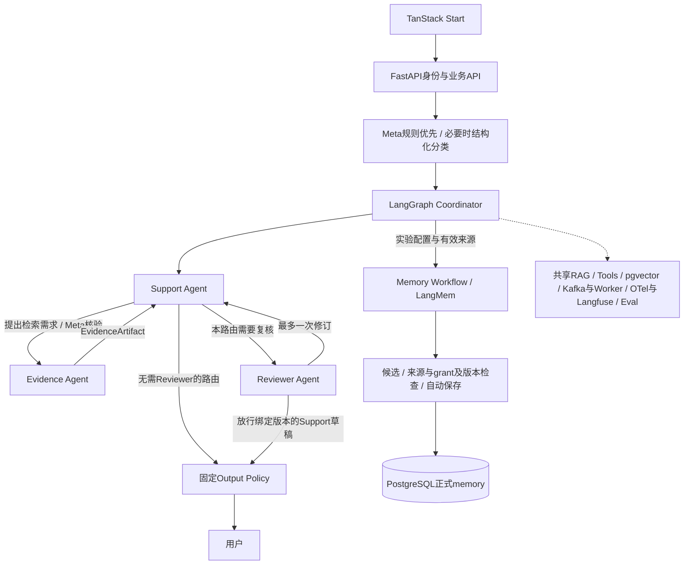

# 阶段5A｜技术方案与实施计划

> 当前按[内部实验执行约定](../../EXPERIMENT.md)推进：支持通过指定 HTTPS 地址分享；注册登录后直接进入，不设年龄、用途确认或资格审批入口，不设固定业务保存期限。支持、记忆、画像、内部评测与优化按版本化实验默认配置开启，各功能仍按所属 STEP 实现。

> 整合修订：2026-09-20｜规划文档；产品未实现，业务验收未执行。
> [项目导览](../../README.md) · [阶段目标](01-阶段目标与功能设计.md) · [技术方案](02-技术方案与实施计划.md) · [测试验收](03-测试与验收标准.md) · [分步实施](04-分步实施与检查清单.md)

2026-09-17｜拟实现合同，尚无实现或运行验收。前置为阶段5统一Eval、Trace、固定单Agent基线及阶段1～4基础能力。遵循[共同合同入口与实施证据边界](../阶段1/02-技术方案与实施计划.md#missing-sources)和本目录01、03，不替换早期运行框架。

## 唯一Runtime与Meta控制

在现有 `backend/app/agent/` 的LangGraph图中增加角色节点，复用 `memory/knowledge/tools/evaluation` 业务服务。LangGraph Coordinator指同一编译后的StateGraph，不是新增Supervisor LLM、Dispatcher或Agent Loop。LangChain承担模型/Tool/Middleware与Structured Output；条件边、Command负责显式流转；独立只读任务确需动态分发才使用Send。Checkpointer/Store沿用既有命名空间；Store或checkpoint不取得PostgreSQL业务数据的canonical ownership。

禁止因Multi-Agent引入CrewAI、AutoGen、第二套Agent Runtime、第二套workflow engine或自研运行循环；未来例外必须先有gap evidence和ADR，当前不设替代实施路线。只有当角色团队协作造成大量重复节点/状态/调度样板，或Agent间自由对话造成消息路由、轮次和终止控制的真实复杂度时，才分别建议对CrewAI或AutoGen做隔离PoC，并与当前LangGraph实现比较状态、可观测性、调试、HITL、checkpoint/resume、Tool/Memory、错误恢复、成本和测试等证据。PoC不能直接替换主线，ADR必须明确唯一最高层Runtime及各项职责归属。具体接口在实施时锁定兼容版本，参考[Graph API](https://docs.langchain.com/oss/python/langgraph/graph-api)、[Multi-agent](https://docs.langchain.com/oss/python/langchain/multi-agent)、[Interrupts](https://docs.langchain.com/oss/python/langgraph/interrupts)。文档能力不等于本项目装配通过。

**节点按需执行，并非每个run启动全部Agent。** Evidence的结果必须返回Support整合；Reviewer的放行发布的是被核验的Support稿，不是Reviewer自由生成的答复。Memory支路可复用阶段2后台任务，仍绑定来源与预算父项；不是新的存储或执行平台。

扩展既有 `MetaDecision`：

| 字段 | 固定合同 |
|---|---|
| mode、route_id、policy_version、reason_codes | 支持方式与已准入路由，原因采用有限枚举/证据引用，不保存隐含思考链 |
| allowed_agents、allowed_tools | 本run子集，不超过外部固定白名单；Memory Workflow独立用许可字段表示 |
| context_scope | 每角色的source_refs、purpose、grant_refs及版本、必要消息/拒绝约束、长度上限 |
| need_evidence、need_reviewer、review_required、allow_memory_workflow | 是否需要对应能力；固定风险规则要求的review_required不能被候选策略关闭 |
| budget、deadline、stop_reason | 总预算与角色分配、原始deadline和有限停止原因 |

输入继续来自服务端身份、任务、偏好、授权、策略版本、运行状态及资源条件。确定性规则先裁剪权限、硬安全规则和预算，必要的模型分类只提供结构化建议；分类失败采用既定保守路由。Support可返回结构化委派需求，Meta重新核验后由图流转，角色不能自行调用名单外Agent或获得新工具。无论Reviewer verdict如何，最终Output Policy仍执行固定规则。

## Typed Artifact与最小上下文

用Pydantic定义以下Artifact；新增受控的 `run_artifacts` 记录，复用 `artifact_sources` 反向来源索引。Artifact是本次运行的派生结果，不另存为正式memory。Envelope中的身份、producer、授权、版本和关联由服务端写入并验证，模型只生成获准payload。

| 公共字段 | 含义与核验 |
|---|---|
| artifact_id、artifact_type、run_id、producer | 不可混用他人run；producer为support/evidence/reviewer/memory_workflow；服务端与实际调用核对 |
| schema_version、generation、version、VersionBinding | VersionBinding沿[共同合同入口与实施证据边界](../阶段1/02-技术方案与实施计划.md#missing-sources)绑定策略、评估器、图、模型与实验配置版本；schema兼容、所属运行代次及不可变内容版本；修订新建版本，不覆盖已审稿 |
| source_refs、authorization_scope | source_refs逐项为{source_type,source_id,source_version,purpose,grant_ref}；authorization_scope绑定服务端owner、run、grant_refs的ID/version及删除状态（expires_at仅可空历史字段），遵循共同封套约束（共同封套见阶段1shared-contracts，专属字段按本节校验）；不由Artifact自报取得权限 |
| trace_id、correlation_id、parent_artifact_refs | 关联具体角色调用、交接和父版本；trace不是正文存储 |
| status、payload | complete/partial/failed/cancelled/stale；失败为有类型的错误与已完成子项，不能伪造完整成功 |

| Artifact | payload最小内容 |
|---|---|
| SupportDraftArtifact | draft_text、采用的evidence_refs、用户约束引用、待确认提案引用；正文仅候选，未通过Output Policy前不可发布 |
| EvidenceArtifact | query/任务范围、claims、逐项source_id/version/chunk及可访问引用、证据片段、provenance、evidence_sufficiency、missing_items、partial_errors；无证据明确返回不足 |
| ReviewArtifact | 被审SupportDraft的ID/version/hash，以及ReviewDecision：verdict(pass/revise/block)、failure_categories、public_feedback、evidence_refs、revision_required |
| MemoryCandidateArtifact | 既有memory_candidate_id/version、source_refs、claim_type、proposed_content、operation、target_memory_id可空；校验自动保存及更正、删除仍走阶段2业务服务 |

ReviewDecision的verdict与revision_required必须一致：pass/block为false，revise为true；格式冲突按失败处理。public_feedback是可说明的问题和修订要求，不是推理链，也不自动公开给用户。引用列表允许空但必须说明证据不足，不补造引用。Reviewer看不到某受限来源时返回无法核验，不能通过追加权限或猜测内容放行。

Support取得当前支持任务所需上下文；Evidence仅取得查询和允许检索域；Reviewer取得草稿、对应证据、必要用户拒绝及授权检查结果；Memory仅取得获准提取来源。使用每角色输入schema和服务端上下文投影，不向所有节点广播全部messages、用户档案或长期记忆。图状态显式保存Artifact引用、计数和路由；禁止跨角色共享可变全局变量。LangGraph private state并不自动屏蔽流事件，前端必须使用自己的事件白名单，禁止透传图state、角色模型流或provider事件。

每次读取、handoff、合并、输出和正式提交前重查run/generation、源版本、grant、删除与取消状态。来源变更传播至Artifact、草稿、review、摘要、checkpoint和相关导出；审稿绑定旧稿或旧证据即失效。撤权取消受影响run，迟到结果丢弃；删除按原处理状态与备份清单推进，禁止用checkpoint或trace复活正文。源已不可见时，工作台只保留获准的最少不可用标记。

## 统一预算与Controlled Stop

run持有唯一总预算账本；各角色有子分配，父项是汇总，不再重复加总为第二笔费用。以下是首轮工程默认值，非实测最优值；专项Eval前冻结profile，部署只能采用不超过外部硬上限的值。

| 限制 | 首轮默认与计数口径 |
|---|---|
| max_model_calls | 10；所有LLM和embedding请求、分类/摘要/提取、错误重试均计数；已有更低硬上限时取较小值 |
| 角色调用分配 | Support 3、Evidence 3、Reviewer 2、Memory 1、Meta及共用处理1；总和不超过10；embedding计入发起角色，未启用角色不调用 |
| max_handoffs | 8；跨角色委派和返回各计一次，Memory Workflow委派/返回也计；Meta及确定性节点不计handoff但计耗时和实际资源 |
| max_reviewer_calls / max_revisions | 2 / 1；首次复核、最多一次Support修订、最多一次复核新稿；无第二轮修订 |
| max_parallel | 2；同run最多两个活跃独立只读分支，仍受模型/工具共享连接限额 |
| token / cost / deadline | 沿用阶段5冻结profile的有限总值，并记录每角色限额；值缺失、非有限或分配越界禁止启动，不编造供应商价格和SLO |

阶段5A的对照各组使用同一总量上限；简单路由仍采用所需最少调用。profile可以在专项Eval中校准，随后经外部审批版本化；运行中的Agent、阶段6优化器和阶段7改进器不能修改硬上限。角色之间不自行借预算；Meta仅按已版本化预算策略分配，复核必需路径预留Reviewer与最多一次revision配额，子配额总和不得超过总额。

每次外部调用前原子预占调用次数、输出token/费用上界和并发位；结束按实际usage结算，取消只释放确定未发生的资源，不能抹掉已请求费用。无可信计费上界或无法保守计量时不得继续新增调用，usage标unknown并保留占用。provider调用、Tool调用、失败与重试均留实际计数；只读Tool重试沿用阶段4有限次数和同一deadline，不因角色交接重置。

预算、deadline、调用/交接/修订次数、当前策略及generation写入既有run持久状态。重启、HITL等待和resume不重置；等待过期后如需重新操作，创建新run并重新核权确认，不能偷偷续期。停止原因至少区分model_call_limit、handoff_limit、review_limit、revision_limit、token_limit、cost_limit、deadline_exceeded、cancelled、authorization_revoked、evidence_insufficient和review_failed。

超过上限即Controlled Stop：停止新增节点/调用，取消尚未完成任务，丢弃迟到输出，保留真实业务结果和消耗。存在仍有效且满足全部输出规则的Support稿时可有限输出；否则返回固定、经审阅的未完成说明及适用现实支持，不由另一次无预算LLM补救。required Reviewer失败或block不能自动降为未经复核的原稿；Evidence不足只允许明确局限、无未经支持事实的支持性回应。未必需角色的降级须是已评价的路由，不能边失败边临时发明。

### 角色装配补强与跨文档承接

关联S5A-T01至S5A-T06；共同验收S5A-A15，不替代原S5A-A01至S5A-A14。

角色输入由服务端投影，不共享可变全局messages或AsyncSession；Artifact生产者、授权封套和trace关联不是模型自报。run账本原子预占并发、调用、token/cost上界和截止时间；角色子配额只在同一批准bundle内调整，嵌套评估的费用不双计。已有10 calls/8 handoffs/2 review/1 revision/并行2为工程初值，未实测，不向每个请求强塞配额。Memory后台支路仍关联父预算；HITL等待、重启和重试不刷新deadline。未知usage不能释放为零。

只读并行分支返回typed partial result并按有效来源合并；mutation、确认、正式memory、review→revision保持串行。required Reviewer失败必须阻断候选正文；简单单Support路径仍执行固定Output Policy。独立evaluator不取候选Reviewer verdict当真值。

验收S5A-A15并复用S5A-A01～S5A-A14；MA-A/B/C/E与合资格D继续固定回放，单Support保留RAG/工具。组合收益不足关闭该范围，不取消后期架构。回退至已验证路由/固定说明，不能回退成跳过必要复核。5A工程与准入证据仍是阶段6正式前置；隔离prompt预研不算阶段6完成。

公共事件及schema_version/event_id/generation/run_version/occurred_at封套以[阶段1](../阶段1/02-技术方案与实施计划.md#public-events)为准；waiting_approval发approval.required，不兼容恢复为真实interrupted并公开run.failed/stop_reason=interrupted。没有独立角色事件流。每角色AsyncSession单独创建，源端观测沿[阶段5](../阶段5/02-技术方案与实施计划.md#observability)。

本文件继续维护角色、typed Artifact、预算、恢复、MA组合准入详规；[阶段5](../阶段5/02-技术方案与实施计划.md)增加11维用户状态、8维Agent行为和反馈校正。二者共同构成5A→6门槛；阶段5不能取消本文件及原14项专项验收。

## 并行、复核与副作用

只并行独立只读检索、独立证据查询和已证实无副作用的分析。分支使用不可变输入快照和独立结果，异常在分支转换为typed partial/failed result，再由确定性合并节点核验后汇总；不得让一支异常覆盖另一支有效产物。合并前重新检查每个source/grant，partial必须保留缺失项与失败原因。LangGraph reducer/状态更新显式定义，禁止多个角色原位写同一草稿。

用户确认、业务修改、正式Memory写入、Tool mutation、Reviewer→revision、共享业务状态修改和不可逆动作默认串行。任务支持能力不扩大阶段4Tool白名单；Evidence仅只读检索，Reviewer无mutation权限，Memory仅提候选。Support的写请求也必须经过固定Tool/Middleware、审批、参数/目标版本核验和业务事务。Reviewer pass不等于用户已同意。

复核序列：SupportDraft v1 → Reviewer 1 → pass直接交Output Policy；revise且有预算时生成v2 → Reviewer 2 → pass交Output Policy，否则Controlled Stop。第二次Reviewer只审v2及当前有效证据，不复用v1的pass。每次发布还须通过确定性schema、权限、引用状态与固定安全检查；用户明确要求复核或固定规则要求复核时不得跳过。

需要复核的run先缓冲正文，等待时只发中性状态；不能先把草稿token流给用户再声称Reviewer拦截。无复核快路径沿用阶段1既有输出检查后流式合同。Coordinator只有Output Policy可以产生最终 `message.delta` 和正式回答；Evidence、Review、Memory内部产物均不能自行发送。

审批和恢复复用阶段4 `approvals/tool_executions`、interrupt/checkpoint/Command；恢复前重查有效期、源/目标版本、角色/工具白名单和已执行结果。图版本不兼容明确中断；任何副作用按审批ID与幂等结果恢复，模型重放、并行失败或checkpoint落后都不能重复写入。Kafka/worker继续用background_jobs同一任务状态，不建立角色专属第二套任务平台。

## 接口、观测与版本

公共学生API不新增角色选择参数；会话、run-draft、grant、start、cancel、SSE、记忆校验自动保存和Tool审批沿用原合同。角色执行为内部策略，客户端不能指定allowed_agents绕过Meta。

| 现有接口或最小扩展 | 变更 |
|---|---|
| 公共run查询与SSE | 沿用终态/stop_reason与事件信封；增加白名单 `run.progress`，仅给finding_resources/checking_sources等用户可理解状态；等待确认继续用approval.required；内部Artifact不默认变成artifact.proposed |
| GET `/api/v1/admin/operations/runs/{id}` | 新增现有运行概览的详情接口；返回实际角色、reason_codes、调用/handoff计数、Artifact元数据、review/revision、角色耗时/usage/cost、失败与stop_reason；无正文默认权限 |
| GET `/api/v1/admin/operations/runs/{id}/artifacts/{artifact_id}` | 按需查看单个Artifact；独立核对来源、用途与版本，ops角色本身不授权正文；不可见404，撤回只给允许的不可用状态 |
| POST/GET `/api/v1/admin/evaluations`及详情 | 沿用任务接口，profile增加multi_agent_comparison；记录arm、route、bundle、模型族、预算profile和固定评分版本 |

管理接口沿用[共同接口合同](../阶段1/02-技术方案与实施计划.md#shared-contracts)及阶段5角色合同。OTel父run span关联角色、模型、检索、Tool及Artifact元数据；Langfuse用于已有版本与调用观察。分别报告角色调用耗时和run墙钟耗时，不能把并行分支耗时求和当端到端latency。user/session/artifact ID不作高基数指标标签；正文、系统推理、密钥和未授权数据不上传trace。观测出口故障沿用背压/降采样，不放宽访问权限。

在既有版本记录中于本阶段登记不可变 `strategy_bundle`：support_prompt、evidence_prompt、reviewer_prompt、routing_policy、handoff_policy、retrieval_policy、memory_policy、context_allocation_policy、agent_budget_policy，以及graph/schema/model版本、hash和Eval证据。只手工配置和受控发布，自动候选生成留阶段6；阶段6在同一bundle上增加优化生命周期，不新建第二个版本主存。每个run固定bundle，回退只停止新分配；在途风险run可取消，不能混合图版本或回退用户数据。

## 专项Eval与正式路由准入

固定对照名使用 `MA-A/MA-B/MA-C/MA-D/MA-E`，与阶段7 `RSI-A/B/C`明确分开：MA-A=Support；MA-B=Support+Reviewer；MA-C=Support+Evidence+Reviewer；MA-D=MA-C+获准Memory Workflow；MA-E=Support+Evidence知识路径消融。A/B/C/E固定执行，D只在实验配置开启且来源有效的对应分层中执行并与同一分层C比较。

隔离Eval的profile固定目标角色组合做配对回放，另行测试Meta的正常按需路由；不得把实际跳过角色的run计为已完成该组合，也不向学生接口开放强制组合参数。固定权限/安全规则始终有效，被阻断的回放照实记结果，不为比较而放宽。

同一数据集/split、模型族、角色映射、内容/记忆起点、工具范围、评分器与总预算配对比较。MA-A保留既有RAG/Tool能力；Memory提取、校验与自动保存规则跨组一致，合成运行明确标记，不能伪造用户确认或用更多私人数据制造角色收益。所有调用、摘要、embedding及重试计入run，Judge单列Eval成本。

按场景报告：支持质量、事实/感受区分、引用正确率、RAG groundedness、严重错误、权限错误、Tool错误、不必要Agent调用率、Reviewer修正有效率、Reviewer误拒率、token、cost、P50/P95 latency、failure rate。缺测、无引用、无检索、无Reviewer分别标N/A并说明分母，不记满分；具体定义见03。

在正式评估前按阶段5流程冻结质量/收益/成本门槛、数据与评分版本、比较次数及停止条件；严重越权、泄露、删除复活、固定安全回归为硬失败。结果写入路由准入表：场景→组合→证据/门槛→预算→启用/关闭→降级及stop条件。Evaluator独立于角色prompt，不能用Reviewer自评替代。未达收益门槛的组合保持关闭，不改变Multi-Agent正式目标；80/15/5不是评分目标。默认路由不强制全角色，已验证快路径持续保留。

### 固定对照的数据、权限与评分

复用阶段5A typed Artifact信封和run_artifacts/source索引：artifact_id/run/producer/schema/source_refs/authorization_scope/generation/version/trace/payload。ReviewDecision绑具体draft hash；终态前重核版本/授权。角色间只传必要字段，Evidence不得直接发正文、Reviewer不批准业务、Memory不得写第二store。

MA-A=Support，MA-B=Support+Reviewer，MA-C=Support+Evidence+Reviewer，MA-E=Support+Evidence，授权记忆分层可加MA-D。同模型族/资料权限/总预算，MA-A保留既有RAG/Tool，避免削弱基线。固定组合回放与实际Meta路由分开计；未发生相应角色调用不能算组合执行成功。D_final只一次锁定审计作业，逐轮只用dev/select；测试访问预算由独立服务强制。

总预算原子预占、角色子配额和截止时间持久化；未知费用保守占用。仅独立只读查询并行，失败返回typed partial；用户确认、正式记忆/Tool写、review→revision串行。必需复核稿缓冲后输出，超时不越过检查。旧graph不能直接恢复新版本；恢复需查业务收据。OTel/Langfuse只记获准元数据，role成本和stop_reason复用现有workbench，不建第二Dashboard。

## 任务顺序与后续交接

| 任务 | 优先级/前置 | 关联功能 | 产出/验收 |
|---|---|---|---|
| S5A-T01  冻结角色/Meta/Artifact合同 | P0/阶段5及所用基础能力通过 | F-MA-001、F-DATA-001 | 同Runtime图、白名单、最小上下文；S5A-A01/S5A-A02/S5A-A04/S5A-A05 |
| S5A-T02  接Support/Evidence/Reviewer | P0/T01 | F-MA-001、F-CHAT-001 | 角色节点、证据回传、有限复核和输出门禁；S5A-A03/S5A-A08/S5A-A11 |
| S5A-T03  复用Memory与来源治理 | P0/T01,T02 | F-MEM-001/002、F-DATA-001 | 候选封装、确认、撤权删除与Artifact失效；S5A-A04/S5A-A06 |
| S5A-T04  接预算/并行/取消/恢复 | P0/T02,T03 | F-MA-001、F-TOOL-001、F-OPS-001 | 总账与子配额、typed partial、HITL幂等恢复；S5A-A07/S5A-A09/S5A-A10 |
| S5A-T05  执行固定专项Eval | P0/T01–T04 | F-EVAL-001、F-MA-001 | 配对结果、收益/失败分母及路由准入表；S5A-A13 |
| S5A-T06  接工作台版本并完成交接 | P0/T04,T05 | F-OPS-001、F-MA-001 | 单工作台观测、bundle与回退、阶段回归和真实装配证据；S5A-A12/S5A-A14 |

进入阶段6须有稳定角色图、全部硬边界验收、单Agent与多角色受控调用证据及明确的路由准入结果。阶段6允许优化角色prompt、routing/handoff、触发条件、上下文与有界budget allocation；阶段7研究产生这些候选的方法本身。两阶段都不能修改固定白名单、用户授权、数据所有权、删除、schema底线、evaluator/holdout、安全硬规则、总预算或发布审批。

## 任务表与执行步骤的关系

基础任务和RSI任务编号用于追溯，父任务关联不等于必须等待父任务全部结束。合并后的实际顺序、局部完成条件及交接见[分步实施清单](04-分步实施与检查清单.md)。同一任务的合同、实现与验证可跨步，须所有相关步骤及用例完成才能记整项通过。

## L0、L1、L2与G责任边界

图中各评估/适配器默认是类型明确的模块或普通节点，不各建自治Agent/微服务。阶段1单Support，阶段2～4扩充基础，阶段5A正式角色化；节点按需执行。FastAPI掌握唯一业务入口，PostgreSQL是用户/授权/记忆/策略发布事实所有者；LangGraph checkpoint只用于恢复。前端保持四入口，Start不改Next.js。官方Start、LangGraph持久化与interrupt仅支持选型，实施时另锁版本。

| 层/模块 | 输入→输出 | 可修改 / 不能修改 | 执行位置 |
|---|---|---|---|
| L0 UserDependencyAssessor | 当前授权Evidence、事件覆盖、自評、更正→分维Profile或unknown | 当次估计/获准个人派生状态；不写正式记忆、不改阈值评估器 | 实时少量规则/结构化分类；趋势在worker |
| L0 DependencyAwarePolicyAdapter | 原策略候选＋诉求/情绪＋Profile＋偏好＋G约束→PolicyDecision | 从已批准集合选帮助方式/参数；不改全局prompt、权限或安全底线 | Meta内确定性规则优先 |
| AgentBehaviorEvaluator | 候选稿/界面动作/记忆引用/结束行为→AgentEvaluation | 独立检查与评分记录；不发布、不更新评估标准 | 在线固定检查；5A可委派Reviewer；离线Judge独立 |
| LongitudinalOutcomeEvaluator | 获准多时点OutcomeObservation与缺失/曝光→汇总证据 | 描述变化/负担与未知；不凭消息减少认定改善 | 隔离worker，非聊天阻塞步骤 |
| L1 Improver | 获准失败/成功案例、固定生成器、父PolicyVersion→Proposal | 策略提示、声明式技能/非安全workflow参数、检索/角色配置；不改G | 离线受限服务身份 |
| L2 MetaOptimizer | 多轮L1历史＋元开发任务＋有限预算→MetaOptimizerVersion候选 | 分析、经验检索、候选生成、分支选择、编辑方法、有界搜索分配；不改个人状态或G | 独立研究workspace，深度上限2层 |
| G 独立Eval与校准 | 候选hash＋数据snapshot＋固定EvaluatorVersion→结果 | 只有人工治理可变更评估器/依赖评估器；新版本需双跑校准 | 单独权限域，holdout不回传优化器 |
| G Registry/Release/Budget | 证据＋ApprovalRecord→注册/发布指针/停机/回滚 | 掌握硬上限、审批、停止权；优化身份只提案 | 数据库事务、访问控制、网络/进程隔离 |

L0/L1/L2/G是本项目设计标签，不是业界统一分级。一次反思只改本次答复；记忆积累更新个人上下文；prompt/skill/workflow优化是L1；权重训练是另一轴；只有改进器资产确实改变、作用到后续任务、相同预算下优于固定改进器，才能讨论本项目边界内的L2受控递归证据。固定权重不等于全面RSI，也不承诺无限能力增长。

## UI参考落地约束

采用[本阶段图号映射](01-阶段目标与功能设计.md#ui-reference)与[统一设计基线](../UI设计图/README.md#ui-reference-policy)，视觉与交互参考不得覆盖本阶段API、状态、权限及数据合同。

W05角色链仅为示例，不要求每次调用全部角色；显示本run实际执行与结构化原因，不暴露内部思维链。S18说明实际提供资料，不声称证明模型内部因果使用。

沿用[阶段1前端职责与按需接入合同](../阶段1/02-技术方案与实施计划.md#frontend-stack-contract)，在既有页面与组件上按真实消费者扩展。本次仅补充设计参考，不新增接口、schema、路由或依赖，不宣称页面已实现。
