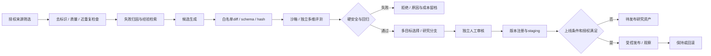

# 阶段6｜技术方案与实施计划

> 当前按[内部实验执行约定](../../EXPERIMENT.md)推进：支持通过指定 HTTPS 地址分享；注册登录后直接进入，不设年龄、用途确认或资格审批入口，不设固定业务保存期限。支持、记忆、画像、内部评测与优化按版本化实验默认配置开启，各功能仍按所属 STEP 实现。

> 整合修订：2026-09-20｜规划文档；产品未实现，业务验收未执行。
> [项目导览](../../README.md) · [阶段目标](01-阶段目标与功能设计.md) · [技术方案](02-技术方案与实施计划.md) · [测试验收](03-测试与验收标准.md) · [分步实施](04-分步实施与检查清单.md)

建议新增 `backend/app/optimization/`、`frontend/src/features/optimization/`和隔离评价装配。参考S02 V42–V51，采用GEPA受限adapter主线，R10 LangMem优化接口仅为互斥备选。实际代码/许可/版本核查不等于接入通过。正式前置增加[阶段5A](../阶段5A/03-测试与验收标准.md)稳定能力与组合准入证据；本阶段在同一LangGraph与strategy_bundle上优化，不重新搭建Multi-Agent。

## 离线控制流


优化worker与实时对话隔离，使用受限服务身份；不能读生产会话表、写生产配置或访问封存测试集。可提交候选资产，评价服务单独加载候选，不赋予其变更评分器权限。任务沿用background_jobs/Kafka，数据库保存状态和预算，不新增调度框架。

默认改进器选择GEPA受限adapter的固定生成器、策略与模型版本；LangMem `create_prompt_optimizer`仅在互斥profile中采用，输入为允许资产、获准开发案例及反馈，输出新提示文本/结构化变更。各角色prompt经同一受限候选合同适配；路由、handoff、触发条件、context/budget allocation只允许产生固定schema下的配置候选，不能生成新执行循环或运行任意代码。参数和调用预算计入OptimizationRun；SDK接口和依赖版本须在隔离装配验证。SDK不可用时只保留人工候选流程，不绕过独立门禁。

### 对象层状态、输入与更新算子

对象层状态 `X_t=(policy_archive, active_research_parent, fixed_improver_ref, dataset_versions, evaluator_ref, ledger, round, stagnation, rejected_refs)`。输入是经过授权筛选/去标识/质量检查的案例、运行收据、Agent行为评分及用户反馈校正。优化对象仅是PolicyVersion允许字段；输出是不可变ImprovementProposal，默认没有生产权限。

固定算子 `F_m` 包含失败分类、经验检索、候选生成、编辑与分支选择，本阶段m和模型配置全程不变。共享经验只收合资格通用条目，失败案例可用于诊断但不能伪装成成功示范。对已解决案例也保留抽样，防只优化错误集导致退化。

```text
object_loop(P0, fixed_m, D_dev, D_select, D_safety, B):
    G.verify_protocol_and_data_versions()
    state = restore_ledger_archive_or_initialize(P0, fixed_m)
    while within_frozen_round_limit(state) and G.reserve_next_step(B):
        parent = fixed_m.select_parent(feasible_research_archive)
        feedback = failure_and_success_view(D_dev, actual_tool_receipts)
        inspirations = retrieve_eligible_nonpersonal_experience(feedback)
        proposal = fixed_m.propose_local_diff(parent, feedback, inspirations)
        if duplicate_hash_or_forbidden_diff(proposal): record_rejection(); continue
        candidate = immutable_apply(parent, proposal)  # 非生产目录
        result = independent_eval(candidate, D_select, D_safety, frozen_evaluator)
        record_all_attempts_costs_and_failures(candidate, result)
        if G.hard_constraints_pass(result): update_research_pareto_archive(result)
        if plateau_or_drift_or_review_failure(): stop_with_baseline_intact()
    return candidates_and_evidence  # 不读取D_final，不发布
```

该伪代码只解释合同；本轮未实现/运行。budget不足连保守计量都无法完成时停止，不新建run绕过父预算。字节hash相同的“新候选”不计机制改进，语义近重复单独标记，不靠随机复评涨分刷新best。current、validation-best、research-archive、approved/active四种状态分开。

### GEPA适配与声明式技能

固定GEPAAdapter只接 `evaluate(batch, candidate, capture_traces)` 与 `make_reflective_dataset` 等必要接口；由项目rollout adapter运行现有LangGraph并调用独立评分服务。候选prompt通过allowlist映射到非安全片段；安全前后置、工具授权、模型/预算代理由G注入，不能从候选文件加载覆盖。关闭正文/输入预览日志，限制num_threads、超时与取消；只用去标识开发数据。第三方内部停止不替代外部账本。

PolicyVersion.bundle沿5A包含support_prompt、evidence_prompt、reviewer_prompt、routing_policy、handoff_policy、retrieval_policy、memory_policy、context_allocation_policy、agent_budget_policy，以及新增dependency_adjustment_policy的**已批准帮助方式选择参数**。依赖评估阈值/评估器、用户同意、数据用途和危机流程不在该字段中。Reviewer角色prompt可被优化，但独立AgentBehaviorEvaluator/最终evaluator不可由它替换。

技能条目为skill_id/version、适用条件、允许节点、输入/输出schema、内容、来源资格、正反例、失效条件、父版本；没有exec/shell/import/url任意执行字段。个人经历不能变共享示例；来源撤回触发条目/候选资格重核。引用R07的delta思想不复制其在线自写经验机制。

## 数据与资产版本

| 结构 | 字段与生命周期 |
|---|---|
| strategy_bundles（沿用5A） | id、parent_id、support_prompt/evidence_prompt/reviewer_prompt（不可变版本引用）、skill_policy、routing_policy、handoff_policy、retrieval_policy、memory_policy、context_allocation_policy、agent_budget_policy、graph/schema版本、model_ref、content_refs、hash、status；不可变，不新建第二份版本主存 |
| optimization_runs | id、baseline、generator_version、allowed_asset_types、dataset_versions、budget_limit/used、status、reason、started_at/ended_at |
| candidate_versions | id、parent、diff、changed_paths、rationale、generator_run、hash、status、rollback_target；不能覆盖旧候选 |
| candidate_evaluations | candidate、evaluator_version、dataset_version、scores、failures、latency/cost、uncertainty、artifact_refs |
| promotion_decisions | candidate、approver、decision、conditions、timestamp、observed_window、reason |
| release_assignments | audience/run→bundle、assigned_at、rollback_reason；一次run固定bundle |

候选状态统一为candidate → offline_validated → human_approved → staging_validated → active；分支状态rejected/research_only/invalidated/rolled_back。canary/production是release.scope，不是候选状态。人工审核批准指定hash进入staging；发布还须核对staging证据、批准有效性、当前来源资格与发布范围。详细状态迁移见[候选生命周期](02-技术方案与实施计划.md#l1-lifecycle)维护。

数据划分：development用于候选生成，selection用于选择，regression用于硬规则回归，holdout封存用于预先约定的最终审计。不得把holdout评分逐轮反馈给改进器；限制评估次数，失败不能无限刷同一封存集。来源按案例/会话族分组划分，避免同一段对话拆进多个集合。

<a id="l1-lifecycle"></a>
### 完整生命周期与状态机



状态统一：candidate→offline_validated→human_approved→staging_validated→active；可转rejected/research_only/invalidated/rolled_back。research_only可保留安全但无默认路由收益的分支/多样性条目，不等于生产可用。权限/隐私违规分支可留最少审计原因，原文按删除规则清理，不继续作为可检索灵感。

每次保存parent hash、changed_paths/diff、模型/生成器/数据/评分/图版本、实验arm/seed、实际工具收据、预算消耗/未知项、拒绝原因与审批记录；模型声称“工具成功”没有真实收据不得计入成功。当前状态提升只由独立服务和权限检查完成，候选payload不能自行将status写为approved。

## 评价和门禁

入口检查允许修改路径和schema；禁止资产包含权限、用户授权/数据用途、删除、密钥、数据库所有权、Agent/Tool白名单、schema底线、固定安全规则与Reviewer固定检查类别、evaluator/holdout、总预算硬上限、发布审批和不可逆动作策略。角色prompt中的越权指令仍作为候选失败处理；不能通过route条件、handoff或预算分配绕过required review、Memory确认或Tool审批。

离线回放使用隔离的记录/工具适配器或明确标注的记录夹具，不执行生产写操作。评价覆盖阶段1～5及5A回归、Meta组合选择、Artifact/来源版本、最小上下文、Memory确认、有限复核、非对话功能数据安全、支持质量和成本；复用5A固定组合对照及分层指标，单Support保留原能力。不能只根据模型自评分、留存、平均满意度或HTTP200发布。

按阶段5事先冻结规则评估：严重安全/权限/删除回归直接拒绝；其他指标报告基线对比、分母和不确定性，阈值未冻结不得通过。模型/场景/预算变化分别记录，不把更多调用带来的收益归于算法。预发布还需验证实际工具权限、取消、持久化、恢复及网关接口。

受控发布采用明确获准用户范围和版本分配；触发回退后停止新run使用候选，在途run按风险中止或完成旧绑定，不能中途混合版本。数据库业务记录继续保留。

路由候选不能仅凭更高平均分发布。每个受影响场景重新通过独立Eval的收益/风险/预算门槛，记录组合启用/关闭和降级路径；不把“不必要Agent调用率下降”解释为取消Multi-Agent架构。Reviewer修正有效率、误拒率与支持质量分开报告，固定evaluator不使用候选Reviewer的verdict作为真值。

### 多目标搜索、分群和淘汰

先硬筛，再在支持质量、自主性、用户认可行动帮助、干预负担、事实性与成本上保留非支配集；不采用“高满意度抵消越权”总分。Archive有有限容量，按任务/风险类型保留经审安全多样性，淘汰被支配或重复候选仍留元数据谱系，不能只保留最好一轮。

选择用D_select和固定D_safety；D_dev检索可含失败但须标failure，不能回传D_final明细。跨任务迁移比较同模型、同context/token预算与同技能检索上限；新模型适配作为独立外部验证，不偷偷更换基础模型。某亚组退化超过事前非劣界限即拒绝相应范围发布；样本不足时标无法判定并保持该范围关闭。

统计接受、样本量/置信区间/多重比较统一见阶段7/02，L1沿同一标准；δ/Δ等未校准不得因“看着更好”放行。零胜出、停滞、成本不划算均为有效记录。

无胜出候选时保留已批准基线和完整拒绝/阴性档案，不要求产生实际晋升或发布。审批、staging、发布拒绝及回退的工程门槛仍须在隔离环境用单独标注synthetic的合成资产完成；沿用同一状态机与权限检查，合成资产不能进入实际候选收益排名或生产分配。工程证据齐备后可交接固定m0、原基线与阴性结果至阶段7；评分版本未批准、依赖装配或权限/恢复检查失败仍是阻塞，不得冒充正常无胜出。执行分支见[阶段6分步清单](04-分步实施与检查清单.md#s6-step04)。

### 预算、停止与沙箱

BudgetService在进程外核总provider calls、token、cost、并行、工具步数、deadline及测试访问次数；本轮设计先导最多3个L1轮次、每轮最多2候选是合成机制演示初值，不是正式效果实验规模。正式参数按先导成本/功效与资源批准冻结，不能自动增大。全部提案、分类/检索、摘要、模型/工具/评分和重试计入账本，失败也计费，恢复不重置。

停滞由连续无有效独立验证改进＋重复hash/失败簇模式记录，窗口由冻结protocol指定；不能临时改成有利窗口。权限违规立即停止该优化任务并隔离资产；分布/评分漂移暂停晋升并交G校准；预算耗尽停止；指标冲突保留研究分支或拒绝；评审不通过不反复刷同一holdout。阶段6可提出“需研究搜索方法”的问题，但不能暗改fixed_m。

sandbox无生产密钥/DB写权/真实通知/任意联网；只读允许snapshot、输出candidate目录；模型与Eval经指定代理，G配置/密钥/holdout不可挂载。worker身份与发布身份分离，数据库行级权限/角色隔离和审计实际测试；不是只在prompt写禁止。

## API及页面状态

均为内部角色接口，读取也校验数据用途；返回id/status/version及证据引用，不返回未获准私人原文。创建带幂等键，变更带expected_version，非法提升409、无权403、预算参数不合法422。

| 方法/路径 | 请求与返回 | 固定边界与错误 |
|---|---|---|
| GET `/api/v1/admin/optimization/failures` | 时间、类别、系统版本→聚合及获准case_refs | 不返回未授权材料 |
| POST `/api/v1/admin/optimization-runs` | baseline_hash、fixed_generator、dataset_snapshot、allowed_assets、budget_profile→202 run_id/job_id | 保护资产不可提交；未冻结/资格失效409，无权403，非有限预算422 |
| GET `/api/v1/admin/optimization-runs/{id}`；POST `/api/v1/admin/optimization-runs/{id}/cancel` | 查询元数据、状态、成本、失败原因；取消携expected_version | 取消不清零消耗，迟到候选不晋升 |
| GET `/api/v1/admin/candidates/{id}` | diff、谱系、来源、状态/hash、逐维及分群结果、拒绝/失败、实际收据引用 | 私人材料权限独立，默认去标识摘要 |
| POST `/api/v1/admin/candidates/{id}/evaluate` | 固定evaluator/dataset版本、profile、budget→evaluation_id | 优化器无D_final/holdout访问权；版本变化须重评 |
| POST `/api/v1/admin/candidates/{id}/decision` | approve/reject/research_only、reason、target_hash、baseline_hash、scope、expiry、expected_version→审批记录 | 身份来自服务端；生成者无审批权；仅offline_validated可批准进入staging；目标/基线变化409；release另验预发布证据 |
| POST `/api/v1/admin/releases` | candidate_id、target_hash、scope、gate_refs、expected_version→release_id | 仅发布角色；资格/条件不满足403/409，不创建active |
| POST `/api/v1/admin/releases/{id}/rollback` | reason、expected_version→rollback_id与分配状态 | 记录from/to/hash及在途处理；不回滚用户数据 |

总体公共run事件用于任务可见状态；优化任务界面通过jobs API查询，不将实时聊天流挪到Kafka。差异页、失败列表及审批按钮明确对应真实状态。

### 发布与回滚行为

发布原子切换新run的策略分配指针，同run绑定版本不变。紧急严重违规可由G中止在途run；普通回退允许已合法执行继续旧版本至终态。已完成用户业务写入不反向撤销；查询/确认记录保留。回滚后验证新请求确用旧批准版、受影响任务停止、用户新记录仍存在；“停止优化器”不等于“回滚生效”。

## 任务顺序与风险

| 任务 | 优先级/依赖 | 功能 | 产出/验收 |
|---|---|---|---|
| S6-T01 <a id="s6-t01"></a> 固定数据与优化权限 | P0/阶段5及5A验收 | F-OPT-001、F-EVAL-001 | split/来源/角色及不可改资产表；S6-A01/S6-A02 |
| S6-T02 <a id="s6-t02"></a> 建不可变候选和预算 | P0/T01 | F-OPT-001 | 沿用5A角色bundle、hash、任务/总预算与子分配合同；S6-A02/S6-A04 |
| S6-T03 <a id="s6-t03"></a> 接固定改进器（GEPA主线／LangMem互斥备选） | P0/T02 | F-OPT-001 | GEPA受限adapter或互斥R10接口装配、输出校验、错误/取消；S6-A03 |
| S6-T04 <a id="s6-t04"></a> 接独立评估和回放 | P0/T01,T03 | F-EVAL-001、F-OPT-001 | 数据不可泄漏、基线对照、拒绝案例；S6-A01/S6-A05 |
| S6-T05 <a id="s6-t05"></a> 做审批/预发布/回退界面 | P0/T04 | F-OPT-001、F-OPS-001 | 状态图、角色检查、绑定版本及回退；S6-A06/S6-A07 |
| S6-T06 <a id="s6-t06"></a> 形成可复现闭环 | P0/T01–T05 | F-OPT-001 | 接受或无收益报告，B组冻结清单；S6-A08 |

成本高、数据不足或质量不稳时降低候选数量/关闭自动生成，保留人工候选和已经验收的固定Multi-Agent系统及单Support快路径，不提高预算直到得到积极结果。未经许可或用途不符的源材料不复制到评价集。阶段7继承本阶段固定B组，而不改写B组历史。

### 任务与交接

增量任务按下表登记；原S*-T*含义保持，页内Txx为本阶段基础任务的局部简称。依赖图中没有公开上线硬前置，但所有权限与预算约束需实证。交付阶段7的初始PolicyVersion、固定MetaOptimizerVersion m0、G hash、原始失败/阴性记录及总预算基线，不把L1成绩写成L2证据。

<a id="increment-tasks"></a>

### RSI任务与基础任务映射

| 增量任务 | 原任务关联 | 依赖 | 功能与接口/实体产出 | 验收引用 |
|---|---|---|---|---|
| RSI-S6-T01 <a id="rsi-s6-t01"></a> 冻结split、权限和固定m | [S6-T01](02-技术方案与实施计划.md) | 本阶段前置门槛 | U15；数据资格、G/模型/m0版本 | [RSI-S6-A01](03-测试与验收标准.md)、[RSI-S6-A02](03-测试与验收标准.md)、[RSI-S6-A03](03-测试与验收标准.md)；共同S6-A09、S6-A10 |
| RSI-S6-T02 <a id="rsi-s6-t02"></a> 接registry/proposal/diff | [S6-T02](02-技术方案与实施计划.md) | RSI-S6-T01 | U15；同一候选注册表、来源/hash/封套 | [RSI-S6-A02](03-测试与验收标准.md)、[RSI-S6-A04](03-测试与验收标准.md)、[RSI-S6-A10](03-测试与验收标准.md)；共同S6-A09、S6-A10 |
| RSI-S6-T03 <a id="rsi-s6-t03"></a> 接GEPA受限adapter或互斥备选 | [S6-T03](02-技术方案与实施计划.md) | RSI-S6-T02 | U15；受限回调、预算代理、依赖/日志 | [RSI-S6-A03](03-测试与验收标准.md)、[RSI-S6-A06](03-测试与验收标准.md)；共同S6-A09、S6-A10 |
| RSI-S6-T04 <a id="rsi-s6-t04"></a> 接独立Eval与统计门槛 | [S6-T04](02-技术方案与实施计划.md) | RSI-S6-T03 | U15；多目标/亚组/非劣、独立收据 | [RSI-S6-A04](03-测试与验收标准.md)、[RSI-S6-A05](03-测试与验收标准.md)、[RSI-S6-A09](03-测试与验收标准.md)；共同S6-A09、S6-A10 |
| RSI-S6-T05 <a id="rsi-s6-t05"></a> 接人工审批/staging/发布回滚 | [S6-T05](02-技术方案与实施计划.md) | RSI-S6-T04 | U16；ApprovalRecord、staging证据、release.scope | [RSI-S6-A07](03-测试与验收标准.md)、[RSI-S6-A08](03-测试与验收标准.md)、[RSI-S6-A10](03-测试与验收标准.md)；共同S6-A09、S6-A10 |
| RSI-S6-T06 <a id="rsi-s6-t06"></a> 交付机制复现与m0冻结包 | [S6-T06](02-技术方案与实施计划.md) | RSI-S6-T05 | U15/U16；输入版本、失败/成本与基线 | [RSI-S6-A03](03-测试与验收标准.md)、[RSI-S6-A04](03-测试与验收标准.md)、[RSI-S6-A06](03-测试与验收标准.md)、[RSI-S6-A09](03-测试与验收标准.md)；共同S6-A09、S6-A10 |

以上均为未来实施任务，未执行。工作包规模不作工期或性能承诺。

<a id="aud-13"></a>
## 优化器适配与发布门槛

GEPA／LangMem互斥profile、完整状态迁移、独立审核允许进入staging、发布另核证据和授权、并发/日志/extras限制，统一维护于[优化器适配合同](02-技术方案与实施计划.md#optimizer-integration)。S6-T02/S6-T03/S6-T05/S6-T06分别消费注册表、适配器、门禁和恢复；新增S6-A09/S6-A10在本阶段验收文档统一定义。原任务含义保留，R10仍是同一候选合同的互斥备选，记忆提取/摘要不受此选择影响。

<a id="optimizer-integration"></a>

### 互斥profile、适配并发与发布细则

L1主profile使用固定GEPA式改进方法与受限adapter，固定生成器/模型/选择规则；资源或兼容条件不足时，另一个互斥profile用LangMem固定prompt optimizer或人工候选。不能一次任务串联两套生产优化器，不建立两套注册表/评价集。LangMem的记忆提取/摘要职责与是否采用它的prompt optimizer独立。

候选生命周期使用candidate→offline_validated→human_approved→staging_validated→active，拒绝/研究保留/失效/回滚另记。human_approved允许指定hash进入staging；正式release必须同时校验staging证据、未过期批准、获准发布范围与当前数据资格。若staging更改hash，重新独立评价/审核。canary/production是release范围与实际证据，不从旧大写状态自动推断。未实际发布的资产保持研究/预发布状态。

GEPA适配优先复用已读`evaluate/make_reflective_dataset`接口和原LangGraph，反思模型亦经同一受控预算边界；禁止adapter直连生产会话、正文日志或默认32线程。依赖只选所需extras：2026-09-18审核快照中pyproject核心dependencies为空，不能把LiteLLM、MLflow、W&B全部变生产必装。隔离依赖失败时保留人工提案/互斥LangMem profile并记录研究组变更，不改既有实验m0。

保留候选白名单、hard failure先筛、多目标/亚群非劣、数据撤权传播、审批hash与回滚。优化对象仍包含角色prompt、routing/handoff、context及有界预算分配，但不能编辑Assessor/evaluator、holdout、安全、授权、删除或总硬限。实施验收证据是受限diff、拒绝案例和可恢复版本，不是每轮提升。验收S6-A09/S6-A10；回退停新分配而不退用户DB。

#### 迁移权限、审核与发布的完整门槛

candidate仅生成身份可登记；独立Eval核相同hash/基线/数据/评估器并通过门槛后转offline_validated；独立人工approve绑定target_hash、baseline_hash、gate_refs、scope和expiry，转human_approved，作用仅为允许该hash进入staging。staging服务校验真实接口、取消、授权与恢复收据后转staging_validated；release_operator原子核有效审批、staging收据、当前来源/数据资格、获准范围与上线条件后才转active。请求均带expected_version与幂等键，身份仅服务端注入。

拒绝为rejected；仅研究使用为research_only，若申请发布必须重新走offline_validated及之后门槛，不直接active；来源/授权/版本失效转invalidated并暂停新分配；已active被回滚转rolled_back并写RollbackRecord，不复用旧发布。任何hash改动创建新candidate并重评重审，staging不能原位改内容。generation失效、取消后迟到评测或重复release不能晋升。canary/production仅release.scope；只有演练收据时标synthetic/staging，不填写真实canary证据。

decision与release API共用同一注册表。decision请求不携可决定审批人的approver字段；响应ApprovalRecord.approver_id来自服务端。staging任务通过已有jobs/Eval/集成验证触发与登记gate_refs，不建第二平台。日志不含输入预览，GEPA默认并发必须由外部预算代理限制；每个reflection、rollout、Judge调用计原预算，依赖锁定仅选必要extras。兼容状态documented/tested/unsupported/unknown，未装配仅documented或unknown。

<a id="technical-sources"></a>
## 技术来源与核验边界

下表转引2026-09-18审核的外部资料与静态快照；本次仅整合文档，未重新核验在线版本或装配兼容性。历史库版本不是项目依赖锁，正文中的建议路径也不是现有源码。

| 来源 | 历史核验记录及适用范围 | 对应合同 |
|---|---|---|
| [GEPA固定快照](https://github.com/gepa-ai/gepa/tree/15ee314f9c7d34ec153b809d401f42f55c4dcd76) | pyproject版本0.1.4、Python≥3.10,<3.15、核心dependencies为空；Litellm等在extras；MIT、未归档。读取api.py、core/adapter.py和LangChain adapter，后者默认num_threads=32 | [AUD-13](02-技术方案与实施计划.md#aud-13)：只启必要extras，外部预算限制线程；不是必须另建Litellm生产网关 |

## 任务表与执行步骤的关系

基础任务和RSI任务编号用于追溯，父任务关联不等于必须等待父任务全部结束。合并后的实际顺序、局部完成条件及交接见[分步实施清单](04-分步实施与检查清单.md)。同一任务的合同、实现与验证可跨步，须所有相关步骤及用例完成才能记整项通过。

<a id="entity-contracts"></a>
## 本阶段核心逻辑实体与合成片段

共同字段、类型、枚举及VersionBinding由[共同合同](../阶段1/02-技术方案与实施计划.md#shared-contracts)统一维护。下表仅列专属字段；复用既有表/注册表，不新增第二份事实库。

| 实体 | 专属字段/枚举与关联 | 隔离、敏感性和删除关系 |
|---|---|---|
| ImprovementProposal | parent_policy/hash、generator_ref、allowed_paths、diff、failure_refs、rationale、expected_tradeoff、dataset_snapshot、status及reject_reason、budget_receipts | 生成身份只写candidate；安全/授权/保留期限/评估器路径不可编辑 |
| PolicyVersion | parent、bundle、hash、scope、model_compat、status=candidate/offline_validated/human_approved/staging_validated/research_only/active/rejected/rolled_back/invalidated、approval_refs | 与strategy_bundle同一注册表；运行内不可变；被删来源派生版本可失效/撤回 |
| ApprovalRecord | target_type/id/hash、baseline_hash、scope、approver_id、decision、gate_refs、decided_at、expiry | 审批人与生成器分离；更换资产/数据/评估器即需新决定 |
| RollbackRecord | release_id、from/to_hash、reason、incident_ref、actor、new_run_assignment_cutoff、inflight_action、verification_refs | 回滚策略不回滚用户记录；审计最小元数据，不保留无期限原文 |

以下为合成payload片段，不是可直接提交或持久化的完整对象；服务端必须补全共同封套并按状态校验。null预算、未批准evaluator、缺失画像来源版本均不能作为可运行/可持久化状态。示例不代表已执行验收。

```json
{
  "ImprovementProposal": {
    "id": "proposal-demo",
    "parent_policy": "policy-demo-v1",
    "allowed_paths": [
      "support_prompt"
    ],
    "diff": {
      "support_prompt": "示例：先询问用户自己的判断"
    },
    "status": "candidate"
  },
  "PolicyVersion": {
    "id": "policy-demo-v2",
    "parent": "policy-demo-v1",
    "status": "candidate",
    "approval_refs": []
  },
  "ApprovalRecord": {
    "id": "approval-demo",
    "target_type": "PolicyVersion",
    "target_id": "policy-demo-v2",
    "decision": "pending",
    "gate_refs": []
  },
  "RollbackRecord": {
    "id": "rollback-demo",
    "from_hash": "candidate-hash-demo",
    "to_hash": "baseline-hash-demo",
    "reason": "synthetic_safety_regression",
    "verification_refs": []
  }
}
```

<a id="original-reuse"></a>
## 原版开源证据与逐项复用

原版复用R编号来自原总体第9节，与RSI研究R编号分域。固定快照为2026-09-17历史静态核查，未运行；复制前核源码、许可与升级差异，完成本项目装配后才能称可用。目标代码路径为建议，不代表当前存在。

| R编号/来源定位 | 目标功能与方式 | 保留、修改、依赖及许可要求 | 目标路径/阶段/验收 |
|---|---|---|---|
| R10 LangMem `src/langmem/prompts/optimization.py:create_prompt_optimizer` | F-OPT-001，接口直接复用(C) | MIT；固定改进器生成候选；加独立数据/预算、审核及回退；不将原库命名metaprompt视为RSI证明 | `backend/app/optimization/candidates.py`；6；S6-A03/A05 |

分类A真正新增、B原有增强、C实现替换、D重复能力、E暂缓；分页和视图不另计功能。

CBT/PsyChat/Loyal/LangMem根LICENSE均已读为MIT；Sage `frontend/LICENSE`为MIT，后端包声明ISC，不能互相替代。SoulChat/Mem0根为Apache-2.0。SoulChat模型README另说明科研用途及基座协议；数据和模型卡的ModelScope网页在本轮未返回可核读正文，未据此授权使用。PsyChat案例文件、CBT知识材料和第三方图/音频/字体的独立许可未完整核实，初始内容采用团队自建且经审阅材料。许可不清不以“网上公开”代替授权。

<a id="research-sources"></a>
## RSI研究来源与官方实现边界

RSI研究R编号来自升级总体第3节；不同于原版复用R编号。访问/静态核查截止2026-09-17，以下性能与实验数字均为作者报告，本项目未独立复现；本次未重新核验网页或许可证。

| ID / 标题及作者 | 首次公开 / 最新arXiv修订 | 状态 / 访问日 |
|---|---|---|
| <a id="r03"></a>R03 [Rethinking Self-Evolving Agent Skills: Feedback Dynamics over Multiple Rounds](https://arxiv.org/abs/2608.02636)；Liu, Yuxuan、Su, Zhaochen、Zhang, Yuhao等 | 2026-07-31 / 2026-07-31 | 预印本；2026-09-17 |
| <a id="r04"></a>R04 [GEPA: Reflective Prompt Evolution Can Outperform Reinforcement Learning](https://arxiv.org/abs/2507.19457)；Agrawal, Lakshya A、Tan, Shangyin、Soylu, Dilara等 | 2025-07-25 / 2026-02-14 | 论文页注明ICLR 2026 Oral；本轮读v2正文；2026-09-17 |
| <a id="r05"></a>R05 [Darwin Godel Machine: Open-Ended Evolution of Self-Improving Agents](https://arxiv.org/abs/2505.22954)；Zhang, Jenny、Hu, Shengran、Lu, Cong等 | 2025-05-29 / 2026-03-12 | 预印本；2026-09-17 |
| <a id="r07"></a>R07 [Agentic Context Engineering: Evolving Contexts for Self-Improving Language Models](https://arxiv.org/abs/2510.04618)；Zhang, Qizheng、Hu, Changran、Upasani, Shubhangi等 | 2025-10-06 / 2026-03-29 | 论文页注明ICLR 2026；本轮读修订正文；2026-09-17 |

| ID | 优化对象/反馈 | 实验条件 | 失败与局限 | 项目关联 |
|---|---|---|---|---|
| R03 | Normal/Fail-only/Success-only反馈；验证集门禁及最佳skill | 主研究42 runs、14设置、5基准/3模型；额外SearchQA模型和test-time控制 | 有效更新稀疏、存在停滞；验证/测试/迁移偏好可不同；oracle采样不可当可部署选择器 | 失败反馈对照、无变化hash、最佳版与当前版分离 |
| R04 | 轨迹反思、提示mutation及逐案例Pareto候选选择；固定模型时更新prompt | 六类任务、与GRPO/MIPROv2比较；rollout预算不等于全部token/cost一致 | 不保证每项胜出；逐案例Pareto不是本项目安全/自主性多目标规范；原机制固定，不能直接叫L2 | L1主路线；外部硬门禁先筛选，再做非支配选择 |
| R05 | 代码自修改、开放式档案与踩脚石搜索；执行反馈 | SWE-bench/Polyglot，任务Agent自身编程改进 | 依赖编程与自修改能力对齐；外层选择/评价固定、算力成本高；非心理任务证据 | 谱系及研究分支参考；不采用任意代码修改 |
| R07 | Generator/Reflector/Curator、条目delta与去重playbook | Agent与领域任务；离线和在线上下文适配 | 不是改进器自身更新；helpful/harmful自报不等于真值；在线写共享经验不适用私人倾诉 | 可审diff和条目化技能；不引入第二套在线角色/runtime |

| 仓库 / 固定commit / commit日期 | 已读模块 | 许可及复用决定 | 边界 | 适配规模 / 替代 |
|---|---|---|---|---|
| [gepa-ai/gepa](https://github.com/gepa-ai/gepa/tree/15ee314f9c7d34ec153b809d401f42f55c4dcd76)<br>`15ee314f9c7d34ec153b809d401f42f55c4dcd76`<br>2026-09-11T06:04:59Z | src/gepa/core/adapter.py; src/gepa/core/engine.py; src/gepa/adapters/langchain_adapter/langchain_adapter.py | MIT；**适配后复用** | L1离线优化库，不是第二Runtime；封装rollout/eval回调，去正文日志、统一预算/取消/权限。现adapter会记录输入预览并用线程池，不能直接接生产私密会话 | M：适配器/错误/成本/取消/回归5类任务；固定LangMem优化器或人工提案；同一候选接口互斥选择 |
| [HKUST-KnowComp/rethinkskill](https://github.com/HKUST-KnowComp/rethinkskill/tree/8252445918ebebebce7adf9be843c90841e66810)<br>`8252445918ebebebce7adf9be843c90841e66810`<br>2026-09-05T09:38:13Z | src/rethinkskill/evolution/loop.py; evolution/protocol.py; tests/test_evolution.py | MIT；**适配后复用** | 反馈过滤、hash去重、当前/最佳版分离；代码的hard/soft是任务性能门禁并存在soft_rescue；不能把它映射成允许补偿本项目硬安全失败；当前commit不自动等于论文实验快照 | M：反馈视图/门禁/停滞3类；本项目固定规则与简单候选列表 |
| [ace-agent/ace](https://github.com/ace-agent/ace/tree/82709de050e1db6e6ef2f07bcb0393560b94992a)<br>`82709de050e1db6e6ef2f07bcb0393560b94992a`<br>2026-08-24T18:49:59Z | ace/core/curator.py; playbook_utils.py; LICENSE.txt | Apache-2.0；**仅参考思路** | delta、条目去重；共享技能仅来自授权去标识案例，不将私人记忆在线合并成playbook | S：版本条目/来源失效2类；复用现有PostgreSQL候选与注册表 |
| [jennyzzt/dgm](https://github.com/jennyzzt/dgm/tree/a565fd2d1dca504ef5104a7cc0f3bdc4ab9b4fd2)<br>`a565fd2d1dca504ef5104a7cc0f3bdc4ab9b4fd2`<br>2025-08-13T10:40:14Z | DGM_outer.py; self_improve_step.py | Apache-2.0；**不采用执行器，仅参考档案思路** | 不开放shell/代码自改；研究分支与部署版分离，完整预算外置 | L，当前不迁；有界策略diff和独立评测 |

R01未核到作者官方代码；R06未核验官方代码包；R09为形式框架；R11/R12不复制参与者数据。代码许可证不覆盖第三方模型权重、训练集、量表题项、图片/音频；未核清者禁止复制进入产品。依赖实读示例：GEPA有Litellm等离线依赖，LangMem声明LangGraph版本范围，SageMate是Next.js/Express/Mongoose；均需将来隔离锁版本验证，不能凭声明范围声称兼容。

许可证补充：R01未核到官方实现/代码许可；R06官方代码包许可未核；R09概念工作未核官方实现；R11/R12仅合法阅读公开论文，个体数据/代码包及题项再用许可未完整核验。其余研究代码的可用性、commit和许可逐项列于§4。开放阅读、论文许可、代码许可、数据/权重许可是不同范围；本轮没有独立复现，未来可复现性仍取决于原始split、模型版本、外部服务和完整运行配置。

<a id="route-evidence"></a>
## 优化路线选择与研究映射

| 路线 | 证据与代价 | 项目决定 |
|---|---|---|
| 固定反思式prompt优化（GEPA型） | R04有固定模型多任务作者实验及官方adapter；需要独立反馈和成本计数 | **L1主路线**：离线调用优化库，LangGraph仍执行任务；模型不改，生成器固定；固定LangMem optimizer/人工提案为互斥低成本替代 |
| 技能/上下文库进化 | R03/R07支持条目化更新、失败反馈与验证选择，但收益稀疏 | 在同一PolicyVersion中增加少量声明式技能条目，非另装ACE Runtime；经审核才共享，不允许私有记忆混入 |
| 工作流/受限代码演化 | R05/R08有多任务研究；可执行判据与沙箱成本高，R08许可非商业 | 首版仅选择已注册非安全节点与参数；**不采用任意Python/shell、自改生产代码或权限**。代码演化需新ADR、许可与另行授权 |
| 改进器元优化 | R01/R06/R08提供快慢层和下游元效用思路；等预算和独立评价仍是关键 | **阶段7研究L2**：更新分析/检索/提案/分配/选择/编辑方法的声明式资产；固定G、固定权重、有限代数，不声称无界RSI |
| 模型与harness共演化 | R10含RL和权重变化，反馈任务来自科学工作流 | 不纳入本批主线；无训练授权，不将其联合收益当本项目固定权重L2依据 |

R01主对照的Single-Level同时去掉跨分支共享并限制子代数量；其H消融虽然固定元更新次数，却改变快循环次数。故本项目单独匹配总调用/token/费用/评价次数，并固定其他模块，只改变元资产是否更新。R02的机制指标是行为链一致性；本项目增加删除/替换/过期artifact对照，仍不声称对真实用户有反事实因果识别。R03当前源码的soft rescue不能移植为安全例外。R04逐案例Pareto仅用于保留不同场景优势，本项目另加自主性/负担/成本向量及硬安全筛选。R08的MetaAgent具有任意代码编辑能力和all tools，PsyEvoAgent的元优化器没有这些权限。

| 来源→原问题 | 本项目需求 | 保留 / 修改 / 不采用 | 模块与数据 | 实验与阶段 |
|---|---|---|---|---|
| R04轨迹反思→候选多样性 | 同一错误反复出现，单次改写不稳 | 保留固定反思和逐案例非支配候选；修改为多目标、许可案例和外部硬门禁；不以模型自评分发布 | Improver、ImprovementProposal、AgentEvaluation、PolicyVersion | 固定L1对比单次反思/等预算best-of-N；阶段6 |
| R03反馈动态→稀疏更新 | 成功反馈偏差、停滞和退化 | 保留失败/成功/混合消融与hash；修改接受统计和失败类别；不承诺单调提升 | FailureCluster、Proposal、ExperimentRun | 多轮轨迹、停滞、拒绝/回退比例；阶段6/7 |
| R02跨会话归因→记忆真实使用 | 不能只靠更长context宣称学习 | 保留清空上下文后的on/off；修改为来源校验/自动保存/遗忘链；不复制Hermes自动写权 | DependencyEvidence、memory_sources、tool_receipts | same-token no-retention/干扰/旧版/更正对照；阶段2/5/7 |
| R07局部delta→保留经验 | 更新一条策略时避免覆盖有效条目 | 保留局部diff/去重；加入来源版本、owner和动作审批；不在线写共享技能 | PolicyVersion.skill_entries、provenance | 同token条目检索 vs 全量注入、来源失效条目负例；阶段6 |
| R01/R06/R08→改进方法变化 | 提案长期停滞，需检验搜索方法价值 | 保留分支元资产和下游效用；限制schema/候选数/元代数；不改G/权重/权限 | MetaOptimizerVersion、ExperimentRun | 新任务固定起点、等预算非递归和元迁移；阶段7 |
| R11/R12→用户与Agent相互影响 | 满意不代表自主性或生活改善 | 保留多维观察与反迎合；改中文校准和独立伦理方案；不照搬临床阈值 | DependencyProfile、OutcomeObservation、AgentEvaluation | 识别校准/盲评/未来长期研究；阶段1～5 |
| R09→外部评价锚定 | 防自我确认循环 | 保留G独立主体；不把概念框架当性能保证 | EvaluatorVersion、ApprovalRecord、BudgetService | 篡改评测/holdout/权限攻击，阶段5～7 |

固定L1实施主线为GEPA，LangMem为互斥替代；共享技能仅使用合资格去标识来源，研究选中不等于发布批准。

<a id="cost-assumptions"></a>
## 资源预算口径与估算边界

工作量按可审工作包计，**不假装实测人日或费用**：S=1～2类已有模块的小接口/状态适配；M=3～5类相关合同、前后端和回归接线；L=跨数据/权限/评审/恢复的多个M包，需拆分验证。量级是规划分类，不是日历承诺。当前分步为阶段1/2/3/4/5/5A/6/7分别8/8/7/8/8/7/7/8步；专业内容、校准/双人评分、合规/伦理和许可工作独立计入，不能由开发人数替代。

成本估算式：`总费用 = 各模型输入/输出token×当期单价 + embedding/工具/存储与运行费用 + 独立人工评分/专业审阅成本`。没有选定provider、地区、数据条件与真实单价，文档不报人民币总额。预计调用上界由候选数×评价case数×重复数×每case最大调用，再加反思、元试跑、Judge和有限重试；max_calls和token/cost/deadline多重限制取先到者。查询公开网页/下载源文件不等于已运行模型实验。

当前执行以61步清单为准，阶段5A独立交接。M/S/L不作工期承诺，不替代真实账本和报价。

<a id="ui-reference-contract"></a>
## UI参考落地约束

采用[本阶段图号映射](01-阶段目标与功能设计.md#ui-reference)与[统一设计基线](../UI设计图/README.md#ui-reference-policy)，视觉与交互参考不得覆盖本阶段API、状态、权限及数据合同。

W07审批最多使候选进入预发布，不等于生产发布；W06按独立发布门禁显示真实状态，平均分提高不代表全部检查通过。无胜出、取消及失败如实保留。

沿用[阶段1前端职责与按需接入合同](../阶段1/02-技术方案与实施计划.md#frontend-stack-contract)，在既有页面与组件上按真实消费者扩展。本次仅补充设计参考，不新增接口、schema、路由或依赖，不宣称页面已实现。
