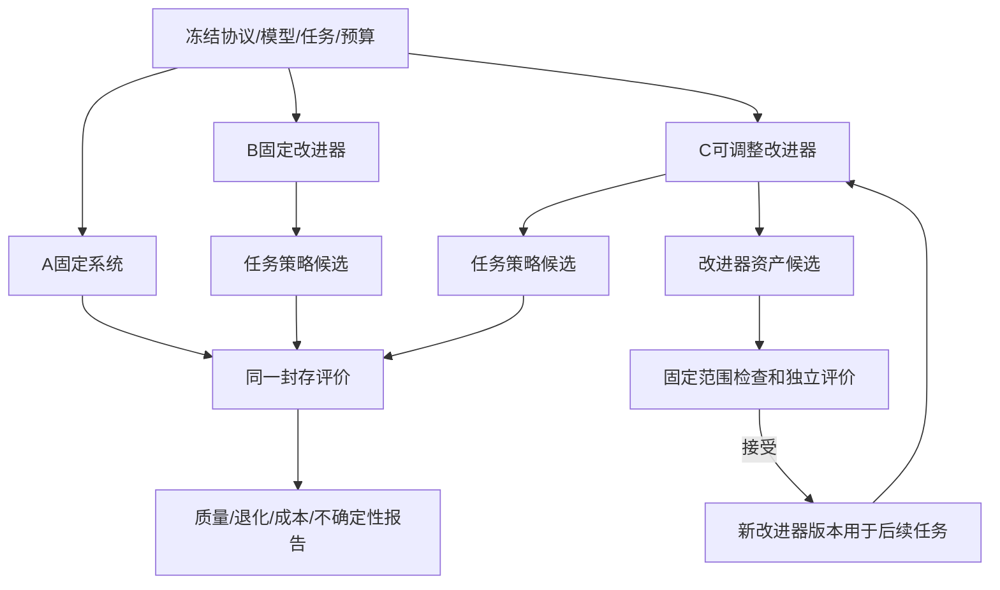

# 阶段7｜技术方案与实施计划

> 当前按[内部实验执行约定](../../EXPERIMENT.md)推进：支持通过指定 HTTPS 地址分享；注册登录后直接进入，不设年龄、用途确认或资格审批入口，不设固定业务保存期限。支持、记忆、画像、内部评测与优化按版本化实验默认配置开启，各功能仍按所属 STEP 实现。

> 整合修订：2026-09-20｜规划文档；产品未实现，业务验收未执行。
> [项目导览](../../README.md) · [阶段目标](01-阶段目标与功能设计.md) · [技术方案](02-技术方案与实施计划.md) · [测试验收](03-测试与验收标准.md) · [分步实施](04-分步实施与检查清单.md)

建议新增 `backend/app/research/`、`frontend/src/features/research/`、`research/protocols/`与隔离实验装配。只规划，不执行研究或训练。继承阶段5A稳定角色能力及阶段6候选、预算、版本和评价服务，不在本阶段首次搭建Multi-Agent。

## 固定控制器与可变改进器



固定控制器承担执行、权限/数据用途/所有权、用户授权、删除、schema底线、总预算、Agent/Tool与变更资产白名单、评价/holdout、安全硬规则、发布审批和停止。单Agent与Multi-Agent均在既有LangGraph Runtime内执行；“不增加第二套多Agent平台”是禁止CrewAI、AutoGen、第二workflow engine或自研Loop/Dispatcher，并不否定已确定的Multi-Agent能力。未来框架例外须先有真实gap evidence、隔离PoC、对照结果和ADR，不能由RSI控制器自行引入；ADR还必须明确最高层Runtime以及State、Checkpoint、Resume、Retry、Trace、Memory、Tool、HITL、错误处理和Agent生命周期归属。C可提交JSON/提示资产，不获得shell、数据库管理、生产配置或评价集读取权限。

任务策略资产沿用阶段6同一strategy_bundle：support_prompt、evidence_prompt、reviewer_prompt、routing_policy、handoff_policy、retrieval_policy、memory_policy、context_allocation_policy和agent_budget_policy；触发条件与组合选择归入routing_policy。有界分配不能增大run或整个实验预算、handoff/review/revision/并行硬上限，不能用Memory后台任务绕过计费。可变Reviewer负责回答复核，固定evaluator负责比较任务质量；后者的prompt/规则/数据和holdout不进入候选。

允许的改进器资产：failure_analysis、experience_retrieval、candidate_generation、allocation、branch_selection、edit_method，均为固定schema内的声明式资产；原failure_analysis_prompt/candidate_generation_prompt分别归入分析/生成，旧失败类别映射和搜索配置作为其子字段。输入输出schema、必须检查的安全/隐私类别、总预算和评价规则固定。类别可合并/细分分析，但不能删除固定保护项。被接受的资产具有parent_hash和生效轮次，不能回写历史。

B的生成器版本整个实验固定，任务策略可变；C的生成器初始版本与B相同，之后只有通过门禁的改进器变更才生效。A同样具备五项新增产品能力、记忆/偏好基础及5A多角色架构，按固定路由选择单Support或角色组合；三组共同初始图/Artifact schema/bundle/白名单可核对，不用削弱基线制造优势。研究组主标识使用E0～E6；RSI-A/B/C仅为E2/E4/E6旧称，避免与5A的MA组合对照混淆。

### 分层权限与元层状态

对象层沿阶段6/02。元层状态 `Z_k=(meta_archive, parent_m, policy_starts, L1_histories, meta_split_manifest, frozen_G_hashes, global_ledger, generation, stop_state)`。输入是授权、去标识、无终评泄漏的L1历史与新任务支持集。可变元资产为failure_analysis、experience_retrieval、candidate_generation、allocation、branch_selection、edit_method，均是固定schema的文本或有限枚举/数值配置。

更新算子M生成m′，由固定验证器检查其只能调用现有允许工具/编辑策略资产。task修改和meta修改分别记录parent hash、diff和实际后续调用。Runtime Meta只执行G批准的规则，元优化器没有Meta的权限、预算签发、白名单、停止、发布或审计写回权。

节奏：对象层快循环；元层仅在至少完成一个冻结窗口的L1尝试、出现可核对停滞/失败模式且剩余预算充分时生成候选。H、停滞窗口、候选数在protocol冻结；合成机制演示可用H=2、最多2个元代、每次最多2个元候选，纯工程限额，不是性能最优参数。层级最多L1/L2两层，不产生L3，不可无限派生子Agent。正式实验规模由样本量/成本先导确定，但任何运行都须有限硬限。

### 元效用与双层伪代码

元目标是**给定同一总预算，在未参与元搜索的任务上，产出符合固定安全与泛化门槛的L1改进**。主量为新任务族中产出合格策略改进的比例及其配对差；同时报告质量/自主性/负担向量、有效候选/总候选、总成本、退化和失败。预算未知或为零不得计算虚假的“每元收益”。不以meta自评分、文本更长或改写次数当效用。

```text
meta_research(m0, P_starts, meta_dev, meta_select, G, B_total):
    freeze(G, models, splits, allowed_assets, seeds, budgets, hypotheses)
    archive = {m0}; state = resume_with_original_ledger()
    for k in bounded_meta_generations:
        if G.stop_or_no_budget_or_data_revoked(): break
        history = authorized_L1_history_without_final_labels()
        parent_m = G.pick_eligible_research_meta_parent(archive)
        proposals = invoke_bounded_improver(parent_m, target="meta_assets",
                                           history=history, budget=remaining_budget)
        for m_candidate in proposals:
            if forbidden_diff_or_duplicate(m_candidate): reject_and_record(); continue
            # 每个方法从相同策略起点与隔离workspace开始，不能偷继承更好task资产
            for task_family, repeat in frozen_meta_select_schedule:
                result = run_L1(m_candidate, P_starts[task_family], support_set,
                                same_model_and_tools, charged_subbudget)
                score = G.evaluate_downstream(result, private_query_set, fixed_evaluator)
                record_method_use_hashes_costs_and_failures(result, score)
            retain_only_feasible_non_dominated_research_methods()
        if frozen_plateau_rule_met(): break
    selected = freeze_one_method_per_protocol_without_final_access()
    # 终评由G执行一次锁定作业，结果不回传继续搜索
    return G.final_compare(selected, m0, equal_budget_nonrecursive,
                           new_task_families, sealed_query_sets)
```

元循环复用同一受限提案接口：初始m0针对task资产产生策略候选；在L2获准目标下，m0也可针对自身meta资产提出m1，获G独立验证后，下一元代明确调用已入研究档案的m1提案方法，同时检验它对后续L1任务的作用。调用接口与允许target类型由G固定，不能通过改meta资产增加L3目标；外层元父节点资格/选择及最终门禁不由m修改。若只用固定外部生成器搜索m且没有新m后续生效，最多称元参数搜索，不充当本项目递归链证据。候选m实际运行后的下游成绩才是接受依据。若只是改Support prompt或生成m′后仍调用m0，机制不成立。研究选中m′不自动成为生产改进器；仍经阶段6同一审批/发布资格。

### G约束、停止和真实研究边界

G控制器、BudgetService、final evaluator/holdout、安全基线、Agent/Tool白名单、权限/所有权/实验配置、保留删除、审计、发布审批皆固定。依赖评估器升级属于G独立校准，不能和E6一起改变。L2写meta_candidates目录、G只读assets、无生产网络/凭证/通知；diff通过也必须独立执行验证，不能只靠静态扫描断言安全。

遇权限违规、评测篡改或测试污染立即隔离并停该实验；预算/deadline耗尽Controlled Stop；停滞按冻结窗口停止；模型/评分分布漂移暂停比较，必要时新协议；无合格meta保留m0。恢复核原始账本、数据资格和hash，结束的实验不能静默重开。

固定历史重放只比较给定上下文，模拟用户不代表真人反事实效果。实验按版本化默认配置推进，保留来源、split隔离、预算、取消和评价器独立；无年龄、同意或资格审批前置。本次不运行后续研究、不调用付费模型或发通知。

## 数据与协议结构

| 结构 | 必须记录 |
|---|---|
| research_protocols | id/hash、研究问题、RSI-A/B/C定义、5A验收引用、共同初始graph/Artifact schema/bundle、固定白名单与保护资产、任务/split/evaluator版本、模型/参数、预算单位与硬上限、重复方案、指标、停止/排除规则、审批状态 |
| experiment_runs | id/protocol、arm、repeat_id、initial_bundle、initial_memory_snapshot、budget_limit/used、status、started_at/ended_at |
| optimizer_versions | id/hash/parent、资产差异、产生来源、接受证据、生效轮次；B只读固定引用 |
| improvement_rounds | experiment、round、task_bundle_before/after、optimizer_before/after、case_refs、attempts、failures、cost、selection_evidence |
| experiment_results | group、round、dataset_version、evaluator_version、分维结果、失败分母、成本、延迟、重复间差异/区间、解释范围 |

保存生成模型的版本和参数、不可保证可控的随机性及provider变化。若API不支持确定seed，不能承诺逐字复现；用固定输入、实际版本和多次独立重复描述变异。资源和先导结果用于事前确定重复次数和停止条件，不在看到正式成绩后追加强组样本。

## 分割、预算与评价

development供优化；selection选择候选；regression执行固定保护检查；holdout封存，在协议规定次数下由评价服务读取。按场景/来源会话族分割，避免相邻轮次泄漏。来源删除、显式来源撤销或第三方许可变化时更新材料资格，旧实验保留失效说明，不能继续给优化器使用。

预算统一统计Support/Evidence/Reviewer、Memory Workflow、Meta分类、记忆提取、摘要、候选生成、改进器修改、检索/embedding、Tool及评分调用。run总账与角色子账汇总不双计；任务执行成本、优化/改进器成本和独立评价成本分列再汇总实验总量。比较相同上限并报告实际花费；C不从后台预算、更多评估调用或重试中获取隐性优势。每轮可追踪剩余预算，重启不重置。

评价输出至少包括：支持质量分维、后续新任务改进成功率、严重退化与一般退化、单位成本收益、延迟及停止原因；同时保留5A角色组合/调用、引用/groundedness、权限/Tool错误、不必要调用、Reviewer修正/误拒及角色成本。主要比较E6与E4、E6与E5；旧C/B对应前一比较，E2（旧A）用于区分适配和优化增量，E0/E1/E3补充归因。统计方法、重复单位、区间和阈值由协议在正式运行前冻结，不把单次最好结果当稳定收益。

完整研究允许阴性结果。只有E6（C）实际改了改进器、参与后续L1及下一元代提案、并在独立终评对E4/E5表现出额外收益，才可在相应范围内讨论递归改进证据；不外推为临床有效或无界能力增长。

<a id="l2-protocol"></a>
### 七组离线协议与归因

所有组保留相同非诊断定位、危机支持、权限/删除、Output Policy、Tool确认和可用LangGraph角色能力；差异只在明确实验因素，不能削弱E0工具或安全。基础模型精确版本、模型族、可用资料/起点、调用/token/计算/费用上限和评估条件固定。

| 组 | 唯一关键变化 | 要回答的问题 |
|---|---|---|
| E0 固定原策略 | 阶段5/5A已批准支持策略，无新增依赖画像适配 | 当前能力参考；原RAG/Memory/角色能力不剥夺 |
| E1 识别但不适配 | 增加Assessor仅输出离线评估记录，策略仍E0 | 识别本身与策略调整分开；固定安全仍处理相同即时风险 |
| E2 依赖感知L0 | 冻结Adapter按证据选已批准帮助方式，无全局更新 | E2-E1评适配增量，E2-E0评整体增量 |
| E3 普通反思改写 | 在E2基础用固定反思操作改一次候选，不跨轮修改方法 | 与持续L1区分；所有额外调用入账 |
| E4 固定改进器L1 | 相同E2起点，固定m0多轮生成/选择PolicyVersion | 核心普通优化对照 |
| E5 等预算非递归搜索 | 相同起点/allowlist，固定best-of-N/beam及固定选择规则；不更新m | 用等量资源探索更多候选，排除“只是算得更多” |
| E6 受控元优化L2 | 相同起点，允许m在G外部约束下变化，元成本同计总预算 | 主要比较E6-E4及E6-E5，检验方法改进的额外价值 |

原三组研究在本批核心映射为RSI-A=E2冻结系统、RSI-B=E4固定改进器、RSI-C=E6可变改进器；E0/E1/E3/E5补充归因。与阶段5A的MA-A/B/C角色组合对照是不同实验轴，不能将MA-C误写为RSI-C。

公平预算以整个实验总ledger为约束：任务执行、Meta/角色、记忆/摘要/embedding、提案、元候选生成、各自L1试跑、评分、失败重试全部收费计入。E6的元开销从其同一上限扣除；E5可将相应资源用于预定非递归搜索，不要求E0浪费调用“凑预算”。报告多预算点的质量—成本曲线；预算点事前固定，无法确认计费的运行不得宣称等成本胜出。

### 数据隔离、元迁移和经验机制

阶段5四类split仍适用。L2额外按**任务族**划分meta-development/meta-selection/meta-final，各族内部再有允许提供给L1的support/dev与隐藏query/final；同用户、近重复、来源族绝不跨集合。m′在meta-final之前冻结；终评时允许它从新任务的规定支持集生成策略，但不能读取该任务隐藏查询答案/评分标签。终评结果只交独立审阅者，不返回m继续学习。元选择次数和final访问额度外置。

迁移包括新用户、未见主题、时间外材料、不同基础模型。现实时间外数据尚不存在时标待收集，合成时间戳只验机制，不证明纵向迁移。跨模型验证m0/m′同时换到相同冻结新模型，禁止给E6单独更强模型。

经验路径专门实验：fresh session清空短期context；同预算开启/关闭持久保留；注入无关经验、过期经验、错用户/错用途；用户更正后旧值抑制；等token直接拼接对照。核对实际save/授权retrieve/revision/应用收据与输出，不用文件存在、grep关键词命中或模型自称读过来证明有效使用；路径证据不等于因果必要性，主动替换/移除Artifact的合成对照提供更强归因，但不能外推真人效果。

<a id="research-statistics"></a>
### 消融、统计与样本量（全批唯一统计规范）

预先固定主比较E6-E4、E6-E5，适配比较E2-E1和E2-E0另列假设族。消融每次只关元更新、跨分支经验、失败反馈、分配自适应、多样性档案或保存检索之一，其余调用预算、角色模型/工具和数据不变；另设打乱/错误反馈负对照，检查是否只是提示长度或评分迎合。R01的多因素变化不照搬为纯递归消融。

实验单位是独立任务族/用户组及完整搜索重复，不把同一次搜索的每个候选当独立样本。开发机制检查至少3个独立repeat/随机种子为工程起点；正式次数按方差、预算与功效确定，不能以3次承诺稳定结论。API不支持seed则固定其余参数、保存repeat_id与时间/provider版本并报告非确定性；不挑最好seed。

主指标是未见任务族上“在固定安全和预定泛化门槛下产出策略改进”的比例差；同时报告原始分母、胜/平/负、支持各维分布、自主性/负担、有效候选率、停滞与退化、总成本和延迟。对有序人评优先报告配对优势/等级分布；仅在事前论证量尺后才把合成均分当间隔变量。效应量为配对比例差/优势概率等，置信区间按任务族与repeat层次做配对聚类bootstrap；稀有严重事件报告计数及适用精确区间。Judge人工一致性依阶段5，不用“另一个模型”代替盲评。

接受规则：任何固定严重安全/权限/删除违规直接拒绝；主要改进指标区间下界超过事前最小有意义δ，核心自主性/支持质量满足事前非劣界限Δ，负担/成本未越限，关键亚组无已确认退化，才可进入人工审核。δ/Δ不能由模型或当前候选成绩反推。95%区间、α=.05、power=.80可作为待批准的常见分析设计起点，不是已经冻结的本项目阈值；多重比较族事前冻结，可用Holm控制。正式结果不做临时加样、挑轮次或反复窥视终评。

样本量：先用不进入final的独立先导估计配对差方差σ_d²、任务族内相关、失访/无效比例和评审误差；简单配对近似 `n ≈ (z_(1-α/2)+z_(power))² σ_d² / δ²` 仅作规划起点，再用按用户/任务族聚类的模拟功效校正（必要时设计效应 `1+(m-1)ICC`），并检验多目标门禁与多重比较造成的功效损失。无先导和有意义δ则不报貌似精确的样本数。真实长期研究另计单位、随访损耗和最小效果，不套离线case数。

数据缺失、评估失败、未知成本和取消单列分母；人群失访结果unknown。预定敏感性分析比较缺失机制、provider变化、verifier替换和亚组样本不足；有选择偏差则收窄结论，不能剔除失败提高均值。若E6不优于E5或区间跨无效区域，结论为本预算/任务域未见额外RSI收益，而非宣称递归永远不可能或本项目失败。

## API和工作台

仅research_operator读取获权实验材料，具备研究审阅权限的人工审阅者冻结协议（不是Reviewer Agent）；实验执行服务只读协议和获准开发材料，不能修改角色或holdout。

| 方法/路径 | 请求 | 返回和错误 |
|---|---|---|
| POST `/api/v1/admin/research/protocols` | 组别、版本、预算、split、指标与停止规则 | draft protocol_id/hash；字段不全422 |
| POST `/api/v1/admin/research/protocols/{id}/freeze` | expected_version、审阅说明 | frozen hash；无审阅权403、仍有未决核心项409 |
| POST `/api/v1/admin/research/experiments` | frozen_protocol_id、获准运行范围、Idempotency-Key | experiment_id/jobs；版本或用途变化409/403 |
| GET `/api/v1/admin/research/experiments/{id}` | 无 | 组/轮次/资产/预算/状态/证据引用 |
| POST `/api/v1/admin/research/experiments/{id}/control` | pause/resume/cancel、expected_version | 新状态；恢复预算不重置，已结束不能悄悄重开 |
| GET `/api/v1/admin/research/experiments/{id}/results` | 已获权的报告视图 | 分组结果及失败/未完成标记；优化身份不能请求封存明细 |

隔离实验中的工具写操作使用测试数据和显式模拟/记录适配器；不得调用学生生产账号。需要验证真实业务事务的部分使用测试数据库并明确证据类型。候选不会自动成为生产release。

### 内部接口、任务与交付

沿原research/protocols创建/人工freeze、experiments创建/control/results接口，增加protocol字段arm E0～E6、nested split、meta可改路径、代数/分支硬上限、总预算、主比较、统计门槛、final访问额度。新增 `POST /api/v1/admin/research/meta-candidates`只登记候选hash/diff；无权403、保护路径422、hash/版本不符409。实验worker不能调用protocol freeze或release；结果页面默认汇总，封存明细仅独立评估角色。

增量任务按下表登记；原S*-T*含义保持，页内Txx为本阶段基础任务的局部简称。各M/L包；正式工期/费用依实际案例与模型价格另审。结果包记录输入hash、所有候选/拒绝/成本、图/模型/evaluator、实际收据、先导/正式划分与阴性解释；公开论文或数据另需授权，研究选中不自动上线。

## 任务顺序

| 任务 | 优先级/前置 | 功能 | 产出/验收 |
|---|---|---|---|
| S7-T01 <a id="s7-t01"></a> 冻结先导协议与共同起点，安排正式冻结 | P0/阶段5A稳定能力及阶段6离线门槛 | F-RSI-001 | RSI-A/B/C、共同Multi-Agent起点、split、预算、指标与固定控制器清单；S7-A01/S7-A02 |
| S7-T02 <a id="s7-t02"></a> 建隔离运行和改进器资产 | P0/T01 | F-RSI-001 | 白名单、不可变版本、组别权限；S7-A03/S7-A04 |
| S7-T03 <a id="s7-t03"></a> 接多轮和预算恢复 | P0/T02 | F-RSI-001 | 各轮实际生效版本、总预算、暂停/恢复；S7-A05 |
| S7-T04 <a id="s7-t04"></a> 做开发先导及固定评价 | P0/T02,T03 | F-RSI-001、F-EVAL-001 | 机制验证和最终正式运行配置，先导单独标记；S7-A06 |
| S7-T05 <a id="s7-t05"></a> 按协议比较并报告 | P0/T04且正式协议冻结 | F-RSI-001 | 成功/失败/阴性结果、成本区间、可复核包；S7-A07/S7-A08 |

“正式运行”是未来任务，不代表本轮已运行。没有足够资源时缩小预定研究范围并在运行前重新冻结协议，不追求虚假的精确工期或必然正结果。公开分享和线上部署另走阶段5/6门禁。

共同研究定义：原RSI-A/RSI-B/RSI-C分别映射E2/E4/E6，E0、E1、E3、E5补充归因，七组全部保留；MA-A/B/C/D/E是独立角色组合轴。E0～E6、嵌套隔离与统计详规统一见[研究协议方案](02-技术方案与实施计划.md#l2-protocol)。本页三组说明是核心对照摘要，不是另一套实验协议。

<a id="increment-tasks"></a>

### RSI任务与基础任务映射

| 增量任务 | 原任务关联 | 依赖 | 功能与接口/实体产出 | 验收引用 |
|---|---|---|---|---|
| RSI-S7-T01 <a id="rsi-s7-t01"></a> 分两次冻结假设、任务族、功效与预算 | [S7-T01](02-技术方案与实施计划.md) | 本阶段前置门槛 | U17；protocol_hash、nested split、δ/Δ | [RSI-S7-A01](03-测试与验收标准.md)、[RSI-S7-A03](03-测试与验收标准.md)、[RSI-S7-A06](03-测试与验收标准.md)；共同S7-A09 |
| RSI-S7-T02 <a id="rsi-s7-t02"></a> 接隔离L1与E0～E5 | [S7-T02](02-技术方案与实施计划.md)、[S7-T04](02-技术方案与实施计划.md) | RSI-S7-T01先导部分 | U17；同一起点、非递归预算对照 | [RSI-S7-A01](03-测试与验收标准.md)、[RSI-S7-A03](03-测试与验收标准.md)、[RSI-S7-A09](03-测试与验收标准.md)；共同S7-A09 |
| RSI-S7-T03 <a id="rsi-s7-t03"></a> 接元资产与后续使用链 | [S7-T02](02-技术方案与实施计划.md)、[S7-T03](02-技术方案与实施计划.md) | RSI-S7-T02 | U17；MetaOptimizerVersion、L1/下一元代收据 | [RSI-S7-A02](03-测试与验收标准.md)、[RSI-S7-A04](03-测试与验收标准.md)、[RSI-S7-A05](03-测试与验收标准.md)；共同S7-A09 |
| RSI-S7-T04 <a id="rsi-s7-t04"></a> 执行等预算E6与迁移消融 | [S7-T03](02-技术方案与实施计划.md)、[S7-T04](02-技术方案与实施计划.md) | RSI-S7-T03及正式协议冻结 | U17；所有元成本、时间外/经验路径 | [RSI-S7-A01](03-测试与验收标准.md)、[RSI-S7-A03](03-测试与验收标准.md)、[RSI-S7-A04](03-测试与验收标准.md)、[RSI-S7-A09](03-测试与验收标准.md)、[RSI-S7-A10](03-测试与验收标准.md)；共同S7-A09 |
| RSI-S7-T05 <a id="rsi-s7-t05"></a> 执行独立终评与统计 | [S7-T05](02-技术方案与实施计划.md) | RSI-S7-T04 | U17；冻结final作业、区间/分母/阴性 | [RSI-S7-A03](03-测试与验收标准.md)、[RSI-S7-A06](03-测试与验收标准.md)、[RSI-S7-A08](03-测试与验收标准.md)；共同S7-A09 |
| RSI-S7-T06 <a id="rsi-s7-t06"></a> 交付结果、局限与复核包 | [S7-T05](02-技术方案与实施计划.md) | RSI-S7-T05 | U17；证据域、全部谱系/失败/费用/许可 | [RSI-S7-A07](03-测试与验收标准.md)、[RSI-S7-A08](03-测试与验收标准.md)、[RSI-S7-A10](03-测试与验收标准.md)；共同S7-A09 |

以上均为未来实施任务，未执行。工作包规模不作工期或性能承诺。

<a id="aud-14"></a>
## L2接管证据的承接

S7-T02/S7-T03在原optimizer_versions/improvement_rounds中关联parent_meta_hash、target_type、proposed_hash、生成收据、G决定、m1后续L1及下一元代实际提案收据；S7-T04/S7-T05核协议、E5等预算、嵌套隔离与终评。字段与机制详规见[递归作用证据](02-技术方案与实施计划.md#recursive-evidence)，新增验收S7-A09。只改Support、只改名称或新m未实际参与后续两条路径均不足；缺收据保留未完成状态，回退m0不恢复旧授权或增加预算。

<a id="recursive-evidence"></a>

### 新改进器接管、递归提案与漂移证据

每条元改进链记录parent_meta_hash、target_type、proposed_hash、生成收据、G接受/拒绝、实际L1调用该hash的收据，以及下一元代实际由该方法参与产生提案的收据。只生成m′、只改Support prompt、固定外部生成器搜索参数或只在报告里改版本名，均不算满足本项目L2作用链。保留m0和失败/阴性路径，元代数/子分支/预算外置且有界，不产生L3。

E0原策略、E1仅识别、E2冻结L0、E3单次反思、E4固定L1、E5等预算非递归、E6受控L2完整保留；旧RSI-A/B/C映射E2/E4/E6，MA组是另一实验轴。协议hash应覆盖模型/Provider参数、图、角色/工具白名单、全部初始资产、nested split、meta代数、总预算与评测版本；E6元生成/试跑/Judge/失败全部计同一实验账，不偷偷借后台额度。精确计费不明时不能宣称等成本胜出。

独立终评只在冻结节点运行，不把final明细返给改进器；用户/近重复/任务族/时间外隔离与repeat统计单位继续按本文件“数据隔离、元迁移和经验机制”及“消融、统计与样本量”执行。任何Provider漂移、数据撤权、evaluator更新按协议暂停或另立实验，不与旧结果直接拼表。无需新增前沿算法也不能删除此路线。验收S7-A09；回退保留固定m0及已批准支持策略，无收益是有效研究结论。

#### 元候选收据最小字段与验证顺序

每条链至少保存protocol_hash、experiment_id/arm/repeat_id、generation、parent_meta_hash、target_type=task_policy/meta_method、proposed_hash、diff_ref、generation_receipt_ref、G_decision_ref、downstream_L1_receipt_refs、next_meta_proposal_receipt_ref、budget_receipt_refs及source_refs/VersionBinding。收据由实际执行适配器签发/登记并与账本对账，生成器文本不能自行宣称已执行。

顺序为m0提m1→G按allowlist及独立下游评测接受研究父节点资格→实际调用m1生成后续L1策略→下一元代由m1提案方法参与产生m2→G继续固定筛选。不是要求m2必定胜出；被拒/无收益仍保留实际调用和成本。若预算耗尽而无下一元代提案收据，标递归链未完成，不能只凭版本名或m1一次试跑宣布机制成立。合成fixture可核链路装配，收益仍须E6-E4/E5与嵌套独立终评。

取消/重启继续原账本与哈希；模型、Provider参数、来源资格或EvaluatorVersion变化按协议暂停/另立实验。终评明细只对G及独立审阅者开放，元方法不获得query/final标签。

## 实施前待补证据

| 待补事项 | 缺失证据 | 当前采用方式 | 影响范围 |
|---|---|---|---|
| L1/L2效果与递归作用 | 完整版本、实际模型/工具收据、等预算、多repeat和独立终评 | 只称协议/候选，保留E5及阴性结果 | RSI收益声明；不妨碍固定支持系统交付 |

<a id="protocol-freezes"></a>
## 先导与正式协议的冻结顺序

S7-T01及RSI-S7-T01分两次完成。第一次在机制装配前冻结先导假设、共同起点、数据隔离、允许资产、先导预算与停止规则；δ/Δ和样本量来源尚不足时保留待定，不宣称正式协议已冻结。先导数据不得进入final。

S7-T04完成独立先导后，由有权限的审阅者依据先导方差、成本与独立内容判断冻结正式δ/Δ、样本量/repeat、比较族、预算、停止规则及protocol_hash。随后才执行RSI-S7-T04的正式E6对照、迁移消融及RSI-S7-T05终评。装配和合成机制检查可提前，正式效果结论不能提前。

RSI-S7-T02与S7-T04的原任务关联表示共同产出，不表示必须先完成S7-T04才可装配对照。详细执行顺序见本阶段04；没有先导、有效来源或硬预算时，记录正式实验blocked及具体工程原因，仍可交付工程机制证据，不填写效果通过。

## 任务表与执行步骤的关系

基础任务和RSI任务编号用于追溯，父任务关联不等于必须等待父任务全部结束。合并后的实际顺序、局部完成条件及交接见[分步实施清单](04-分步实施与检查清单.md)。同一任务的合同、实现与验证可跨步，须所有相关步骤及用例完成才能记整项通过。

<a id="entity-contracts"></a>
## 本阶段核心逻辑实体与合成片段

共同字段、类型、枚举及VersionBinding由[共同合同](../阶段1/02-技术方案与实施计划.md#shared-contracts)统一维护。下表仅列专属字段；复用既有表/注册表，不新增第二份事实库。

| 实体 | 专属字段/枚举与关联 | 隔离、敏感性和删除关系 |
|---|---|---|
| ExperimentRun | protocol_hash、arm、seed_or_repeat、model_config、initial_policy/meta/memory_refs、split_manifest、budget_limit/used/unknown、status、stop_reason、tool_receipts | 独立试验域；任务执行、生成器、Judge成本分列后汇总；fake/recorded/live标记 |
| MetaOptimizerVersion | parent、analysis/retrieval/proposal/allocation/selection/edit_policy、hash、depth、generation、allowed_assets、acceptance_evidence | 只改改进方法；非Meta权限配置；发布资格不随研究选中自动获得 |

以下为合成payload片段，不是可直接提交或持久化的完整对象；服务端必须补全共同封套并按状态校验。null预算、未批准evaluator、缺失画像来源版本均不能作为可运行/可持久化状态。示例不代表已执行验收。

```json
{
  "ExperimentRun": {
    "id": "exp-demo",
    "arm": "E6",
    "status": "planned",
    "seed_or_repeat": null,
    "budget_limit": null,
    "tool_receipts": []
  },
  "MetaOptimizerVersion": {
    "id": "meta-demo-v2",
    "parent": "meta-demo-v1",
    "depth": 2,
    "generation": 1,
    "allocation_policy": {
      "max_children": 2
    },
    "acceptance_evidence": []
  }
}
```

ExperimentRun映射既有实验运行记录；MetaOptimizerVersion映射optimizer_versions及版本资产。planned允许尚未冻结正式参数；queued/running必须有对应先导或正式协议、有限预算、版本和数据资格，正式组不得借先导协议运行。

<a id="research-sources"></a>
## RSI研究来源与官方实现边界

RSI研究R编号来自升级总体第3节；不同于原版复用R编号。访问/静态核查截止2026-09-17，以下性能与实验数字均为作者报告，本项目未独立复现；本次未重新核验网页或许可证。

| ID / 标题及作者 | 首次公开 / 最新arXiv修订 | 状态 / 访问日 |
|---|---|---|
| <a id="r01"></a>R01 [MetaSkill-Evolve: Recursive Self-Improvement of LLM Agents via Two-Timescale Meta-Skill Evolution](https://arxiv.org/abs/2607.05297)；Wang, Zefeng、Yan, Minxi、Bi, Jinhe等 | 2026-07-06 / 2026-07-06 | 预印本；2026-09-17 |
| <a id="r06"></a>R06 [Self-Taught Optimizer (STOP): Recursively Self-Improving Code Generation](https://arxiv.org/abs/2310.02304)；Zelikman, Eric、Lorch, Eliana、Mackey, Lester等 | 2023-10-03 / 2024-08-16 | COLM 2024；正文首页确认；2026-09-17 |
| <a id="r08"></a>R08 [Hyperagents](https://arxiv.org/abs/2603.19461)；Zhang, Jenny、Zhao, Bingchen、Yang, Wannan等 | 2026-03-19 / 2026-03-19 | 预印本；2026-09-17 |
| <a id="r10"></a>R10 [ScienceBuddy: Recursive-in-Recursive Self-Improvement for Interactive Scientific Agents](https://arxiv.org/abs/2609.17523)；Xue, Shuhan、Zhong, Jianyuan、Nan, Ziyuan等 | 2026-09-15 / 2026-09-15 | 2026-09-15新预印本＋工程发布；2026-09-17 |

| ID | 优化对象/反馈 | 实验条件 | 失败与局限 | 项目关联 |
|---|---|---|---|---|
| R01 | 任务skill＋分支局部五元meta-skill；执行失败与子代效用反馈 | OfficeQA/SealQA/ALFWorld；同一冻结Gemma-4 31B；三分割 | 五角色管线/连线固定；主单层对照同时改变分支与共享，不能只凭主表归因递归；未证明支持对话迁移 | L2快慢节奏、分析/经验检索/分配/提案/编辑资产拆分 |
| R06 | seed improver用下游utility改进自身scaffold | 固定GPT-4、少量算法任务，元效用衡量下游改进 | 作者明确非full RSI；sandbox flag绕过为生成代码语法检查，不能写成已执行逃逸 | L2下游效用目标；预算/沙箱必须外置不可改 |
| R08 | 任务Agent和可编辑meta-agent联合程序；档案搜索 | 编程、论文评审、机器人reward设计；数学评分作元迁移 | 外层父节点选择/评价仍固定；主观任务有judge风险；代码许可非商业限制 | L2跨任务下游评估参考，不复制其tools_available=all执行器 |
| R10 | 内层harness优化，外层模型RL；交互证据转任务rubric | 科学任务案例，固定模型harness消融与多周期模型更新 | 包含权重更新和辅助模型；不能把联合收益算成固定模型L2；科学可执行判据不能移植为心理效果 | 任务证据包参考；本轮不训练、不接其服务 |

| 仓库 / 固定commit / commit日期 | 已读模块 | 许可及复用决定 | 边界 | 适配规模 / 替代 |
|---|---|---|---|---|
| [facebookresearch/Hyperagents](https://github.com/facebookresearch/Hyperagents/tree/59a68f672dfb92c74aeb7e61535d776fb36e172d)<br>`59a68f672dfb92c74aeb7e61535d776fb36e172d`<br>2026-04-14T19:07:47Z | meta_agent.py; generate_loop.py; select_next_parent.py; LICENSE.md | CC BY-NC-SA 4.0（实读许可证）；**仅参考思路** | 不复制任意代码编辑和all tools，不以noncommercial/ShareAlike代码直接进入拟商用产品；借鉴元迁移对照 | L：若迁入需重做执行安全和许可评估，当前不迁；受限声明式元资产 |
| [Gen-Verse/ScienceBuddy-RSI](https://github.com/Gen-Verse/ScienceBuddy-RSI/tree/f1eb025d8ded3ccf5fcedf148d43457d718faa34)<br>`f1eb025d8ded3ccf5fcedf148d43457d718faa34`<br>2026-09-17T11:06:59Z | src/simple_scibuddy/coevolve/selection.py; coevolve/protocol.py; tests/test_coevolve.py | MIT；**仅参考思路** | 证据/选择协议；不采用模型训练、科学任务判分与推理服务替换 | L，当前不迁；固定权重L1/L2实验 |

R01未核到作者官方代码；R06未核验官方代码包；R09为形式框架；R11/R12不复制参与者数据。代码许可证不覆盖第三方模型权重、训练集、量表题项、图片/音频；未核清者禁止复制进入产品。依赖实读示例：GEPA有Litellm等离线依赖，LangMem声明LangGraph版本范围，SageMate是Next.js/Express/Mongoose；均需将来隔离锁版本验证，不能凭声明范围声称兼容。

许可证补充：R01未核到官方实现/代码许可；R06官方代码包许可未核；R09概念工作未核官方实现；R11/R12仅合法阅读公开论文，个体数据/代码包及题项再用许可未完整核验。其余研究代码的可用性、commit和许可逐项列于§4。开放阅读、论文许可、代码许可、数据/权重许可是不同范围；本轮没有独立复现，未来可复现性仍取决于原始split、模型版本、外部服务和完整运行配置。

<a id="research-method"></a>
## 研究检索方法与证据局限

检索截止与访问日期均为2026-09-17（Asia/Shanghai）。主要窗口2025-09-17至2026-09-17，重点2026-03-17以后，另追查2026年7～9月；STOP、DGM和GEPA首发作为必要早期参照。日期分别来自arXiv submission history、论文首页/出版社；网页抓取或仓库推送时间不代表论文成熟度。下列12项均核对一手页面；除STOP以原PDF读取外，其余取得arXiv HTML正文，并定向读取方法、实验/局限；未独立复现实验。GEPA/ACE会议状态据论文页，Science出版日期另以出版社和Crossref核验。

所有数值是**作者报告**，不是PsyEvoAgent成绩；本轮仅核方法/代码，不把论文有结果等同于本项目可复现。首次上传、修订、会议接收与正式出版分别列出。R12正式出版链接：[Science](https://doi.org/10.1126/science.aec8352)。
检索路径：用户指定七项→arXiv版本及正文→引文/官方仓库→补查Hyperagents、GAI、ScienceBuddy、纵向互动及迎合研究。关键词包括recursive self-improving agents、meta-optimizer、self-evolving skills、reflective prompt optimization、longitudinal agent evaluation、evaluator drift、emotional dependency。已检索到的非官方MetaSkill复现仓库仅自述toy机制检查，本轮不采为独立复现。学术MCP未挂载，使用arXiv/出版社/官方机构、Crossref公开接口与Web检索回溯一手来源；未检索付费数据库全库，不声称穷尽。
深查重点：R01 §3.2–3.5/§4.1/4.4/Limitations；R02 §3/4.3/Conclusion/Future Work及Appendix B；R03反馈/验证门禁与控制实验；R04 §3/3.1、官方adapter/engine；R08 §3/4/6/7及MetaAgent源码。R06查§3和§6.2及附录I，注意其绕过证据的语法检查范围。

<a id="source-pending"></a>
## 来源与实际适用性待核事项

| 待验证/待负责人决定 | 当前默认和未完成范围 | 关闭条件 |
|---|---|---|
| L1/L2效果与公平预算 | 本批只有协议，未跑任何候选实验 | 真实版本/调用收据、固定split、多重复、独立统计与阴性结果 |
| MetaSkill官方实现与部分数据/素材许可 | 未核到作者仓库/未完整核个体数据和量表改编授权 | 一手官方链接和许可条款明确前仅参考思想 |
| 外部研究复现 | 所有性能均作者报告；STOP HTML失败后读原PDF；量表全文获取受限 | 未来合法受控复现或承认不可复现范围，不伪造“已通过” |

<a id="ui-reference-contract"></a>
## UI参考落地约束

采用[本阶段图号映射](01-阶段目标与功能设计.md#ui-reference)与[统一设计基线](../UI设计图/README.md#ui-reference-policy)，视觉与交互参考不得覆盖本阶段API、状态、权限及数据合同。

W08数值仅为合成示例；先导与正式冻结协议分别展示，研究产物不自动进入生产。允许阴性结果，未知指标不填零，机制装配不等于效果验证。

沿用[阶段1前端职责与按需接入合同](../阶段1/02-技术方案与实施计划.md#frontend-stack-contract)，在既有页面与组件上按真实消费者扩展。本次仅补充设计参考，不新增接口、schema、路由或依赖，不宣称页面已实现。
