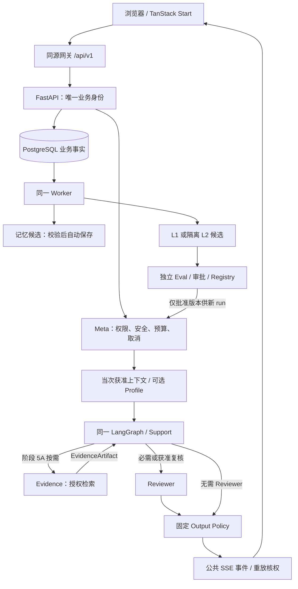

# PsyEvoAgent

2026-09-24当前进度：**S1-STEP05隔离合成工程交付完成**。持久run启动/幂等、公共SSE/游标快照、取消CAS、独立fake Worker与互动去重已落地。Windows通过42项真实PostgreSQL/API/迁移、65项后端及11项浏览器/HTTPS检查；WSL内核隔离工程门禁通过。真实Provider、内容审阅和SMTP继续BLOCKED；未实现STEP06聊天页面或STEP07删除清理，未公开发布。最早未完成步骤为STEP06，详见[本步证据](PsyEvoAgent项目计划/阶段1/evidence/S1-STEP05/README.md)。下方历次实施摘要保留历史时点。

> 当前按[内部实验执行约定](EXPERIMENT.md)推进：可通过指定HTTPS地址分享；目标注册先验证邮箱，登录后直接进入，无年龄或用途确认，不设公众资格、真人告知或期限审批前置。业务不设固定TTL。邮箱身份已实现；真实 SMTP 尚未配置，验证范围见阶段1 STEP03.5 记录。

面向大学生的受控心理支持系统规划仓库：先交付可停止、可删除、可核对的基础倾听闭环，再按阶段接入记忆、记录、知识工具、质量治理、受控 Multi-Agent，以及受限的策略优化与 RSI 研究。

> **当前状态：S1-STEP03原用户名注册登录、账号页、实验默认配置与来源关联已实现并局部验收；S1-STEP03.5邮箱身份与品牌接入已实现，验证见新增记录，完整支持产品尚未实现。**
> 业务路径、接口和技术选型仍为设计；实际工程入口与验证边界见下方STEP02记录，不能当作完整产品已上线或已通过验收的证据。整合修订日期：2026-09-21。

2026-09-24 STEP04已完成隔离合成交付：后端单Support/LangGraph、fake Provider、预算与固定整稿检查；Windows与WSL隔离门禁通过，包含41项本步测试、61项后端回归及5项工程浏览器用例。STEP03前置完整复验通过，修复测试数据库初始化就绪竞态及API重载停止等待，历史缺图仍明确不可核验。无聊天页面、start/SSE接口或真实模型调用；真实Provider/内容审阅仍BLOCKED。详见[本步记录](PsyEvoAgent项目计划/阶段1/evidence/S1-STEP04/README.md)，下一步STEP05本轮未实施，历史收据不改写。

实施进度：已完成 [S1-STEP01材料交付](PsyEvoAgent项目计划/阶段1/04-分步实施与检查清单.md#s1-step01-evidence)。[S1-STEP02工程实施记录](PsyEvoAgent项目计划/阶段1/04-分步实施与检查清单.md#s1-step02-evidence)包含前后端源码、锁文件、检查入口和实测结果；Windows/WSL 的完整工程门禁与 API reload 均通过，WSL 内核级 PR 出口隔离及拒绝降级检查通过，STEP02 全部子操作完成，未进入 STEP03。业务验收仍未执行。

本仓库收录阶段 1–7 与阶段 5A 的目标、技术方案和验收标准，原版、RSI设计与2026-09-18技术栈审核已融入各阶段正文。它不是临床诊疗系统，也不能替代专业心理咨询、紧急救助或学校官方支持渠道。

2026-09-21当前进度补充：上述STEP02收据为历史工程记录；现已完成[S1-STEP03局部交付](PsyEvoAgent项目计划/阶段1/04-分步实施与检查清单.md#s1-step03-evidence)。实际入口 `/register`、`/login`、`/me`，旧 `/me/privacy` 跳转账号页，新增独立PostgreSQL、迁移及本步测试，命令见[DEVELOPMENT](DEVELOPMENT.md)。正式年龄核验、公众服务资格和保留期限审批不属于当前实验的阻塞项；对话生成、反馈和完整删除尚未实现，下一步STEP04本轮未推进。

邮箱验证码注册、邮箱密码登录、忘记密码和登录后改密见[身份合同](PsyEvoAgent项目计划/阶段1/02-技术方案与实施计划.md#email-identity-target)。2026-09-23已实现邮箱验证注册、邮箱密码登录、找回和改密，接入现有品牌资源；增量迁移与本机旧账号清理分开执行，未发送真实邮件。详见[本次记录](PsyEvoAgent项目计划/阶段1/evidence/S1-STEP03/email-identity/README.md)。

## 目录

- [它做什么](#它做什么)
- [它不做什么](#它不做什么)
- [当前仓库里有什么](#当前仓库里有什么)
- [规划架构](#规划架构)
- [规划技术栈](#规划技术栈)
- [阶段路线](#阶段路线)
- [学生端与工作台](#学生端与工作台)
- [安全、授权与数据](#安全授权与数据)
- [RSI 研究边界](#rsi-研究边界)
- [如何阅读这些文档](#如何阅读这些文档)
- [文档约定](#文档约定)
- [实现后的本地开发方向](#实现后的本地开发方向)
- [状态词](#状态词)

## 它做什么

PsyEvoAgent 的产品主线是**当下可用的支持**，而不是依赖检测分数或自我进化演示。

后续支持闭环的目标如下；当前仅注册登录与账号入口已实现：

1. 完成邮箱验证码注册后自动进入已实现功能；以后用邮箱和密码登录，可通过邮箱验证码找回密码，并可在登录后改密；不经过年龄或用途确认。当前已接入身份入口，其他支持功能仍按后续STEP实施。
2. 得到倾听、必要澄清、合作分析或可选下一步，也可以只倾听。
3. 随时停止生成、查看失败原因、删除会话并退出。
4. 不聊天也能完成一个无模型依赖的注意力练习。
5. 看到已核实的现实支持入口；没有核实信息时说明未知，不编造联系方式。

后续阶段在同一运行合同上扩展：

| 能力 | 用户能核对的结果 | 阶段 |
|---|---|---|
| 笔记、睡眠、支持备忘卡、提取校验后自动保存的记忆 | 来源、用途、遗忘和撤权可追踪 | [2](PsyEvoAgent项目计划/阶段2/01-阶段目标与功能设计.md) |
| 想法整理、情绪、微行动、练习与回顾 | 任一步可跳过，不打成长分 | [3](PsyEvoAgent项目计划/阶段3/01-阶段目标与功能设计.md) |
| 已审文章/方法、现实渠道、有限业务工具 | 引用可核版本；写入必须用户确认 | [4](PsyEvoAgent项目计划/阶段4/01-阶段目标与功能设计.md) |
| 导出、删除、反馈受理、内部评测与运维 | 请求状态真实，不把失败显示成成功 | [5](PsyEvoAgent项目计划/阶段5/01-阶段目标与功能设计.md) |
| 按任务调用 Support / Evidence / Reviewer | 学生端不出现角色菜单 | [5A](PsyEvoAgent项目计划/阶段5A/01-阶段目标与功能设计.md) |
| 失败簇 → 候选策略 → 独立评价 → 可回退版本 | 不能改权限、删除或固定安全规则 | [6](PsyEvoAgent项目计划/阶段6/01-阶段目标与功能设计.md) |
| 固定系统 / 固定改进器 / 可调改进器对照 | 无收益也保留完整研究报告 | [7](PsyEvoAgent项目计划/阶段7/01-阶段目标与功能设计.md) |

## 它不做什么

- 不诊断疾病、不给临床依赖总分、不把少聊天或失访当成“好转”。
- 不因高频使用、亲昵称呼或一次深夜对话判定依赖。
- 支持、记忆、画像、内部评测与优化按实验配置默认开启；实现进度单列，默认配置不记作用户同意。
- 不站外推送、不自动联系他人、不读取微信、不开放任意文件/SQL/shell 工具。
- 不训练模型权重，不自动修改生产代码，不把提示词改写称为 RSI 完成。
- 未实现功能不显示可用入口，不将实验结果称为临床有效；保留来源、账号隔离与重要副作用确认。

## 当前仓库里有什么

```text
.
├── README.md
├── AGENTS.md
├── DEVELOPMENT.md
├── backend/
├── frontend/
├── scripts/
└── PsyEvoAgent项目计划/
    ├── 阶段1/fixtures/ 与 evidence/
    ├── 阶段1/ … 阶段7/
    └── 阶段5A/
```

8个阶段共32份文档；各阶段维护01/02/03正文和04分步实施清单：

| 文件 | 作用 |
|---|---|
| `01-阶段目标与功能设计.md` | 功能、用户故事、页面、流程和边界 |
| `02-技术方案与实施计划.md` | 架构、数据、API、基础及配套任务、技术依据 |
| `03-测试与验收标准.md` | S/RSI-S验收及AUD历史编号映射、证据要求、完成门槛 |
| `04-分步实施与检查清单.md` | 执行顺序、子操作、产出、失败检查及任务/验收映射 |

升级内容与审核要求已按主题归位，不再单独维护升级版或审核文件。共同技术栈及历史核验记录见[阶段1技术方案](PsyEvoAgent项目计划/阶段1/02-技术方案与实施计划.md#technology-stack)，验收证据格式见[阶段1验收标准](PsyEvoAgent项目计划/阶段1/03-测试与验收标准.md#case-evidence)。

两份总体规划已从指纹匹配的备份恢复核对，共同封套、14类核心实体及来源目录已整合到[阶段技术合同](PsyEvoAgent项目计划/阶段1/02-技术方案与实施计划.md#missing-sources)。外部申报、移交材料及历史产品源码仍未提供。本仓库现有STEP02工程及STEP03合成身份/授权实现、PostgreSQL Compose、迁移和局部实测；没有部署CI或完整支持产品验收。启动与检查见[本地开发说明](DEVELOPMENT.md)。

## 规划架构

前四阶段保持单 Support Agent。阶段 5A 起按任务增加 Evidence / Reviewer，记忆提取仍是经服务端校验后自动保存的 workflow，不另建第二套 Agent Runtime。



不变约束：

- Meta 不是 Agent，也不被 Supervisor LLM 替换。
- 简单倾听保持 Support 快路径，不为每个请求默认拉起多角色。
- 业务状态以 PostgreSQL 为准；LangGraph 检查点不决定删除或 run 终态。
- 取消、完成、失败以服务端 CAS 终态为准；断网只丢失订阅，不会自动再发一次请求。

## 规划技术栈

下表是**生产主线方向**，不表示已经安装或通过兼容验收。

后续 AI 开发先读[前端职责与按需接入合同](PsyEvoAgent项目计划/阶段1/02-技术方案与实施计划.md#frontend-stack-contract)：当前只有 Start/Router 工程检查页，Query/Form/Store 和 shadcn 等按真实消费者接入。2026-09-21 已补齐 Prettier 与前端 `check` 入口；[本次专项验证](PsyEvoAgent项目计划/阶段1/04-分步实施与检查清单.md#frontend-audit-followup)不替代历史完整门禁或业务验收。

| 层 | 主线 | 条件触发 | 明确不采用（除非另立 ADR） |
|---|---|---|---|
| 语言与工具 | Python 3.12、TypeScript；uv、Ruff、mypy、pytest | 已有可用工具链则先复用 | 为展示并装多套包管理器 |
| 前端 | React；TanStack Start / Router / Query / Form；Tailwind CSS | 真实消费者出现后再加表格虚拟化 | 用 Next.js 换掉 Start；第二套身份 store |
| API | FastAPI、Pydantic、HTTPX、SQLAlchemy、Alembic | FastAPI 原生 SSE 取决于锁定版本 | 自研通用 Provider SDK |
| Agent | LangChain + **唯一** LangGraph Runtime；LangMem 提取/摘要 | MCP Client 仅在外部工具需求成立时 | CrewAI、AutoGen、第二 Agent Loop |
| 数据 | PostgreSQL 为权威存储；阶段 4 起 pgvector、对象存储、Kafka + outbox | 应用 Redis 仅在缓存/跨实例限流有证据时 | 第二向量库、第二队列、无需求的 GraphRAG |
| 观测与交付 | OpenTelemetry、已有 workbench；按数据条件接 Langfuse | 开发 Compose 默认只起 PostgreSQL | 把 Compose 应用容器当成生产；无缺口引入 K8s |
| 优化与研究 | 确定性 Eval + 获准人工评价；L1 以 GEPA 受限 adapter 为主线 | LangMem prompt optimizer 为 L1 **互斥**备选 | 训练平台、任意代码自演化、自动上线最强版本 |

本地开发一旦开始写代码：TanStack Start 走实际 `pnpm dev`，FastAPI 用 uv 热重载，需要时再起独立 Python Worker。**不要在 API import 或 reload 时启动消费者。** Kafka、对象存储和观测服务只在已有真实消费者时启用。

技术栈采用“现有方案优先、能力缺口证据驱动”的门禁。LangChain/LangGraph、PostgreSQL/pgvector分别是当前能力层、唯一主要Runtime和业务/向量主线；CrewAI、AutoGen、ChromaDB、Milvus等不会因流行或技术栈丰富而加入。发现协作复杂度、Agent自由对话、RAG规模或检索性能出现真实瓶颈时，按“问题→证据→隔离PoC→对比→ADR→决定”评估，且不形成第二套Runtime或数据真相。详细触发条件与对照维度见[阶段1技术方案的技术栈缺口评估](PsyEvoAgent项目计划/阶段1/02-技术方案与实施计划.md#技术栈缺口评估与隔离验证)。

## 阶段路线

Multi-Agent 是阶段 5 之后的正式目标（阶段 5A），不是可选项，也不要求公开上线后才建设。阶段 6、7 默认先离线，但不能跳过 5A 工程门槛。

| 阶段 | 名称 | 用户可感知的增量 | 关键内部合同 |
|---|---|---|---|
| [1](PsyEvoAgent项目计划/阶段1/01-阶段目标与功能设计.md) | 首次使用与支持闭环 | `/chat`、独立练习、现实支持、删除与反馈 | 身份、run/SSE/取消、预算、基础安全 |
| 2 | 长期记忆与适度关心 | `/records` 笔记与睡眠、备忘卡、记忆查看与更正 | 候选校验后自动保存，推断保持标识；画像与记忆分来源用途 |
| 3 | 情绪与现实行动管理 | 想法表、情绪、微行动、练习扩展、回顾 | 当次明确拒绝优先于可选画像 |
| 4 | 知识支持与授权工具 | 资源中心、内容审发、有限 Tool + HITL | 无有效授权不得执行；引用缺失不能编造 |
| 5 | 质量治理与云端交付 | 导出/删除跟踪、反馈进度、内部工作台 | 统一 Eval、观测白名单、备份恢复 |
| 5A | Multi-Agent 协作 | 学生仍是四个入口；内部可追踪角色与 Artifact | Support 唯一负责最终表达 |
| 6 | 受控持续优化（L1） | 学生端无优化入口 | GEPA 主线；发布可回退，不回滚用户新数据 |
| 7 | RSI 研究与验证（L2） | 学生端无研究菜单 | 比较固定系统 / 固定改进器 / 可调改进器 |

建议阅读顺序：本README → [阶段1技术栈与架构](PsyEvoAgent项目计划/阶段1/02-技术方案与实施计划.md#technology-stack) → 各阶段01/02/03，按1→2→3→4→5→5A→6→7推进。

## 学生端与工作台

学生端四个入口保持稳定：**对话｜我的记录｜支持资源｜我的**。内部角色名、思维链、依赖分数和 RSI 实验不进入学生导航。

| 路由（规划） | 阶段 | 说明 |
|---|---|---|
| `/chat`、`/chat/$sessionId` | 1 | 倾听/澄清/分析/收尾；停止与重连看服务端终态 |
| `/resources`、`/resources/exercises/$id` | 1→4 | 练习可独立进入；文章与现实支持后来补齐 |
| `/register`、`/login`、`/me` | 1 | 邮箱验证码注册、邮箱密码登录、验证码找回及账号改密；旧隐私地址跳转/me；真实SMTP待配置 |
| `/records` 及子页 | 2→3 | 笔记、睡眠、想法、情绪、行动、回顾 |
| `/me/memories`、`/me/support-adaptation` | 2 | 记忆查看与更正/遗忘；可选适配可更正 |
| `/me/data`、`/me/feedback` | 5 | 导出与删除进度；反馈受理状态 |
| `/workbench/*` | 4→7 | 内容、任务、反馈、评测、运行、版本、优化、研究 |

## 安全、授权与数据

- 年龄范围 `adult / minor / unknown`：未知不得默认为成人。
- experiment-defaults/1默认开放五类功能；旧consent保留历史，不作为入口或业务前置，不伪造granted。
- 高风险表达走已审支持流程；不能假称已联系专业人员或值班热线。
- 记忆提取校验后自动保存，可查看、更正和确认删除；推断不冒充用户事实，删源和更正传播到候选、派生和检索。
- 正文不进 URL 或普通日志；观测默认只留元数据，Artifact 正文另需来源和用途权限。
- 删除先阻断访问，再报告已完成步骤；未完成不得显示“已彻底删除”。

历史依据链接留在[阶段5治理合同](PsyEvoAgent项目计划/阶段5/02-技术方案与实施计划.md#service-governance)，不作为本次实验入口或阶段交接门槛。

## RSI 研究边界

本项目把三类变化分开：

| 层次 | 变的是什么 | 不变的是什么 |
|---|---|---|
| 个体适配 | 自动保存且保留推断标识的记忆、偏好、当次明确诉求 | 权限模型、删除、固定安全 |
| L1 任务策略 | 角色提示、路由、检索、有界预算分配 | 评价器、holdout、总预算硬上限、发布审批 |
| L2 改进方法 | 分析/检索/生成/分支选择等声明式资产 | 模型权重、生产代码、数据用途、Agent/Tool 白名单 |

阶段 7 的 RSI-A/B/C 是研究组别，与阶段 5A 的 MA-A/B/C 角色组合对照不是同一套编号。没有“新改进器真正接管后续任务”的收据，不能报告递归改进得到验证。阴性结果仍是完整交付。

## 如何阅读这些文档

1. 先看状态行：业务仍为**规划、未实现、验收未执行**；STEP02基础工程按独立收据记录。
2. 功能编号`F-*`、用户故事`U01`–`U17`、任务`S*-T*`与`RSI-S*-T*`保持原含义；配套任务表列出父任务关系。
3. 验收编号`S*-A*`与`RSI-S*-A*`不重新编号；17项`AUD-S*-A*`候选场景已分配到对应阶段03，未执行或未批准的状态不因整合而改变。
4. 条件性MCP、Redis和检索增强继续按需求与证据触发，文档整合不代表批准安装或上线。
5. 历史SHA-256和外部版本核验注明2026-09-18来源，不代表当前文件指纹或本次重新核验结果。

常用入口：

- [合同统一口径与待决项](PsyEvoAgent项目计划/阶段1/02-技术方案与实施计划.md#contract-decisions)
- [L1候选生命周期](PsyEvoAgent项目计划/阶段6/02-技术方案与实施计划.md#l1-lifecycle)
- [L2实验分组](PsyEvoAgent项目计划/阶段7/02-技术方案与实施计划.md#l2-protocol)
- [研究统计规范](PsyEvoAgent项目计划/阶段7/02-技术方案与实施计划.md#research-statistics)

## 文档约定

- 保留中文文件名、阶段编号和原有术语。
- Markdown 标题、表格、相对链接和 JSON 围栏保持可解析。
- 提交说明建议聚焦且祈使，例如 `docs(stage4): clarify optional Kafka`。
- PR 应写明：影响阶段、合同变更、相关验收 ID、实际做了哪类核对、仍未验证的限制。
- 区分三种状态：**已规划 / 已实现 / 已验证**。产品能力仍属已规划；S1-STEP01材料交付及其静态检查已留证，不代表产品实现。

当前代码风格：Python 四空格，由 Ruff 配置约束；TypeScript/JSON 两空格，前端 Prettier 使用单引号、无分号；Python 测试文件 `test_*.py`。命令见[本地开发说明](DEVELOPMENT.md)。

## 实现后的本地开发方向

工程骨架的清单、锁文件与启动脚本已经存在，实际命令以[本地开发说明](DEVELOPMENT.md)为准。后续业务和数据库能力仍按消费者接入。

当前本地进程与后续服务边界：

- 前端：TanStack Start 开发服务器（实际 `pnpm` 脚本）
- API：`uv` 管理的 FastAPI，开发热重载
- Worker：独立 Python 进程，需要持久任务时再启动
- 数据库：Docker Compose **默认只运行 PostgreSQL**；pgvector 是扩展，不是 Python 包

付费模型调用、销毁数据的重置、以及任何生产变更都需要明确授权。凭据只进被忽略的本地配置，不进文档和 git。

## 状态词

| 说法 | 含义 |
|---|---|
| 已确认规划 | 文档合同存在，可作为实现输入 |
| 候选建议 | 审核或升级中的拟修订，尚未当作已批准账本 |
| 本次未找到产品实现证据 | 本仓库无对应代码或装配 |
| 验收未执行 | 计划用例尚未执行；实际编号以各阶段03为准，无覆盖率数字 |

---

PsyEvoAgent 可以是一个谨慎的支持系统和一项可证伪的研究设计；它还不是已经跑通的产品。实现时请先复用本仓库已经写清的身份、run、授权、删除和预算合同，而不是另起一套聊天框架。

## 分步实施入口

先读对应阶段01了解目标，实施时按04执行并查阅02合同，按03记录验收。S1-STEP01已完成局部材料交付，STEP02本地工程门禁已通过，其余步骤仍为规划；不能把局部工程交付当作业务用例通过。

| 阶段 | 分步清单 | 步骤数 |
|---|---|---|
| 1 | [阶段1分步实施](PsyEvoAgent项目计划/阶段1/04-分步实施与检查清单.md) | 8 |
| 2 | [阶段2分步实施](PsyEvoAgent项目计划/阶段2/04-分步实施与检查清单.md) | 8 |
| 3 | [阶段3分步实施](PsyEvoAgent项目计划/阶段3/04-分步实施与检查清单.md) | 7 |
| 4 | [阶段4分步实施](PsyEvoAgent项目计划/阶段4/04-分步实施与检查清单.md) | 8 |
| 5 | [阶段5分步实施](PsyEvoAgent项目计划/阶段5/04-分步实施与检查清单.md) | 8 |
| 5A | [阶段5A分步实施](PsyEvoAgent项目计划/阶段5A/04-分步实施与检查清单.md) | 7 |
| 6 | [阶段6分步实施](PsyEvoAgent项目计划/阶段6/04-分步实施与检查清单.md) | 7 |
| 7 | [阶段7分步实施](PsyEvoAgent项目计划/阶段7/04-分步实施与检查清单.md) | 8 |

共61个实施步骤，每步包含3～6项具体操作。阶段5基础交接与5A联合验收分别记录；阶段7先完成独立先导再冻结正式协议。153个验收用例及17个AUD别名沿原编号维护，不因拆步骤重复计数。

## 实验入口修订与验收

版本化默认配置与历史用户决定分离，来源grant不再要求consent_id；追加迁移保留账号、年龄、旧consent和授权关系。运行时接受显式PostgreSQL地址与库名，自动化只使用独立合成测试库。指定HTTPS Origin、同域代理与证书配置见[开发说明](DEVELOPMENT.md#指定https地址配置准备不代表已发布)。

全阶段32份计划、注册登录、权限回归和验证边界见[修订清单与新验收](PsyEvoAgent项目计划/阶段1/evidence/S1-STEP03/registration-review.md)。本次不实际发布远程服务，不推进STEP04及后续功能。
